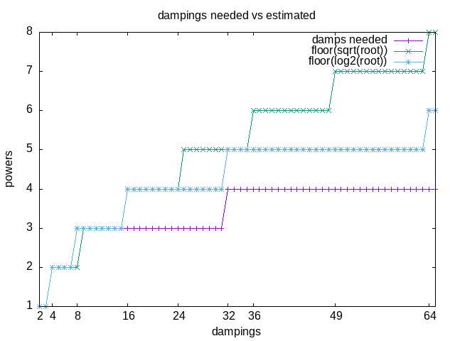
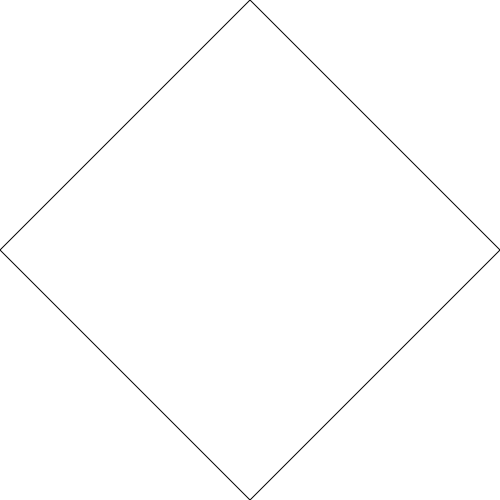

# Table of Contents

1.  [Introduction Notes](#orga86e0e5)
    1.  [Text Foreword](#org4512712)
    2.  [Preface, 1e](#orgf7edd5c)
2.  [Chapter 1: Building Abstractions with Procedures](#org20f2eef)
    1.  [1.1: The Elements of Programming](#orgdba0305)
    2.  [1.1.1: Expressions](#orgdbc53ae)
    3.  [1.1.3: Evaluating Combinations](#orge9999b3)
    4.  [1.1.4: Compound Procedures](#org36c46ca)
    5.  [1.1.5: The Substitution Model for Procedure Application](#org94c6d2d)
    6.  [1.1.6: Conditional Expressions and Predicates](#orgb400f04)
    7.  [Exercise 1.1: Trying expressions](#org2b68116)
        1.  [Question](#org5068ad7)
        2.  [Answer](#org05ab58b)
    8.  [Exercise 1.2: Prefix form](#orga021c2d)
        1.  [Question](#org86f63a8)
        2.  [Answer](#org9bd1b81)
    9.  [Exercise 1.3: Conditionals](#orgd82cf3a)
        1.  [Question](#orgcd53d17)
        2.  [Answer](#org07ef267)
    10. [Exercise 1.4: Compound expressions](#orgbc00085)
        1.  [Question](#orgaf5b77d)
        2.  [Answer](#orgcf463b8)
    11. [Exercise 1.5: Applicative vs normal-order evaluation](#orgde01bdb)
        1.  [Question](#orgd951cf8)
        2.  [Answer](#orgd263ea3)
    12. [1.1.7: Example: Square Roots by Newton’s Method](#org02d026f)
    13. [1.1.8: Procedures as Black-Box Abstractions](#org9de75e2)
    14. [Exercise 1.6: Special form evaluation](#org9730d50)
        1.  [Text code](#orgb21a02f)
        2.  [Question](#orge97e315)
        3.  [Answer](#orga37c7ea)
    15. [Exercise 1.7: `sqrt` with small and large numbers](#org84948f4)
        1.  [Text](#orgd5fafcb)
        2.  [Question](#orgb406c80)
        3.  [Diary](#orgb3659bd)
        4.  [Answer](#orgbdcb844)
    16. [Exercise 1.8: Cube roots](#org224d567)
        1.  [Question](#org0371118)
        2.  [Diary](#org1fcae98)
        3.  [Answer](#org716ecd6)
    17. [1.2: Procedures and the Processes They Generate](#org165c113)
    18. [1.2.1: Linear Recursion and Iteration](#orgafd7be4)
    19. [Exercise 1.9: Peano counting and recursion](#org2d15578)
        1.  [Question](#org5822729)
        2.  [Answer](#org52b92e0)
    20. [Exercise 1.10: Ackermann’s Function](#orgd919783)
        1.  [Question](#org8f33c32)
        2.  [Answer](#org3273792)
    21. [1.2.2: Tree Recursion](#org081662d)
        1.  [Example: Counting change](#orga7d36af)
    22. [Exercise 1.11: More recursion vs iteration](#orge869238)
        1.  [Question](#org45b0489)
        2.  [Answer](#org457aad2)
    23. [Exercise 1.12: Pascal’s Triangle](#org1e9dda0)
        1.  [Question](#org97446d2)
        2.  [Answer](#orgb3c2975)
    24. [Exercise 1.13: Proving Fibonacci approximation](#org7efc895):optional:
        1.  [Question](#org112be4c)
        2.  [Answer](#org2754e27)
    25. [1.2.3: Orders of Growth](#org8df3384)
    26. [Exercise 1.14: `count-change`](#org7e4f08b)
        1.  [Text](#org3562a54)
        2.  [Question A: Draw the tree](#org2d14863)
        3.  [Answer](#org0839499)
        4.  [Question B: Analyzing process growth](#org46a3fdd)
        5.  [Answer B](#orge0f13b7)
    27. [Exercise 1.15: Sine approximation](#org9ff54c0)
        1.  [Question A](#org8a31b75)
        2.  [Answer A](#orgdecb013)
        3.  [Question B](#org0fa7599)
        4.  [Answer B](#org5e9e40e)
    28. [Exercise 1.16: Making `fast-expt` iterative](#org2df22c5)
        1.  [Text](#orgf062454)
        2.  [Question](#org9433574)
        3.  [Diary](#orgb5f6f0c)
        4.  [Answer](#org8f9fb55)
    29. [Exercise 1.17: Logarithmic multiplication (recursive)](#orgf3ab49b)
        1.  [Question](#org083b3ca)
        2.  [Answer](#orga64918d)
    30. [Exercise 1.18: Logarithmic multiplication (iterative)](#org10a9325)
        1.  [Question](#orga563d74)
        2.  [Diary](#org4d68ad3)
        3.  [Answer](#orgcd8082a)
    31. [Exercise 1.19: Logarithmic fibonacci computing with $T$](#orgd331118)
        1.  [Question](#org5c5af36)
        2.  [Diary](#orga9a6494)
        3.  [Answer](#orgfaa79d3)
    32. [1.2.5: Greatest Common Divisor](#org097ddfb)
    33. [Exercise 1.20: Inefficiency of normal-order evaluation](#org94e4f9d)
        1.  [Text](#org0881484)
        2.  [Question](#orgd29777b)
        3.  [Answer](#org399cf27)
    34. [1.2.6: Example: Testing for Primality](#org161dbc1)
    35. [Exercise 1.21](#orge6e12c4)
        1.  [Text](#org807962b)
        2.  [Question](#orga425e6c)
        3.  [Answer](#org053b081)
    36. [Exercise 1.22](#org4f1920b)
        1.  [Question](#org1f1bcc8)
        2.  [Answer](#orgcc9ba6c)
    37. [Exercise 1.23](#org185bff5)
        1.  [Question](#orgc5ab321)
        2.  [A Comedy of Error (just the one)](#org0b53dd7)
        3.  [Answer](#orgb3124af)
    38. [Exercise 1.24](#org7d86b2d)
        1.  [Text](#org0c9a3ae)
        2.  [Question](#org8eb84b3)
        3.  [Answer](#org263c44f)
    39. [Exercise 1.25](#orgb9237ad)
        1.  [Question](#orgdfa0648)
        2.  [Answer](#orgc5e7469)
    40. [Exercise 1.26](#org213c0df)
        1.  [Question](#org9eac79e)
        2.  [Answer](#org8131525)
    41. [Exercise 1.27](#org7acd9ab)
        1.  [Question](#orgfcb896f)
        2.  [Answer](#orga92b887)
    42. [Exercise 1.28](#org8772ed1)
        1.  [Question](#orgf930a0c)
        2.  [Analysis](#org6bd2a29)
        3.  [Answer](#orgf7f8a4d)
    43. [1.3: Formulating Abstractions with Higher-Order Procedures](#org0a149f0)
    44. [1.3.1: Procedures as Arguments](#org06c8f74)
    45. [Exercise 1.29](#orge165f22)
        1.  [Text](#orga08df4a)
        2.  [Question](#orgadf3bda)
        3.  [Answer](#org4ce77e9)
    46. [Exercise 1.30](#org21f7b62)
        1.  [Question](#orga806ccb)
        2.  [Answer](#orga1218dd)
    47. [Exercise 1.31](#org222b067)
        1.  [Question A.1](#org349dbb6)
        2.  [Answer A.1](#orgf831734)
        3.  [Question A.2](#orge571777)
        4.  [Answer A.2](#orgec4e552)
        5.  [Question A.3](#orge0db7c4)
        6.  [Answer A.3](#orgbf0aa23)
        7.  [Question B](#orgb96d8c4)
        8.  [Answer B](#org62c07f7)
    48. [Exercise 1.32](#org26713fd)
        1.  [Question A](#org69926d9)
        2.  [Answer A](#org7b7f5c2)
        3.  [Question B](#orgd722f60)
        4.  [Answer B](#orgf5b92db)
    49. [Exercise 1.33](#org6f00e8d)
        1.  [Question A](#org05ea2bd)
        2.  [Answer A](#orgfdecb28)
        3.  [Question B](#org34171cb)
    50. [1.3.2: Constructing Procedures Using lambda](#orgb794115)
    51. [Exercise 1.34](#orge660289)
        1.  [Question](#orga1b1255)
        2.  [Answer](#orgf5afd9a)
    52. [1.3.3 Procedures as General Methods](#org6b9140e)
    53. [Exercise 1.35](#org7a0f807)
        1.  [Text](#org8ff0345)
        2.  [Question](#org4973b44)
        3.  [Answer](#org78f7273)
    54. [Exercise 1.36](#org65db605)
        1.  [Question](#orgd0b266e)
        2.  [Answer](#org8ebdcd7)
    55. [Exercise 1.37](#orgfe1b694)
        1.  [Question A](#orge7caa8f)
        2.  [Answer A](#org5652591)
        3.  [Question B](#orgd74c088)
        4.  [Answer B](#orgcc12aca)
        5.  [Question C](#orgae0a073)
        6.  [Answer C](#org8d7f249)
    56. [Exercise 1.38](#orgcd6f572)
        1.  [Question](#org3e4b5c2)
        2.  [Answer](#org2c2c8e2)
    57. [Exercise 1.39](#org4fd4f7c)
        1.  [Question](#orgc003ee1)
        2.  [Answer](#org8b13037)
    58. [1.3.4 Procedures as Returned Values](#org8aaebea)
    59. [Exercise 1.40](#org8ca25af)
        1.  [Text](#orga4d2dc8)
        2.  [Question](#orgdab5cc1)
        3.  [Answer](#org3d1f6b9)
    60. [Exercise 1.41](#orgb03d452)
        1.  [Question](#org8271c39)
        2.  [Answer](#org9d328ec)
    61. [Exercise 1.42](#orge12e35e)
        1.  [Question](#org260205e)
        2.  [Answer](#org1fd1046)
    62. [Exercise 1.43](#orgd7ad870)
        1.  [Question](#orgfef42b4)
        2.  [Answer](#org3bc35c3)
    63. [Exercise 1.44](#org6509c9d)
        1.  [Question](#orgbcf666d)
        2.  [Answer](#orgfeca7f2)
    64. [Exercise 1.45](#orge477c36)
        1.  [Question](#org35da7dc)
        2.  [Answer](#org27068b9)
    65. [Exercise 1.46](#org02ec920)
        1.  [Question](#org30a3cbe)
        2.  [Answer](#org2797f23)
3.  [Chapter 2: Building Abstractions with Data](#orge3bd11e)
    1.  [2.1.1: Example: Arithmetic Operations for Rational Numbers](#org04974ff)
    2.  [Exercise 2.1](#orge546120)
        1.  [Text](#orgb995ec4)
        2.  [Question](#org33a7d8e)
        3.  [Answer](#org2d29edd)
    3.  [Exercise 2.2](#org3cc125c)
        1.  [Question](#org3d2dc70)
        2.  [Answer](#org0f54c5d)
    4.  [Exercise 2.3](#orgde8f12c)
        1.  [Question](#org3d3b7f9)
        2.  [Answer 1](#orgfe40e35)
        3.  [Answer 2](#orgc4f601b)
    5.  [2.1.3: What Is Meant by Data?](#org745fe42)
    6.  [Exercise 2.4](#orgc1a2ae6)
        1.  [Question](#org6ad680b)
        2.  [Answer](#org8a1bf1b)
    7.  [Exercise 2.5](#org712d009):optional:
        1.  [Question](#org54db212)
        2.  [Answer](#org7e9da8d)
    8.  [Exercise 2.6](#orgf5ceb3b):optional:
        1.  [Question](#org0d620f0)
        2.  [Answer](#org38faae8)
    9.  [Exercise 2.7](#org42affa1)
        1.  [Text](#org90cc021)
        2.  [Question](#orgeeb6189)
        3.  [Answer](#org71692c3)
    10. [Exercise 2.8](#org8d65467)
        1.  [Question](#orgbf3451d)
        2.  [Answer](#orgdedb7bd)
    11. [Exercise 2.9](#orgf0a982c)
        1.  [Question](#org03614b6)
        2.  [Answer](#org681c877)
    12. [Exercise 2.10](#org6e54498)
        1.  [Question](#orgee89822)
        2.  [Answer](#org4994b3e)
    13. [Exercise 2.11](#org8578a70)
        1.  [Question](#org6b191a5)
        2.  [Answer](#org311404e)
    14. [Exercise 2.12](#org7ef2a93)
        1.  [Question](#org7aa9b0d)
        2.  [Answer](#org5a86088)
    15. [Exercise 2.13](#org06787ad):optional:
        1.  [Question](#orga441d07)
        2.  [Answer](#org2d77034)
    16. [Exercise 2.14](#org1bc9204)
        1.  [Question](#org9df1312)
        2.  [Answer](#orgce9c280)
    17. [Exercise 2.15](#org2a7f2d3)
        1.  [Question](#org8bc9db5)
        2.  [Answer](#org0828c67)
    18. [Exercise 2.16](#org632685b):optional:
        1.  [Question](#org9397bee)
        2.  [Answer](#org277a831)
    19. [2.2: Hierarchical Data and the Closure Property](#orgd9e192a)
    20. [2.2.1: Representing Sequences](#orgc8049fc)
    21. [Exercise 2.17](#org7ef5341)
        1.  [Question](#org9343ebb)
        2.  [Answer](#org899dbb1)
    22. [Exercise 2.18](#orgcb79134)
        1.  [Question](#org9803b4d)
        2.  [Answer](#org58644f6)
    23. [Exercise 2.19](#org418bbfb)
        1.  [Question](#org6fb306a)
        2.  [Answer](#orgac52736)
    24. [Exercise 2.20](#org1a3e6ce)
        1.  [Question](#org81bf6c3)
        2.  [Answer](#org24b896c)
    25. [Exercise 2.21](#org148040a)
        1.  [Question](#orgca5ee74)
        2.  [Answer](#orgd7ad9e1)
    26. [Exercise 2.22](#orgbf15a9d)
        1.  [Questions](#org0065225)
        2.  [Answer](#orgb0b9cbf)
    27. [Exercise 2.23](#orgef41065)
        1.  [Question](#orgf5763b3)
        2.  [Answer](#org2c00f88)
    28. [Exercise 2.24](#orgca3dbc0)
        1.  [Text Definitions](#org80609e2)
        2.  [Question](#orgb7d7a1e)
        3.  [Answer](#orgf7178d4)
    29. [Exercise 2.25](#org149b74e)
        1.  [Question](#org52a3868)
    30. [Exercise 2.26](#orgff943f8)
        1.  [Question](#org65acd6f)
        2.  [Answer](#org2d14b90)
    31. [Exercise 2.27](#orgd645f63)
        1.  [Question](#orgf42b9ee)
        2.  [Answer](#org3d00c48)
    32. [Exercise 2.28](#orgcd56bf3)
        1.  [Question](#orga10bd28)
        2.  [Answer](#org8e6d720)
    33. [Exercise 2.29: Binary Mobiles](#org575ad81)
        1.  [Text Definitions](#org1a40012)
        2.  [Question A: Selectors](#org46b4705)
        3.  [Answer A](#org7780ab9)
        4.  [Question B: total-weight](#org87c7f28)
        5.  [Answer B](#org6cafa87)
        6.  [Question C: Balancing](#org72ccab1)
        7.  [Answer C](#org269df80)
        8.  [Question D: Implementation shakeup](#org6b87ea0)
        9.  [Answer D](#org8ddeb8e)
    34. [Exercise 2.30](#orgfcc20fb)
        1.  [Question](#orga4b9ba1)
        2.  [Answer](#org4c6e442)
    35. [Exercise 2.31](#org5f1beee)
        1.  [Question](#org559fa94)
        2.  [Answer](#orgcf4f02f)
    36. [Exercise 2.32](#orgc4fc99f)
        1.  [Question](#org4864eeb)
        2.  [Answer](#org7ba8f50)
    37. [2.2.3: Sequences as Conventional Interfaces](#orgf7c8d11)
    38. [Exercise 2.33: The flexibility of `accumulate`](#org18c4319)
        1.  [Text Definitions](#orgdb996fd)
        2.  [Question](#org86bf9b9)
        3.  [Answer](#orgf791deb)
    39. [Exercise 2.34](#org81504b8)
        1.  [Question](#org6d282dd)
        2.  [Answer](#orgef5165e)
    40. [Exercise 2.35](#org8a5043d)
        1.  [Question](#org6aebe3f)
        2.  [Answer](#orgb581b42)
    41. [Exercise 2.36: Accumulate across multiple lists](#orgc3d28b4)
        1.  [Question](#org4ea5b23)
        2.  [Answers](#org440a8b1)
    42. [Exercise 2.37: Enter the matrices](#org30151b9)
        1.  [Question](#org7df1e34)
        2.  [Answer](#org03bf8e4)
    43. [Exercise 2.38: fold-right](#org52075e8)
        1.  [Question A](#orgb6158db)
        2.  [Answer A](#org48465e2)
        3.  [Question B](#orga0a1126)
        4.  [Answer B](#orgb1796f0)
    44. [Exercise 2.39: reverse via fold](#orgcb87054)
        1.  [Question](#org0124c3f)
        2.  [Answer](#org9648157)
    45. [Exercise 2.40: `unique-pairs`](#org720f2a8)
        1.  [Text Definitions](#orgd1b8ae3)
        2.  [Question](#org6f1fc3b)
        3.  [Answer](#org17b3a8f)
    46. [Exercise 2.41: Ordered triples of positive integers](#org150d6f8)
        1.  [Question](#org0298e0a)
        2.  [Answer](#org85be707)
    47. [Exercise 2.42: Eight Queens](#orgb9abb62)
        1.  [Question](#org7619d61)
        2.  [Answer](#orge21a614)
    48. [Exercise 2.43: Louis’ `queens`](#orgd46e139)
        1.  [Question](#orgf3e1020)
        2.  [Answer](#org9436ce0)
    49. [2.2.4: Example: A Picture Language](#org5ffc522)
    50. [Exercise 2.44: `up-split`](#orgb92fb5c)
        1.  [Text Definitions](#org5d33386)
        2.  [Question](#org0f8e9e7)
        3.  [Answer](#orgdc3f9ba)
    51. [Exercise 2.45: Generalized splitting](#org5fc6170)
        1.  [Question](#org9f33f6e)
        2.  [Answer](#org8238ce9)
    52. [Exercise 2.46: Defining vectors](#org52de4af)
        1.  [Question](#orgaea817d)
        2.  [Answer](#org3a72aa0)
    53. [Exercise 2.47: Defining frames](#org072a93a)
        1.  [Question](#org2b79411)
        2.  [Answer](#orgd3077f4)
    54. [Exercise 2.48: Line segments](#orgfe622de)
        1.  [Question](#org669fa6c)
        2.  [Answer](#org17716e0)
    55. [Exercise 2.49: Primitive painters](#orgf65ffa6)
        1.  [Text Definitions](#orgca8085b)
        2.  [Question](#org50f1b8f)
        3.  [Answer](#org8f1c869)
    56. [Exercise 2.50: Transforming painters](#org5cd016f)
        1.  [Text Definitions](#org8a40afe)
        2.  [Question](#orge722450)
        3.  [Answer](#orga0162c8)
    57. [Exercise 2.51](#orgfaebfbc)
        1.  [Question](#org6391bcf)
        2.  [Answer](#org89e38f6)
    58. [2.2.4 continued](#org434783c)
    59. [Exercise 2.52](#org9b6f61f)
        1.  [Question A](#orgcc0456f)
        2.  [Answer A](#org2fa55dd)
        3.  [Question B](#orge53e633)
        4.  [Question C](#org299c07b)
        5.  [Textbook Definitions](#org0d294c7)
        6.  [Answer C](#org5d3e9f0)
    60. [2.3.1: Quotation](#orgc9c957c)
    61. [Exercise 2.53](#orgf1dfe71)
        1.  [Question](#org668b89f)
        2.  [Answer](#orgf3933eb)
    62. [Exercise 2.54](#orgdd2a909)
        1.  [Answer](#orgbbb0a05)
    63. [Exercise 2.55](#org70cc786)
        1.  [Question](#org8533bb1)
        2.  [Answer](#org0465047)
    64. [2.3.2: Example: Symbolic differentiator](#org38424d0)
    65. [Exercise 2.56: Differentiating exponentiation](#org3700d2c)
        1.  [Text definitions](#org8ceff3d)
        2.  [Question](#orgb199021)
        3.  [Answer](#org6703abc)
    66. [Exercise 2.57: Differentiating arbitrary-length expressions](#org390c58f)
        1.  [Question](#org288ab83)
        2.  [Answer](#org0ae2a9b)
    67. [Exercise 2.58: Processing expressions with infix notation](#org10e1f41)
        1.  [Question](#orga810f86)
        2.  [Part 1](#orgd72238c)
        3.  [Answer 1](#org2a18e3b)
        4.  [Part 2](#org6ca1959)
        5.  [Answer 2](#org6ac00e1)
    68. [Exercise 2.59: Representing sets](#org4ad13ed)
        1.  [Text definitions](#orgcfa2cd6)
        2.  [Question](#orgf17a25d)
        3.  [Answer](#orgdd78eb4)
    69. [Exercise 2.59: Sets with duplicates](#org7fc63b4)
        1.  [Question](#org33f429b)
        2.  [Answer](#org06d5bfb)
    70. [Exercise 2.61: Ordered sets](#orgb7affad)
        1.  [Question](#orgdb2a4d5)
        2.  [Answer](#orga42ec44)
    71. [Exercise 2.62: `union-set` ordered](#org1fb55cc)
        1.  [Question](#orgc378886)
        2.  [Answer](#org0d020cb)
    72. [Exercise 2.63: binary trees](#orgc4b163a)
        1.  [Text definitions](#org82d369c)
        2.  [Question A](#org2cb7e5e)
        3.  [Answer A](#orgc8eb70b)
        4.  [Question B](#org14fdde7)
        5.  [Answer B](#orgd24aea0)
    73. [Exercise 2.64: Making a balanced binary tree](#orgf6f23a8)
        1.  [Question A](#orgb091c59)
        2.  [Answer A](#org1c72860)
        3.  [Question B](#org7be947f)
        4.  [Answer B](#orge9b7229)
    74. [Exercise 2.65: Sets as binary trees](#orgfecce11)
        1.  [Textbook Definitions](#org233eccc)
        2.  [Question](#orgd2a6bdc)
        3.  [Answer](#org469c52c)
    75. [Exercise 2.66: binary tree `lookup`](#orgcd9327c)
        1.  [Question](#org4ddc1ba)
        2.  [Answer](#orgee2c95e)
    76. [Exercise 2.67: decoding Huffman tree messages](#org0cc7add)
        1.  [Text definitions](#org438e9ee)
        2.  [Question](#org75c9c50)
        3.  [Answer](#orgf87f3c8)
    77. [Exercise 2.68: encoding Huffman tree messages](#org07f7965)
        1.  [Question](#orgd889ef0)
        2.  [Answer](#orgf54d172)
    78. [Exercise 2.69: Generating Huffman trees](#org371ae05)
        1.  [Question](#org1e0e26d)
        2.  [Answer](#org25e134f)
    79. [Exercise 2.70: encoding 1950s rock songs](#orgeed7b89)
        1.  [Question](#orgbabcc17)
        2.  [Answer](#orga1a71cd)
    80. [Exercise 2.71](#org644a169)
        1.  [Questions](#org7a9132f)
        2.  [Answers](#orgf415cfa)
    81. [Exercise 2.72: order of growth of `encode`](#org0e6d065)
    82. [2.4: Multiple Representations for Abstract Data](#org5e4d610)
    83. [Exercise 2.73: Data-driven symbolic differentiator](#org4c32cfe)
        1.  [Question A](#orgd0ab32f)
        2.  [Answer A](#orgbe37127)
        3.  [Questions B and C](#orge85952f)
        4.  [Answer B & C version 1](#org58affae)
        5.  [Answer B & C version 2](#org80a8b81)
        6.  [Question D](#org97b4b21)
        7.  [Answer D](#org81b8f46)
    84. [Exercise 2.74: Multi-division record storage](#orge985773)
        1.  [Questions ABC](#orga2a37e2)
        2.  [Answers ABC](#org535de4b)
        3.  [Question D](#orgbf3e0a3)
        4.  [Answer D](#orgcb93aaf)
    85. [2.4.3: Data-directed and message-passing programs](#org6ad98f0)
    86. [Exercise 2.75: Message-passing styled imaginary numbers](#orgd020e67)
        1.  [Question](#orgce5aace)
        2.  [Answer](#orgeebde0b)
    87. [Exercise 2.76: comparing generic operation solutions](#orgd393612)
        1.  [Question](#orge2c15a3)
        2.  [Answer](#orgd7526a0)
    88. [Exercise 2.77: generic arithmetic package](#org1f34b87)
        1.  [Question](#orgffaa80d)
        2.  [Answer](#org52527c1)
    89. [Exercise 2.78: native scheme numbers](#org97043d8)
        1.  [Question](#org763c96b)
        2.  [Answer](#org9967e13)
    90. [Exercise 2.79: generic equality](#org41a9d66)
        1.  [Question](#org146c602)
        2.  [Answer](#org0ca5355)
    91. [Exercise 2.80: Generic testing for zero](#org8cd3ce8)
        1.  [Question](#org0b8373a)
        2.  [Answer](#orgdff9759)
    92. [2.4.3: Combining Data of Different Types](#org846f627)
    93. [Exercise 2.81: Louis’ `apply-generic`](#org31e828d)
        1.  [Question A](#org2d4e0e1)
        2.  [Answer A](#orge23e71b)
        3.  [Question B](#org6c72092)
        4.  [Answer B](#org965cb28)
        5.  [Question C](#org736fbf2)
        6.  [Answer C](#org8cac623)
    94. [Exercise 2.82: `apply-generic` with multiple coerced arguments](#org529c4a9)
        1.  [Question](#org26fc185)
        2.  [Answer](#orgde71d8d)
        3.  [Answer with vararg support](#org96d603e)
    95. [Exercise 2.83: `raise`](#orgab90ea8)
        1.  [Question](#orgd27e461)
        2.  [Answer](#orgbaffeb4)
    96. [Exercise 2.84: `append-generic` with `raise`](#orga1708e3)
        1.  [Question](#org3010956)
        2.  [Answer](#org8c79700)
    97. [Exercise 2.85: `append-generic` with `drop`](#org0ff0d62)
        1.  [Question](#org8e10051)
        2.  [Answer](#orgac7d881)
    98. [Exercise 2.86: complex numbers with flexible types](#org8cf82a7)
        1.  [Question](#org9757180)
        2.  [Answer](#org7b58f78)
    99. [2.5: Symbolic Algebra](#orgacc13bc)
    100. [Exercise 2.87: `=zero?` for polynomials](#org1c5f943)
        1.  [Question](#org801a420)
        2.  [Answer](#org884dca3)
    101. [Exercise 2.88: negation, subtracting polynomials](#org68901d3)
        1.  [Question](#org7879245)
        2.  [Answer](#orgfccb1ee)
    102. [Exercise 2.89: an abstraction for dense polynomials](#orgbd9a309)
        1.  [Question](#org76489c0)
        2.  [Answer](#orgb7fc762)
    103. [Exercise 2.90: dense polynomials integrated into the system](#org96192a8)
        1.  [Question](#org6935856)
        2.  [Answer](#orgb1aa494)
    104. [Exercise 2.91: division of polynomials](#orgb6e6319)
        1.  [Question](#org07fff35)
        2.  [Answer](#orgf99865c)
    105. [Exercise 2.92: operating on polys in different variables](#org331e0d2)
        1.  [Question](#orgdac2f29)
        2.  [Answer](#orgf23afc3)
    106. [Exercise 2.93: extending `make-rational` for rational functions](#org1b2d015)
        1.  [Question](#orge85299a)
        2.  [Answer](#org7ff6302)
    107. [Exercise 2.94: GCD of polynomials](#orgac7a262)
        1.  [Question](#org9bf9cdf)
        2.  [Answer](#orgd5d2d28)
    108. [Exercise 2.95: a quirk in rational functions](#org7b9ce07)
        1.  [Question](#org037f198)
        2.  [Answer](#org538cb89)
    109. [Exercise 2.96: pseudodivision of polynomials](#orgd1ebbef)
        1.  [Text formulas](#org16d098d)
        2.  [Questions 1 and 2](#org7873a47)
        3.  [Answers 1 and 2](#orgf1ea95c)
    110. [Exercise 2.97: reducing terms of rational functions](#org66c51ab)
        1.  [Questions 1 and 2](#org35443d2)
        2.  [Answers 1 and 2](#orgff7f07c)

# Introduction Notes

## Text Foreword

This book centers on three areas: the human mind, collections of computer
programs, and the computer.

Every program is a model of a real or mental process, and these processes are at
any time only partially understood. We change these programs as our
understandings of these processes evolve.

Ensuring the correctness of programs becomes a Herculean task as complexity
grows. Because of this, it&rsquo;s important to make fundamentals that can be relied
upon to support larger structures.

## Preface, 1e

&ldquo;Computer Science&rdquo; isn&rsquo;t really about computers or science, in the same way that
geometry isn&rsquo;t really about measuring the earth (&rsquo;geometry&rsquo; translates to
&rsquo;measurement of earth&rsquo;).

Programming is a medium for expressing ideas about methodology. For this reason,
programs should be written first for people to read, and second for machines to
execute.

The essential material for introductory programming is how to control complexity
when building programs.

Computer Science is about imperative knowledge, as opposed to declarative. This
can be called *procedural epistemology*.

-   ****Declarative knowledge**:** *what is true*. For example: $\sqrt{x}$ is the
    $y$ such that $y^2 = x$ and $y \geq 0$

-   ****Imperative knowledge**:** *How to follow a process*. For example: to find an
    approximation to $\sqrt{x}$, make a guess $G$, improve the guess by
    averaging $G$ and $x/G$, keep improving until the guess is good enough.

1.  Techniques for controlling complexity

    -   **Black-box abstraction:** Encapsulating an operation so the details of it are
        irrelevant.
        
        The fixed point of a function $f()$ is a value $y$ such that $f(y) = y$.
        Method for finding a fixed point: start with a guess for $y$ and keep applying
        $f(y)$ over and over until the result doesn&rsquo;t change very much.
        
        Define a box of the method for finding the fixed point of $f()$.
        
        One way to find $\sqrt{x}$ is to take our function for approaching a square
        root `(lambda(guess target) (average guess (divide target guess)))`, applying
        that to our method for finding a fixed point, and this creates a **procedure** to
        find a square root.
        
        Black-box abstraction
        
        1.  Start with primitive objects of procedures and data.
        2.  Combination: combine procedures with *composition*, combine data with
            *construction* of compound data.
        3.  Abstraction: defining procedures and abstracting data. Capture common
            patterns by making high-order procedures composed of other procedures. Use
            data as procedures.
    
    -   **Conventional interfaces:** Agreed-upon ways of connecting things together.
        -   How do you make operations generalized?
        -   How do you make large-scale structure and modularity?
            -   **Object-oriented programming:** thinking of your structure as a society of
                discrete but interacting parts.
            -   **Operations on aggregates:** thinking of your structure as operating on a
                stream, comparable to signal processing. *(Needs clarification.)*
    
    -   **Metalinguistic abstractions:** Making new languages. This changes the way you
        interact with the system by letting you emphasize some parts and deemphasize
        other parts.

# Chapter 1: Building Abstractions with Procedures

**Computational processes** are abstract &rsquo;beings&rsquo; that inhabit computers. Their
evolution is directed by a pattern of rules called a **program**, and processes
manipulate other abstract things called **data**.

Master software engineers are able to organize programs so they can be
reasonably sure the resulting process performs the task intended, without
catastrophic consequences, and that any problems can be debugged.

Lisp&rsquo;s users have traditionally resisted attempts to select an &ldquo;official&rdquo;
version of the language, which has enabled Lisp to continually evolve.

There are powerful program-design techniques which rely on the ability to blur
the distinction between data and processes. Lisp enables these techniques by
allowing processes to be represented and manipulated as data.

## 1.1: The Elements of Programming

A programming language isn&rsquo;t just a way to instruct a computer &#x2013; it&rsquo;s also a
framework for the programmer to organize their ideas. Thus it&rsquo;s important to
consider the means the language provides for combining ideas. Every powerful
language has three mechanisms for this:

-   ****primitive expressions**:** the simplest entities the language is concerned with
-   ****means of combination**:** how compound elements can be built from simpler ones
-   ****means of abstraction**:** how which compound elements can be named and
    manipulated as units

In programming, we deal with **data** which is what we want to manipulate, and
**procedures** which are descriptions of the rules for manipulating the data.

A procedure has **formal parameters**. When the procedure is applied, the formal
parameters are replaced by the **arguments** it is being applied to. For example,
take the following code:

    1  (define (square x)
    2    (* x x))

    <<square>>
    (square 5)

`x` is the formal parameter and  `5` is the argument.

## 1.1.1: Expressions

The general form of Lisp is evaluating **combinations**, denoted by parenthesis,
in the form `(operator operands)`, where *operator* is a procedure and
*operands* are the 0 or more arguments to the operator.

Lisp uses **prefix notation**, which is not customary mathematical notation, but
provides several advantages.

1.  It supports procedures that take arbitrary numbers of arguments,
    i.e. `(+ 1 2 3 4 5)`.
2.  It&rsquo;s straightforward to nest combinations in other combinations.

## 1.1.3: Evaluating Combinations

The evaluator can evaluate nested expressions recursively. **Tree accumulation**
is the process of evaluating nested combinations, &ldquo;percolating&rdquo; values upward.

The recursive evaluation of `(* (+ 2 (* 4 6)) (+ 3 5 7))` breaks down
into four parts:

## 1.1.4: Compound Procedures

We have identified the following in Lisp:

-   primitive data are numbers, primitive procedures are arithmetic operations
-   Operations can be combined by nesting combinations
-   Data and procedures can be abstracted by variable & procedure definitions

Procedure definitions give a name to a compound procedure.

    (define (square x) (* x x)) ; to square something, multiply it by itself
    ; now it can be applied or used in other definitions:
    (square 4) ; => 16
    
    (define (sum-of-squares x y)
      (+ (square x) (square y)))
    (sum-of-squares 3 4) ; => 25

Note how these compound procedures are used in the same way as primitive
procedures.

## 1.1.5: The Substitution Model for Procedure Application

To understand how the interpreter works, imagine it substituting the procedure
calls with the bodies of the procedure and its arguments.

    (* (square 3) (square 4))
    ; has the same results as
    (* (* 3 3) (* 3 3))

This way of understanding procedure application is called the **substitution
model**. This model is to help you understand procedure substitution, and is
usually not how the interpreter actually works. This book will progress through
more intricate models of interpreters as it goes. This is the natural
progression when learning scientific phenomena, starting with a simple model,
and replace it with more refined models as the phenomena is examined in more
detail.

Evaluations can be done in different orders.

-   ****Applicative order**:** evaluates the operator and operands, and then applies the

resulting procedure to the resulting arguments. In other words, reducing, then
expanding, then reducing.

-   ****Normal order**:** substitutes expressions until it obtains an expression involving

only primitive operators, or until it can&rsquo;t substitute any further, and then
evaluates. This results in expanding the expression completely before doing any
reduction, which results in some repeated evaluations.

For all procedure applications that can be modeled using substitution,
applicative and normal order evaluation produce the same result. Normal order
becomes more complicated once dealing with procedures that can&rsquo;t be modeled by
substitution.

Lisp uses applicative order evaluation because it helps avoid repeated work and
other complications. But normal has its own advantages which will be explored in
Chapter 3 and 4.

    ; Applicative evaluation
    (f 5)
    (sum-of-squares (+ a 1) (* a 2))
    (sum-of-squares (+ 5 1) (* 5 2))
    (sum-of-squares 6 10)
    (+ (square x)(square y))
    (+ (square 6)(square 10))
    (+ (* 6 6)(* 10 10))
    (+ 36 100)
    136
    ; Normal evaluation
    (f 5)
    (sum-of-squares (+ a 1) (* a 2))
    (sum-of-squares (+ 5 1) (* 5 2))
    (+ (square (+ 5 1)) (square (* 5 2)))
    (+ (* (+ 5 1) (+ 5 1)) (* (* 5 2) (* 5 2)))
    (+ (* 6 6) (* 10 10))
    (+ 36 100)
    136

(Extra-curricular clarification: Normal order delays evaluating arguments until
they&rsquo;re needed by a procedure, which is called lazy evaluation.)

## 1.1.6: Conditional Expressions and Predicates

An important aspect of programming is testing and branching depending on the
results of the test. `cond` tests **predicates**, and upon encountering one,
returns a **consequent**.

    (cond
         (predicate1 consequent1)
         ...
         (predicateN consequentN))

A shorter form of conditional:

    (if predicate consequent alternative)

If `predicate` is true, `consequent` is returned. Else,
`alternative` is returned.

Combining predicates:

    (and expression1 ... expressionN)
    ; if encounters false, stop eval and returns false.
    (or expression1 ... expressionN)
    ; if encounters true, stop eval and return true. Else false.
    (not expression)
    ; true is expression is false, false if expression is true.

A small clarification:

    (define A (* 5 5))
    (define (D) (* 5 5))
    A ; => 25
    D ; => compound procedure D
    (D) ; => 25 (result of executing procedure D)

Special forms bring more nuances into the substitution model mentioned
previously. For example, when evaluating an `if` expression, you
evaluate the predicate and, depending on the result, either evaluate the
**consequent** or the **alternative**. If you were evaluating in a standard manner,
the consequent and alternative would both be evaluated, rendering the
`if` expression ineffective.

## Exercise 1.1: Trying expressions

### Question

Below is a sequence of expressions. What is the result printed by the
interpreter in response to each expression? Assume that the sequence is to be
evaluated in the order in which it is presented.

### Answer

     1  10 ;; 10
     2  (+ 5 3 4) ;; 12
     3  (- 9 1) ;; 8
     4  (/ 6 2) ;; 3
     5  (+ (* 2 4) (- 4 6)) ;; 6
     6  (define a 3) ;; a=3
     7  (define b (+ a 1)) ;; b=4
     8  (+ a b (* a b)) ;; 19
     9  (= a b) ;; false
    10  (if (and (> b a) (< b (* a b)))
    11      b
    12      a) ;; 4
    13  (cond ((= a 4) 6)
    14        ((= b 4) (+ 6 7 a))
    15        (else 25)) ;; 16
    16  (+ 2 (if (> b a) b a)) ;; 6
    17  (* (cond ((> a b) a)
    18           ((< a b) b)
    19           (else -1))
    20     (+ a 1)) ;; 16

## Exercise 1.2: Prefix form

### Question

Translate the following expression into prefix form:
$$
  \frac{5 + 2 + (2 - 3 - (6 + \frac{4}{5})))}
            {3(6 - 2)(2 - 7)}
$$

### Answer

    1  (/ (+ 5 2 (- 2 3 (+ 6 (/ 4 5))))
    2     (* 3 (- 6 2) (- 2 7)))

    1/75

## Exercise 1.3: Conditionals

### Question

Define a procedure that takes three numbers as arguments and
returns the sum of the squares of the two larger numbers.

### Answer

    1  <<square>>
    2  (define (sum-square x y)
    3    (+ (square x) (square y)))
    4  (define (square-2of3 a b c)
    5    (cond ((and (>= a b) (>= b c)) (sum-square a b))
    6          ((and (>= a b) (> c b)) (sum-square a c))
    7          (else (sum-square b c))))

    1  <<EX1-3>>
    2  <<try-these>>
    3   (try-these square-2of3 '(7 5 3)
    4                          '(7 3 5)
    5                          '(3 5 7))

<table border="2" cellspacing="0" cellpadding="6" rules="groups" frame="hsides">

<colgroup>
<col  class="org-left" />

<col  class="org-right" />
</colgroup>
<tbody>
<tr>
<td class="org-left">(7 5 3)</td>
<td class="org-right">74</td>
</tr>

<tr>
<td class="org-left">(7 3 5)</td>
<td class="org-right">74</td>
</tr>

<tr>
<td class="org-left">(3 5 7)</td>
<td class="org-right">74</td>
</tr>
</tbody>
</table>

## Exercise 1.4: Compound expressions

### Question

Observe that our model of evaluation allows for combinations whose operators are
compound expressions. Use this observation to describe the behavior of the
following procedure:

    1  (define (a-plus-abs-b a b)
    2    ((if (> b 0) + -) a b))

### Answer

This code accepts the variables `a` and `b`, and if
`b` is positive, it adds `a` and `b`. However, if
`b` is zero or negative, it subtracts them. This decision is made by
using the `+` and `-` procedures as the results of an if
expression, and then evaluating according to the results of that expression.
This is in contrast to a language like Python, which would do something like
this:

    if b > 0: a + b
    else: a - b

## Exercise 1.5: Applicative vs normal-order evaluation

### Question

Ben Bitdiddle has invented a test to determine whether the interpreter he is
faced with is using applicative-order evaluation or normal-order evaluation. He
defines the following two procedures:

    1  (define (p) (p))
    2  
    3  (define (test x y)
    4    (if (= x 0)
    5        0
    6        y))

Then he evaluates the expression:

    1  (test 0 (p))

What behavior will Ben observe with an interpreter that uses applicative-order
evaluation?  What behavior will he observe with an interpreter that uses
normal-order evaluation?  Explain your answer.  (Assume that the evaluation
rule for the special form `if` is the same whether the interpreter is
using normal or applicative order: The predicate expression is evaluated first,
and the result determines whether to evaluate the consequent or the alternative
expression.)

### Answer

In either type of language, `(define (p) (p))` is an infinite loop.
However, a normal-order language will encounter the special form, return
`0`, and never evaluate `(p)`. An applicative-order language
evaluates the arguments to `(test 0 (p))`, thus triggering the
infinite loop.

## 1.1.7: Example: Square Roots by Newton&rsquo;s Method

Functions in the formal mathematical sense are **declarative knowledge**, while
procedures like in computer science are **imperative knowledge**.

Notice that the elements of the language that have been introduced so far are
sufficient for writing any purely numerical program, despite not having
introduced any looping constructs like `FOR` loops.

## 1.1.8: Procedures as Black-Box Abstractions

Notice how the `sqrt` procedure is divided into other procedures,
which mirror the division of the square root problem into sub problems.

A procedure should accomplish an identifiable task, and be ready to be used as a
module in defining other procedures. This lets the programmer know how to use
the procedure while not needing to know the details of how it works.

Suppressing these details are particularly helpful:

-   **Local names.:** A procedure user shouldn&rsquo;t need to know a procedure&rsquo;s choices
    of variable names. A formal parameter of a procedure whose name is irrelevant
    is called a **bound variable**. A procedure definition **binds** its parameters. A
    **free variable** isn&rsquo;t bound. The set of expressions in which a binding defines
    a name is the **scope** of that name.
-   **Internal definitions and block structure.:** By nesting relevant definitions
    inside other procedures, you hide them from the global namespace. This nesting
    is called **block structure**. Nesting these definitions also allows relevant
    variables to be shared across procedures, which is called **lexical scoping**.

## Exercise 1.6: Special form evaluation

### Text code

    1  (define (abs x)
    2    (if (< x 0)
    3        (- x)
    4        x))

    1  (define (average x y)
    2    (/ (+ x y) 2))

     1  <<average>>
     2  (define (improve guess x)
     3    (average guess (/ x guess)))
     4  
     5  <<square>>
     6  <<abs>>
     7  (define (good-enough? guess x)
     8    (< (abs (- (square guess) x)) 0.001))
     9  
    10  (define (sqrt-iter guess x)
    11    (if (good-enough? guess x)
    12        guess
    13        (sqrt-iter (improve guess x) x)))
    14  
    15  (define (sqrt x)
    16    (sqrt-iter 1.0 x))

### Question

Alyssa P. Hacker doesn&rsquo;t see why `if` needs to be provided as a
special form. &ldquo;Why can&rsquo;t I just define it as an ordinary procedure in terms of
cond?&rdquo; she asks. Alyssa&rsquo;s friend Eva Lu Ator claims this can indeed be done, and
she defines a new version of `if`:

    1  (define (new-if predicate
    2                  then-clause
    3                  else-clause)
    4    (cond (predicate then-clause)
    5          (else else-clause)))

Eva demonstrates the program for Alyssa:

    1  (new-if (= 2 3) 0 5)
    2  ;; => 5
    3  
    4  (new-if (= 1 1) 0 5)
    5  ;; => 0

Delighted, Alyssa uses `new-if` to rewrite the square-root program:

    1  (define (sqrt-iter guess x)
    2    (new-if (good-enough? guess x)
    3            guess
    4            (sqrt-iter (improve guess x) x)))

What happens when Alyssa attempts to use this to compute square roots? Explain.

### Answer

Using Alyssa&rsquo;s `new-if` leads to an infinite loop because the
recursive call to `sqrt-iter` is evaluated before the actual call to
`new-if`. This is because `if` and `cond` are
special forms that change the way evaluation is handled; whichever branch is
chosen leaves the other branches unevaluated.

## Exercise 1.7: `sqrt` with small and large numbers

### Text

    1  (define (mean-square x y)
    2    (average (square x) (square y)))

### Question

The `good-enough?` test used in computing square roots will not be
very effective for finding the square roots of very small numbers. Also, in real
computers, arithmetic operations are almost always performed with limited
precision. This makes our test inadequate for very large numbers. Explain these
statements, with examples showing how the test fails for small and large
numbers. An alternative strategy for implementing `good-enough?` is to
watch how `guess` changes from one iteration to the next and to stop
when the change is a very small fraction of the guess. Design a square-root
procedure that uses this kind of end test. Does this work better for small and
large numbers?

### Diary

1.  Solving

    My original answer was this, which compares the previous iteration until the new
    and old are within an arbitrary $dx$.
    
         1  <<txt-sqrt>>
         2  (define (inferior-good-enough? guess lastguess)
         3    (<=
         4     (abs (-
         5           (/ lastguess guess)
         6           1))
         7     0.0000000000001)) ; dx
         8  (define (new-sqrt-iter guess x lastguess) ;; Memory of previous value
         9    (if (inferior-good-enough? guess lastguess)
        10        guess
        11        (new-sqrt-iter (improve guess x) x guess)))
        12  (define (new-sqrt x)
        13    (new-sqrt-iter 1.0 x 0))
    
    This solution can correctly find small and large numbers:
    
        1  <<inferior-good-enough>>
        2  (new-sqrt 10000000000000)
    
        3162277.6601683795
    
        1  <<try-these>>
        2  <<inferior-good-enough>>
        3  (try-these new-sqrt '(0.01 0.0001 0.000001 0.00000001 0.0000000001))
    
    <table border="2" cellspacing="0" cellpadding="6" rules="groups" frame="hsides">
    
    
    <colgroup>
    <col  class="org-right" />
    
    <col  class="org-right" />
    </colgroup>
    <tbody>
    <tr>
    <td class="org-right">0.01</td>
    <td class="org-right">0.1</td>
    </tr>
    
    
    <tr>
    <td class="org-right">0.0001</td>
    <td class="org-right">0.01</td>
    </tr>
    
    
    <tr>
    <td class="org-right">1e-06</td>
    <td class="org-right">0.001</td>
    </tr>
    
    
    <tr>
    <td class="org-right">1e-08</td>
    <td class="org-right">9.999999999999999e-05</td>
    </tr>
    
    
    <tr>
    <td class="org-right">1e-10</td>
    <td class="org-right">9.999999999999999e-06</td>
    </tr>
    </tbody>
    </table>
    
    However, I found this solution online that isn&rsquo;t just simpler but automatically
    reaches the precision limit of the system:
    
        1  <<txt-sqrt>>
        2  (define (best-good-enough? guess x)
        3     (= (improve guess x) guess))

2.  Imroving `sqrt` by avoiding extra `improve` call

    1.  Non-optimized
    
             1  (use-modules (ice-9 format))
             2  (load "../mattbench.scm")
             3  (define (average x y)
             4    (/ (+ x y) 2))
             5  (define (improve guess x)
             6    (average guess (/ x guess)))
             7  (define (good-enough? guess x)
             8     (= (improve guess x) guess)) ;; improve call 1
             9  (define (sqrt-iter guess x)
            10    (if (good-enough? guess x)
            11        guess
            12        (sqrt-iter (improve guess x) x))) ;; call 2
            13  (define (sqrt x)
            14    (sqrt-iter 1.0 x))
            15  (newline)
            16  (display (mattbench (lambda() (sqrt 69420)) 400000000))
            17  (newline)
            18  ;; 4731.30 <- Benchmark results
    
    2.  Optimized
    
             1  (use-modules (ice-9 format))
             2  (load "../mattbench.scm")
             3  (define (average x y)
             4    (/ (+ x y) 2))
             5  (define (improve guess x)
             6    (average guess (/ x guess)))
             7  (define (good-enough? guess nextguess x)
             8    (= nextguess guess))
             9  (define (sqrt-iter guess x)
            10    (let ((nextguess (improve guess x)))
            11      (if (good-enough? guess nextguess x)
            12          guess
            13          (sqrt-iter nextguess x))))
            14  (define (sqrt x)
            15    (sqrt-iter 1.0 x))
            16  (newline)
            17  (display (mattbench (lambda() (sqrt 69420)) 400000000))
            18  (newline)
    
    3.  Benchmark results
    
        <table border="2" cellspacing="0" cellpadding="6" rules="groups" frame="hsides">
        
        
        <colgroup>
        <col  class="org-left" />
        
        <col  class="org-right" />
        </colgroup>
        <tbody>
        <tr>
        <td class="org-left">Unoptimized</td>
        <td class="org-right">4731.30</td>
        </tr>
        
        
        <tr>
        <td class="org-left">Optimized</td>
        <td class="org-right">2518.44</td>
        </tr>
        </tbody>
        </table>

### Answer

The current method has decreasing accuracy with smaller numbers. Notice the
steady divergence from correct answers here (should be decreasing powers of
0.1):

    1  <<txt-sqrt>>
    2  <<try-these>>
    3  (try-these sqrt 0.01 0.0001 0.000001 0.00000001 0.0000000001)

<table border="2" cellspacing="0" cellpadding="6" rules="groups" frame="hsides">

<colgroup>
<col  class="org-right" />

<col  class="org-right" />
</colgroup>
<tbody>
<tr>
<td class="org-right">0.01</td>
<td class="org-right">0.10032578510960605</td>
</tr>

<tr>
<td class="org-right">0.0001</td>
<td class="org-right">0.03230844833048122</td>
</tr>

<tr>
<td class="org-right">1e-06</td>
<td class="org-right">0.031260655525445276</td>
</tr>

<tr>
<td class="org-right">1e-08</td>
<td class="org-right">0.03125010656242753</td>
</tr>

<tr>
<td class="org-right">1e-10</td>
<td class="org-right">0.03125000106562499</td>
</tr>
</tbody>
</table>

And for larger numbers, an infinite loop will eventually be reached. $10^{12}$
can resolve, but $10^{13}$ cannot.

    1  <<txt-sqrt>>
    2  (sqrt 1000000000000)

    1000000.0

So, my definition of `sqrt`:

     1  <<average>>
     2  (define (improve guess x)
     3    (average guess (/ x guess)))
     4  (define (good-enough? guess x)
     5     (= (improve guess x) guess))
     6  (define (sqrt-iter guess x)
     7    (if (good-enough? guess x)
     8        guess
     9        (sqrt-iter (improve guess x) x)))
    10  (define (sqrt x)
    11    (sqrt-iter 1.0 x))

    1  <<try-these>>
    2  <<sqrt>>
    3  (try-these sqrt '(0.01 0.0001 0.000001 0.00000001 0.0000000001))

<table border="2" cellspacing="0" cellpadding="6" rules="groups" frame="hsides">

<colgroup>
<col  class="org-right" />

<col  class="org-right" />
</colgroup>
<tbody>
<tr>
<td class="org-right">0.01</td>
<td class="org-right">0.1</td>
</tr>

<tr>
<td class="org-right">0.0001</td>
<td class="org-right">0.01</td>
</tr>

<tr>
<td class="org-right">1e-06</td>
<td class="org-right">0.001</td>
</tr>

<tr>
<td class="org-right">1e-08</td>
<td class="org-right">9.999999999999999e-05</td>
</tr>

<tr>
<td class="org-right">1e-10</td>
<td class="org-right">9.999999999999999e-06</td>
</tr>
</tbody>
</table>

## Exercise 1.8: Cube roots

### Question

Newton&rsquo;s method for cube roots is based on the fact that if $y$ is an
approximation to the cube root of $x$, then a better approximation is given by
the value

$$
\frac{\frac{x}{y^2} + 2y}{3}
$$

Use this formula to implement a cube-root procedure analogous to the
`square-root` procedure. (In [1.3.4 Procedures as Returned Values](#org8aaebea) we
will see how to implement Newton&rsquo;s method in general as an abstraction of these
square-root and cube-root procedures.)

### Diary

My first attempt works, but needs an arbitrary limit to stop infinite loops:

     1  <<square>>
     2  <<try-these>>
     3  (define (cb-good-enough? guess x)
     4    (= (cb-improve guess x) guess))
     5  (define (cb-improve guess x)
     6    (/
     7     (+
     8      (/ x (square guess))
     9      (* guess 2))
    10     3))
    11  (define (cbrt-iter guess x counter)
    12    (if (or (cb-good-enough? guess x) (> counter 100))
    13        guess
    14        (begin
    15          (cbrt-iter (cb-improve guess x) x (+ 1 counter)))))
    16  (define (cbrt x)
    17    (cbrt-iter 1.0 x 0))
    18  
    19  (try-these cbrt 7 32 56 100)

<table border="2" cellspacing="0" cellpadding="6" rules="groups" frame="hsides">

<colgroup>
<col  class="org-right" />

<col  class="org-right" />
</colgroup>
<tbody>
<tr>
<td class="org-right">7</td>
<td class="org-right">1.912931182772389</td>
</tr>

<tr>
<td class="org-right">32</td>
<td class="org-right">3.174802103936399</td>
</tr>

<tr>
<td class="org-right">56</td>
<td class="org-right">3.825862365544778</td>
</tr>

<tr>
<td class="org-right">100</td>
<td class="org-right">4.641588833612779</td>
</tr>
</tbody>
</table>

However, this will hang on an infinite loop when trying to run `(cbrt 100)`. I speculate it&rsquo;s a floating point precision issue with the &ldquo;improve&rdquo;
algorithm. So to avoid it I&rsquo;ll just keep track of the last guess and stop
improving when there&rsquo;s no more change occurring. Also while researching I
discovered that (again due to floating point) `(cbrt -2)` loops
forever unless you initialize your guess with a slightly different value, so
let&rsquo;s do 1.1 instead.

### Answer

     1  <<square>>
     2  (define (cb-good-enough? nextguess guess lastguess x)
     3    (or (= nextguess guess)
     4        (= nextguess lastguess)))
     5  (define (cb-improve guess x)
     6    (/
     7     (+
     8      (/ x (square guess))
     9      (* guess 2))
    10     3))
    11  (define (cbrt-iter guess lastguess x)
    12    (define nextguess (cb-improve guess x))
    13    (if (cb-good-enough? nextguess guess lastguess x)
    14        nextguess
    15        (cbrt-iter nextguess guess x)))
    16  (define (cbrt x)
    17    (cbrt-iter 1.1 9999 x))

    1  <<cbrt>>
    2  <<try-these>>
    3  (try-these cbrt 7 32 56 100 -2)

<table border="2" cellspacing="0" cellpadding="6" rules="groups" frame="hsides">

<colgroup>
<col  class="org-right" />

<col  class="org-right" />
</colgroup>
<tbody>
<tr>
<td class="org-right">7</td>
<td class="org-right">1.912931182772389</td>
</tr>

<tr>
<td class="org-right">32</td>
<td class="org-right">3.174802103936399</td>
</tr>

<tr>
<td class="org-right">56</td>
<td class="org-right">3.825862365544778</td>
</tr>

<tr>
<td class="org-right">100</td>
<td class="org-right">4.641588833612779</td>
</tr>

<tr>
<td class="org-right">-2</td>
<td class="org-right">-1.2599210498948732</td>
</tr>
</tbody>
</table>

## 1.2: Procedures and the Processes They Generate

Procedures define the **local evolution** of processes. We would like to be able
to make statements about the **global** behavior of a process.

## 1.2.1: Linear Recursion and Iteration

Consider these two procedures for obtaining factorials:

    (define (factorial-recursion n)
      (if (= n 1)
          1
          (* n 
             (factorial-recursion (- n 1)))))
    
    (define (factorial-iteration n)
      (define (fact-iter product counter max-count)
          (if (> counter max-count)
              product
              (fact-iter
                        (* counter product)
                        (+ counter 1)
                        max-count)))
      
      (fact-iter 1 1 n))

These two procedures reach the same answers, but form very different processes.
The `factorial-recursion` version takes more computational **time** and
**space** to evaluate, by building up a chain of deferred operations. This is a
**recursive process**. As the number of steps needed to operate, and the amount of
info needed to keep track of these operations, both grow linearly with $n$,
this is a **linear recursive process**.

The second version forms an **iterative process**. Its state can be summarized
with a fixed number of state variables. The number of steps required grow
linearly with $n$, so this is a **linear iterative process**.

-   **recursive procedure:** is a procedure whose definition refers to itself.
-   **recursive process:** is a process that evolves recursively.

So `fact-iter` is a recursive *procedure* that generates an iterative
*process*.

Many implementations of programming languages interpret all recursive procedures
in a way that consume memory that grows with the number of procedure calls, even
when the process is essentially iterative. These languages instead use looping
constructs such as `do`, `repeat`, `for`, etc.
Implementations that execute iterative processes in constant space, even if the
procedure is recursive, are **tail-recursive**.

## Exercise 1.9: Peano counting and recursion

### Question

Each of the following two procedures defines a method for adding two positive
integers in terms of the procedures `inc`, which increments its
argument by 1, and `dec`, which decrements its argument by 1.

    1  (define (+ a b)
    2    (if (= a 0)
    3        b
    4        (inc (+ (dec a) b))))
    5  
    6  (define (+ a b)
    7    (if (= a 0)
    8        b
    9        (+ (dec a) (inc b))))

Using the substitution model, illustrate the process generated by each procedure
in evaluating `(+ 4 5)`. Are these processes iterative or recursive?

### Answer

The first procedure is recursive, while the second is iterative though
tail-recursion.

1.  recursive procedure

         1  (+ 4 5)
         2  (inc (+ 3 5))
         3  (inc (inc (+ 2 5)))
         4  (inc (inc (inc (+ 1 5))))
         5  (inc (inc (inc (inc (+ 0 5)))))
         6  (inc (inc (inc (inc 5))))
         7  (inc (inc (inc 6)))
         8  (inc (inc 7))
         9  (inc 8)
        10  9

2.  iterative procedure

        1  (+ 4 5)
        2  (+ 3 6)
        3  (+ 2 7)
        4  (+ 1 8)
        5  (+ 0 9)
        6  9

## Exercise 1.10: Ackermann&rsquo;s Function

### Question

The following procedure computes a mathematical function called Ackermann&rsquo;s
function.

    1  (define (A x y)
    2    (cond ((= y 0) 0)
    3          ((= x 0) (* 2 y))
    4          ((= y 1) 2)
    5          (else (A (- x 1)
    6                   (A x (- y 1))))))

What are the values of the following expressions?

    1  (A 1 10)
    2  (A 2 4)
    3  (A 3 3)

<table border="2" cellspacing="0" cellpadding="6" rules="groups" frame="hsides">

<colgroup>
<col  class="org-left" />

<col  class="org-right" />
</colgroup>
<tbody>
<tr>
<td class="org-left">(1 10)</td>
<td class="org-right">1024</td>
</tr>

<tr>
<td class="org-left">(2 4)</td>
<td class="org-right">65536</td>
</tr>

<tr>
<td class="org-left">(3 3)</td>
<td class="org-right">65536</td>
</tr>
</tbody>
</table>

    1  <<ackermann>>
    2  (define (f n) (A 0 n))
    3  (define (g n) (A 1 n))
    4  (define (h n) (A 2 n))
    5  (define (k n) (* 5 n n))

Give concise mathematical definitions for the functions computed by the
procedures `f`, `g`, and `h` for positive integer
values of $n$. For example, `(k n)` computes $5n^2$.

### Answer

1.  `f`

        1  <<try-these>>
        2  <<EX1-10-defs>>
        3  (try-these f 1 2 3 10 15 20)
    
    <table border="2" cellspacing="0" cellpadding="6" rules="groups" frame="hsides">
    
    
    <colgroup>
    <col  class="org-right" />
    
    <col  class="org-right" />
    </colgroup>
    <tbody>
    <tr>
    <td class="org-right">1</td>
    <td class="org-right">2</td>
    </tr>
    
    
    <tr>
    <td class="org-right">2</td>
    <td class="org-right">4</td>
    </tr>
    
    
    <tr>
    <td class="org-right">3</td>
    <td class="org-right">6</td>
    </tr>
    
    
    <tr>
    <td class="org-right">10</td>
    <td class="org-right">20</td>
    </tr>
    
    
    <tr>
    <td class="org-right">15</td>
    <td class="org-right">30</td>
    </tr>
    
    
    <tr>
    <td class="org-right">20</td>
    <td class="org-right">40</td>
    </tr>
    </tbody>
    </table>
    
    $$
    f(n)=2n
    $$

2.  `g`

        1  <<try-these>>
        2  <<EX1-10-defs>>
        3  (try-these g 1 2 3 4 5 6 7 8)
    
    <table border="2" cellspacing="0" cellpadding="6" rules="groups" frame="hsides">
    
    
    <colgroup>
    <col  class="org-right" />
    
    <col  class="org-right" />
    </colgroup>
    <tbody>
    <tr>
    <td class="org-right">1</td>
    <td class="org-right">2</td>
    </tr>
    
    
    <tr>
    <td class="org-right">2</td>
    <td class="org-right">4</td>
    </tr>
    
    
    <tr>
    <td class="org-right">3</td>
    <td class="org-right">8</td>
    </tr>
    
    
    <tr>
    <td class="org-right">4</td>
    <td class="org-right">16</td>
    </tr>
    
    
    <tr>
    <td class="org-right">5</td>
    <td class="org-right">32</td>
    </tr>
    
    
    <tr>
    <td class="org-right">6</td>
    <td class="org-right">64</td>
    </tr>
    
    
    <tr>
    <td class="org-right">7</td>
    <td class="org-right">128</td>
    </tr>
    
    
    <tr>
    <td class="org-right">8</td>
    <td class="org-right">256</td>
    </tr>
    </tbody>
    </table>
    
    $$
    g(n)=2^n
    $$

3.  `h`

        1  <<try-these>>
        2  <<EX1-10-defs>>
        3  (try-these h 1 2 3 4)
    
    <table border="2" cellspacing="0" cellpadding="6" rules="groups" frame="hsides">
    
    
    <colgroup>
    <col  class="org-right" />
    
    <col  class="org-right" />
    </colgroup>
    <tbody>
    <tr>
    <td class="org-right">1</td>
    <td class="org-right">2</td>
    </tr>
    
    
    <tr>
    <td class="org-right">2</td>
    <td class="org-right">4</td>
    </tr>
    
    
    <tr>
    <td class="org-right">3</td>
    <td class="org-right">16</td>
    </tr>
    
    
    <tr>
    <td class="org-right">4</td>
    <td class="org-right">65536</td>
    </tr>
    </tbody>
    </table>
    
    It took a while to figure this one out, just because I didn&rsquo;t know the term.
    This is repeated exponentiation. This operation is to exponentiation, what
    exponentiation is to multiplication. It&rsquo;s called either *tetration* or *hyper-4*
    and has no formal notation, but two common ways would be these:
    
    $$
    h(n)=2 \uparrow\uparrow n
    $$
    $$
    h(n)={}^{n}2
    $$

## 1.2.2: Tree Recursion

Consider a recursive procedure for computing Fibonacci numbers:

    (define (fib n)
      (cond ((= n 0) 0)
            ((= n 1) 1)
            (else (+ (fib (- n 1))
                     (fib (- n 2))))))

The resulting process splits into two with every iteration, creating a tree of
computations, many of which are duplicates of previous computations. This kind
of pattern is called **tree-recursion**. However, this one is quite inefficient.
The time and space required grows exponentially with the number of iterations
requested.

Instead, it makes much more sense to start from `Fib(1) ~ 1` and `Fib(0) ~ 0`
and iterate upwards to the desired value. This only requires a linear number of
steps relative to the input.

    (define (fib n)
      (fib-iter 1 0 n))
    (define (fib-iter a b count)
      (if (= count 0) b (fib-iter (+ a b) a (- count 1))))

However, notice that the inefficient tree-recursive version is a fairly
straightforward translation of the Fibonacci sequence&rsquo;s definition, while the
iterative version required redefining the process as an iteration with three
variables.

### Example: Counting change

I should come back and try to make the &ldquo;better algorithm&rdquo; suggested.

## Exercise 1.11: More recursion vs iteration

### Question

A function $f$ is defined by the rule that:
$$
f(n)=n \text{ if } n<3
$$
$$
\text{ and }
$$
$$
f(n)=f(n-1)+2f(n-2)+3f(n-3) \text{ if } n \geq 3
$$

Write a procedure that computes $f$ by means of a recursive process. Write a
procedure that computes $f$ by means of an iterative process.

### Answer

1.  Recursive

        1  (define (fr n)
        2    (if (< n 3)
        3        n
        4        (+      (fr (- n 1))
        5           (* 2 (fr (- n 2)))
        6           (* 3 (fr (- n 3))))))
    
        1  <<try-these>>
        2  <<EX1-11-fr>>
        3  (try-these fr 1 3 5 10)
    
    <table border="2" cellspacing="0" cellpadding="6" rules="groups" frame="hsides">
    
    
    <colgroup>
    <col  class="org-right" />
    
    <col  class="org-right" />
    </colgroup>
    <tbody>
    <tr>
    <td class="org-right">1</td>
    <td class="org-right">1</td>
    </tr>
    
    
    <tr>
    <td class="org-right">3</td>
    <td class="org-right">4</td>
    </tr>
    
    
    <tr>
    <td class="org-right">5</td>
    <td class="org-right">25</td>
    </tr>
    
    
    <tr>
    <td class="org-right">10</td>
    <td class="org-right">1892</td>
    </tr>
    </tbody>
    </table>

2.  Iterative

    1.  Attempt 1
    
             1  ;; This seems like it could be better
             2  (define (fi n)
             3    (define (formula l)
             4      (let ((a (car l))
             5             (b (cadr l))
             6             (c (caddr l)))
             7        (+ a
             8           (* 2 b)
             9           (* 3 c))))
            10    (define (iter l i)
            11      (if (= i n)
            12          (car l)
            13          (iter (cons (formula l) l)
            14                (+ 1 i))))
            15    (if (< n 3)
            16        n
            17        (iter '(2 1 0) 2)))
        
            1  <<try-these>>
            2  <<EX1-11-fi>>
            3  (try-these fi 1 3 5 10)
        
        <table border="2" cellspacing="0" cellpadding="6" rules="groups" frame="hsides">
        
        
        <colgroup>
        <col  class="org-right" />
        
        <col  class="org-right" />
        </colgroup>
        <tbody>
        <tr>
        <td class="org-right">1</td>
        <td class="org-right">1</td>
        </tr>
        
        
        <tr>
        <td class="org-right">3</td>
        <td class="org-right">4</td>
        </tr>
        
        
        <tr>
        <td class="org-right">5</td>
        <td class="org-right">25</td>
        </tr>
        
        
        <tr>
        <td class="org-right">10</td>
        <td class="org-right">1892</td>
        </tr>
        </tbody>
        </table>
        
        It works but it seems wasteful.
    
    2.  Attempt 2
    
             1  (define (fi2 n)
             2    (define (formula a b c)
             3        (+ a
             4           (* 2 b)
             5           (* 3 c)))
             6    (define (iter a b c i)
             7      (if (= i n)
             8          a
             9          (iter (formula a b c)
            10                a
            11                b
            12                (+ 1 i))))
            13    (if (< n 3)
            14        n
            15        (iter 2 1 0 2)))
        
            1  <<try-these>>
            2  <<EX1-11-fi2>>
            3  (try-these fi2 1 3 5 10)
        
        <table border="2" cellspacing="0" cellpadding="6" rules="groups" frame="hsides">
        
        
        <colgroup>
        <col  class="org-right" />
        
        <col  class="org-right" />
        </colgroup>
        <tbody>
        <tr>
        <td class="org-right">1</td>
        <td class="org-right">1</td>
        </tr>
        
        
        <tr>
        <td class="org-right">3</td>
        <td class="org-right">4</td>
        </tr>
        
        
        <tr>
        <td class="org-right">5</td>
        <td class="org-right">25</td>
        </tr>
        
        
        <tr>
        <td class="org-right">10</td>
        <td class="org-right">1892</td>
        </tr>
        </tbody>
        </table>
        
        I like that better.

## Exercise 1.12: Pascal&rsquo;s Triangle

### Question

The following pattern of numbers is called Pascal&rsquo;s triangle.

            1
          1   1
        1   2   1
      1   3   3   1
    1   4   6   4   1
          . . .

The numbers at the edge of the triangle are all 1, and each number inside the
triangle is the sum of the two numbers above it. Write a procedure that
computes elements of Pascal&rsquo;s triangle by means of a recursive process.

### Answer

I guess I&rsquo;ll rotate the triangle 45 degrees to make it the corner of an
infinite spreadsheet.

    1  (define (pascal x y)
    2    (if (or (= x 0)
    3            (= y 0))
    4        1
    5        (+ (pascal (- x 1) y)
    6           (pascal x (- y 1)))))

     1  <<try-these>>
     2  <<pascal-rec>>
     3  (let ((l (iota 8)))
     4    (map (lambda (row)
     5           (map (lambda (xy)
     6                  (apply pascal xy))
     7                row))
     8         (map (lambda (x)
     9                (map (lambda (y)
    10                       (list x y))
    11                     l))
    12              l)))

<table border="2" cellspacing="0" cellpadding="6" rules="groups" frame="hsides">

<colgroup>
<col  class="org-right" />

<col  class="org-right" />

<col  class="org-right" />

<col  class="org-right" />

<col  class="org-right" />

<col  class="org-right" />

<col  class="org-right" />

<col  class="org-right" />
</colgroup>
<tbody>
<tr>
<td class="org-right">1</td>
<td class="org-right">1</td>
<td class="org-right">1</td>
<td class="org-right">1</td>
<td class="org-right">1</td>
<td class="org-right">1</td>
<td class="org-right">1</td>
<td class="org-right">1</td>
</tr>

<tr>
<td class="org-right">1</td>
<td class="org-right">2</td>
<td class="org-right">3</td>
<td class="org-right">4</td>
<td class="org-right">5</td>
<td class="org-right">6</td>
<td class="org-right">7</td>
<td class="org-right">8</td>
</tr>

<tr>
<td class="org-right">1</td>
<td class="org-right">3</td>
<td class="org-right">6</td>
<td class="org-right">10</td>
<td class="org-right">15</td>
<td class="org-right">21</td>
<td class="org-right">28</td>
<td class="org-right">36</td>
</tr>

<tr>
<td class="org-right">1</td>
<td class="org-right">4</td>
<td class="org-right">10</td>
<td class="org-right">20</td>
<td class="org-right">35</td>
<td class="org-right">56</td>
<td class="org-right">84</td>
<td class="org-right">120</td>
</tr>

<tr>
<td class="org-right">1</td>
<td class="org-right">5</td>
<td class="org-right">15</td>
<td class="org-right">35</td>
<td class="org-right">70</td>
<td class="org-right">126</td>
<td class="org-right">210</td>
<td class="org-right">330</td>
</tr>

<tr>
<td class="org-right">1</td>
<td class="org-right">6</td>
<td class="org-right">21</td>
<td class="org-right">56</td>
<td class="org-right">126</td>
<td class="org-right">252</td>
<td class="org-right">462</td>
<td class="org-right">792</td>
</tr>

<tr>
<td class="org-right">1</td>
<td class="org-right">7</td>
<td class="org-right">28</td>
<td class="org-right">84</td>
<td class="org-right">210</td>
<td class="org-right">462</td>
<td class="org-right">924</td>
<td class="org-right">1716</td>
</tr>

<tr>
<td class="org-right">1</td>
<td class="org-right">8</td>
<td class="org-right">36</td>
<td class="org-right">120</td>
<td class="org-right">330</td>
<td class="org-right">792</td>
<td class="org-right">1716</td>
<td class="org-right">3432</td>
</tr>
</tbody>
</table>

The test code was much harder to write than the actual solution.

## Exercise 1.13: Proving Fibonacci approximation     :optional:

### Question

Prove that $\text{Fib}(n)$ is the closest integer to
$\frac\Phi^n}{\sqrt{5}}$ where $\Phi$ is $\frac{1 + \sqrt{5}}{2}$. Hint: let
$\Upsilon = \frac{1 - \sqrt{5}}{2}$. Use induction and the definition of the
Fibonacci numbers to prove that

$$
 \text{Fib}(n) = \frac{\Phi^n - \Upsilon^n}{\sqrt{5}}
$$

### Answer

I don&rsquo;t know how to write a proof yet, but I can make functions to
demonstrate it.

1.  Fibonacci number generator

         1  (define (fib-iter n)
         2    (define (iter i a b)
         3      (if (= i n)
         4          b
         5      (iter (+ i 1)
         6            b
         7            (+ a b))))
         8    (if (<= n 2)
         9        1
        10        (iter 2 1 1)))

2.  Various algorithms relating to the question

         1  <<sqrt>>
         2  (define sqrt5
         3    (sqrt 5))
         4  (define phi
         5    (/ (+ 1 sqrt5) 2))
         6  (define upsilon
         7    (/ (- 1 sqrt5) 2))
         8  (define (fib-phi n)
         9    (/ (- (expt phi n)
        10          (expt upsilon n))
        11       sqrt5))
    
        1  (use-srfis '(1))
        2  <<fib-iter>>
        3  <<fib-phi>>
        4  <<try-these>>
        5  
        6  (let* ((vals (drop (iota 21) 10))
        7         (fibs (map fib-iter vals))
        8         (approx (map fib-phi vals)))
        9    (zip vals fibs approx))
    
    <table border="2" cellspacing="0" cellpadding="6" rules="groups" frame="hsides">
    
    
    <colgroup>
    <col  class="org-right" />
    
    <col  class="org-right" />
    
    <col  class="org-right" />
    </colgroup>
    <tbody>
    <tr>
    <td class="org-right">10</td>
    <td class="org-right">55</td>
    <td class="org-right">54.99999999999999</td>
    </tr>
    
    
    <tr>
    <td class="org-right">11</td>
    <td class="org-right">89</td>
    <td class="org-right">89.0</td>
    </tr>
    
    
    <tr>
    <td class="org-right">12</td>
    <td class="org-right">144</td>
    <td class="org-right">143.99999999999997</td>
    </tr>
    
    
    <tr>
    <td class="org-right">13</td>
    <td class="org-right">233</td>
    <td class="org-right">232.99999999999994</td>
    </tr>
    
    
    <tr>
    <td class="org-right">14</td>
    <td class="org-right">377</td>
    <td class="org-right">377.00000000000006</td>
    </tr>
    
    
    <tr>
    <td class="org-right">15</td>
    <td class="org-right">610</td>
    <td class="org-right">610.0</td>
    </tr>
    
    
    <tr>
    <td class="org-right">16</td>
    <td class="org-right">987</td>
    <td class="org-right">986.9999999999998</td>
    </tr>
    
    
    <tr>
    <td class="org-right">17</td>
    <td class="org-right">1597</td>
    <td class="org-right">1596.9999999999998</td>
    </tr>
    
    
    <tr>
    <td class="org-right">18</td>
    <td class="org-right">2584</td>
    <td class="org-right">2584.0</td>
    </tr>
    
    
    <tr>
    <td class="org-right">19</td>
    <td class="org-right">4181</td>
    <td class="org-right">4181.0</td>
    </tr>
    
    
    <tr>
    <td class="org-right">20</td>
    <td class="org-right">6765</td>
    <td class="org-right">6764.999999999999</td>
    </tr>
    </tbody>
    </table>
    
    You can see they follow closely. Graphing the differences, it&rsquo;s just
    an exponential curve at very low values, presumably following the
    exponential increase of the Fibonacci sequence itself.
    
    

## 1.2.3: Orders of Growth

An **order of growth** gives you a gross measure of the resources required by a
process as its inputs grow larger.

Let $n$ be a parameter for the size of a problem, and $R(n)$ be the amount
of resources required for size $n$. $R(n)$ has order of growth
$\Theta(f(n))$

For example:

-   **$\Theta(1)$:** is constant, not growing regardless of input size.
-   **$\Theta(n)$:** is growth 1-to-1 proportional to the input size.

Some algorithms we&rsquo;ve already seen:

-   **Linear recursive:** is time and space $\Theta(n)$
-   **Iterative:** is time $\Theta(n)$ space $\Theta(1)$
-   **Tree-recursive:** means in general, time is proportional to the number of
    nodes, space is proportional to the depth of the tree. In the Fibonacci
    algorithm example, $\Theta(n)$ and time $\Theta(\Upsilon^{n})$ where
    $\Upsilon$ is the golden ratio $\frac{1 + \sqrt{5}}{2}$

Orders of growth are very crude descriptions of process behaviors, but they are
useful in indicating how a process will change with the size of the problem.

## Exercise 1.14: `count-change`

### Text

Below is the default version of the `count-change` function. I&rsquo;ll be
aggressively modifying it in order to get a graph out of it.

     1  (define (count-change amount)
     2    (cc amount 5))
     3  
     4  (define (cc amount kinds-of-coins)
     5    (cond ((= amount 0) 1)
     6          ((or (< amount 0)
     7               (= kinds-of-coins 0))
     8           0)
     9          (else
    10           (+ (cc amount (- kinds-of-coins 1))
    11              (cc (- amount (first-denomination
    12                             kinds-of-coins))
    13                  kinds-of-coins)))))
    14  
    15  (define (first-denomination kinds-of-coins)
    16    (cond ((= kinds-of-coins 1) 1)
    17          ((= kinds-of-coins 2) 5)
    18          ((= kinds-of-coins 3) 10)
    19          ((= kinds-of-coins 4) 25)
    20          ((= kinds-of-coins 5) 50)))

### Question A: Draw the tree

Draw the tree illustrating the process generated by the `count-change`
procedure of [1.2.2: Tree Recursion](#org081662d) in making change for 11 cents.

### Answer

I want to generate this graph algorithmically.

     1  ;; cursed global
     2  (define bubblecounter 0)
     3  ;; Returns # of ways change can be made
     4  ;; "Helper" for (cc)
     5  (define (count-change amount)
     6    (display "digraph {\n") ;; start graph
     7    (cc amount 5 0)
     8    (display "}\n") ;; end graph
     9    (set! bubblecounter 0))
    10  
    11  ;; GraphViz output
    12  ;; Derivative: https://stackoverflow.com/a/14806144
    13  (define (cc amount kinds-of-coins oldbubble)
    14    (let ((recur (lambda (new-amount new-kinds)
    15                   (begin
    16                     (display "\"") ;; Source bubble
    17                     (display `(,oldbubble ,amount ,kinds-of-coins))
    18                     (display "\"")
    19                     (display " -> ") ;; arrow pointing from parent to child
    20                     (display "\"") ;; child bubble
    21                     (display `(,bubblecounter ,new-amount ,new-kinds))
    22                     (display "\"")
    23                     (display "\n")
    24                     (cc new-amount new-kinds bubblecounter)))))
    25      (set! bubblecounter (+ bubblecounter 1))
    26      (cond ((= amount 0) 1)
    27            ((or (< amount 0) (= kinds-of-coins 0)) 0)
    28            (else (+
    29                   (recur amount (- kinds-of-coins 1))
    30                   (recur (- amount
    31                             (first-denomination kinds-of-coins))
    32                          kinds-of-coins))))))
    33  
    34  (define (first-denomination kinds-of-coins)
    35    (cond ((= kinds-of-coins 1) 1)
    36          ((= kinds-of-coins 2) 5)
    37          ((= kinds-of-coins 3) 10)
    38          ((= kinds-of-coins 4) 25)
    39          ((= kinds-of-coins 5) 50)))

I&rsquo;m not going to include the full printout of the `(count-change 11)`,
here&rsquo;s an example of what this looks like via `1`.

    1  <<count-change-graphviz>>
    2  (count-change 1)

    digraph {
    "(0 1 5)" -> "(1 1 4)"
    "(1 1 4)" -> "(2 1 3)"
    "(2 1 3)" -> "(3 1 2)"
    "(3 1 2)" -> "(4 1 1)"
    "(4 1 1)" -> "(5 1 0)"
    "(4 1 1)" -> "(6 0 1)"
    "(3 1 2)" -> "(7 -4 2)"
    "(2 1 3)" -> "(8 -9 3)"
    "(1 1 4)" -> "(9 -24 4)"
    "(0 1 5)" -> "(10 -49 5)"
    }

So, the graph of `(count-change 11)` is:

### Question B: Analyzing process growth

What are the orders of growth of the space and number of steps used by this
process as the amount to be changed increases?

### Answer B

Let&rsquo;s look at this via the number of function calls needed for value
`n`. Instead of returning an integer, I&rsquo;ll return a pair where
`car` is the number of ways to count change, and `cdr` is
the number of function calls that have occurred down that branch of the tree.

     1  (define (count-calls amount)
     2    (cc-calls amount 5))
     3  
     4  (define (cc-calls amount kinds-of-coins)
     5    (cond ((= amount 0) '(1 . 1))
     6          ((or (< amount 0)
     7               (= kinds-of-coins 0))
     8           '(0 . 1))
     9          (else
    10           (let ((a (cc-calls amount (- kinds-of-coins 1)))
    11                 (b (cc-calls (- amount (first-denomination
    12                                   kinds-of-coins))
    13                        kinds-of-coins)))
    14             (cons (+ (car a)
    15                      (car b))
    16                   (+ 1
    17                      (cdr a)
    18                      (cdr b)))))))
    19  
    20  (define (first-denomination kinds-of-coins)
    21    (cond ((= kinds-of-coins 1) 1)
    22          ((= kinds-of-coins 2) 5)
    23          ((= kinds-of-coins 3) 10)
    24          ((= kinds-of-coins 4) 25)
    25          ((= kinds-of-coins 5) 50)))

    1  (use-srfis '(1))
    2  <<cc-calls>>
    3  (let* ((vals (drop (iota 101) 1))
    4         (mine (map count-calls vals)))
    5    (zip vals (map car mine) (map cdr mine)))

I believe the space to be $\Theta(n+d)$ as the function calls count down the
denominations before counting down the change. However I notice most answers
describe $\Theta(n)$ instead, maybe I&rsquo;m being overly pedantic and getting the
wrong answer.

My issues came finding the time. The book describes the meaning and properties
of $\Theta$ notation in [Section 1.2.3](http://sarabander.github.io/sicp/html/1_002e2.xhtml#g_t1_002e2_002e3). However, my lack of formal math
education made realizing the significance of this passage difficult. For one, I
didn&rsquo;t understand that $k_{1}f(n) \leq R(n) \leq k_{2}f(n)$ means &ldquo;you can
find the $\Theta$ by proving that a graph of the algorithm&rsquo;s resource usage is
bounded by two identical functions multiplied by constants.&rdquo; So, the graph of
resource usage for an algorithm with $\Theta(n^{2})$ will by bounded by lines
of $n^{2} \times some constant$, the top boundary&rsquo;s constant being larger than
the small boundary. These are arbitrarily chosen constants, you&rsquo;re just proving
that the function behaves the way you think it does.

Overall, finding the $\Theta$ and $\Omega$ and $O$ notations (they are all
different btw!) is about aggressively simplifying to make a very general
statement about the behavior of the algorithm.

I could tell that a &ldquo;correct&rdquo; way to find the $\Theta$ would be to make a
formula which describes the algorithm&rsquo;s function calls for given input and
denominations. This is one of the biggest time sinks, although I had a lot of
fun and learned a lot. In the end, with some help from Jach in a Lisp Discord, I
had the following formula:

$$
\sum_{i=1}^{ceil(n / val(d))} T(n - val(d)*i, d)
$$

But I wasn&rsquo;t sure where to go from here. The graphs let me see some interesting
trends, though I didn&rsquo;t get any closer to an answer in the process.

By reading on other websites, I knew that you could find $\Theta$ by obtaining
a formula for $R(n)$ and removing constants to end up with a term of interest.
For example, if your algorithm&rsquo;s resource usage is $\frac{n^{2} + 7n}{5}$,
this demonstrates $\Theta(n^{2})$. So I know a formula **without** a $\sum$
would give me the answer I wanted. It didn&rsquo;t occur to me that it might be
possible to use calculus to remove the $\sum$ from the equation. At this point
I knew I was stuck and decided to look up a guide.

After seeing a few solutions that I found somewhat confusing, I landed on [this
awesome article from Codology.net](https://codology.net/post/sicp-solution-exercise-1-14/)<a id="fnr.1" class="footref" href="#fn.1" role="doc-backlink">1</a>. They show how you can
remove the summation, and proposed this equation for count-change with 5
denominations:

$$
T(n,5)=\frac n{50}+1+\sum_{i=0}^{n/50}T(n-50i,1)
$$

Which, when expanded and simplified, demonstrates $\Theta(n^{5})$ for 5
denominations.

Overall I&rsquo;m relieved that I wasn&rsquo;t entirely off, given I haven&rsquo;t done math work
like this since college. It&rsquo;s inspired me to restart my remedial math courses, I
don&rsquo;t think I really grasped the nature of math as a tool of empowerment until
now.

## Exercise 1.15: Sine approximation

### Question A

The sine of an angle (specified in radians) can be computed by making use of the
approximation $\sin x \approx x$ if $x$ is sufficiently small, and the
trigonometric identity $\sin x = 3\sin\frac{x}{3} - 4\sin^3\frac{x}{3}$
to reduce the size of the argument of sin. (For purposes of this exercise an
angle is considered &ldquo;sufficiently small&rdquo; if its magnitude is not greater than
0.1 radians.) These ideas are incorporated in the following procedures:

    1  (define (cube x) (* x x x))
    2  (define (p x) (- (* 3 x) (* 4 (cube x))))
    3  (define (sine angle)
    4    (if (not (> (abs angle) 0.1))
    5        angle
    6        (p (sine (/ angle 3.0)))))

How many times is the procedure `p` applied when `(sine 12.15)` is evaluated?

### Answer A

Let&rsquo;s find out!

    1  (define (cube x) (* x x x))
    2  (define (p x) (- (* 3 x) (* 4 (cube x))))
    3  (define (sine angle)
    4    (if (not (> (abs angle) 0.1))
    5        (cons angle 0)
    6        (let ((x (sine (/ angle 3.0))))
    7          (cons (p (car x)) (+ 1 (cdr x))))))

    1  <<1-15-p-measure>>
    2  (let ((xy (sine 12.15)))
    3    (list (car xy) (cdr xy)))

<table border="2" cellspacing="0" cellpadding="6" rules="groups" frame="hsides">

<colgroup>
<col  class="org-right" />

<col  class="org-right" />
</colgroup>
<tbody>
<tr>
<td class="org-right">-0.39980345741334</td>
<td class="org-right">5</td>
</tr>
</tbody>
</table>

`p` is evaluated 5 times.

### Question B

What is the order of growth in space and number of steps (as a function of
`a`) used by the process generated by the sine procedure when
`(sine a)` is evaluated?

### Answer B

    1  (use-srfis '(1))
    2  <<1-15-p-measure>>
    3  (let* ((vals (iota 300 0.1 0.1))
    4         (sines (map (lambda (i)
    5                       (cdr (sine i)))
    6                     vals)))
    7    (zip vals sines))

    1  (use-srfis '(1))
    2  <<1-15-p-measure>>
    3  (let* ((vals (iota 10 0.1 0.1))
    4         (sines (map (lambda (i)
    5                       (cdr (sine i)))
    6                     vals)))
    7    (zip vals sines))

Example output:

<table border="2" cellspacing="0" cellpadding="6" rules="groups" frame="hsides">

<colgroup>
<col  class="org-right" />

<col  class="org-right" />
</colgroup>
<tbody>
<tr>
<td class="org-right">0.1</td>
<td class="org-right">0</td>
</tr>

<tr>
<td class="org-right">0.2</td>
<td class="org-right">1</td>
</tr>

<tr>
<td class="org-right">0.30000000000000004</td>
<td class="org-right">2</td>
</tr>

<tr>
<td class="org-right">0.4</td>
<td class="org-right">2</td>
</tr>

<tr>
<td class="org-right">0.5</td>
<td class="org-right">2</td>
</tr>

<tr>
<td class="org-right">0.6</td>
<td class="org-right">2</td>
</tr>

<tr>
<td class="org-right">0.7000000000000001</td>
<td class="org-right">2</td>
</tr>

<tr>
<td class="org-right">0.8</td>
<td class="org-right">2</td>
</tr>

<tr>
<td class="org-right">0.9</td>
<td class="org-right">2</td>
</tr>

<tr>
<td class="org-right">1.0</td>
<td class="org-right">3</td>
</tr>
</tbody>
</table>

This graph shows that the number of times `sine` will be called is
logarithmic.

-   0.1 to 0.2 are divided once
-   0.3 to 0.8 are divided twice
-   0.9 to 2.6 are divided three times
-   2.7 to 8 are divided four times
-   8.5 to 23.8 are divided five times

Given that the calls to `p` get stacked recursively, like this:

    (sine 12.15)
    (p (sine 4.05))
    (p (p (sine 1.35)))
    (p (p (p (sine 0.45))))
    (p (p (p (p (sine 0.15)))))
    (p (p (p (p (p (sine 0.05))))))
    (p (p (p (p (p 0.05)))))
    (p (p (p (p 0.14950000000000002))))
    (p (p (p 0.43513455050000005)))
    (p (p 0.9758465331678772))
    (p -0.7895631144708228)
    -0.39980345741334

So I argue the space and time is $\Theta(\log(n))$

We can also prove this for the time by benchmarking the function:

     1  ;; This execution takes too long for org-mode, so I'm doing it
     2  ;; externally and importing the results
     3  (use-srfis '(1))
     4  (use-modules (ice-9 format))
     5  (load "../../mattbench.scm")
     6  <<1-15-deps>>
     7  (let* ((vals (iota 300 0.1 0.1))
     8         (times (map (lambda (i)
     9                       (mattbench (lambda () (sine i)) 1000000))
    10                     vals)))
    11    (with-output-to-file "sine-bench.dat" (lambda ()
    12       (map (lambda (x y)
    13             (format #t "~s~/~s~%" x y))
    14           vals times))))

    reset # helps with various issues in execution
    set xtics 0.5
    set xlabel 'values of x'
    set logscale x
    set key top left
    set style fill solid 1.00 border
    #set style function fillsteps below
    
    f(x) = (log(x) * a) + b
    fit f(x) 'Ex15/sine-bench.dat' using 1:2 via a,b
    
    plot 'Ex15/sine-bench.dat' using 1:2 with fillsteps title 'time to execute', \
         'Ex15/sine-bench.dat' using 1:(f($1)) with lines title sprintf('(log(x) * %.2f) + %.2f', a, b)

1.  1.2.4 Exponentiation

    Considering a few ways to compute the exponential of a given number.
    
        (define (expt b n)
          (expt-iter b n 1))
        (define (expt-iter b counter product)
          (if (= counter 0)
              product
              (expt-iter b (- counter 1) (* b product))))
    
    This iterative procedure is essentially equivalent to:
    
    $$b^{8} = b \cdot (b \cdot (b \cdot (b \cdot (b \cdot (b \cdot (b \cdot b))))))$$
    
    But note it could be approached faster with squaring:
    
    $$\begin{aligned}b^2 &= b \cdot b\\
    b^4 &= b^2\cdot b^2\\
    b^8 &= b^4 \cdot b^4\end{aligned}$$

## Exercise 1.16: Making `fast-expt` iterative

### Text

     1  (define (expt-rec b n)
     2    (if (= n 0) 
     3        1 
     4        (* b (expt-rec b (- n 1)))))
     5  
     6  (define (expt-iter b n) 
     7    (define (iter counter product)
     8      (if (= counter 0)
     9          product
    10          (iter (- counter 1)
    11                (* b product))))
    12    (iter n 1))
    13  
    14  (define (fast-expt b n)
    15    (cond ((= n 0) 
    16           1)
    17          ((even? n) 
    18           (square (fast-expt b (/ n 2))))
    19          (else 
    20           (* b (fast-expt b (- n 1))))))

### Question

Design a procedure that evolves an iterative exponentiation process that uses
successive squaring and uses a logarithmic number of steps, as does fast-expt.
(Hint: Using the observation that $(b^{n/2})^2=(b^2)^{n/2}$, keep, along with
the exponent $n$ and the base $b$, an additional state variable $a$ , and
define the state transformation in such a way that the product ${ab}^n$ is
unchanged from state to state. At the beginning of the process $a$ is taken to
be 1, and the answer is given by the value of $a$ at the end of the process.
In general, the technique of defining an *invariant quantity* that remains
unchanged from state to state is a powerful way to think about the design of
iterative algorithms.)

### Diary

First I made this program which tries to use a false equivalence:
$$ab^2 = (a + 1)b^{n - 1}$$

     1  <<square>>
     2  (define (fast-expt-iter b n)
     3    (define (iter b n a)
     4      (format #t "~&|~s~/~/|~s~/~/|~s|~%" b n a)
     5      (cond ((= n 1) (begin (format #t "~&|~s~/~/|~s~/~/|~s|~%" (* b a) 1 1)
     6                            (* b a)))
     7            ((even? n) (iter (square b)
     8                           (/ n 2)
     9                           a))
    10            (else (iter b (- n 1) (+ a 1)))))
    11    (format #t "|~a~/|~a~/|~a|~%" "base" "power" "variable")
    12    (format #t "~&|--|--|--|~%")
    13    (iter b n 1))

    1  <<fast-expt-iter-fail1>>
    2  <<try-these>>
    3  (fast-expt-iter 2 6)

Here&rsquo;s what the internal state looks like during $2^6$ (correct answer is 64):

<table border="2" cellspacing="0" cellpadding="6" rules="groups" frame="hsides">

<colgroup>
<col  class="org-right" />

<col  class="org-right" />

<col  class="org-right" />
</colgroup>
<thead>
<tr>
<th scope="col" class="org-right">base</th>
<th scope="col" class="org-right">power</th>
<th scope="col" class="org-right">variable</th>
</tr>
</thead>

<tbody>
<tr>
<td class="org-right">2</td>
<td class="org-right">6</td>
<td class="org-right">1</td>
</tr>

<tr>
<td class="org-right">4</td>
<td class="org-right">3</td>
<td class="org-right">1</td>
</tr>

<tr>
<td class="org-right">4</td>
<td class="org-right">2</td>
<td class="org-right">2</td>
</tr>

<tr>
<td class="org-right">16</td>
<td class="org-right">1</td>
<td class="org-right">2</td>
</tr>

<tr>
<td class="org-right">32</td>
<td class="org-right">1</td>
<td class="org-right">1</td>
</tr>
</tbody>
</table>

### Answer

There are two key transforms to a faster algorithm. The first was already shown
in the text:

$$
    ab^n \to a(b^2)^{n/2}
$$

The second which I needed to deduce was this:

$$
    ab^n \to ((a \times b) \times b)^{n - 1}
$$

The solution essentially follows this logic:

-   initialize $a$ to 1
-   If $ n $ is 1, return $b * a$
-   else if $n$ is even, halve $n$, square $b$, and iterate
-   else $n$ is odd, so subtract 1 from $n$ and $a \to a \times b$

    1  <<square>>
    2  (define (fast-expt-iter b n)
    3    (define (iter b n a)
    4      (cond ((= n 1) (* b a))
    5            ((even? n) (iter (square b)
    6                           (/ n 2)
    7                           a))
    8            (else (iter b (- n 1) (* b a)))))
    9    (iter b n 1))

    1  <<fast-expt-iter>>
    2  <<try-these>>
    3  (try-these (lambda(x) (fast-expt-iter 3 x)) (cdr (iota 11)))

<table border="2" cellspacing="0" cellpadding="6" rules="groups" frame="hsides">

<colgroup>
<col  class="org-right" />

<col  class="org-right" />
</colgroup>
<tbody>
<tr>
<td class="org-right">1</td>
<td class="org-right">3</td>
</tr>

<tr>
<td class="org-right">2</td>
<td class="org-right">9</td>
</tr>

<tr>
<td class="org-right">3</td>
<td class="org-right">27</td>
</tr>

<tr>
<td class="org-right">4</td>
<td class="org-right">81</td>
</tr>

<tr>
<td class="org-right">5</td>
<td class="org-right">243</td>
</tr>

<tr>
<td class="org-right">6</td>
<td class="org-right">729</td>
</tr>

<tr>
<td class="org-right">7</td>
<td class="org-right">2187</td>
</tr>

<tr>
<td class="org-right">8</td>
<td class="org-right">6561</td>
</tr>

<tr>
<td class="org-right">9</td>
<td class="org-right">19683</td>
</tr>

<tr>
<td class="org-right">10</td>
<td class="org-right">59049</td>
</tr>
</tbody>
</table>

## Exercise 1.17: Logarithmic multiplication (recursive)

### Question

The exponentiation algorithms in this section are based on performing
exponentiation by means of repeated multiplication. In a similar way, one can
perform integer multiplication by means of repeated addition. The following
multiplication procedure (in which it is assumed that our language can only add,
not multiply) is analogous to the expt procedure:

    1  (define (* a b)
    2    (if (= b 0)
    3        0
    4        (+ a (* a (- b 1)))))

This algorithm takes a number of steps that is linear in $ b $. Now suppose we
include, together with addition, operations double, which doubles an integer,
and halve, which divides an (even) integer by 2. Using these, design a
multiplication procedure analogous to fast-expt that uses a logarithmic number
of steps.

### Answer

     1  (define (double x)
     2    (+ x x))
     3  (define (halve x)
     4    (/ x 2))
     5  (define (fast-mult-rec a b)
     6    (cond ((= b 0) 0)
     7          ((even? b)
     8           (double (fast-mult-rec a (halve b)))) ; This was kind of a stretch to think of.G
     9           ;(fast-mult (double a) (halve b))) <== My first instinct is iterative
    10          (else (+ a (fast-mult-rec a (- b 1))))))

Proof it works:

    1  <<fast-mult-rec>>
    2  <<try-these>>
    3  (try-these (lambda(x) (fast-mult-rec 3 x)) (cdr (iota 11)))

<table border="2" cellspacing="0" cellpadding="6" rules="groups" frame="hsides">

<colgroup>
<col  class="org-right" />

<col  class="org-right" />
</colgroup>
<tbody>
<tr>
<td class="org-right">1</td>
<td class="org-right">3</td>
</tr>

<tr>
<td class="org-right">2</td>
<td class="org-right">6</td>
</tr>

<tr>
<td class="org-right">3</td>
<td class="org-right">9</td>
</tr>

<tr>
<td class="org-right">4</td>
<td class="org-right">12</td>
</tr>

<tr>
<td class="org-right">5</td>
<td class="org-right">15</td>
</tr>

<tr>
<td class="org-right">6</td>
<td class="org-right">18</td>
</tr>

<tr>
<td class="org-right">7</td>
<td class="org-right">21</td>
</tr>

<tr>
<td class="org-right">8</td>
<td class="org-right">24</td>
</tr>

<tr>
<td class="org-right">9</td>
<td class="org-right">27</td>
</tr>

<tr>
<td class="org-right">10</td>
<td class="org-right">30</td>
</tr>
</tbody>
</table>

## Exercise 1.18: Logarithmic multiplication (iterative)

### Question

Using the results of Exercise 1.16 and Exercise 1.17, devise a procedure that
generates an iterative process for multiplying two integers in terms of adding,
doubling, and halving and uses a logarithmic number of steps.

### Diary

1.  Comparison benchmarks:

        1  (load "../mattbench.scm")
        2  <<fast-mult-iter>>
        3  <<fast-mult-rec>>
        4  <<print-table>>
        5  (print-table (list (list "fast-mult-rec" "fast-mult-iter")
        6                     (list (mattbench (lambda() (fast-mult-rec 32 32)) 10000000)
        7                           (mattbench (lambda() (fast-mult 32 32)) 10000000)))
        8               #:colnames #t)
    
    <table border="2" cellspacing="0" cellpadding="6" rules="groups" frame="hsides">
    
    
    <colgroup>
    <col  class="org-right" />
    
    <col  class="org-right" />
    </colgroup>
    <thead>
    <tr>
    <th scope="col" class="org-right">&ldquo;fast-mult-rec&rdquo;</th>
    <th scope="col" class="org-right">&ldquo;fast-mult-iter&rdquo;</th>
    </tr>
    </thead>
    
    <tbody>
    <tr>
    <td class="org-right">196.89</td>
    <td class="org-right">166.35</td>
    </tr>
    </tbody>
    </table>
    
    So the iterative version takes 0.84 times less to do $32 \times 32$.

2.  Hall of shame

    Some of my *very* incorrect ideas:
    $$ab = (a+1)(b-1)$$
    $$ab = \big(a+\Big(\frac{a}{2}\Big)(b-1)\big)$$
    $$ab+c = \big(a(b-1)+(b+c)\big)$$

### Answer

     1  (define (double x)
     2    (+ x x))
     3  (define (halve x)
     4    (/ x 2))
     5  (define (fast-mult a b)
     6    (define (iter a b c)
     7      (cond ((= b 0) 0)
     8            ((= b 1) (+ a c))
     9            ((even? b)
    10             (iter (double a) (halve b) c))
    11            (else (iter a (- b 1) (+ a c)))))
    12    (iter a b 0))

    1  <<fast-mult-iter>>
    2  <<try-these>>
    3  (try-these (lambda(x) (fast-mult 3 x)) (cdr (iota 11)))

<table border="2" cellspacing="0" cellpadding="6" rules="groups" frame="hsides">

<colgroup>
<col  class="org-right" />

<col  class="org-right" />
</colgroup>
<tbody>
<tr>
<td class="org-right">1</td>
<td class="org-right">3</td>
</tr>

<tr>
<td class="org-right">2</td>
<td class="org-right">6</td>
</tr>

<tr>
<td class="org-right">3</td>
<td class="org-right">9</td>
</tr>

<tr>
<td class="org-right">4</td>
<td class="org-right">12</td>
</tr>

<tr>
<td class="org-right">5</td>
<td class="org-right">15</td>
</tr>

<tr>
<td class="org-right">6</td>
<td class="org-right">18</td>
</tr>

<tr>
<td class="org-right">7</td>
<td class="org-right">21</td>
</tr>

<tr>
<td class="org-right">8</td>
<td class="org-right">24</td>
</tr>

<tr>
<td class="org-right">9</td>
<td class="org-right">27</td>
</tr>

<tr>
<td class="org-right">10</td>
<td class="org-right">30</td>
</tr>
</tbody>
</table>

## Exercise 1.19: Logarithmic fibonacci computing with $T$

### Question

There is a clever algorithm for computing the Fibonacci numbers in a logarithmic
number of steps. Recall the transformation of the state variables a and b in the
`fib-iter` process of section 1-2-2:

$$a <- a + b\text{ and }b <- a$$

Call this transformation T, and observe that applying T over and over again n
times, starting with 1 and 0, produces the pair Fib$(n + 1)$ and Fib$(n)$. In
other words, the Fibonacci numbers are produced by applying $ T^n $, the nth
power of the transformation T, starting with the pair (1,0). Now consider T to
be the special case of p = 0 and q = 1 in a family of transformations $
T_{(pq)} $, where $ T_{(pq)} $ transforms the pair (a,b) according to $ a <-
bq + aq + ap $ and $ b <- bp + aq $. Show that if we apply such a
transformation $ T_{(pq)} $ twice, the effect is the same as using a single
transformation $ T_{(p'q')} $ of the same form, and compute p&rsquo; and q&rsquo; in terms
of p and q. This gives us an explicit way to square these transformations, and
thus we can compute $ T^n $ using successive squaring, as in the \`fast-expt&rsquo;
procedure. Put this all together to complete the following procedure, which runs
in a logarithmic number of steps:

     1  (define (fib n)
     2    (fib-iter 1 0 0 1 n))
     3  
     4  (define (fib-iter a b p q count)
     5    (cond ((= count 0) b)
     6          ((even? count)
     7           (fib-iter a
     8                     b
     9                     <??>      ; compute p'
    10                     <??>      ; compute q'
    11                     (/ count 2)))
    12          (else (fib-iter (+ (* b q) (* a q) (* a p))
    13                          (+ (* b p) (* a q))
    14                          p
    15                          q
    16                          (- count 1)))))

### Diary

More succinctly put:

$$
    \text{Fib}_n \begin{cases}
        a \leftarrow a + b\\
        b \leftarrow a
    \end{cases}
$$
$$
    \text{Fib-iter}_{abpq} \begin{cases}
        a \leftarrow bq + aq + ap\\
        b \leftarrow bp + aq
    \end{cases}
$$

`(T)` returns a transformation function based on the two numbers in
the attached list. so `(T 0 1)` returns a fib function.

     1  (define (T p q)
     2    (lambda (a b)
     3      (cons (+ (* b q) (* a q) (* a p))
     4            (+ (* b p) (* a q)))))
     5  
     6  (define T-fib
     7    (T 0 1))
     8  
     9  ;; Repeatedly apply T functions:
    10  (define (Tr f n)
    11    (Tr-iter f n 0 1))
    12  (define (Tr-iter f n a b)
    13    (if (= n 0)
    14        a
    15        (let ((l (f a b)))
    16          (Tr-iter f (- n 1) (car l) (cdr l)))))

\text{T}pq: a,b\mapsto \begin{cases}
        a &larr; bq + aq + ap  
        b &larr; bp + aq
    \end{cases}

    1  <<T-func>>
    2  <<try-these>>
    3  (try-these (lambda (x) (Tr (T 0 1) x)) (cdr (iota 11)))

<table border="2" cellspacing="0" cellpadding="6" rules="groups" frame="hsides">

<colgroup>
<col  class="org-right" />

<col  class="org-right" />
</colgroup>
<tbody>
<tr>
<td class="org-right">1</td>
<td class="org-right">1</td>
</tr>

<tr>
<td class="org-right">2</td>
<td class="org-right">1</td>
</tr>

<tr>
<td class="org-right">3</td>
<td class="org-right">2</td>
</tr>

<tr>
<td class="org-right">4</td>
<td class="org-right">3</td>
</tr>

<tr>
<td class="org-right">5</td>
<td class="org-right">5</td>
</tr>

<tr>
<td class="org-right">6</td>
<td class="org-right">8</td>
</tr>

<tr>
<td class="org-right">7</td>
<td class="org-right">13</td>
</tr>

<tr>
<td class="org-right">8</td>
<td class="org-right">21</td>
</tr>

<tr>
<td class="org-right">9</td>
<td class="org-right">34</td>
</tr>

<tr>
<td class="org-right">10</td>
<td class="org-right">55</td>
</tr>
</tbody>
</table>

### Answer

     1  (define (fib-rec n)
     2    (cond ((= n 0) 0)
     3          ((= n 1) 1)
     4          (else (+ (fib-rec (- n 1))
     5                   (fib-rec (- n 2))))))
     6  (define (fib n)
     7    (fib-iter 1 0 0 1 n))
     8  
     9  (define (fib-iter a b p q count)
    10    (cond ((= count 0) b)
    11          ((even? count)
    12           (fib-iter a
    13                     b
    14                     (+ (* p p)
    15                        (* q q))      ; compute p'
    16                     (+ (* p q)
    17                        (* q q)
    18                        (* q p))      ; compute q'
    19                     (/ count 2)))
    20          (else (fib-iter (+ (* b q) (* a q) (* a p))
    21                          (+ (* b p) (* a q))
    22                          p
    23                          q
    24                          (- count 1)))))

<table border="2" cellspacing="0" cellpadding="6" rules="groups" frame="hsides">

<colgroup>
<col  class="org-right" />

<col  class="org-right" />

<col  class="org-right" />
</colgroup>
<thead>
<tr>
<th scope="col" class="org-right">&ldquo;n&rdquo;</th>
<th scope="col" class="org-right">&ldquo;fib-rec&rdquo;</th>
<th scope="col" class="org-right">&ldquo;fib-iter&rdquo;</th>
</tr>
</thead>

<tbody>
<tr>
<td class="org-right">1</td>
<td class="org-right">1</td>
<td class="org-right">1</td>
</tr>

<tr>
<td class="org-right">2</td>
<td class="org-right">1</td>
<td class="org-right">1</td>
</tr>

<tr>
<td class="org-right">3</td>
<td class="org-right">2</td>
<td class="org-right">2</td>
</tr>

<tr>
<td class="org-right">4</td>
<td class="org-right">3</td>
<td class="org-right">3</td>
</tr>

<tr>
<td class="org-right">5</td>
<td class="org-right">5</td>
<td class="org-right">5</td>
</tr>

<tr>
<td class="org-right">6</td>
<td class="org-right">8</td>
<td class="org-right">8</td>
</tr>

<tr>
<td class="org-right">7</td>
<td class="org-right">13</td>
<td class="org-right">13</td>
</tr>

<tr>
<td class="org-right">8</td>
<td class="org-right">21</td>
<td class="org-right">21</td>
</tr>

<tr>
<td class="org-right">9</td>
<td class="org-right">34</td>
<td class="org-right">34</td>
</tr>
</tbody>
</table>

## 1.2.5: Greatest Common Divisor

A greatest common divisor (or GCD) for two integers is the largest integer that
divides both of them. A GCD can be quickly found by transforming the problem
like so: $$a \% b = r$$

$$\text{GCD}(a, b) = \text{GCD}(b, r)$$

This eventually produces a pair where the second number is 0. Then, the GCD is
the other number in the pair. This is Euclid&rsquo;s Algorithm.

$$\begin{aligned}\text{GCD}(206,40) &= \text{GCD}(40,6)\\ &=
            \text{GCD}(6,4)\\ &= \text{GCD}(4,2)\\ &~ \text{GCD}(2,0) ~
            2\end{aligned}$$

> **Lamé&rsquo;s Theorem:** If Euclid&rsquo;s Algorithm requires $k$ steps to compute the
>  GCD of some pair, then the smaller number in the pair must be greater than or
>  equal to the $k^{th}$Fibonacci number.

## Exercise 1.20: Inefficiency of normal-order evaluation

### Text

    1  (define (gcd a b)
    2    (if (= b 0)
    3        a
    4        (gcd b (remainder a b))))

### Question

The process that a procedure generates is of course dependent on the rules used
by the interpreter. As an example, consider the iterative `gcd`
procedure given above. Suppose we were to interpret this procedure using
normal-order evaluation, as discussed in 1.1.5: The Substitution Model for Procedure Application. (The normal-order-evaluation
rule for `if` is described in Exercise 1.5.) Using the substitution
method (for normal order), illustrate the process generated in evaluating
`(gcd 206 40)` and indicate the `remainder` operations that
are actually performed. How many `remainder` operations are actually
performed in the normal-order evaluation of `(gcd 206 40)`? In the
applicative-order evaluation?

### Answer

I struggled to understand this, but the key here is that normal-order evaluation
causes the unevaluated expressions to be duplicated, meaning they get evaluated
multiple times.

1.  Applicative order

        call (gcd 206 40)
        (if)
        (gcd 40 (remainder 206 40))
        eval remainder before call
        call (gcd 40 6)
        (if)
        (gcd 6 (remainder 40 6))
        eval remainder before call
        call (gcd 6 4)
        (if)
        (gcd 2 (remainder 4 2))
        eval remainder before call
        call (gcd 2 0)
        (if)
        ;; => 2
    
        ;; call gcd
        (gcd 206 40)
        
        ;; eval conditional
        (if (= 40 0)
            206
            (gcd 40 (remainder 206 40)))
        
        ;; recurse
        (gcd 40 (remainder 206 40))
        
        ; encounter conditional
        (if (= (remainder 206 40) 0)
            40
            (gcd (remainder 206 40)
                 (remainder 40 (remainder 206 40))))
        
        ; evaluate 1 remainder
        (if (= 6 0)
            40
            (gcd (remainder 206 40)
                 (remainder 40 (remainder 206 40))))
        
        ; recurse
        (gcd (remainder 206 40)
             (remainder 40 (remainder 206 40)))
        
        ; encounter conditional
        (if (= (remainder 40 (remainder 206 40)) 0)
            (remainder 206 40)
            (gcd (remainder 40 (remainder 206 40))
                 (remainder (remainder 206 40) (remainder 40 (remainder 206 40)))))
        
        ; eval 2 remainder
        (if (= 4 0)
            (remainder 206 40)
            (gcd (remainder 40 (remainder 206 40))
                 (remainder (remainder 206 40) (remainder 40 (remainder 206 40)))))
        
        ; recurse
        (gcd (remainder 40 (remainder 206 40))
             (remainder (remainder 206 40) (remainder 40 (remainder 206 40))))
        
        ; encounter conditional
        (if (= (remainder (remainder 206 40) (remainder 40 (remainder 206 40))) 0)
            (remainder 40 (remainder 206 40))
            (gcd (remainder (remainder 206 40) (remainder 40 (remainder 206 40)))
                 (remainder (remainder 40 (remainder 206 40)) (remainder (remainder 206 40) (remainder 40 (remainder 206 40))))))
        
        ; eval 4 remainders
        (if (= 2 0)
            (remainder 40 (remainder 206 40))
            (gcd (remainder (remainder 206 40) (remainder 40 (remainder 206 40)))
                 (remainder (remainder 40 (remainder 206 40)) (remainder (remainder 206 40) (remainder 40 (remainder 206 40))))))
        
        ; recurse
        (gcd (remainder (remainder 206 40) (remainder 40 (remainder 206 40)))
             (remainder (remainder 40 (remainder 206 40)) (remainder (remainder 206 40) (remainder 40 (remainder 206 40)))))
        
        ; encounter conditional
        (if (= (remainder (remainder 40 (remainder 206 40)) (remainder (remainder 206 40) (remainder 40 (remainder 206 40)))) 0)
            (remainder (remainder 206 40) (remainder 40 (remainder 206 40)))
            (gcd (remainder (remainder 40 (remainder 206 40)) (remainder (remainder 206 40) (remainder 40 (remainder 206 40)))) (remainder a  (remainder (remainder 40 (remainder 206 40)) (remainder (remainder 206 40) (remainder 40 (remainder 206 40)))))))
        
        ; eval 7 remainders
        (if (= 0 0)
            (remainder (remainder 206 40) (remainder 40 (remainder 206 40)))
            (gcd (remainder (remainder 40 (remainder 206 40)) (remainder (remainder 206 40) (remainder 40 (remainder 206 40)))) (remainder a  (remainder (remainder 40 (remainder 206 40)) (remainder (remainder 206 40) (remainder 40 (remainder 206 40)))))))
        
        ; eval 4 remainders
        (remainder (remainder 206 40) (remainder 40 (remainder 206 40)))
        ; => 2
    
    So, in normal-order eval, remainder is called 18 times, while in applicative order
    it&rsquo;s called 5 times.

## 1.2.6: Example: Testing for Primality

Two algorithms for testing primality of numbers.

1.  $\Theta(\sqrt{n})$: Start with $x = 2$, check for divisibility with
    $n$, if not then increment $x$ by 1 and check again. If $x^2 > n$ and
    you haven&rsquo;t found a divisor, $n$ is prime.
2.  $\Theta(\log n)$: Given a number $n$, pick a random number $a < n$ and
    compute the remainder of $a^n$ modulo $n$. If the result is not equal to
    $a$, then $n$ is certainly not prime. If it is $a$, then chances are
    good that $n$ is prime. Now pick another random number $a$ and test it
    with the same method. If it also satisfies the equation, then we can be even
    more confident that $n$ is prime. By trying more and more values of $a$,
    we can increase our confidence in the result. This algorithm is known as the
    Fermat test.

> **Fermat&rsquo;s Little Theorem:** If $n$ is a prime number and $a$ is any
>  positive integer less than $n$, then $a$ raised to the $n^{th}$ power
>  is congruent to $a$ modulo $n$. [Two numbers are *congruent modulo* $n$
>  if they both have the same remainder when divided by $n$.]

The Fermat test is a probabilistic algorithm, meaning its answer is likely to be
correct rather than guaranteed to be correct. Repeating the test increases the
likelihood of a correct answer.

## Exercise 1.21

### Text

     1  <<square>>
     2  (define (smallest-divisor n)
     3    (find-divisor n 2))
     4  
     5  (define (find-divisor n test-divisor)
     6    (cond ((> (square test-divisor) n) 
     7           n)
     8          ((divides? test-divisor n) 
     9           test-divisor)
    10          (else (find-divisor 
    11                 n 
    12                 (+ test-divisor 1)))))
    13  
    14  (define (divides? a b)
    15    (= (remainder b a) 0))

### Question

Use the smallest-divisor procedure to find the smallest divisor of each of the
following numbers: 199, 1999, 19999.

### Answer

    1  <<find-divisor-txt>>
    2  (map smallest-divisor '(199 1999 19999))

<table border="2" cellspacing="0" cellpadding="6" rules="groups" frame="hsides">

<colgroup>
<col  class="org-right" />

<col  class="org-right" />

<col  class="org-right" />
</colgroup>
<tbody>
<tr>
<td class="org-right">199</td>
<td class="org-right">1999</td>
<td class="org-right">7</td>
</tr>
</tbody>
</table>

## Exercise 1.22

### Question

Most Lisp implementations include a primitive called `runtime` that
returns an integer that specifies the amount of time the system has been running
(measured, for example, in microseconds). The following
`timed-prime-test` procedure, when called with an integer $n$,
prints $n$ and checks to see if $n$ is prime. If $n$ is prime, the
procedure prints three asterisks followed by the amount of time used in
performing the test.

    1  <<find-divisor-txt>>
    2  (define (prime? n)
    3    (= n (smallest-divisor n)))

     1  <<prime-smallest-divisor>>
     2  (define (timed-prime-test n)
     3    (newline)
     4    (display n) ;; Guile compatible \downarrow
     5    (start-prime-test n (get-internal-run-time)))
     6  (define (start-prime-test n start-time)
     7    (if (prime? n)
     8        (begin
     9          (report-prime (- (get-internal-run-time) 
    10                         start-time))
    11          n)
    12        #f))
    13  (define (report-prime elapsed-time)
    14    (display " *** ")
    15    (display elapsed-time))

Using this procedure, write a procedure `search-for-primes` that
checks the primality of consecutive odd integers in a specified range. Use your
procedure to find the three smallest primes larger than 1000; larger than
10,000; larger than 100,000; larger than 1,000,000. Note the time needed to test
each prime. Since the testing algorithm has order of growth of
$\Theta(\sqrt{n})$, you should expect that testing for primes around 10,000
should take about $\sqrt{10}$ times as long as testing for primes around 1000.
Do your timing data bear this out? How well do the data for 100,000 and
1,000,000 support the $\Theta(\sqrt{n})$ prediction? Is your result compatible
with the notion that programs on your machine run in time proportional to the
number of steps required for the computation?

### Answer

1.  Part 1

    So this question is a little funky, because modern machines are so fast that the
    single-run times can seriously vary.
    
         1  <<timed-prime-test-txt>>
         2  (define (search-for-primes minimum goal)
         3    (define m (if (even? minimum)
         4                  (+ minimum 1)
         5                  (minimum)))
         6    (search-for-primes-iter m '() goal))
         7  (define (search-for-primes-iter n lst goal)
         8    (if (= goal 0)
         9        lst
        10        (let ((x (timed-prime-test n)))
        11          (if (not (equal? x #f))
        12              (search-for-primes-iter (+ n 2) (cons x lst) (- goal 1))
        13              (search-for-primes-iter (+ n 2) lst goal)))))
    
        1  <<search-primes-basic>>
        2  (let ((lt1000-1 (search-for-primes 1000 3)))
        3    (list "Primes > 1000" lt1000-1))
    
        1001
        1003
        1005
        1007
        1009 *** 1651
        1011
        1013 *** 1425
        1015
        1017
        1019 *** 1375
    
    There&rsquo;s proof it works. And here are the answers to the question:
    
         1  <<search-primes-basic>>
         2  (let ((lt1000-1 (search-for-primes 1000 3))
         3        (lt10000-1 (search-for-primes 10000 3))
         4        (lt100000-1 (search-for-primes 100000 3))
         5        (lt100000000-1 (search-for-primes 1000000 3)))
         6    (list
         7     (list "Primes > 1000" (reverse lt1000-1))
         8     (list "Primes > 10000" (reverse lt10000-1))
         9     (list "Primes > 100000" (reverse lt100000-1))
        10     (list "Primes > 100000000" (reverse lt100000000-1))
        11     ))
    
    <table border="2" cellspacing="0" cellpadding="6" rules="groups" frame="hsides">
    
    
    <colgroup>
    <col  class="org-left" />
    
    <col  class="org-left" />
    </colgroup>
    <tbody>
    <tr>
    <td class="org-left">Primes &gt; 1000</td>
    <td class="org-left">(1009 1013 1019)</td>
    </tr>
    
    
    <tr>
    <td class="org-left">Primes &gt; 10000</td>
    <td class="org-left">(10007 10009 10037)</td>
    </tr>
    
    
    <tr>
    <td class="org-left">Primes &gt; 100000</td>
    <td class="org-left">(100003 100019 100043)</td>
    </tr>
    
    
    <tr>
    <td class="org-left">Primes &gt; 100000000</td>
    <td class="org-left">(1000003 1000033 1000037)</td>
    </tr>
    </tbody>
    </table>

2.  Part 2

    Repeatedly re-running, it I see it occasionally jump to twice the time. I&rsquo;m not
    happy with this, so I&rsquo;m going to refactor to use the `mattbench2`
    utility from the root of the project folder.
    
        (define (mattbench2 f n)
          ;; Executes "f" for n times, and returns how long it took.
          ;; f is a lambda that takes no arguments, a.k.a. a "thunk"
          
          ;; Returns a list with car(last execution results) and cadr(time taken divided by iterations n)
        
          (define (time-getter) (get-internal-run-time))
          (define start-time (time-getter))
          (define (how-long) (- (time-getter) start-time))
        
          (define (iter i)
            (f)
            (if (<= i 0)
                (f) ;; return the results of the last function call
                (iter (- i 1))))
        
          (list (iter n) ;; result of last call of f
                (/ (how-long) (* n 1.0))));; Divide by iterations so changed n has no effect
    
    I&rsquo;m going to get some more precise times. First, I need a prime searching
    variant that doesn&rsquo;t bother benchmarking. This will call `prime?`,
    which will be bound later since we&rsquo;ll be trying different methods.
    
         1  (define (search-for-primes minimum goal)
         2    (define m (if (even? minimum)
         3                  (+ minimum 1)
         4                  (minimum)))
         5    (search-for-primes-iter m '() goal))
         6  (define (search-for-primes-iter n lst goal)
         7    (if (= goal 0)
         8        lst
         9        (let ((x (prime? n)))
        10          (if (not (equal? x #f))
        11              (search-for-primes-iter (+ n 2) (cons n lst) (- goal 1))
        12              (search-for-primes-iter (+ n 2) lst goal)))))
    
    I can benchmark these functions like so:
    
         1  <<mattbench2>>
         2  <<prime-smallest-divisor>>
         3  <<search-for-primes-untimed>>
         4  <<print-table>>
         5  
         6  (define benchmark-iterations 1000000)
         7  (define (testit f)
         8    (list (cadr (mattbench2 (lambda() (f 1000 3)) benchmark-iterations))
         9          (cadr (mattbench2 (lambda() (f 10000 3)) benchmark-iterations))
        10          (cadr (mattbench2 (lambda() (f 100000 3)) benchmark-iterations))
        11          (cadr (mattbench2 (lambda() (f 1000000 3)) benchmark-iterations))))
        12  
        13  (print-row
        14   (testit search-for-primes))
    
    Here are the results (run externally from Org-Mode):
    
    <table id="org70634d7" border="2" cellspacing="0" cellpadding="6" rules="groups" frame="hsides">
    
    
    <colgroup>
    <col  class="org-right" />
    
    <col  class="org-right" />
    
    <col  class="org-right" />
    
    <col  class="org-right" />
    </colgroup>
    <tbody>
    <tr>
    <td class="org-right">5425.223086</td>
    <td class="org-right">20772.332491</td>
    <td class="org-right">53577.240193</td>
    <td class="org-right">121986.712395</td>
    </tr>
    </tbody>
    </table>
    
    
    
    The plot for the square root function doesn&rsquo;t quite fit the real one and I&rsquo;m not
    sure where the fault lies. I don&rsquo;t struggle to understand things like &ldquo;this
    algorithm is slower than this other one,&rdquo; but when asked to find or prove the
    $\Theta$ notation I&rsquo;m pretty clueless;

## Exercise 1.23

### Question

The `smallest-divisor` procedure shown at the start of this section
does lots of needless testing: After it checks to see if the number is divisible
by 2 there is no point in checking to see if it is divisible by any larger even
numbers. This suggests that the values used for test-divisor should not be 2, 3,
4, 5, 6, &hellip;, but rather 2, 3, 5, 7, 9, &hellip;. To implement this change,
define a procedure `next` that returns 3 if its input is equal to 2
and otherwise returns its input plus 2. Modify the smallest-divisor procedure to
use `(next test-divisor)` instead of `(+ test-divisor 1)`.
With `timed-prime-test` incorporating this modified version of
`smallest-divisor`, run the test for each of the 12 primes found in
Exercise 1.22. Since this modification halves the number of test steps, you
should expect it to run about twice as fast. Is this expectation confirmed? If
not, what is the observed ratio of the speeds of the two algorithms, and how do
you explain the fact that it is different from 2?

### A Comedy of Error (just the one)

     1  <<square>>
     2  (define (smallest-divisor n)
     3    (find-divisor n 2))
     4  
     5  (define (next n)
     6    (if (= n 2)
     7        3
     8        (+ n 1)))
     9  
    10  (define (find-divisor n test-divisor)
    11    (cond ((> (square test-divisor) n) 
    12           n)
    13          ((divides? test-divisor n) 
    14           test-divisor)
    15          (else (find-divisor 
    16                 n 
    17                 (next test-divisor)))))
    18  
    19  (define (divides? a b)
    20    (= (remainder b a) 0))

     1  <<mattbench2>>
     2  <<find-divisor-faster>>
     3  (define (prime? n)
     4    (= n (smallest-divisor n)))
     5  <<search-for-primes-untimed>>
     6  <<print-table>>
     7  
     8  (define benchmark-iterations 1000000)
     9  (define (testit f)
    10    (list (cadr (mattbench2 (lambda() (f 1000 3)) benchmark-iterations))
    11          (cadr (mattbench2 (lambda() (f 10000 3)) benchmark-iterations))
    12          (cadr (mattbench2 (lambda() (f 100000 3)) benchmark-iterations))
    13          (cadr (mattbench2 (lambda() (f 1000000 3)) benchmark-iterations))))
    14  
    15  (print-row
    16   (testit search-for-primes))

<table id="org9664ba2" border="2" cellspacing="0" cellpadding="6" rules="groups" frame="hsides">

<colgroup>
<col  class="org-right" />

<col  class="org-right" />

<col  class="org-right" />

<col  class="org-right" />
</colgroup>
<tbody>
<tr>
<td class="org-right">6456.538118</td>
<td class="org-right">25550.757304</td>
<td class="org-right">66746.041644</td>
<td class="org-right">148505.580638</td>
</tr>
</tbody>
</table>

<table border="2" cellspacing="0" cellpadding="6" rules="groups" frame="hsides">

<colgroup>
<col  class="org-right" />

<col  class="org-right" />

<col  class="org-right" />
</colgroup>
<tbody>
<tr>
<td class="org-right">min</td>
<td class="org-right">(+1)</td>
<td class="org-right">(next)</td>
</tr>

<tr>
<td class="org-right">1000</td>
<td class="org-right">5507.42497</td>
<td class="org-right">6366.99462</td>
</tr>

<tr>
<td class="org-right">10000</td>
<td class="org-right">20913.71497</td>
<td class="org-right">24845.9193</td>
</tr>

<tr>
<td class="org-right">100000</td>
<td class="org-right">53778.74737</td>
<td class="org-right">64756.73693</td>
</tr>

<tr>
<td class="org-right">1000000</td>
<td class="org-right">122135.60511</td>
<td class="org-right">143869.63561</td>
</tr>
</tbody>
</table>

So it&rsquo;s *slower* than before. Why?

Oh, that&rsquo;s why.

    (define (next n)
      (if (= n 2)
          3
          (+ n 1))) ;; <-- D'oh.

### Answer

Ok, let&rsquo;s try that again.

     1  <<square>>
     2  (define (smallest-divisor n)
     3    (find-divisor n 2))
     4  
     5  (define (next n)
     6    (if (= n 2)
     7        3
     8        (+ n 2)))
     9  
    10  (define (find-divisor n test-divisor)
    11    (cond ((> (square test-divisor) n) 
    12           n)
    13          ((divides? test-divisor n) 
    14           test-divisor)
    15          (else (find-divisor 
    16                 n 
    17                 (next test-divisor)))))
    18  
    19  (define (divides? a b)
    20    (= (remainder b a) 0))

     1  <<mattbench2>>
     2  <<find-divisor-faster-real>>
     3  (define (prime? n)
     4    (= n (smallest-divisor n)))
     5  <<search-for-primes-untimed>>
     6  <<print-table>>
     7  
     8  (define benchmark-iterations 500000)
     9  (define (testit f)
    10    (list (cadr (mattbench2 (lambda() (f 1000 3)) benchmark-iterations))
    11          (cadr (mattbench2 (lambda() (f 10000 3)) benchmark-iterations))
    12          (cadr (mattbench2 (lambda() (f 100000 3)) benchmark-iterations))
    13          (cadr (mattbench2 (lambda() (f 1000000 3)) benchmark-iterations))))
    14  
    15  (print-row
    16   (testit search-for-primes))

<table id="orgf2850eb" border="2" cellspacing="0" cellpadding="6" rules="groups" frame="hsides">

<colgroup>
<col  class="org-right" />

<col  class="org-right" />

<col  class="org-right" />

<col  class="org-right" />
</colgroup>
<tbody>
<tr>
<td class="org-right">3863.7424</td>
<td class="org-right">13519.209814</td>
<td class="org-right">33520.676384</td>
<td class="org-right">73005.539932</td>
</tr>
</tbody>
</table>

<table border="2" cellspacing="0" cellpadding="6" rules="groups" frame="hsides">

<colgroup>
<col  class="org-right" />

<col  class="org-right" />

<col  class="org-right" />

<col  class="org-right" />
</colgroup>
<tbody>
<tr>
<td class="org-right">min</td>
<td class="org-right">(+1)</td>
<td class="org-right">(next-broken)</td>
<td class="org-right">(next-fixed)</td>
</tr>

<tr>
<td class="org-right">---</td>
<td class="org-right">---</td>
<td class="org-right">---</td>
<td class="org-right">---</td>
</tr>

<tr>
<td class="org-right">1000</td>
<td class="org-right">5425.223086</td>
<td class="org-right">6456.538118</td>
<td class="org-right">3863.7424</td>
</tr>

<tr>
<td class="org-right">10000</td>
<td class="org-right">20772.332491</td>
<td class="org-right">25550.757304</td>
<td class="org-right">13519.209814</td>
</tr>

<tr>
<td class="org-right">100000</td>
<td class="org-right">53577.240193</td>
<td class="org-right">66746.041644</td>
<td class="org-right">33520.676384</td>
</tr>

<tr>
<td class="org-right">1000000</td>
<td class="org-right">121986.712395</td>
<td class="org-right">148505.580638</td>
<td class="org-right">73005.539932</td>
</tr>
</tbody>
</table>

I had a lot of trouble getting this one to compile, I have to restart Emacs in
order to get it to render.

Anyways, there&rsquo;s the speedup that was expected. Let&rsquo;s compare the ratios.

Defining a new average that takes arbitrary numbers of arguments:

    (define (average . args)
      (let ((len (length args)))
        (/ (apply + args) len)))

Using it for percentage comparisons:

    <<average-varargs>>
    (list (cons "% speedup for broken (next)"
                (cons (format #f "~2$%"
                              (apply average
                                     (map (lambda (x y) (* 100 (/ x y)))
                                          (car smd) (car smdf))))
                      #nil))
          (cons "% speedup for real (next)"
                (cons (format #f "~2$%"
                              (apply average
                                     (map (lambda (x y) (* 100 (/ x y)))
                                          (car smd) (car smdff))))
                      #nil)))

<table border="2" cellspacing="0" cellpadding="6" rules="groups" frame="hsides">

<colgroup>
<col  class="org-left" />

<col  class="org-right" />
</colgroup>
<tbody>
<tr>
<td class="org-left">% speedup for broken (next)</td>
<td class="org-right">81.93%</td>
</tr>

<tr>
<td class="org-left">% speedup for real (next)</td>
<td class="org-right">155.25%</td>
</tr>
</tbody>
</table>

Since this changed algorithm cuts out almost half of the steps, you might expect
something more like a 200% speedup. Let&rsquo;s try optimizing it further. Two observations:

1.  The condition `(divides? 2 n)` only needs to be run once at the
    start of the program.
2.  Because it only needs to be run once, it doesn&rsquo;t need to be a separate
    function at all.

     1  <<square>>
     2  (define (smallest-divisor n)
     3    (if (divides? 2 n)                  ;; check for division by 2
     4        2
     5        (find-divisor n 3)))            ;; start find-divisor at 3
     6  
     7  (define (find-divisor n test-divisor)
     8    (cond ((> (square test-divisor) n) 
     9           n)
    10          ((divides? test-divisor n) 
    11           test-divisor)
    12          (else (find-divisor 
    13                 n 
    14                 (+ 2 test-divisor))))) ;; just increase by 2
    15  
    16  (define (divides? a b)
    17    (= (remainder b a) 0))

     1  <<mattbench2>>
     2  <<find-divisor-faster-real2>>
     3  (define (prime? n)
     4    (= n (smallest-divisor n)))
     5  <<search-for-primes-untimed>>
     6  <<print-table>>
     7  
     8  (define benchmark-iterations 500000)
     9  (define (testit f)
    10    (list (cadr (mattbench2 (lambda() (f 1000 3)) benchmark-iterations))
    11          (cadr (mattbench2 (lambda() (f 10000 3)) benchmark-iterations))
    12          (cadr (mattbench2 (lambda() (f 100000 3)) benchmark-iterations))
    13          (cadr (mattbench2 (lambda() (f 1000000 3)) benchmark-iterations))))
    14  
    15  (print-row
    16   (testit search-for-primes))

<table id="orge388ae7" border="2" cellspacing="0" cellpadding="6" rules="groups" frame="hsides">

<colgroup>
<col  class="org-right" />

<col  class="org-right" />

<col  class="org-right" />

<col  class="org-right" />
</colgroup>
<tbody>
<tr>
<td class="org-right">3151.259574</td>
<td class="org-right">11245.20428</td>
<td class="org-right">27803.067944</td>
<td class="org-right">61997.275154</td>
</tr>
</tbody>
</table>

<table border="2" cellspacing="0" cellpadding="6" rules="groups" frame="hsides">

<colgroup>
<col  class="org-right" />

<col  class="org-right" />

<col  class="org-right" />

<col  class="org-right" />

<col  class="org-right" />
</colgroup>
<tbody>
<tr>
<td class="org-right">min</td>
<td class="org-right">(+1)</td>
<td class="org-right">(next-broken)</td>
<td class="org-right">(next-fixed)</td>
<td class="org-right">integrated</td>
</tr>

<tr>
<td class="org-right">---</td>
<td class="org-right">---</td>
<td class="org-right">---</td>
<td class="org-right">---</td>
<td class="org-right">---</td>
</tr>

<tr>
<td class="org-right">1000</td>
<td class="org-right">5425.223086</td>
<td class="org-right">6456.538118</td>
<td class="org-right">3863.7424</td>
<td class="org-right">3151.259574</td>
</tr>

<tr>
<td class="org-right">10000</td>
<td class="org-right">20772.332491</td>
<td class="org-right">25550.757304</td>
<td class="org-right">13519.209814</td>
<td class="org-right">11245.20428</td>
</tr>

<tr>
<td class="org-right">100000</td>
<td class="org-right">53577.240193</td>
<td class="org-right">66746.041644</td>
<td class="org-right">33520.676384</td>
<td class="org-right">27803.067944</td>
</tr>

<tr>
<td class="org-right">1000000</td>
<td class="org-right">121986.712395</td>
<td class="org-right">148505.580638</td>
<td class="org-right">73005.539932</td>
<td class="org-right">61997.275154</td>
</tr>
</tbody>
</table>

<table border="2" cellspacing="0" cellpadding="6" rules="groups" frame="hsides">

<colgroup>
<col  class="org-left" />

<col  class="org-right" />
</colgroup>
<tbody>
<tr>
<td class="org-left">% speedup for broken (next)</td>
<td class="org-right">81.93%</td>
</tr>

<tr>
<td class="org-left">% speedup for real (next)</td>
<td class="org-right">155.25%</td>
</tr>

<tr>
<td class="org-left">% speedup for optimized</td>
<td class="org-right">186.59%</td>
</tr>
</tbody>
</table>

## Exercise 1.24

### Text

    <<square>>
    (define (expmod base exp m)
      (cond ((= exp 0) 1)
            ((even? exp)
             (remainder 
              (square (expmod base (/ exp 2) m))
              m))
            (else
             (remainder 
              (* base (expmod base (- exp 1) m))
              m))))

    (define (fermat-test n)
      (define (try-it a)
        (= (expmod a n n) a))
      (try-it (+ 1 (random (- n 1)))))

    (define (fast-prime? n times)
      (cond ((= times 0) #t)
            ((fermat-test n) 
             (fast-prime? n (- times 1)))
            (else #f)))

### Question

Modify the `timed-prime-test` procedure of [2.36](#org4f1920b) to use
`fast-prime?` (the Fermat method), and test each of the 12 primes you
found in that exercise. Since the Fermat test has $\Theta(\text{log}n)$
growth, how would you expect the time to test primes near 1,000,000 to compare
with the time needed to test primes near 1000? Do your data bear this out? Can
you explain any discrepancy you find?

### Answer

     1  <<mattbench2>>
     2  <<expmod>>
     3  <<fermat-test>>
     4  <<fast-prime>>
     5  (define fermat-iterations 2)
     6  (define (prime? n)
     7    (fast-prime? n fermat-iterations))
     8  <<search-for-primes-untimed>>
     9  <<print-table>>
    10  
    11  (define benchmark-iterations 500000)
    12  (define (testit f)
    13    (list (cadr (mattbench2 (lambda() (f 1000 3)) benchmark-iterations))
    14          (cadr (mattbench2 (lambda() (f 10000 3)) benchmark-iterations))
    15          (cadr (mattbench2 (lambda() (f 100000 3)) benchmark-iterations))
    16          (cadr (mattbench2 (lambda() (f 1000000 3)) benchmark-iterations))))
    17  
    18  (print-row
    19   (testit search-for-primes))

<table id="org53c8b5d" border="2" cellspacing="0" cellpadding="6" rules="groups" frame="hsides">

<colgroup>
<col  class="org-right" />

<col  class="org-right" />

<col  class="org-right" />

<col  class="org-right" />
</colgroup>
<tbody>
<tr>
<td class="org-right">11175.799722</td>
<td class="org-right">23518.62116</td>
<td class="org-right">32150.745642</td>
<td class="org-right">32679.766448</td>
</tr>
</tbody>
</table>

<table border="2" cellspacing="0" cellpadding="6" rules="groups" frame="hsides">

<colgroup>
<col  class="org-right" />

<col  class="org-right" />

<col  class="org-right" />

<col  class="org-right" />
</colgroup>
<tbody>
<tr>
<td class="org-right">min</td>
<td class="org-right">(+1)</td>
<td class="org-right">integrated</td>
<td class="org-right">fermat (2 guesses)</td>
</tr>

<tr>
<td class="org-right">---</td>
<td class="org-right">---</td>
<td class="org-right">---</td>
<td class="org-right">---</td>
</tr>

<tr>
<td class="org-right">1000</td>
<td class="org-right">5425.223086</td>
<td class="org-right">3151.259574</td>
<td class="org-right">11175.799722</td>
</tr>

<tr>
<td class="org-right">10000</td>
<td class="org-right">20772.332491</td>
<td class="org-right">11245.20428</td>
<td class="org-right">23518.62116</td>
</tr>

<tr>
<td class="org-right">100000</td>
<td class="org-right">53577.240193</td>
<td class="org-right">27803.067944</td>
<td class="org-right">32150.745642</td>
</tr>

<tr>
<td class="org-right">1000000</td>
<td class="org-right">121986.712395</td>
<td class="org-right">61997.275154</td>
<td class="org-right">32679.766448</td>
</tr>
</tbody>
</table>

It definitely looks to be advancing much slower than the other methods. I&rsquo;d like
to see more of the function.

     1  <<mattbench2>>
     2  <<find-divisor-faster-real>>
     3  (define (prime? n)
     4    (= n (smallest-divisor n)))
     5  <<search-for-primes-untimed>>
     6  <<print-table>>
     7  
     8  (define benchmark-iterations 100000)
     9  (define (testit f)
    10    (list (cadr (mattbench2 (lambda() (f 1000 3)) benchmark-iterations))
    11          (cadr (mattbench2 (lambda() (f 10000 3)) benchmark-iterations))
    12          (cadr (mattbench2 (lambda() (f 100000 3)) benchmark-iterations))
    13          (cadr (mattbench2 (lambda() (f 1000000 3)) benchmark-iterations))
    14          (cadr (mattbench2 (lambda() (f 10000000 3)) benchmark-iterations))
    15          (cadr (mattbench2 (lambda() (f 100000000 3)) benchmark-iterations))
    16          (cadr (mattbench2 (lambda() (f 1000000000 3)) benchmark-iterations))
    17          (cadr (mattbench2 (lambda() (f 10000000000 3)) benchmark-iterations))
    18          (cadr (mattbench2 (lambda() (f 100000000000 3)) benchmark-iterations))
    19          (cadr (mattbench2 (lambda() (f 1000000000000 3)) benchmark-iterations))))
    20  
    21  (print-row
    22   (testit search-for-primes))

     1  <<mattbench2>>
     2  <<expmod>>
     3  <<fermat-test>>
     4  <<fast-prime>>
     5  (define fermat-iterations 100)
     6  (define (prime? n)
     7    (fast-prime? n fermat-iterations))
     8  <<search-for-primes-untimed>>
     9  <<print-table>>
    10  
    11  (define benchmark-iterations 100000)
    12  (define (testit f)
    13    (list (cadr (mattbench2 (lambda() (f 1000 3)) benchmark-iterations))
    14          (cadr (mattbench2 (lambda() (f 10000 3)) benchmark-iterations))
    15          (cadr (mattbench2 (lambda() (f 100000 3)) benchmark-iterations))
    16          (cadr (mattbench2 (lambda() (f 1000000 3)) benchmark-iterations))
    17          (cadr (mattbench2 (lambda() (f 10000000 3)) benchmark-iterations))
    18          (cadr (mattbench2 (lambda() (f 100000000 3)) benchmark-iterations))
    19          (cadr (mattbench2 (lambda() (f 1000000000 3)) benchmark-iterations))
    20          (cadr (mattbench2 (lambda() (f 10000000000 3)) benchmark-iterations))
    21          (cadr (mattbench2 (lambda() (f 100000000000 3)) benchmark-iterations))
    22          (cadr (mattbench2 (lambda() (f 1000000000000 3)) benchmark-iterations))))
    23  
    24  (print-row
    25   (testit search-for-primes))

For the life of me I have no idea what that bump is. Maybe it needs more
aggressive bignum processing there?

## Exercise 1.25

### Question

Alyssa P. Hacker complains that we went to a lot of extra work in writing
`expmod`. After all, she says, since we already know how to compute
exponentials, we could have simply written

    1  (define (expmod base exp m)
    2    (remainder (fast-expt base exp) m))

Is she correct? Would this procedure serve as well for our fast prime tester?
Explain.

### Answer

In Alyssa&rsquo;s version of `expmod`, the result of the
`fast-expt` operation is *extremely* large. For example, in the
process of checking for divisors of 1,001, the number 455 will be tried.
`(expt 455 1001)` produces an integer 2,661 digits long. This is just
one of the thousands of exponentiations that `smallest-divisor` will
perform. It&rsquo;s best to avoid this, so we use to our advantage the fact that we
only need to know the remainder of the exponentiations. `expmod`
breaks down the exponentiation into smaller steps and performs
`remainder` after every step, significantly reducing the memory
requirements.

As an example, let&rsquo;s trace (some of) the execution of `(expmod 455 1001 1001)`:

    (expmod 455 1001 1001)
    >  (even? 1001)
    >  #f
    >  (expmod 455 1000 1001)
    >  >  (even? 1000)
    >  >  #t
    >  >  (expmod 455 500 1001)
    >  >  >  (even? 500)
    >  >  >  #t
    ;; ...
    >  >  >  x11 (expmod 455 2 1001)
    >  >  >  x11 >  (even? 2)
    >  >  >  x11 >  #t
    >  >  >  x11 >  (expmod 455 1 1001)
    >  >  >  x11 >  >  (even? 1)
    >  >  >  x11 >  >  #f
    >  >  >  x11 >  >  (expmod 455 0 1001)
    >  >  >  x11 >  >  1
    >  >  >  x11 >  455
    >  >  >  x11 >  (square 455)
    >  >  >  x11 >  207025
    >  >  >  x11 819
    ;; ...
    >  >  >  (square 364)
    >  >  >  132496
    >  >  364
    >  >  (square 364)
    >  >  132496
    >  364
    455

You can see that the numbers remain quite manageable throughout this process. So
taking these extra steps actually leads to an algorithm that performs better.

## Exercise 1.26

### Question

Louis Reasoner is having great difficulty doing Exercise 1.24. His
`fast-prime?` test seems to run more slowly than his
`prime?` test. Louis calls his friend Eva Lu Ator over to help. When
they examine Louis&rsquo;s code, they find that he has rewritten the
`expmod` procedure to use an explicit multiplication, rather than
calling `square`:

     1  (define (expmod base exp m)
     2    (cond ((= exp 0) 1)
     3          ((even? exp)
     4           (remainder 
     5            (* (expmod base (/ exp 2) m) ;; <== hmm.
     6               (expmod base (/ exp 2) m))
     7            m))
     8          (else
     9           (remainder 
    10            (* base 
    11               (expmod base (- exp 1) m))
    12            m))))

&ldquo;I don&rsquo;t see what difference that could make,&rdquo; says Louis. &ldquo;I do.&rdquo; says Eva. &ldquo;By
writing the procedure like that, you have transformed the $\Theta(\log n)$
process into a $\Theta(n)$ process.&rdquo; Explain.

### Answer

Making the same function call twice isn&rsquo;t the same as using a variable twice &#x2013;
Louis&rsquo; version doubles the work, having two processes solving the exact same
problem. Since the number of processes used increases exponentially, this turns
$\log n$ into $n$.

## Exercise 1.27

### Question

Demonstrate that the Carmichael numbers listed in Footnote 1.47 really do fool
the Fermat test. That is, write a procedure that takes an integer $n$ and
tests whether $a^n$ is congruent to $a$ modulo $n$ for every $a < n$,
and try your procedure on the given Carmichael numbers.

<table id="org83d0214" border="2" cellspacing="0" cellpadding="6" rules="groups" frame="hsides">

<colgroup>
<col  class="org-right" />

<col  class="org-right" />

<col  class="org-right" />

<col  class="org-right" />

<col  class="org-right" />

<col  class="org-right" />
</colgroup>
<tbody>
<tr>
<td class="org-right">561</td>
<td class="org-right">1105</td>
<td class="org-right">1729</td>
<td class="org-right">2465</td>
<td class="org-right">2821</td>
<td class="org-right">6601</td>
</tr>
</tbody>
</table>

### Answer

    1  <<expmod>>
    2  (define (car-test n)
    3    (define (check a)
    4      (= (remainder (expt a n) n)
    5         (remainder (modulo a n) n)))
    6    (every check
    7             (cddr (iota n))))

    <<car-test>>
    (list (car-test 12) ; <== false (not prime)
          (car-test 1009);<== true  (real prime)
          (car-test 561));<== true  (not prime,
                         ;      Carmichael number)

## Exercise 1.28

### Question

One variant of the Fermat test that cannot be fooled is called the
****Miller-Rabin test**** (Miller 1976; Rabin 1980). This starts from an alternate
form of Fermat&rsquo;s Little Theorem, which states that if $ n $ is a prime number
and $ a $ is any positive integer less than $ n $, then $ a $ raised to
the $ (n-1) $ -st power is congruent to 1 modulo $ n $. To test the
primality of a number $ n $ by the Miller-Rabin test, we pick a random number
$ a<n $ and raise $ a $ to the $ (n-1) $ -st power modulo $ n $ using
the `expmod` procedure. However, whenever we perform the squaring step
in `expmod`, we check to see if we have discovered a &ldquo;nontrivial
square root of 1 modulo $ n $,&rdquo; that is, a number not equal to 1 or $ n-1 $
whose square is equal to 1 modulo $ n $. It is possible to prove that if such
a nontrivial square root of 1 exists, then $ n $ is not prime. It is also
possible to prove that if $ n $ is an odd number that is not prime, then, for
at least half the numbers $ a<n $, computing $ an-1 $ in this way will
reveal a nontrivial square root of 1 modulo $ n $. (This is why the
Miller-Rabin test cannot be fooled.) Modify the `expmod` procedure to
signal if it discovers a nontrivial square root of 1, and use this to implement
the Miller-Rabin test with a procedure analogous to fermat-test. Check your
procedure by testing various known primes and non-primes. Hint: One convenient
way to make `expmod` signal is to have it return 0.

### Analysis

For the sake of verifying this, I want to get a bigger list of primes and
Carmichael numbers to verify against. I&rsquo;ll save them using Guile&rsquo;s built in
read/write functions that save Lisp lists to text:

    <<find-divisor-faster-real>>
    (define (prime? n)
      (= n (smallest-divisor n)))
    (call-with-output-file "Data/primes-1k_to_1mil.txt" (lambda(port)
      (write (filter prime? (iota (- 1000000 1000) 1000))
             port)))

    ;; fermat prime test but checks *every* value from 2 to n-1
    (define (fermat-prime? n)
      (define (iter a)
        (if (= a n)
            #f
            (if (= (expmod a n n) a)
                #t
                (iter (+ 1 a)))))
      (iter 2))

    (use-srfis '(1))
    <<expmod>>
    <<fermat-prime?>>
    <<find-divisor-faster-real>>
    (define (prime? n)
      (= n (smallest-divisor n)))
    (call-with-output-file "Data/carmichael-verification.txt" (lambda(port)
         (write (filter
                 (lambda(x) (and (fermat-prime? x)
                            (not (prime? x))))
                 (iota (- 1000000 1000) 1000))
                port)))

This will be useful in various future functions:

    (define list-of-primes (call-with-input-file "Data/primes-1k_to_1mil.txt" read))
    (define list-of-carmichaels (call-with-input-file "Data/carmichael.txt" read))

    (use-srfis '(1))
    <<expmod>>
    <<fermat-prime?>>
    <<find-divisor-faster-real>>
    (define (prime? n)
      (= n (smallest-divisor n)))
    <<get-lists-of-primes>>
    (define prime-is-working
      (and (and-map prime? list-of-primes)
           (not (and-map prime? list-of-carmichaels))))
    (format #t "(prime?) is working: ~a~%"
            (if prime-is-working
                "Yes"
                "No"))
    (define fermat-is-vulnerable
      (and (and-map fermat-prime? list-of-primes)
           (and-map fermat-prime? list-of-carmichaels)))
    (format #t "(fermat-prime?) is vulnerable: ~a~%"
            (if fermat-is-vulnerable
                "Yes"
                "No"))

    (prime?) is working: Yes
    (fermat-prime?) is vulnerable: Yes

### Answer

     1  <<square>>
     2  (define (expmod-mr base exp m)
     3    (cond ((= exp 0) 1)
     4          ((even? exp)
     5           (let ((sqr
     6                  (square (expmod-mr base (/ exp 2) m))))
     7             (if (= 1 (modulo sqr m))
     8                 0
     9                 (remainder sqr m))))
    10          (else
    11           (remainder 
    12            (* base (expmod-mr base (- exp 1) m))
    13            m))))

    (define (mr-test n)
      (define (try-it a)
        (let ((it (expmod-mr a n n)))
          (or (= it a)
              (= it 0))))
      (try-it (+ 1 (random (- n 1)))))

    (define (mr-prime? n times)
      (cond ((= times 0) #t)
            ((mr-test n) 
             (mr-prime? n (- times 1)))
            (else #f)))

    <<expmod-mr>>
    <<mr-test>>
    <<mr-prime>>
    (define mr-times 100)
    <<get-lists-of-primes>>
    (format #t "      mr detects primes: ~a~%mr false-positives Carmichaels: ~a~%"
            (and-map (lambda(x)(mr-prime? x mr-times)) list-of-primes)
          (and-map (lambda(x)(mr-prime? x mr-times)) list-of-carmichaels))

          mr detects primes: #t
    mr false-positives Carmichaels: #t

Shoot. And I thought I did a very literal interpretation of what the book asked.

Ah, I see the problem. I need to keep track of what the pre-squaring number was
and use that to determine whether the square is valid or not.

     1  <<square>>
     2  (define (expmod-mr base exp m)
     3    (cond ((= exp 0) 1)
     4          ((even? exp)
     5           ;; Keep result and remainder seperate
     6           (let* ((result (expmod-mr base (/ exp 2) m))
     7                  (rem (remainder (square result) m)))
     8             (if (and (not (= result 1))
     9                      (not (= result (- m 1)))
    10                      (= 1 rem))
    11                 0 ;; non-trivial sqrt mod 1 is found
    12                 rem)))
    13          (else
    14           (remainder 
    15            (* base (expmod-mr base (- exp 1) m))
    16            m))))

Unfortunately this one has the same problem. What&rsquo;s the issue?

Sadly, there&rsquo;s a massive issue in `mr-test`.

    17  (define (mr-test n)
    18    (define (try-it a)
    19      (let ((it (expmod-mr a n n))) ;; Should be "a (- n 1) n"
    20        (or (= it a)    ;; Should be (= it 1)
    21            (= it 0)))) ;; Two strikes, you're out
    22    (try-it (+ 1 (random (- n 1)))))

One more time.

    23  (define (mr-test n)
    24    (define (try-it a)
    25      (= 1 (expmod-mr a (- n 1) n)))
    26    (try-it (+ 1 (random (- n 1)))))

    1  <<expmod-mr2>>
    2  <<mr-test2>>
    3  <<mr-prime>>
    4  (define mr-times 100)
    5  <<get-lists-of-primes>>
    6  (format #t "      mr detects primes: ~a~%mr false-positives Carmichaels: ~a~%"
    7          (and-map (lambda(x)(mr-prime? x mr-times)) list-of-primes)
    8        (and-map (lambda(x)(mr-prime? x mr-times)) list-of-carmichaels))

         mr detects primes: #t
    mr false-positives Carmichaels: #f

## 1.3: Formulating Abstractions with Higher-Order Procedures

Procedures that manipulate procedures are called *higher-order procedures*.

## 1.3.1: Procedures as Arguments

Let&rsquo;s say we have several different types of series that we want to sum.
Functions for each of these tasks will look very similar, so we&rsquo;re better off
defining a general function that expresses the *idea* of summation, that can
then be passed specific functions to cause the specific behavior of the series.
Mathematicians express this as $\sum$ (&ldquo;sigma&rdquo;) notation.

For the program:

    (define (sum term a next b)
      (if (> a b)
          0
          (+ (term a)
             (sum term (next a) next b))))

Which is equivalent to:

$$\sum^{b}_{n~a}term(n)~term(a)+term(next(a))+term(next(next(a)))+\cdots+term(b)$$

We can pass integers to `a` and `b` and functions to
`term` and `next`. Note that in order to simply sum
integers, we&rsquo;d need to define and pass an identity function to `term`.

## Exercise 1.29

### Text

    1  (define (sum term a next b)
    2    (if (> a b)
    3        0
    4        (+ (term a)
    5           (sum term (next a) next b))))

    1  (define (integral f a b dx)
    2    (define (add-dx x)
    3      (+ x dx))
    4    (* (sum f (+ a (/ dx 2.0)) add-dx b)
    5       dx))

### Question

Simpson&rsquo;s Rule is a more accurate method of numerical integration than the
method illustrated above. Using Simpson&rsquo;s Rule, the integral of a function $f$
between $a$ and $b$ is approximated as

$$
\frac{h}{3}(y_0 + 4y_1 + 2y_2 + 4y_3 + 2y_4 + \dots + 2y_{n-2} + 4y_{n-1} + y_n)
$$

where $h = (b - a) / n$, for some even integer $n$, and $y_k = f(a + kh)$.
(Increasing $n$ increases the accuracy of the approximation.) Define a
procedure that takes as arguments $f$, $a$, $b$, and $n$ and returns the
value of the integral, computed using Simpson&rsquo;s Rule. Use your procedure to
integrate `cube` between 0 and 1 (with $n = 100$ and $n = 1000$),
and compare the results to those of the `integral` procedure shown
above.

### Answer

     1  (define (int-simp f a b n)
     2    (define h
     3      (/ (- b a)
     4       n))
     5    (define (gety k)
     6      (f (+ a (* k h))))
     7    (define (series-y sum k) ;; start with sum = y_0
     8      (cond ((= k n) (+ sum (gety k)));; and k = 1
     9            ((even? k) (series-y
    10                        (+ sum (* 2 (gety k)))
    11                        (+ 1 k)))
    12            (else (series-y
    13                   (+ sum (* 4 (gety k)))
    14                   (+ 1 k)))))
    15    (define sum-of-series (series-y (gety a) 1)) ;; (f a) = y_0
    16    (* (/ h 3) sum-of-series))

Let&rsquo;s compare these at equal levels of computational difficulty.

     1  <<mattbench2>>
     2  <<print-table>>
     3  (define (cube x)
     4    (* x x x))
     5  <<sum>>
     6  <<integral>>
     7  <<int-simp>>
     8  
     9  (define iterations 100000) ;; benchmark iterations
    10  (define (run-test1)
    11    (integral cube 0.0 1.0 0.0008))
    12  (define (run-test2)
    13    (int-simp cube 0.0 1.0 1000.0))
    14  (print-table (list (list "integral dx:0.0008" "int-simp i:1000")
    15                     (list (run-test1) (run-test2))
    16                     (list (cadr (mattbench2 run-test1 iterations))
    17                           (cadr (mattbench2 run-test2 iterations))))
    18               #:colnames #t)

<table border="2" cellspacing="0" cellpadding="6" rules="groups" frame="hsides">

<colgroup>
<col  class="org-right" />

<col  class="org-right" />
</colgroup>
<thead>
<tr>
<th scope="col" class="org-right">integral dx:0.0008</th>
<th scope="col" class="org-right">int-simp i:1000</th>
</tr>
</thead>

<tbody>
<tr>
<td class="org-right">0.24999992000001311</td>
<td class="org-right">0.25000000000000006</td>
</tr>

<tr>
<td class="org-right">321816.2755</td>
<td class="org-right">330405.8918</td>
</tr>
</tbody>
</table>

So, more accurate for roughly the same effort or less.

## Exercise 1.30

### Question

The `sum` procedure above generates a linear recursion. The procedure
can be rewritten so that the sum is performed iteratively. Show how to do this
by filling in the missing expressions in the following definition:

### Answer

    1  (define (sum-iter term a next b)
    2    (define (iter a result)
    3      (if (> a b)
    4          result
    5          (iter (next a) (+ result (term a)))))
    6    (iter a 0))

Let&rsquo;s check the stats!

<table border="2" cellspacing="0" cellpadding="6" rules="groups" frame="hsides">

<colgroup>
<col  class="org-right" />

<col  class="org-right" />
</colgroup>
<thead>
<tr>
<th scope="col" class="org-right">recursive</th>
<th scope="col" class="org-right">iterative</th>
</tr>
</thead>

<tbody>
<tr>
<td class="org-right">30051.080005</td>
<td class="org-right">19568.685587</td>
</tr>
</tbody>
</table>

## Exercise 1.31

### Question A.1

The `sum` procedure is only the simplest of a vast number of similar
abstractions that can be captured as higher-order procedures. Write an analogous
procedure called `product` that returns the product of the values of a
function at points over a given range.

### Answer A.1

    1  (define (product-iter term a next b)
    2    (define (iter a result)
    3      (if (> a b)
    4          result
    5          (iter (next a) (* result (term a)))))
    6    (iter a 1)) ;; start at 1 so it's not always 0

### Question A.2

Show how to define `factorial` in terms of `product`.

### Answer A.2

I was briefly stumped because `product` only counts upward. Then I
realized that&rsquo;s just how it&rsquo;s presented and it can go either direction, since
addition and multiplication are commutative. I look forward to building up a
more intuitive sense of numbers.

     1  <<product-iter>>
     2  (define (identity x)
     3    x)
     4  (define (inc x)
     5    (1+ x))
     6  
     7  (define (factorial n)
     8    (product-iter identity 1 inc n))
     9  
    10  (display (factorial 7))

### Question A.3

Also use `product` to compute approximations to $\pi$ using the
formula

$$
\frac{\pi}{4} =
\frac{2\cdot 4\cdot 4\cdot 6\cdot 6\cdot 8\cdots}{3\cdot 3\cdot 5\cdot 5\cdot 7\cdot 7\cdots}
$$

### Answer A.3

Once this equation is encoded, you just need to multiply it by two to get $\pi$.

Fun fact: the formula is slightly wrong, it should start the series with $\frac{1}{2}$.

    1  <<product-iter>>
    2  (define (pi-product n)
    3    (define (div x)
    4      (let ((x1 (- x 1))
    5            (x2 (+ x 1)))
    6        (* (/ x x1) (/ x x2))))
    7    (* 2.0 (product-iter div 2 (lambda (z) (+ z 2)) n)))
    8  
    9  (display (pi-product 100000))

    3.1415769458228726

### Question B

If your product procedure generates a recursive process, write one that
generates an iterative process. If it generates an iterative process, write one
that generates a recursive process.

### Answer B

    1  (define (product-rec term a next b)
    2    (if (> a b)
    3        1
    4        (* (term a)
    5           (product-rec term (next a) next b))))

     1  <<mattbench2>>
     2  <<print-table>>
     3  <<product-iter>>
     4  (define (pi-product n)
     5    (define (div x)
     6      (let ((x1 (- x 1))
     7            (x2 (+ x 1)))
     8        (* (/ x x1) (/ x x2))))
     9    (* 2.0 (product-iter div 2 (lambda (z) (+ z 2)) n)))
    10  <<product-rec>>
    11  (define (pi-product-rec n)
    12    (define (div x)
    13      (let ((x1 (- x 1))
    14            (x2 (+ x 1)))
    15        (* (/ x x1) (/ x x2))))
    16    (* 2.0 (product-rec div 2 (lambda (z) (+ z 2)) n)))
    17  
    18  (define iterations 50000)
    19  (print-table
    20   (list (list "iterative" "recursive")
    21         (list (cadr (mattbench2 (lambda()(pi-product 1000)) iterations))
    22               (cadr (mattbench2 (lambda()(pi-product-rec 1000)) iterations))))
    23   #:colnames #t)

<table border="2" cellspacing="0" cellpadding="6" rules="groups" frame="hsides">

<colgroup>
<col  class="org-right" />

<col  class="org-right" />
</colgroup>
<thead>
<tr>
<th scope="col" class="org-right">iterative</th>
<th scope="col" class="org-right">recursive</th>
</tr>
</thead>

<tbody>
<tr>
<td class="org-right">1267118.0538</td>
<td class="org-right">3067085.5323</td>
</tr>
</tbody>
</table>

## Exercise 1.32

### Question A

Show that `sum` and `product` are both special cases of a
still more general notion called `accumulate` that combines a
collection of terms, using some general accumulation function:

    (accumulate combiner null-value term a next b)

`accumulate` takes as arguments the same term and range specifications
as `sum` and `product`, together with a `combiner`
procedure (of two arguments) that specifies how the current term is to be
combined with the accumulation of the preceding terms and a
`null-value` that specifies what base value to use when the terms run
out. Write `accumulate` and show how `sum` and
`product` can both be defined as simple calls to
`accumulate`.

### Answer A

When I first did this question, I struggled a lot before realizing
`accumulate` was much closer to the exact definitions of sum/product
than I thought.

    1  (define (accumulate-iter combiner null-value term a next b)
    2    (define (iter a result)
    3      (if (> a b)
    4          result
    5          (iter (next a)
    6                (combiner result (term a)))))
    7    (iter a null-value))

     1  <<accumulate-iter>>
     2  
     3  ;; here you can see definitions in terms of accumulate
     4  (define (sum term a next b)
     5    (accumulate-iter + 0 term a next b))
     6  (define (product term a next b)
     7    (accumulate-iter * 1 term a next b))
     8  
     9  (define (identity x)
    10    x)
    11  (define (inc x)
    12    (1+ x))
    13  
    14  ;; accumulate in action
    15  (define (factorial n)
    16    (accumulate-iter * 1 identity 1 inc n))
    17  
    18  (display (factorial 7))

    5040

### Question B

If your `accumulate` procedure generates a recursive process, write
one that generates an iterative process. If it generates an iterative process,
write one that generates a recursive process.

### Answer B

    1  (define (accumulate-rec combiner null-value term a next b)
    2    (if (> a b)
    3        null-value
    4        (combiner (term a)
    5           (accumulate-rec combiner null-value
    6                           term (next a) next b))))

## Exercise 1.33

### Question A

You can obtain an even more general version of `accumulate` by
introducing the notion of a filter on the terms to be combined. That is, combine
only those terms derived from values in the range that satisfy a specified
condition. The resulting `filtered-accumulate` abstraction takes the
same arguments as accumulate, together with an additional predicate of one
argument that specifies the filter. Write `filtered-accumulate` as a
procedure.

### Answer A

     1  (define (filtered-accumulate-iter
     2             predicate? combiner null-value
     3             term a next b)
     4    (define (iter a result)
     5      (cond ((> a b) result)
     6            ((predicate? a)
     7             (iter (next a)
     8                   (combiner result (term a))))
     9            (else (iter (next a)
    10                        result))))
    11    (iter a null-value))

### Question B

Show how to express the following using `filtered-accumulate`:

1.  A

    Find the sum of the squares of the prime numbers in the interval $a$ to $b$
    (assuming that you have a `prime?` predicate already written)
    
         1  (load "mattcheck.scm")
         2  (define (square x)
         3    (* x x))
         4  <<filtered-accumulate-iter>>
         5  <<expmod-mr2>>
         6  <<mr-test2>>
         7  <<mr-prime>>
         8  (define mr-times 100)
         9  (define (prime? x)
        10    (mr-prime? x mr-times))
        11  (define (prime-sum a b)
        12    (filtered-accumulate-iter prime? + 0
        13                              square a 1+ b))
        14  
        15  (mattcheck-equal "1 prime correct"
        16                   (prime-sum 1008 1010)
        17                   (square 1009)) ;; 1009
        18  (mattcheck-equal "many primes correct"
        19                   (prime-sum 1000 2001)
        20                   (apply +
        21                          (map square
        22                               (filter prime? (iota (- 2001 1000)
        23                                                    1000)))))
    
        SUCCEED at 1 prime correct
        SUCCEED at many primes correct

2.  B

    > Find the product of all the positive integers less than $n$ that are
    > relatively prime to $n$ (i.e., all positive integers $i < n$ such that
    > $\textsc{gcd}(i, n) = 1$.
    
         1  (load "mattcheck.scm")
         2  (define (square x)
         3    (* x x))
         4  (define (id x) x)
         5  <<filtered-accumulate-iter>>
         6  <<gcd>>
         7  (define (relative-prime? x y)
         8    (= 1 (gcd x y)))
         9  
        10  (define (Ex_1-33B n)
        11    (filtered-accumulate-iter
        12     (lambda(i) (relative-prime? i n))
        13     * 1 id
        14     1 1+ (1- n)))
        15  
        16  (define (alternate n)
        17    (apply *
        18           (filter (lambda(i) (relative-prime? i n))
        19                   (iota (- n 1) 1))))
        20  
        21  (mattcheck-equal "Ex_1-33B"
        22                   (Ex_1-33B 100)
        23                   (alternate 100))
    
        SUCCEED at Ex_1-33B

## 1.3.2: Constructing Procedures Using lambda

A procedure that&rsquo;s only used once is more conveniently expressed as the special
form `lambda`.

Variables that are only briefly used in a limited scope can be specified with
the special form `let`. Variables in `let` blocks override
external variables. The authors recommend using `define` for
procedures and `let` for variables.

## Exercise 1.34

### Question

> Suppose we define the procedure

    (define (f g) (g 2))

> Then, we have

    (f square)
    ; 4
    (f (lambda (z) (* z (+ z 1))))
    ; 6

> What happens if we (perversely) ask the interpreter to evaluate the combination
> `(f f)`? Explain.

### Answer

It ends up trying to execute `2` as a function.

    1  ;; Will be evaluated like this:
    2  ;;   (f f)
    3  ;;   (f 2)
    4  ;;   (2 2)
    5  (define (f g) (g 2))
    6  (f f)

    ice-9/boot-9.scm:1685:16: In procedure raise-exception:
    Wrong type to apply: 2

## 1.3.3 Procedures as General Methods

The **half-interval method**: if $f(a)<0<f(b)$, then $f$ must have at least
one 0 between $a$ and $b$. To find 0, let $x$ be the average of $a$ and
$b$, if $f(x) < 0$ then 0 must be between $x$ and $b$, if $f(x)>0$
than 0 must be between $a$ and $x$.

The **fixed point** of a function satisfies the equation $$f(x)=x$$

For some functions, we can locate a fixed point by beginning with an initial
guess $y$ and applying $f(y)$ repeatedly until the value doesn&rsquo;t change
much.

**Average damping** can help converge fixed-point searches.

The symbol $\mapsto$ (&ldquo;maps to&rdquo;) can be considered equivalent to a lambda. For
example, $x \mapsto x+x$ is equivalent to `(lambda (x) (+ x x))`. In
English, &ldquo;the function whose value at $y$ is $x/y$&rdquo;. *Though it seems like
$\mapsto$ doesn&rsquo;t necessarily describe a function, but the value of a function
at a certain point? Or maybe that would just be $~$, ie $f(x)~etc$*

## Exercise 1.35

### Text

    1  (define (close-enough? x y) 
    2    (< (abs (- x y)) 0.001))

     1  (define tolerance 0.00001)
     2  
     3  (define (fixed-point f first-guess)
     4    (define (close-enough? v1 v2)
     5      (< (abs (- v1 v2)) 
     6         tolerance))
     7    (define (try guess)
     8      (let ((next (f guess)))
     9        (if (close-enough? guess next)
    10            next
    11            (try next))))
    12    (try first-guess))

### Question

> Show that the golden ratio $\varphi$ is a fixed point of the transformation
> $x \mapsto 1 + 1 / x$, and use this fact to compute $\varphi$ by means of
> the `fixed-point` procedure.

### Answer

    1  <<close-enough>>
    2  <<fixed-point-txt>>
    3  (define golden-ratio
    4    (fixed-point (lambda(x)(+ 1 (/ 1 x)))
    5                 1.0))
    6  
    7  (display golden-ratio)

    1.6180327868852458

## Exercise 1.36

### Question

> Modify `fixed-point` so that it prints the sequence of approximations
> it generates, using the `newline` and `display` primitives
> shown in Exercise 1.22. Then find a solution to $x^x = 1000$ by finding a
> fixed point of $x \mapsto \log(1000) / \log(x)$. (Use Scheme&rsquo;s primitive
> `log` procedure, which computes natural logarithms.) Compare the
> number of steps this takes with and without average damping. (Note that you
> cannot start `fixed-point` with a guess of 1, as this would cause
> division by $\log(1) = 0$.)

### Answer

Using the `display` and `newline` functions at any great
extent is pretty exhausting, so I&rsquo;ll use `format` instead.

     1  (use-modules (ice-9 format))
     2  (define tolerance 0.00001)
     3  
     4  (define (fixed-point f first-guess)
     5    (define (close-enough? v1 v2)
     6      (< (abs (- v1 v2)) 
     7         tolerance))
     8    (define (try guess)
     9      (let ((next (f guess)))
    10        (format #t "~&~a~%" next)
    11        (if (close-enough? guess next)
    12            next
    13            (try next))))
    14    (try first-guess))

    1  <<close-enough>>
    2  <<fixed-point-debug>>
    3  (fixed-point (lambda(x) (/ (log 1000) (log x))) 1.1)

Undamped, fixed-point makes 37 guesses.

    1  <<close-enough>>
    2  <<fixed-point-debug>>
    3  (define (average x y)
    4    (/ (+ x y) 2))
    5  (fixed-point (lambda(x) (average (log x) (/ (log 1000) (log x)))) 1.1)

Damped, it makes 21.

## Exercise 1.37

### Question A

> An infinite continued fraction is an expression of the form
> 
> $$ {f} = \cfrac{N_1}{D_1 + \cfrac{N_2}{D_2 + \cfrac{N_3}{D_3 + \dots}}} $$
> 
> As an example, one can show that the infinite continued fraction expansion with
> the $N_i$ and the $D_i$ all equal to 1 produces $1 / \varphi$, where
> $\varphi$ is the golden ratio (described in 1.2.2). One way to approximate an
> infinite continued fraction is to truncate the expansion after a given number of
> terms. Such a truncation&#x2014;a so-called $k$-term finite continued
> fraction}&#x2014;has the form
> 
> $$ \cfrac{N_1}{D_1 + \cfrac{N_2}{\ddots + \cfrac{N_k}{D_k}}} $$
> 
> Suppose that `n` and `d` are procedures of one argument (the
> term index $i$) that return the $N_i$ and $D_i$ of the terms of the
> continued fraction. Define a procedure `cont-frac` such that
> evaluating `(cont-frac n d k)` computes the value of the $k$-term
> finite continued fraction.

### Answer A

A note: the &ldquo;golden ratio&rdquo; this code estimates is exactly `1.0` less than the
golden ratio anyone else seems to be talking about.

    1  (define (cont-frac n d k)
    2    (define (iter i result)
    3      (if (= i 0)
    4          result
    5          (iter (1- i) (/ (n i) (+ (d i) result)))))
    6  
    7    (iter (1- k) (/ (n k) (d k))))

### Question B

Check your procedure by approximating $1 / \varphi$ using

    (cont-frac (lambda (i) 1.0)
               (lambda (i) 1.0)
               k)

for successive values of `k`. How large must you make `k` in
order to get an approximation that is accurate to 4 decimal places?

### Answer B

<table border="2" cellspacing="0" cellpadding="6" rules="groups" frame="hsides">

<colgroup>
<col  class="org-right" />

<col  class="org-right" />
</colgroup>
<tbody>
<tr>
<td class="org-right">1</td>
<td class="org-right">-0.3819660112501051</td>
</tr>

<tr>
<td class="org-right">2</td>
<td class="org-right">0.1180339887498949</td>
</tr>

<tr>
<td class="org-right">3</td>
<td class="org-right">-0.04863267791677173</td>
</tr>

<tr>
<td class="org-right">4</td>
<td class="org-right">0.018033988749894814</td>
</tr>

<tr>
<td class="org-right">5</td>
<td class="org-right">-0.0069660112501050975</td>
</tr>

<tr>
<td class="org-right">6</td>
<td class="org-right">0.0026493733652794837</td>
</tr>

<tr>
<td class="org-right">7</td>
<td class="org-right">-0.0010136302977241662</td>
</tr>

<tr>
<td class="org-right">8</td>
<td class="org-right">0.00038692992636546464</td>
</tr>

<tr>
<td class="org-right">9</td>
<td class="org-right">-0.00014782943192326314</td>
</tr>

<tr>
<td class="org-right">10</td>
<td class="org-right">5.6460660007306984e-05</td>
</tr>
</tbody>
</table>

$k$ must be at least 10 to get precision of 4 decimal places.

### Question C

> If your `cont-frac` procedure generates a recursive process, write one
> that generates an iterative process. If it generates an iterative process, write
> one that generates a recursive process.

### Answer C

    1  (define (cont-frac-rec n d k)
    2    (define (rec i)
    3      (if (= i k)
    4          (/ (n i) (d i))
    5          (/ (n i) (+ (d i) (rec (1+ i))))))
    6  
    7    (rec 1))

     1  <<cont-frac>>
     2  <<cont-frac-rec>>
     3  (define (golden-ratio k)
     4    (cont-frac (lambda(i) 1.0)(lambda(i)1.0) k))
     5  (define (golden-ratio-rec k)
     6    (cont-frac-rec (lambda(i) 1.0)(lambda(i)1.0) k))
     7  
     8  (load "mattcheck.scm")
     9  (mattcheck-equal "cont-frac iter and recursive equivalence"
    10             (golden-ratio-rec 15)
    11             (golden-ratio 15))

    SUCCEED at cont-frac iter and recursive equivalence

## Exercise 1.38

### Question

> In 1737, the Swiss mathematician Leonhard Euler published a memoir *De
> Fractionibus Continuis*, which included a continued fraction expansion for $e -
> 2$, where $e$ is the base of the natural logarithms. In this fraction, the
> $N_i$ are all 1, and the $D_i$ are successively 1, 2, 1, 1, 4, 1, 1, 6, 1,
> 1, 8, $\dots$. Write a program that uses your `cont-frac` procedure
> from Exercise 1.37 to approximate $e$, based on Euler&rsquo;s expansion.

### Answer

     1  <<cont-frac>>
     2  (define (euler k)
     3    (+ 2
     4       (cont-frac (lambda(i) 1.0)
     5               (lambda(i) (let ((j (1+ i)))
     6                       (if (= 0 (modulo j 3))
     7                           (* 2 (/ j 3))
     8                           1)))
     9               k)))
    10  
    11  (euler 100)

    2.7182818284590455

## Exercise 1.39

### Question

> A continued fraction representation of the tangent function was published in
> 1770 by the German mathematician J.H. Lambert:
> 
> $$ {\tan x} = \cfrac{x}{1 - \cfrac{x^2}{3 - \cfrac{x^2}{5 - \dots}}} $$
> 
> where $x$ is in radians. Define a procedure `(tan-cf x k)` that
> computes an approximation to the tangent function based on Lambert&rsquo;s formula.
> `k` specifies the number of terms to compute, as in Exercise 1.37.

### Answer

     1  <<cont-frac>>
     2  (define (tan-cf x k)
     3    (cont-frac (lambda(i) (if (= i 1)
     4                         x
     5                         (* x x -1.0)))
     6               (lambda(i) (if (= i 1)
     7                         1.0
     8                         (- (* i 2.0) 1.0)))
     9               k))
    10  
    11  (tan-cf 55 101)

    -45.1830879105221

## 1.3.4 Procedures as Returned Values

Procedures can return other procedures, which opens up new ways to express
processes.

> Newton&rsquo;s Method: $g(x)=0$ is a fixed point of the function $x \mapsto f(x)$
> where $$f(x)=x-\frac{g(x)}{Dg(x)}$$
> 
> Where $x \mapsto g(x)$ is a differentiable function and $Dg(x)$ is the
> derivative of $g$ evaluated at $x$.

## Exercise 1.40

### Text

    1  (define (average-damp f)
    2    (lambda (x) (average x (f x))))

    1  (define dx 0.00001)

    1  (define (deriv g)
    2    (lambda (x) (/ (- (g (+ x dx)) (g x)) dx)))

    1  (define (newton-transform g)
    2    (lambda (x) (- x (/ (g x) ((deriv g) x)))))
    3  (define (newtons-method g guess)
    4    (fixed-point (newton-transform g) guess))

    1  <<average>>
    2  <<average-damp>>
    3  <<dx>>
    4  <<deriv>>
    5  <<newtons-method>>

### Question

> Define a procedure `cubic` that can be used together with the
> `newtons-method` procedure in expressions of the form:

    (newtons-method (cubic a b c) 1)

> to approximate zeros of the cubic $x^3 + ax^2 + bx + c$.

### Answer

    1  (define (cubic a b c)
    2    (lambda (x)
    3      (+ (expt x 3)
    4         (* a (expt x 2))
    5         (* b x)
    6         c)))

    1  (define (cubic-zero a b c)
    2    (newtons-method (cubic a b c) 1))

    1  <<fixed-point-txt>>
    2  <<newtons-method-txt>>
    3  <<cubic>>
    4  <<cubic-zero>>
    5  
    6  (cubic-zero 2 3 4)

## Exercise 1.41

### Question

> Define a procedure `double` that takes a procedure of one argument as
> argument and returns a procedure that applies the original procedure twice. For
> example, if `inc` is a procedure that adds 1 to its argument, then
> `(double inc)` should be a procedure that adds 2. What value is
> returned by

    (((double (double double)) inc) 5)

### Answer

    (define (double f)
      (lambda (x)
        (f (f x))))

    (define inc 1+)
    <<double>>
    <<Ex1-41>>

    21

## Exercise 1.42

### Question

> Let $f$ and $g$ be two one-argument functions. The composition $f$ after
> $g$ is defined to be the function $x \mapsto f(g(x))$. Define a procedure
> `compose` that implements composition.

### Answer

    (define (compose f g)
      (lambda(x)
        (f (g x))))

    <<compose>>
    <<square>>
    (define inc 1+)
    ((compose square inc) 6)

    49

## Exercise 1.43

### Question

> If $f$ is a numerical function
> and $n$ is a positive integer, then we can form the $n^{\mathrm{th}}$ repeated
> application of $f$, which is defined to be the function whose value at $x$
> is $f(f(\dots (f(x))\dots ))$.  For example, if $f$ is the
> function $x \mapsto x + 1$, then the $n^{\mathrm{th}}$ repeated application of $f$ is
> the function $x \mapsto x + n$.  If $f$ is the operation of squaring a
> number, then the $n^{\mathrm{th}}$ repeated application of $f$ is the function that
> raises its argument to the $2^n$-th power.  Write a procedure that takes as
> inputs a procedure that computes $f$ and a positive integer $n$ and returns
> the procedure that computes the $n^{\mathrm{th}}$ repeated application of $f$.

### Answer

    <<compose>>
    (define (repeated f n)
      (if (= n 1)
          f
          (repeated (compose f f)
                    (- n 1))))

    <<square>>
    <<repeated>>
    (if (= ((repeated square 2) 5) 625)
        "Success"
        "Fail")

    Success

## Exercise 1.44

### Question

> The idea of smoothing a function is an important concept in signal processing.
> If $f$ is a function and $dx$ is some small number, then the smoothed
> version of $f$ is the function whose value at a point $x$ is the average of
> $f(x - dx)$, $f(x)$, and $f(x + dx)$. Write a procedure `smooth`
> that takes as input a procedure that computes $f$ and returns a procedure that
> computes the smoothed $f$. It is sometimes valuable to repeatedly smooth a
> function (that is, smooth the smoothed function, and so on) to obtain the
> $n$-fold smoothed function. Show how to generate the $n$-fold smoothed
> function of any given function using `smooth` and `repeated`
> from Exercise 1.43.

### Answer

    <<average-varargs>>
    (define (smooth f)
      (lambda(x)
        (average (f (- x dx))
                 (f x)
                 (f (+ x dx)))))
    (define (smooth-n f n)
      ((repeated smooth n) f))

## Exercise 1.45

### Question

> We saw in 1.3.3 that attempting to compute square roots by naively finding a
> fixed point of $y \mapsto x / y$ does not converge, and that this can be fixed
> by average damping. The same method works for finding cube roots as fixed points
> of the average-damped $y \mapsto x / y^2$. Unfortunately, the process does not
> work for fourth roots&#x2014;a single average damp is not enough to make a
> fixed-point search for $y \mapsto x / y^3$ converge. On the other hand, if we
> average damp twice (i.e., use the average damp of the average damp of $y
> \mapsto x / y^3$) the fixed-point search does converge. Do some experiments to
> determine how many average damps are required to compute $n^{\mathrm{th}}$
> roots as a fixed-point search based upon repeated average damping of $y \mapsto
> x / y^{n-1}$. Use this to implement a simple procedure for computing
> $n^{\mathrm{th}}$ roots using `fixed-point~, ~average-damp`, and the
> `repeated` procedure of Exercise 1.43. Assume that any arithmetic
> operations you need are available as primitives.

### Answer

So this is strange. Back in my original workthrough of this book, I&rsquo;d decided
that finding an $n$th root required $\lfloor\sqrt{n}\rfloor$ dampings. With
a solution like this:

    <<fixed-point-txt>>
    <<repeated>>
    <<average-damp>>
    (define (sqrt n)
      (fixed-point
       (average-damp
        (lambda (y)
          (/ x y)))
       1.0))
    (define (nth-root x n)
      (fixed-point
       ((repeated average-damp (ceiling (sqrt n)))
        (lambda (y)
          (/ x (expt y (- n 1)))))
       1.0))

While this solution appears to work fine, my experiments are suggesting that it
takes *less* than $\lfloor\sqrt{n}\rfloor$. For example, I originally thought
powers of 16 required four dampings, but this code isn&rsquo;t failing until it
reaches powers of 32.

    ;; Version of "repeated" that can handle being asked to repeat zero times.
    <<compose>>
    <<identity>>
    (define (repeated f n)
      (define (rec m)
      (if (= n 1)
          f
          (repeated (compose f f)
                    (- n 1))))
      (if (= n 0)
          identity
          (rec n)))

    ;; version of "fixed-point" that will give up after a certain number of guesses.
    (define (limited-fixed-point f first-guess)
      (define limit 5000)
      (define tolerance 0.00000001)
      (define (close-enough? v1 v2)
        (< (abs (- v1 v2)) 
           tolerance))
      (define (try guess tries)
        (if (= tries limit)
            "LIMIT REACHED"
            (let ((next (f guess)))
              (if (close-enough? guess next)
                  next
                  (try next (+ 1 tries))))))
        (try first-guess 1))

Let&rsquo;s automatically find how many dampings are necessary. We can make a program
that finds higher and higher $n$th roots, and adds another layer of damping
when it hits the error. It returns a list of $n$th roots along with how many
dampings were needed to find them.

    <<fixed-point-txt>>
    <<limited-fixed-point>>
    <<repeated>>
    <<average-damp>>
    <<average>>
    <<print-table>>
    (define (sqrt x)
      (fixed-point
       (average-damp
        (lambda (y) (/ x y)))
       1.0))
    (define (nth-tester base n-max)
      (define (iter ll)
        (let ((n (+ 2 (length ll))))
          (define (try damps)
            (let ((x (limited-fixed-point
                      ((repeated average-damp damps)
                       (lambda (y)
                         (/ base (expt y (- n 1)))))
                      1.1)))
              (if (string? x)
                  (try (1+ damps))
                  (list base n x damps))))
          (if (> n n-max)
              ll
              (iter (cons (try 1) ll)))))
    
      (iter '()))
    (let* ((t (reverse (nth-tester 3 65))))
      (cons '("root" "result" "damps needed" "floor(sqrt(root))" "floor(log2(root))")
            (map (lambda(x)
                   (append x
                           (list (floor (sqrt (car x)))
                                 (floor (/ (log (car x))(log 2))))))
                 (map cdr t))))

I&rsquo;ve spent too much time on this problem already but I have to wonder about
floating-point issues, given that they are the core of the
`good-enough` procedure. I have to wonder whether a
`fixed-point` version that replaces the `tolerance` decision
making, and instead retains the last three guesses and checks for a loop. (TODO)

## Exercise 1.46

### Question

> Several of the numerical methods described in this chapter are instances of an
> extremely general computational strategy known as *iterative improvement*.
> Iterative improvement says that, to compute something, we start with an initial
> guess for the answer, test if the guess is good enough, and otherwise improve
> the guess and continue the process using the improved guess as the new guess.
> Write a procedure `iterative-improve` that takes two procedures as
> arguments: a method for telling whether a guess is good enough and a method for
> improving a guess. `iterative-improve` should return as its value a
> procedure that takes a guess as argument and keeps improving the guess until it
> is good enough. Rewrite the `sqrt` procedure of 1.1.7 and the
> `fixed-point` procedure of 1.3.3 in terms of
> `iterative-improve`.

### Answer

    1  (define (iterative-improve good-enough? improve)
    2    (define (iter guess)
    3      (let ((next (improve guess)))
    4        (if (good-enough? guess next)
    5            next
    6            (iter next))))
    7    iter)

     1  <<iterative-improve>>
     2  (define tolerance 0.00001)
     3  
     4  (define (fixed-point-improve f first-guess)
     5    (define (close-enough? v1 v2)
     6      (< (abs (- v1 v2)) 
     7         tolerance))
     8    ((iterative-improve
     9      close-enough?
    10      f)
    11     first-guess))

     1  <<square>>
     2  <<average>>
     3  <<iterative-improve>>
     4  (define (improve guess x)
     5    (average guess (/ x guess)))
     6  (define (good-enough? next x)
     7    ;;   (= guess next)) ;; no longer works with this method
     8    (< (abs (- (square next) x)) 0.001))
     9  (define (sqrt-improve x)
    10    ((iterative-improve
    11      (lambda(guess next)(good-enough? next x))
    12      (lambda(guess) (improve guess x)))
    13     1.0))

     1  (load "mattcheck2.scm")
     2  <<fixed-point-txt>>
     3  <<fixed-point-improve>>
     4  (mattcheck "fixed-point-improve still working"
     5                   (fixed-point (lambda(x)(+ 1 (/ 1 x))) 1.1)
     6                   (fixed-point-improve (lambda(x)(+ 1 (/ 1 x))) 1.1))
     7  <<sqrt>>
     8  <<sqrt-improve>>
     9  (mattcheck "sqrt-improve still working"
    10                   (sqrt 5)
    11                   (sqrt-improve 5))

    SUCCEED at fixed-point-improve still working
    SUCCEED at sqrt-improve still working

# Chapter 2: Building Abstractions with Data

The basic representations of data we&rsquo;ve used so far aren&rsquo;t enough to deal with
complex, real-world phenomena. We need to combine these representations to form
**compound data**.

The technique of isolating how data objects are *represented* from how they are
*used* is called **data abstraction**.

## 2.1.1: Example: Arithmetic Operations for Rational Numbers

Lisp gives the procedures `cons`, `car`, and `cdr`
to create **pairs**. This is an easy system for representing rational numbers.

Note that the system proposed for representing and working with rational numbers
has **abstraction barriers** isolating different parts of the system. The parts
that use rational numbers don&rsquo;t know how the constructors and selectors for
rational numbers work, and the constructors and selectors use the underlying
Lisp interpreter&rsquo;s pair functions without caring how they work.

Note that these abstraction layers allow the developer to change the underlying
architecture without modifying the programs that depend on it.

## Exercise 2.1

### Text

     1  (define (add-rat x y)
     2    (make-rat (+ (* (numer x) (denom y))
     3                 (* (numer y) (denom x)))
     4              (* (denom x) (denom y))))
     5  
     6  (define (sub-rat x y)
     7    (make-rat (- (* (numer x) (denom y))
     8                 (* (numer y) (denom x)))
     9              (* (denom x) (denom y))))
    10  
    11  (define (mul-rat x y)
    12    (make-rat (* (numer x) (numer y))
    13              (* (denom x) (denom y))))
    14  
    15  (define (div-rat x y)
    16    (make-rat (* (numer x) (denom y))
    17              (* (denom x) (numer y))))
    18  
    19  (define (equal-rat? x y)
    20    (= (* (numer x) (denom y))
    21       (* (numer y) (denom x))))

    1  (define (make-rat n d) (cons n d))
    2  (define (numer x) (car x))
    3  (define (denom x) (cdr x))

    1  (define (print-rat x)
    2    (newline)
    3    (display (numer x))
    4    (display "/")
    5    (display (denom x)))

    1  (define one-half (make-rat 1 2))
    2  (define one-third (make-rat 1 3))
    3  (print-rat one-half)
    4  (print-rat
    5   (mul-rat one-half one-third))

    1/2
    1/6

### Question

> Define a better version of `make-rat` that handles both positive and
> negative arguments. `make-rat` should normalize the sign so that if
> the rational number is positive, both the numerator and denominator are
> positive, and if the rational number is negative, only the numerator is
> negative.

### Answer

     1  <<abs>>
     2  (define (make-rat n d)
     3    (cond ((not (or (< n 0)
     4                (< d 0)))
     5           (cons n d))
     6          ((and (< n 0)
     7                (< d 0))
     8           (cons (- n) (- d)))
     9          (else
    10           (cons (- (abs n)) (abs d)))))
    11  (define (numer x) (car x))
    12  (define (denom x) (cdr x))
    13  
    14  ;; Bonus: an attempt to optimize
    15  (define (make-rat-opt n d)
    16    (let ((nn (< n 0))
    17          (dn (< d 0)))
    18      (cond ((not (or nn dn))
    19             (cons n d))
    20            ((and nn dn)
    21             (cons (- n) (- d)))
    22            (else
    23             (cons (- (abs n)) (abs d))))))

     1  <<make-rat>>
     2  <<print-rat-txt>>
     3  <<rat-ops-txt>>
     4  (load "mattcheck2.scm")
     5  (mattcheck "make-rat double negative"
     6             (cons 1 2)
     7             (make-rat -1 -2))
     8  (mattcheck "make-rat numerator negative"
     9             (cons -1 2)
    10             (make-rat -1 2))
    11  (mattcheck "make-rat denominator negative"
    12             (cons -1 2)
    13             (make-rat 1 -2))
    14  (mattcheck "make-rat-opt double negative"
    15             (cons 1 2)
    16             (make-rat-opt -1 -2))
    17  (mattcheck "make-rat-opt numerator negative"
    18             (cons -1 2)
    19             (make-rat-opt -1 2))
    20  (mattcheck "make-rat-opt denominator negative"
    21             (cons -1 2)
    22             (make-rat-opt 1 -2))

    SUCCEED at make-rat double negative
    SUCCEED at make-rat numerator negative
    SUCCEED at make-rat denominator negative
    SUCCEED at make-rat-opt double negative
    SUCCEED at make-rat-opt numerator negative
    SUCCEED at make-rat-opt denominator negative

My &ldquo;optimized&rdquo; version shows no benefit at all:

    unoptimized make-rat: ((1 . 2) 231.74267794)
    optimized make-rat: ((1 . 2) 233.99087033)

## Exercise 2.2

### Question

> Consider the problem of representing line segments in a plane. Each segment is
> represented as a pair of points: a starting point and an ending point. Define a
> constructor `make-segment` and selectors `start-segment` and
> `end-segment` that define the representation of segments in terms of
> points. Furthermore, a point can be represented as a pair of numbers: the $x$
> coordinate and the $y$ coordinate. Accordingly, specify a constructor
> `make-point` and selectors `x-point` and `y-point`
> that define this representation. Finally, using your selectors and constructors,
> define a procedure `midpoint-segment` that takes a line segment as
> argument and returns its midpoint (the point whose coordinates are the average
> of the coordinates of the endpoints). To try your procedures, you&rsquo;ll need a way
> to print points:

    1  (define (print-point p)
    2    (newline)
    3    (display "(")
    4    (display (x-point p))
    5    (display ",")
    6    (display (y-point p))
    7    (display ")"))

### Answer

     1  <<average>>
     2  (define (make-point x y)
     3    (cons x y))
     4  (define (x-point p)
     5    (car p))
     6  (define (y-point p)
     7    (cdr p))
     8  (define (make-segment start end)
     9    (cons start end))
    10  (define (start-segment seg)
    11    (car seg))
    12  (define (end-segment seg)
    13    (cdr seg))
    14  (define (midpoint-segment seg)
    15    (make-point (average (x-point (start-segment seg))
    16                         (x-point (end-segment seg)))
    17                (average (y-point (start-segment seg))
    18                         (y-point (end-segment seg)))))
    19  (define (midpoint-segment-opt seg)
    20    (let ((ax (x-point (start-segment seg)))
    21          (bx (x-point (end-segment seg)))
    22          (ay (y-point (start-segment seg)))
    23          (by (y-point (end-segment seg))))
    24    (make-point (average ax
    25                         bx)
    26                (average ay
    27                         by))))

     1  <<make-point>>
     2  (load "mattcheck2.scm")
     3  (mattcheck "make-point"
     4             (list 1 2)
     5             (let ((p (make-point 1 2)))
     6               (list (x-point p)
     7                     (y-point p))))
     8  (let* ((p1 (make-point 1 2))
     9        (p2 (make-point -1 -2))
    10        (s (make-segment p1 p2)))
    11    (mattcheck "make-segment"
    12               (list p1 p2)
    13               (list (start-segment s)
    14                     (end-segment s)))
    15    (mattcheck "midpoint-segment"
    16                (make-point 0 0)
    17                (midpoint-segment s))
    18    (mattcheck "midpoint-segment-opt"
    19                (make-point 0 0)
    20                (midpoint-segment-opt s)))

    SUCCEED at make-point
    SUCCEED at make-segment
    SUCCEED at midpoint-segment
    SUCCEED at midpoint-segment-opt

And once again my bikeshedding is revealed:

    unoptimized make-rat: ((0.0 . 0.0) 326.94653558)
    optimized make-rat: ((0.0 . 0.0) 331.83410742)

## Exercise 2.3

### Question

> Implement a representation for rectangles in a plane. (Hint: You may want to
> make use of Exercise 2.2.) In terms of your constructors and selectors, create
> procedures that compute the perimeter and the area of a given rectangle. Now
> implement a different representation for rectangles. Can you design your system
> with suitable abstraction barriers, so that the same perimeter and area
> procedures will work using either representation?

### Answer 1

I don&rsquo;t really like the &ldquo;wishful thinking&rdquo; process the book advocates but since
this question specifically regards abstraction, I&rsquo;ll start by writing the two
requested procedures first.

    1  (define (rect-area R)
    2    (* (rect-height R)
    3       (rect-width R)))
    4  
    5  (define (rect-peri R)
    6    (* 2
    7       (+ (rect-height R)
    8          (rect-width R))))

So my &ldquo;wishlist&rdquo; is just for `(rect-area R)` and `(rect-width R)`.

So, my first implementation of a rectangle will be of a list of 3 points
$\mathrm{ABC}$, with the fourth point $\mathrm{D}$ being constructed from
the others. I haven&rsquo;t done geometry lessons in a while but logically I can
deduce that $\mathrm{D}$ is as far from $\mathrm{A}$ as $\mathrm{B}$ is
from $\mathrm{C}$, and as far from $\mathrm{C}$ as $\mathrm{A}$ is from
$\mathrm{B}$. by experimentation I&rsquo;ve figured out that
$\mathrm{D}=\mathrm{A} + (\mathrm{C}-\mathrm{B})=\mathrm{C} +
(\mathrm{A}-\mathrm{B})$.

     1  ;;   AB = width
     2  ;;(0,1) (1,1)
     3  ;; A-----B
     4  ;; |     | BC = height
     5  ;; D-----C
     6  ;;(0,0) (1,0)
     7  ;; could be rotated any direction
     8  <<square>>
     9  <<make-point>>
    10  (define (make-rect a b c)
    11    (cons (cons a b) c))
    12  (define (rect-a R)
    13    (caar R))
    14  (define (rect-b R)
    15    (cdar R))
    16  (define (rect-c R)
    17    (cdr R))
    18  ;(define (rect-d R)
    19  ;  (make-point (x-point (rect-a R))
    20  ;              (y-point (rect-c R))))
    21  ;; Wait, this won't work if the rectangle is angled.
    22  
    23  (define (sub-points a b)
    24    (make-point (- (x-point a)
    25                   (x-point b))
    26                (- (y-point a)
    27                   (y-point b))))
    28  
    29  (define (add-points a b)
    30    (make-point (+ (x-point a)
    31                   (x-point b))
    32                (+ (y-point a)
    33                   (y-point b))))
    34  
    35  (define (rect-d R)
    36    (let ((a (rect-a R))
    37          (b (rect-b R))
    38          (c (rect-c R)))
    39      (add-points a
    40                  (sub-points c b))))
    41  (define (rect-d-alt R) ; should be mathematically identical.
    42    (let ((a (rect-a R))
    43          (b (rect-b R))
    44          (c (rect-c R)))
    45      (add-points c
    46                  (sub-points a b))))
    47  
    48  ;; this is incorrect
    49  ;(define (length-points a b)
    50  ;  (let ((diffP (sub-points a b)))
    51  ;    (+ (abs (x-point diffP))
    52  ;       (abs (y-point diffP)))))
    53  (define (length-points a b)
    54    (let ((ax (x-point a))
    55          (ay (y-point a))
    56          (bx (x-point b))
    57          (by (y-point b)))
    58      (sqrt (+ (square (- ax bx))
    59            (square (- ay by))))))
    60  
    61  (define (rect-height R)
    62    (abs (length-points (rect-b R)
    63                   (rect-c R))))
    64  (define (rect-width R)
    65    (abs (length-points (rect-b R)
    66                   (rect-a R))))
    67  
    68  (define (length-segment seg)
    69    (abs (length-points (start-segment seg)
    70                   (end-segment seg))))

     1  (load "mattcheck2.scm")
     2  
     3  <<rect-4pt>>
     4  <<rect-area-peri>>
     5  
     6  (let* ((a (make-point 13 14))
     7         (b (make-point 14 14))
     8         (c (make-point 14 13))
     9         (d (make-point 13 13))
    10         (ABC (make-rect a b c))
    11         (CDA (make-rect c d a))
    12         (w (make-point -2.0 -2.0))
    13         (x (make-point -0.5 -0.5))
    14         (y (make-point -1.5 0.5))
    15         (z (make-point -3.0 -1.0))
    16         (WXY (make-rect w x y)))
    17    (mattcheck "make-rect"
    18               ABC
    19               (cons (cons a b) c))
    20    (mattcheck "rect-d and rect-d-alt (ABCD)"
    21               (rect-d ABC)
    22               (rect-d-alt ABC)
    23               d)
    24    (mattcheck "rect-d and rect-d-alt (CDAB)"
    25               (rect-d CDA)
    26               (rect-d-alt CDA)
    27               b)
    28    (mattcheck "rect-d and rect-d-alt (WXYZ)"
    29               (rect-d WXY)
    30               (rect-d-alt WXY)
    31               z)
    32    (mattcheck "rect-d and rect-d-alt (XYZW)"
    33               (rect-d (make-rect x y z))
    34               w)
    35    (mattcheck "rect-height ABC"
    36               (rect-height ABC)
    37               1)
    38    (mattcheck "rect-width ABC"
    39               (rect-width ABC)
    40               1)
    41    (mattcheck "rect-height WXY"
    42               (rect-height WXY)
    43               1.4142135623730951)
    44    (mattcheck "rect-width WXY"
    45               (rect-width WXY)
    46               2.1213203435596424)
    47    (mattcheck "rect-area ABCD"
    48               (rect-area ABC)
    49               (rect-area CDA)
    50               1)
    51    (mattcheck "rect-area WXYZ"
    52               (rect-area WXY)
    53               3.0)
    54    (mattcheck "rect-peri ABCD"
    55               (rect-peri ABC)
    56               4)
    57    (mattcheck "rect-peri WXYZ"
    58               (rect-peri WXY)
    59               7.0710678118654755))

    SUCCEED at make-rect
    SUCCEED at rect-d and rect-d-alt (ABCD)
    SUCCEED at rect-d and rect-d-alt (CDAB)
    SUCCEED at rect-d and rect-d-alt (WXYZ)
    SUCCEED at rect-d and rect-d-alt (XYZW)
    SUCCEED at rect-height ABC
    SUCCEED at rect-width ABC
    SUCCEED at rect-height WXY
    SUCCEED at rect-width WXY
    SUCCEED at rect-area ABCD
    SUCCEED at rect-area WXYZ
    SUCCEED at rect-peri ABCD
    SUCCEED at rect-peri WXYZ

### Answer 2

My second implementation will be of a rectangle as an origin, height, width, and
angle. Basically, height and width are two vectors originating from origin, with
width going straight right and height offset $90\deg$ from width. Angle is
added during conversion from Polar to Cartesian coordinates. In relation to my
1st implementation, point D is where the origin is.

     1  <<make-point>>
     2  ;; origin is a (make-point), hwa are floats
     3  (define (make-rect origin height width angle)
     4    (cons (cons origin height)
     5          (cons width angle)))
     6  
     7  (define (rect-origin R)
     8    (caar R))
     9  (define rect-d rect-origin)
    10  (define (rect-height R)
    11    (cdar R))
    12  (define (rect-width R)
    13    (cadr R))
    14  (define (rect-angle R)
    15    (cddr R))
    16  
    17  ;; I underestimated how much math this would take.
    18  (define (add-points a b)
    19    (make-point (+ (x-point a)
    20                   (x-point b))
    21                (+ (y-point a)
    22                   (y-point b))))
    23  
    24  (define pi (* 4 (atan 1.0)))
    25  (define (radian deg)
    26    (* deg (/ pi 180.0)))
    27  (define (vector-to-xy distance angle)
    28        ;; rect-c: (cos(Theta),sin(Theta)) * width
    29        (make-point (* (cos (radian angle))
    30                       distance)
    31                    (* (sin (radian angle))
    32                       distance)))
    33        ;; could also be rotated by 90 degrees just by using
    34        ;;   (-sin(Theta),cos(Theta)) * height
    35  (define (rect-c R)
    36    (add-points
    37     (rect-origin R)
    38     (vector-to-xy (rect-width R) (rect-angle R))))
    39  (define (rect-a R)
    40    (add-points
    41     (rect-origin R)
    42     (vector-to-xy (rect-height R)
    43                   (+ 90 (rect-angle R)))))
    44  (define (rect-b R)
    45    (add-points
    46     (rect-origin R)
    47     (add-points
    48      (vector-to-xy (rect-width R) (rect-angle R))
    49      (vector-to-xy (rect-height R)
    50                    (+ 90 (rect-angle R))))))

     1  (load "mattcheck2.scm")
     2  
     3  <<rect-ohwa>>
     4  <<rect-area-peri>>
     5  
     6  (let* ((a (make-point 13.0 14.0))
     7         (b (make-point 14.0 14.0))
     8         (c (make-point 14.0 13.0))
     9         (d (make-point 13.0 13.0))
    10         (ABC (make-rect d 1 1 0))
    11         (CDA (make-rect b 1 1 180))
    12         (w (make-point -2.0 -2.0))
    13         (x (make-point -2.5 1.5))
    14         (y (make-point -1.5 0.5))
    15         (z (make-point -3.0 -1.0))
    16         (wxy-height 1.4142135623730951)
    17         (wxy-width 2.1213203435596424)
    18         (WXY (make-rect z wxy-height wxy-width 45)))
    19    (mattcheck "make-rect"
    20               ABC
    21               (cons (cons d 1) (cons 1 0)))
    22    (mattcheck "rect-b (ABCD)"
    23               (rect-b ABC)
    24               b)
    25    (mattcheck "rect-b (CDAB)"
    26               (rect-b CDA)
    27               d)
    28    (mattcheck "rect-b (WXYZ)"
    29               (rect-b WXY)
    30               x)
    31    (mattcheck "rect-height"
    32               (rect-height WXY)
    33               wxy-height)
    34    (mattcheck "rect-width"
    35               (rect-width WXY)
    36               wxy-width)
    37    (mattcheck "rect-area ABCD"
    38               (rect-area ABC)
    39               (rect-area CDA)
    40               1)
    41    (mattcheck "rect-area WXYZ"
    42               (rect-area WXY)
    43               3.0)
    44    (mattcheck "rect-peri ABCD"
    45               (rect-peri ABC)
    46               4)
    47    (mattcheck "rect-peri WXYZ"
    48               (rect-peri WXY)
    49               7.0710678118654755))

    SUCCEED at make-rect
    SUCCEED at rect-b (ABCD)
    SUCCEED at rect-b (CDAB)
    SUCCEED at rect-b (WXYZ)
    SUCCEED at rect-height
    SUCCEED at rect-width
    SUCCEED at rect-area ABCD
    SUCCEED at rect-area WXYZ
    SUCCEED at rect-peri ABCD
    SUCCEED at rect-peri WXYZ

## 2.1.3: What Is Meant by Data?

We can consider data as being a collection of selectors and constructors,
together with specific conditions that these procedures must fulfill in order to
be a valid representation. For example, in the case of our rational number
implementation, for rational number $x$ made with numerator $n$ and
denominator $d$, dividing the result of `(numer x)` over the result
of `(denom x)` should be equivalent to dividing $n$ over $d$.

## Exercise 2.4

### Question

> Here is an alternative procedural representation of pairs. For this
> representation, verify that `(car (cons x y))` yields `x` for any
> objects `x` and `y`.

    1  (define (cons x y)
    2    (lambda (m) (m x y)))
    3  (define (car z)
    4    (z (lambda (p q) p)))

> What is the corresponding definition of `cdr`? (Hint: To verify that
> this works, make use of the substitution model of 1.1.5.)

### Answer

First, let&rsquo;s explain with the substitution model.

     1  (cons 0 1)
     2  (lambda (m) (m 0 1))
     3  
     4  (car (lambda (m) (m 0 1)))
     5  ((lambda (m) (m 0 1)) (lambda (p q) p))
     6  (lambda (0 1) 0)
     7  0
     8  (cdr (lambda (m) (m 0 1)))
     9  ((lambda (m) (m 0 1)) (lambda (p q) q))
    10  (lambda (0 1) 1)
    11  1

Now for implementation.

     1  (load "mattcheck2.scm")
     2  <<alt-pairs-txt>>
     3  (define (cdr z)
     4    (z (lambda (p q) q)))
     5  
     6  (let ((pair (cons 0 1)))
     7    (mattcheck "car"
     8               (car pair)
     9               0)
    10    (mattcheck "cdr"
    11               (cdr pair)
    12               1))

    | (0 . 0) | (0 . 1) | (0 . 2) | (0 . 3) | (0 . 4) | (0 . 5) | (0 . 6) |
    | (1 . 0) | (1 . 1) | (1 . 2) | (1 . 3) | (1 . 4) | (1 . 5) | (1 . 6) |
    | (2 . 0) | (2 . 1) | (2 . 2) | (2 . 3) | (2 . 4) | (2 . 5) | (2 . 6) |
    | (3 . 0) | (3 . 1) | (3 . 2) | (3 . 3) | (3 . 4) | (3 . 5) | (3 . 6) |
    | (4 . 0) | (4 . 1) | (4 . 2) | (4 . 3) | (4 . 4) | (4 . 5) | (4 . 6) |
    | (5 . 0) | (5 . 1) | (5 . 2) | (5 . 3) | (5 . 4) | (5 . 5) | (5 . 6) |
    | (6 . 0) | (6 . 1) | (6 . 2) | (6 . 3) | (6 . 4) | (6 . 5) | (6 . 6) |

## Exercise 2.5     :optional:

### Question

> Show that we can represent pairs of nonnegative integers using only numbers and
> arithmetic operations if we represent the pair $a$ and $b$ as the integer
> that is the product $2^a 3^b$. Give the corresponding definitions of the
> procedures `cons`, `car`, and `cdr`.

### Answer

This one really blew my mind inside-out when I first did it. Basically, because
the two numbers are coprime, you can factor out the unwanted number and be left
with the desired one.

> Where $x$ is the scrambled number, $p$ is the base we want to remove, $q$
> is the base we want to retrieve from and $y$ is the value exponentiating
> $p$, the original number is retrieved by dividing $x$ by $p$ for $y$
> number of times, and then applying $\log_{q}$ to the result.

First, let&rsquo;s make `cons`.

     1  (define (cons-nnint a b)
     2    (* (expt 2 a) (expt 3 b)))
     3  (define (cons-nnint-debug a b) ;; DEBUG
     4    (let* ((aa (expt 2 a))
     5           (bb (expt 3 b))
     6           (ab (* aa bb)))
     7      (display aa)
     8      (newline)
     9      (display bb)
    10      (newline)
    11      (display ab)
    12      (newline)
    13      ab))

Also, Guile doesn&rsquo;t have a function for custom logs so let&rsquo;s define that now.

    1  (define (logn b p)
    2    (/ (log p) (log b)))

Let&rsquo;s do some analysis to see how these numbers are related.

     1  <<cons-nnint>>
     2  (let*
     3      ((tablesize 7)
     4       (inputs (map (lambda(x)
     5                      (map (lambda(y)
     6                             (cons x y))
     7                           (iota tablesize)))
     8                    (iota tablesize)))
     9       (outputs (map (lambda(row)
    10                       (map (lambda(col)
    11                              (cons-nnint (car col) (cdr col)))
    12                            row))
    13                     inputs)))
    14    outputs)

<table border="2" cellspacing="0" cellpadding="6" rules="groups" frame="hsides">

<colgroup>
<col  class="org-right" />

<col  class="org-right" />

<col  class="org-right" />

<col  class="org-right" />

<col  class="org-right" />

<col  class="org-right" />

<col  class="org-right" />
</colgroup>
<tbody>
<tr>
<td class="org-right">1</td>
<td class="org-right">3</td>
<td class="org-right">9</td>
<td class="org-right">27</td>
<td class="org-right">81</td>
<td class="org-right">243</td>
<td class="org-right">729</td>
</tr>

<tr>
<td class="org-right">2</td>
<td class="org-right">6</td>
<td class="org-right">18</td>
<td class="org-right">54</td>
<td class="org-right">162</td>
<td class="org-right">486</td>
<td class="org-right">1458</td>
</tr>

<tr>
<td class="org-right">4</td>
<td class="org-right">12</td>
<td class="org-right">36</td>
<td class="org-right">108</td>
<td class="org-right">324</td>
<td class="org-right">972</td>
<td class="org-right">2916</td>
</tr>

<tr>
<td class="org-right">8</td>
<td class="org-right">24</td>
<td class="org-right">72</td>
<td class="org-right">216</td>
<td class="org-right">648</td>
<td class="org-right">1944</td>
<td class="org-right">5832</td>
</tr>

<tr>
<td class="org-right">16</td>
<td class="org-right">48</td>
<td class="org-right">144</td>
<td class="org-right">432</td>
<td class="org-right">1296</td>
<td class="org-right">3888</td>
<td class="org-right">11664</td>
</tr>

<tr>
<td class="org-right">32</td>
<td class="org-right">96</td>
<td class="org-right">288</td>
<td class="org-right">864</td>
<td class="org-right">2592</td>
<td class="org-right">7776</td>
<td class="org-right">23328</td>
</tr>

<tr>
<td class="org-right">64</td>
<td class="org-right">192</td>
<td class="org-right">576</td>
<td class="org-right">1728</td>
<td class="org-right">5184</td>
<td class="org-right">15552</td>
<td class="org-right">46656</td>
</tr>
</tbody>
</table>

Here are our scrambled numbers. 

     1  ;; To find a number of some base in some column,
     2  ;; First divide by unwantedbase for targetcol number of times
     3  <<repeated>>
     4  (let ((targetcol 2)
     5        (unwantedbase 3))
     6    (map (lambda(row)
     7           (map (lambda(item)
     8                  ((repeated (lambda(x) 
     9                               (/ x unwantedbase)) targetcol)
    10                   item))
    11                  row))
    12         data))

<table border="2" cellspacing="0" cellpadding="6" rules="groups" frame="hsides">

<colgroup>
<col  class="org-left" />

<col  class="org-left" />

<col  class="org-right" />

<col  class="org-right" />

<col  class="org-right" />

<col  class="org-right" />

<col  class="org-right" />
</colgroup>
<tbody>
<tr>
<td class="org-left">1/9</td>
<td class="org-left">1/3</td>
<td class="org-right">1</td>
<td class="org-right">3</td>
<td class="org-right">9</td>
<td class="org-right">27</td>
<td class="org-right">81</td>
</tr>

<tr>
<td class="org-left">2/9</td>
<td class="org-left">2/3</td>
<td class="org-right">2</td>
<td class="org-right">6</td>
<td class="org-right">18</td>
<td class="org-right">54</td>
<td class="org-right">162</td>
</tr>

<tr>
<td class="org-left">4/9</td>
<td class="org-left">4/3</td>
<td class="org-right">4</td>
<td class="org-right">12</td>
<td class="org-right">36</td>
<td class="org-right">108</td>
<td class="org-right">324</td>
</tr>

<tr>
<td class="org-left">8/9</td>
<td class="org-left">8/3</td>
<td class="org-right">8</td>
<td class="org-right">24</td>
<td class="org-right">72</td>
<td class="org-right">216</td>
<td class="org-right">648</td>
</tr>

<tr>
<td class="org-left">16/9</td>
<td class="org-left">16/3</td>
<td class="org-right">16</td>
<td class="org-right">48</td>
<td class="org-right">144</td>
<td class="org-right">432</td>
<td class="org-right">1296</td>
</tr>

<tr>
<td class="org-left">32/9</td>
<td class="org-left">32/3</td>
<td class="org-right">32</td>
<td class="org-right">96</td>
<td class="org-right">288</td>
<td class="org-right">864</td>
<td class="org-right">2592</td>
</tr>

<tr>
<td class="org-left">64/9</td>
<td class="org-left">64/3</td>
<td class="org-right">64</td>
<td class="org-right">192</td>
<td class="org-right">576</td>
<td class="org-right">1728</td>
<td class="org-right">5184</td>
</tr>
</tbody>
</table>

The numbers from our target column onwards are integers, with the target column
being linearly exponentiated by 2 because the original numbers were linear.

    1  <<logn>>
    2  (let ((wantedbase 2))
    3    (map (lambda(row)
    4           (map (lambda(item)
    5                  (format #f "~6,3f" (logn 2 item)))
    6                  row))
    7         data))

<table border="2" cellspacing="0" cellpadding="6" rules="groups" frame="hsides">

<colgroup>
<col  class="org-right" />

<col  class="org-right" />

<col  class="org-right" />

<col  class="org-right" />

<col  class="org-right" />

<col  class="org-right" />

<col  class="org-right" />
</colgroup>
<tbody>
<tr>
<td class="org-right">-3.170</td>
<td class="org-right">-1.585</td>
<td class="org-right">0.000</td>
<td class="org-right">1.585</td>
<td class="org-right">3.170</td>
<td class="org-right">4.755</td>
<td class="org-right">6.340</td>
</tr>

<tr>
<td class="org-right">-2.170</td>
<td class="org-right">-0.585</td>
<td class="org-right">1.000</td>
<td class="org-right">2.585</td>
<td class="org-right">4.170</td>
<td class="org-right">5.755</td>
<td class="org-right">7.340</td>
</tr>

<tr>
<td class="org-right">-1.170</td>
<td class="org-right">0.415</td>
<td class="org-right">2.000</td>
<td class="org-right">3.585</td>
<td class="org-right">5.170</td>
<td class="org-right">6.755</td>
<td class="org-right">8.340</td>
</tr>

<tr>
<td class="org-right">-0.170</td>
<td class="org-right">1.415</td>
<td class="org-right">3.000</td>
<td class="org-right">4.585</td>
<td class="org-right">6.170</td>
<td class="org-right">7.755</td>
<td class="org-right">9.340</td>
</tr>

<tr>
<td class="org-right">0.830</td>
<td class="org-right">2.415</td>
<td class="org-right">4.000</td>
<td class="org-right">5.585</td>
<td class="org-right">7.170</td>
<td class="org-right">8.755</td>
<td class="org-right">10.340</td>
</tr>

<tr>
<td class="org-right">1.830</td>
<td class="org-right">3.415</td>
<td class="org-right">5.000</td>
<td class="org-right">6.585</td>
<td class="org-right">8.170</td>
<td class="org-right">9.755</td>
<td class="org-right">11.340</td>
</tr>

<tr>
<td class="org-right">2.830</td>
<td class="org-right">4.415</td>
<td class="org-right">6.000</td>
<td class="org-right">7.585</td>
<td class="org-right">9.170</td>
<td class="org-right">10.755</td>
<td class="org-right">12.340</td>
</tr>
</tbody>
</table>

Now the second column has recovered its original values. Although we didn&rsquo;t know
what the original integer values were, we can now tell which column has the
correct numbers by looking at which are integer values.

We can use this sign of a correct result in the proposed `car` and
`cdr` procedures.

     1  <<cons-nnint>>
     2  <<logn>>
     3  (use-srfis '(1))
     4  (define (all-your-base ab unwanted wanted)
     5    (if (equal? (modulo ab unwanted) 0)
     6        (all-your-base (/ ab unwanted) unwanted wanted)
     7        (if (equal? (modulo ab wanted) 0)
     8            (round (logn wanted ab))
     9            "This number isn't a factor!")))
    10  (define (car-nnint ab)
    11    (all-your-base ab 3 2))
    12  (define (cdr-nnint ab)
    13    (all-your-base ab 2 3))
    14  
    15  (let* ((initvalues '((2 3) (4 5) (7 2)))
    16         (conslist (map (lambda(x)
    17                          (apply cons-nnint x))
    18                        initvalues))
    19         (carlist (map (lambda(x)
    20                         (car-nnint x))
    21                       conslist))
    22         (cdrlist (map (lambda(x)
    23                         (cdr-nnint x))
    24                       conslist)))
    25    (map (lambda(x y) (cons x y))
    26         (list "pairs" "cons'd" "car" "cdr")
    27         (list initvalues conslist carlist cdrlist)))

<table border="2" cellspacing="0" cellpadding="6" rules="groups" frame="hsides">

<colgroup>
<col  class="org-left" />

<col  class="org-right" />

<col  class="org-right" />

<col  class="org-right" />
</colgroup>
<thead>
<tr>
<th scope="col" class="org-left">pairs</th>
<th scope="col" class="org-right">(2 3)</th>
<th scope="col" class="org-right">(4 5)</th>
<th scope="col" class="org-right">(7 2)</th>
</tr>
</thead>

<tbody>
<tr>
<td class="org-left">cons&rsquo;d</td>
<td class="org-right">108</td>
<td class="org-right">3888</td>
<td class="org-right">1152</td>
</tr>

<tr>
<td class="org-left">car</td>
<td class="org-right">2.0</td>
<td class="org-right">4.0</td>
<td class="org-right">7.0</td>
</tr>

<tr>
<td class="org-left">cdr</td>
<td class="org-right">3.0</td>
<td class="org-right">5.0</td>
<td class="org-right">2.0</td>
</tr>
</tbody>
</table>

## Exercise 2.6     :optional:

### Question

> In case representing pairs as procedures wasn&rsquo;t mind-boggling enough, consider
> that, in a language that can manipulate procedures, we can get by without
> numbers (at least insofar as nonnegative integers are concerned) by implementing
> 0 and the operation of adding 1 as

    1  (define zero (lambda (f) (lambda (x) x)))
    2  (define (add-1 n)
    3    (lambda (f) (lambda (x) (f ((n f) x)))))

> This representation is known as *Church numerals*, after its inventor, Alonzo
> Church, the logician who invented the &lambda;-calculus.
> 
> Define `one` and `two` directly (not in terms of
> `zero` and `add-1`). (Hint: Use substitution to evaluate
> `(add-1 zero)`). Give a direct definition of the addition procedure
> `+` (not in terms of repeated application of `add-1`).

### Answer

First, let&rsquo;s check out `(add-1 zero)`.

     1  (define zero (lambda (f) (lambda (x) x)))
     2  (define (add-1 n)
     3    (lambda (f) (lambda (x)
     4             (f ((n f) x)))))
     5  
     6  (add-1 zero)
     7  ((lambda (f) (lambda (x)
     8            (f ((zero f) x)))))
     9  ((lambda (f) (lambda (x)
    10            (f ((lambda (x) x) x)))))
    11  ((lambda (f) (lambda (x)
    12            (f x))))

So from this I believe the correct definition of one and two are:

     1  (load "mattcheck2.scm")
     2  (define one
     3    (lambda (f) (lambda (x)
     4             (f x))))
     5  (define two
     6    (lambda (f) (lambda (x)
     7              (f (f x)))))
     8  
     9  (mattcheck "1 = 1+0"
    10             1
    11             ((one 1+) 0))
    12  (mattcheck "2 = 1+1+0"
    13             2
    14             ((two 1+) 0))
    15  
    16  (define (add a b)
    17    (lambda (f) (lambda (x)
    18             ((a f) ((b f) x)))))
    19  
    20  (mattcheck "3 = 1+2 = (1+0) + (1+1+0)"
    21             3
    22             (((add one two) 1+) 0))

    SUCCEED at 1 = 1+0
    SUCCEED at 2 = 1+1+0
    SUCCEED at 3 = 1+2 = (1+0) + (1+1+0)

## Exercise 2.7

### Text

     1  (define (add-interval x y)
     2    (make-interval (+ (lower-bound x) (lower-bound y))
     3                   (+ (upper-bound x) (upper-bound y))))
     4  (define (mul-interval x y)
     5    (let ((p1 (* (lower-bound x) (lower-bound y)))
     6          (p2 (* (lower-bound x) (upper-bound y)))
     7          (p3 (* (upper-bound x) (lower-bound y)))
     8          (p4 (* (upper-bound x) (upper-bound y))))
     9      (make-interval (min p1 p2 p3 p4)
    10                     (max p1 p2 p3 p4))))
    11  (define (div-interval x y)
    12    (mul-interval
    13     x
    14     (make-interval (/ 1.0 (upper-bound y))
    15                    (/ 1.0 (lower-bound y)))))

### Question

> Alyssa&rsquo;s program is incomplete because she has not specified the implementation
> of the interval abstraction. Here is a definition of the interval constructor:

    1  (define (make-interval a b) (cons a b))

> Define selectors `upper-bound` and `lower-bound` to complete
> the implementation.

### Answer

     1  <<interval-txt>>
     2  
     3  ;; Makes more sense to me to test
     4  ;; order in the constructor than selector
     5  (define (make-interval a b)
     6    (if (> a b)
     7        (cons a b)
     8        (cons b a)))
     9  
    10  (define (upper-bound i)
    11    (car i))
    12  (define (lower-bound i)
    13    (cdr i))

## Exercise 2.8

### Question

> Using reasoning analogous to Alyssa&rsquo;s, describe how the difference of two
> intervals may be computed. Define a corresponding subtraction procedure, called
> `sub-interval`.

### Answer

I would argue that with one interval subtracted from the other, the lowest
possible value is the lower of the first subtracted from the *upper* of the
second, and the highest is the upper of the first subtracted from the lower of
the second.

    1  (define (sub-interval x y)
    2    (make-interval (- (lower-bound x) (upper-bound y))
    3                   (- (upper-bound x) (lower-bound y))))

## Exercise 2.9

### Question

> The *width* of an interval is half of the difference between its upper and lower
> bounds. The width is a measure of the uncertainty of the number specified by the
> interval. For some arithmetic operations the width of the result of combining
> two intervals is a function only of the widths of the argument intervals,
> whereas for others the width of the combination is not a function of the widths
> of the argument intervals. Show that the width of the sum (or difference) of two
> intervals is a function only of the widths of the intervals being added (or
> subtracted). Give examples to show that this is not true for multiplication or
> division.

### Answer

My first interpretation of the question was that it asked whether width
operations are *distributive*. For example, multiplication is distributive:

$$
  a(b+c) = (a \times b)+(a \times c)
$$

For this I wrote the following tests:

     1  (load "mattcheck2.scm")
     2  <<make-interval>>
     3  <<sub-interval>>
     4  
     5  (define (halve x)
     6    (/ x 2))
     7  
     8  (define (width-interval I)
     9    (halve (- (upper-bound I)
    10              (lower-bound I))))
    11  
    12  (let* ((ia (make-interval 10.1 9.9))
    13         (ib (make-interval 5.2 4.8))
    14         (Aab (add-interval ia ib))
    15         (Sab (sub-interval ia ib))
    16         (Mab (mul-interval ia ib))
    17         (Dab (div-interval ia ib)))
    18    (mattcheck-float "ia width = roughly .1"
    19                     0.1
    20                     (width-interval ia))
    21    (mattcheck-float "ib width = roughly .2"
    22                     0.2
    23                     (width-interval ib))
    24    (mattcheck-float "width addition is distributive"
    25                     (width-interval Aab)
    26                     (+ (width-interval ia)
    27                        (width-interval ib)))
    28    (mattcheck-float "width subtraction is distributive"
    29                     (width-interval Sab)
    30                     (- (width-interval ia)
    31                        (width-interval ib)))
    32    (mattcheck-float "width multiplication is distributive"
    33                     (width-interval Mab)
    34                     (* (width-interval ia)
    35                        (width-interval ib)))
    36    (mattcheck-float "width division is distributive"
    37                     (width-interval Dab)
    38                     (/ (width-interval ia)
    39                        (width-interval ib))))

    SUCCEED at ia width = roughly .1
    SUCCEED at ib width = roughly .2
    SUCCEED at width addition is distributive
    FAIL at width subtraction is distributive
    expected: -0.10000000000000053
    returned: 0.2999999999999998
    FAIL at width multiplication is distributive
    expected: 0.01999999999999995
    returned: 2.5
    FAIL at width division is distributive
    expected: 0.4999999999999978
    returned: 0.10016025641025639

However upon rereading the question I see that it could be rephrased as &ldquo;in what
operations can you calculate the resulting interval&rsquo;s width with only the widths
of the argument intervals?&rdquo;

Basically, for argument interval $x$ and $y$ and result interval $z$:

> `IF` $z = x + y$   
> `THEN` $z_{width} = x_{width} + y_{width}$   
> `IF` $z = x - y$   
> `THEN` $z_{width} = x_{width} + y_{width}$   
> Multiplied or divided widths cannot be determined from widths alone.

So, let&rsquo;s try that again.

     1  (load "mattcheck2.scm")
     2  <<make-interval>>
     3  <<sub-interval>>
     4  
     5  (define (halve x)
     6    (/ x 2))
     7  
     8  (define (width-interval I)
     9    (halve (- (upper-bound I)
    10              (lower-bound I))))
    11  
    12  (let* ((ia (make-interval 10.1 9.9))
    13         (ib (make-interval 5.2 4.8))
    14         (Aab (add-interval ia ib))
    15         (Sab (sub-interval ia ib)))
    16    (mattcheck-float "ia width = roughly .1"
    17                     0.1
    18                     (width-interval ia))
    19    (mattcheck-float "ib width = roughly .2"
    20                     0.2
    21                     (width-interval ib))
    22    (mattcheck-float "width(ia+ib) = width(ia) + width(ib)"
    23                     (width-interval Aab)
    24                     (+ (width-interval ia)
    25                        (width-interval ib)))
    26    (mattcheck-float "width(ia-ib) = width(ia) + width(ib)"
    27                     (width-interval Sab)
    28                     (+ (width-interval ia)
    29                        (width-interval ib))))

    SUCCEED at ia width = roughly .1
    SUCCEED at ib width = roughly .2
    SUCCEED at width(ia+ib) = width(ia) + width(ib)
    SUCCEED at width(ia-ib) = width(ia) + width(ib)

## Exercise 2.10

### Question

> Ben Bitdiddle, an expert systems programmer, looks over Alyssa&rsquo;s shoulder and
> comments that it is not clear what it means to divide by an interval that spans
> zero. Modify Alyssa&rsquo;s code to check for this condition and to signal an error if
> it occurs.

### Answer

     1  (define (interval-spans-zero? I)
     2    (and (> upper-bound 0)
     3         (< lower-bound 0)))
     4  (define (div-interval x y)
     5    (if (interval-spans-zero? y)
     6        "DIV-INTERVAL ERROR: denominator spans zero"
     7        (mul-interval
     8         x
     9         (make-interval (/ 1.0 (upper-bound y))
    10                        (/ 1.0 (lower-bound y))))))

## Exercise 2.11

### Question

> In passing, Ben also cryptically comments: \`\`By testing the signs of the
> endpoints of the intervals, it is possible to break `mul-interval`
> into nine cases, only one of which requires more than two multiplications.&rsquo;&rsquo;
> Rewrite this procedure using Ben&rsquo;s suggestion.

### Answer

This problem doesn&rsquo;t appear to have a beautiful, elegant answer.

Let&rsquo;s examine the nine cases.

     1  (use-modules (ice-9 format))
     2  (use-srfis '(1))
     3  (load "mattcheck2.scm")
     4  <<make-interval>>
     5  <<sub-interval>>
     6  
     7  (define (matt-examine-mult f)
     8    (let* ((pp (make-interval 3 2))
     9           (pn (make-interval 3 -5))
    10           (pn2 (make-interval 1 -0.5))
    11           (nn (make-interval -5 -7))
    12           (listofpairs (list
    13                         (list pp pp)
    14                         (list pp pn)
    15                         (list pp nn)
    16                         (list pn pp)
    17                         (list pn pn)
    18                         (list pn pn2) ;;<- edge case to catch incomplete
    19                         (list pn nn)  ;;   multiplication functions
    20                         (list nn pp)
    21                         (list nn pn)
    22                         (list nn nn)))
    23           (givesign (lambda(x)
    24                       (if (negative? x)
    25                           "-"
    26                           "+")))
    27           (print-sign (lambda(I)
    28                         (format #f "~a ~a"
    29                                 (givesign (upper-bound I))
    30                                 (givesign (lower-bound I)))))
    31           (print-int (lambda(I)
    32                        (format #f "~a/~a"
    33                                (upper-bound I)
    34                                (lower-bound I))))
    35           (print-ints (lambda(I J)
    36                         (format #f "~a times ~a"
    37                                 (print-int I)
    38                                 (print-int J))))
    39           (results (map (lambda(p)
    40                           (apply f p))
    41                         listofpairs)))
    42      (list
    43       (map (lambda(p)
    44              (apply print-ints p))
    45            listofpairs)
    46       (map print-int results)
    47       (map (lambda(I)
    48              (print-sign I))
    49            results)
    50       (map (lambda(p)
    51              (format #f "~a // ~a"
    52                      (print-sign (car p))
    53                      (print-sign (cadr p))))
    54            listofpairs))))
    55  (cons
    56   (list "problem" "result" "signs" "problem signs")
    57   (apply zip 
    58          (matt-examine-mult mul-interval)))

<table border="2" cellspacing="0" cellpadding="6" rules="groups" frame="hsides">

<colgroup>
<col  class="org-left" />

<col  class="org-left" />

<col  class="org-left" />

<col  class="org-left" />
</colgroup>
<thead>
<tr>
<th scope="col" class="org-left">problem</th>
<th scope="col" class="org-left">result</th>
<th scope="col" class="org-left">signs</th>
<th scope="col" class="org-left">problem signs</th>
</tr>
</thead>

<tbody>
<tr>
<td class="org-left">3/2 times 3/2</td>
<td class="org-left">9/4</td>
<td class="org-left">+ +</td>
<td class="org-left">+ + // + +</td>
</tr>

<tr>
<td class="org-left">3/2 times 3/-5</td>
<td class="org-left">9/-15</td>
<td class="org-left">+ -</td>
<td class="org-left">+ + // + -</td>
</tr>

<tr>
<td class="org-left">3/2 times -5/-7</td>
<td class="org-left">-10/-21</td>
<td class="org-left">- -</td>
<td class="org-left">+ + // - -</td>
</tr>

<tr>
<td class="org-left">3/-5 times 3/2</td>
<td class="org-left">9/-15</td>
<td class="org-left">+ -</td>
<td class="org-left">+ - // + +</td>
</tr>

<tr>
<td class="org-left">3/-5 times 3/-5</td>
<td class="org-left">25/-15</td>
<td class="org-left">+ -</td>
<td class="org-left">+ - // + -</td>
</tr>

<tr>
<td class="org-left">3/-5 times 1/-0.5</td>
<td class="org-left">3.0/-5.0</td>
<td class="org-left">+ -</td>
<td class="org-left">+ - // + -</td>
</tr>

<tr>
<td class="org-left">3/-5 times -5/-7</td>
<td class="org-left">35/-21</td>
<td class="org-left">+ -</td>
<td class="org-left">+ - // - -</td>
</tr>

<tr>
<td class="org-left">-5/-7 times 3/2</td>
<td class="org-left">-10/-21</td>
<td class="org-left">- -</td>
<td class="org-left">- - // + +</td>
</tr>

<tr>
<td class="org-left">-5/-7 times 3/-5</td>
<td class="org-left">35/-21</td>
<td class="org-left">+ -</td>
<td class="org-left">- - // + -</td>
</tr>

<tr>
<td class="org-left">-5/-7 times -5/-7</td>
<td class="org-left">49/25</td>
<td class="org-left">+ +</td>
<td class="org-left">- - // - -</td>
</tr>
</tbody>
</table>

     1  (define (mul-interval-opt x y)
     2    (let ((xu (upper-bound x))
     3          (xl (lower-bound x))
     4          (yu (upper-bound y))
     5          (yl (lower-bound y)))
     6      (define p? positive?)
     7      (define n? negative?)
     8      (define (check-signs? a b x y) ;; pass functions
     9        (and (a xu)
    10             (b xl)
    11             (x yu)
    12             (y yl)))
    13      (define (same-signs?)
    14        (or (check-signs? p? p? p? p?)
    15            (check-signs? n? n? n? n?)))
    16      (define (alt-signs?)
    17        (or (check-signs? p? p? n? n?)
    18            (check-signs? n? n? p? p?)))
    19      (cond ((same-signs?)
    20             (make-interval (* xu yu)
    21                            (* xl yl)))
    22            ((alt-signs?)
    23             (make-interval (* xl yu)
    24                            (* xu yl)))
    25            ((check-signs? p? p? p? n?)
    26             (make-interval (* xu yu)
    27                            (* xu yl)))
    28            ((check-signs? p? n? p? p?)
    29             (make-interval (* xu yu)
    30                            (* xl yu)))
    31            ((check-signs? p? n? p? n?)
    32             (let ((p1 (* xu yu))
    33                   (p2 (* xu yl))
    34                   (p3 (* xl yu))
    35                   (p4 (* xl yl)))
    36               (make-interval (max p1 p2 p3 p4)
    37                              (min p1 p2 p3 p4))))
    38            ((check-signs? p? n? n? n?)
    39             (make-interval (* xl yl)
    40                            (* xu yl)))
    41            ((check-signs? n? n? p? n?)
    42             (make-interval (* xl yl)
    43                            (* xl yu))))))

     1  (use-modules (ice-9 format))
     2  (use-srfis '(1))
     3  (load "mattcheck2.scm")
     4  <<make-interval>>
     5  <<sub-interval>>
     6  <<mul-interval-opt>>
     7  
     8  (define (matt-mult-consistency f1 f2)
     9    (let* ((pp (make-interval 3 2))
    10           (pn (make-interval 3 -5))
    11           (pn2 (make-interval 1 -0.5))
    12           (nn (make-interval -5 -7))
    13           (listofpairs (list
    14                         (list "pp*nn" pp pp)
    15                         (list "pp*pn" pp pn)
    16                         (list "pp*nn" pp nn)
    17                         (list "pn*pp" pn pp)
    18                         (list "pn*pn" pn pn)
    19                         (list "pn*pn2" pn pn2) ;;<- edge case to catch incomplete
    20                         (list "pn*nn" pn nn)  ;;   multiplication functions
    21                         (list "nn*pp" nn pp)
    22                         (list "nn*pn" nn pn)
    23                         (list "nn*nn" nn nn))))
    24      (map (lambda(l)
    25             (mattcheck (car l)
    26                        (apply f1 (cdr l))
    27                        (apply f2 (cdr l))))
    28           listofpairs)))
    29  
    30  (matt-mult-consistency mul-interval mul-interval-opt)

    SUCCEED at pp*nn
    SUCCEED at pp*pn
    SUCCEED at pp*nn
    SUCCEED at pn*pp
    SUCCEED at pn*pn
    SUCCEED at pn*pn2
    SUCCEED at pn*nn
    SUCCEED at nn*pp
    SUCCEED at nn*pn
    SUCCEED at nn*nn

    Unoptimized mul-interval: (5231.8421225)
    Optimized mul-interval: (2526.5896437)

So as expected, about twice as fast!

## Exercise 2.12

### Question

After debugging her program, Alyssa shows it to a potential user, who complains
that her program solves the wrong problem. He wants a program that can deal with
numbers represented as a center value and an additive tolerance; for example, he
wants to work with intervals such as $3.5 \pm 0.15$ rather than [3.35, 3.65].
Alyssa returns to her desk and fixes this problem by supplying an alternate
constructor and alternate selectors:

    1  (define (make-center-width c w)
    2    (make-interval (- c w) (+ c w)))
    3  (define (center i)
    4    (/ (+ (lower-bound i) (upper-bound i)) 2))
    5  (define (width i)
    6    (/ (- (upper-bound i) (lower-bound i)) 2))

Unfortunately, most of Alyssa&rsquo;s users are engineers. Real engineering situations
usually involve measurements with only a small uncertainty, measured as the
ratio of the width of the interval to the midpoint of the interval. Engineers
usually specify percentage tolerances on the parameters of devices, as in the
resistor specifications given earlier.

Define a constructor `make-center-percent` that takes a center and a
percentage tolerance and produces the desired interval. You must also define a
selector `percent` that produces the percentage tolerance for a given
interval. The `center` selector is the same as the one shown above.

### Answer

    1  (define (reciprocal x)
    2    (/ 1 x))

     1  <<reciprocal>>
     2  <<make-interval>>
     3  <<sub-interval>>
     4  <<interval-center-width>>
     5  
     6  (define (make-center-percent c pt)
     7    (let ((pp (* c
     8                 (* pt 0.01))))
     9      (make-interval (- c pp) (+ c pp))))
    10  (define (percent I)
    11    (* 100.0
    12       (/ (width I)
    13          (center I))))

     1  <<interval-percent>>
     2  (load "mattcheck2.scm")
     3    (define (roughly-eq? a b)
     4      ;; error size varies with magnitude of fp
     5      ;; so dx must vary too.
     6      (define dx (* a 0.000001))
     7      (and (> a (- b dx))
     8           (< a (+ b dx))))
     9  (define (interval-roughly-eq? I J)
    10    (and (roughly-eq? (upper-bound I) (upper-bound J))
    11         (roughly-eq? (lower-bound I) (lower-bound J))))
    12  
    13  (let* ((i1 (make-interval 105.0 95.0))
    14        (i2 (make-center-width 100.0 5))
    15        (i3 (make-center-percent 100.0 5))
    16        (i1a (upper-bound i1)))
    17    (mattcheck "make-center-width"
    18               i1
    19               i2)
    20    (mattcheck "make-center-percent"
    21               i1
    22               i3)
    23    (mattcheck "percent"
    24               (percent i1)
    25               (percent i3)
    26               5.0)
    27    (mattcheck+ "make-center-percent is consistent"
    28                (list i1 i3)
    29                #:eql? interval-roughly-eq?))

    SUCCEED at make-center-width
    SUCCEED at make-center-percent
    SUCCEED at percent
    SUCCEED at make-center-percent is consistent

## Exercise 2.13     :optional:

### Question

> Show that under the assumption of small percentage tolerances there is a simple
> formula for the approximate percentage tolerance of the product of two intervals
> in terms of the tolerances of the factors. You may simplify the problem by
> assuming that all numbers are positive.

### Answer

I should&rsquo;ve written this function a while ago.

    1  (use-modules (ice-9 format))
    2  (define (stringit . args)
    3    (string-append
    4     (apply string-append
    5      (map (lambda(x)
    6            (format #f "~:a " x))
    7          args))))
    8  (define (echo . args)
    9    (format #t "~&~:a~%" (apply stringit args)))

Now, let&rsquo;s examine how interval percents relate to each other.

     1  <<echo>>
     2  <<interval-percent>>
     3  <<mul-interval-opt>>
     4  
     5  (let* ((i1 (make-center-width 100 5))
     6         (i2 (make-center-width 200 5))
     7         (M12 (mul-interval-opt i1 i2)))
     8    (echo "intervals 1 and 2:" i1 i2)
     9    (echo "width of 1 and 2:" (width i1) (width i2))
    10    (echo "percent of 1 and 2:" (percent i1) (percent i2))
    11    (echo "i1*i2 = " M12)
    12    (echo "width M12:" (width M12))
    13    (echo "percent M12:" (percent M12)))

    intervals 1 and 2: (105 . 95) (205 . 195) 
    width of 1 and 2: 5 5 
    percent of 1 and 2: 5.0 2.5 
    i1*i2 =  (21525 . 18525) 
    width M12 1500 
    percent M12 7.490636704119851 

Perhaps percent$(A\times B) =$percent$(A)+$percent$(B)$?

    1  <<echo>>
    2  <<interval-percent>>
    3  <<mul-interval-opt>>
    4  
    5  (let* ((i1 (make-center-percent 40 0.1))
    6         (i2 (make-center-percent 200 0.4))
    7         (M12 (mul-interval-opt i1 i2)))
    8    (echo "percent of 1 and 2:" (percent i1) (percent i2))
    9    (echo "percent M12:" (percent M12)))

    percent of 1 and 2: 0.09999999999999788 0.40000000000000563 
    percent M12: 0.499998000008 

## Exercise 2.14

### Question

> After considerable work, Alyssa P. Hacker delivers her finished system. Several
> years later, after she has forgotten all about it, she gets a frenzied call from
> an irate user, Lem E. Tweakit. It seems that Lem has noticed that the formula
> for parallel resistors can be written in two algebraically equivalent ways:
> 
> $$
> \frac{R_1 R_2}{R_1 + R_2}
> $$
> 
> and
> 
> $$
> \frac{1}{\frac{1}{R_1} + \frac{1}{R_2}}
> $$
> 
> He has written the following two programs, each of which computes the
> parallel-resistors formula differently:

    1  (define (par1 r1 r2)
    2    (div-interval (mul-interval r1 r2)
    3                  (add-interval r1 r2)))
    4  
    5  (define (par2 r1 r2)
    6    (let ((one (make-interval 1 1)))
    7      (div-interval
    8       one (add-interval (div-interval one r1)
    9                         (div-interval one r2)))))

> Lem complains that Alyssa&rsquo;s program gives different answers for the two ways of
> computing. This is a serious complaint.
> 
> Demonstrate that Lem is right. Investigate the behavior of the system on a
> variety of arithmetic expressions. Make some intervals $A$ and $B$, and use
> them in computing the expressions $A / A$ and $A / B$. You will get the most
> insight by using intervals whose width is a small percentage of the center
> value. Examine the results of the computation in center-percent form (see
> Exercise 2.12).

### Answer

     1  <<echo>>
     2  <<interval-percent>>
     3  <<mul-interval-opt>>
     4  <<par-resistors>>
     5  
     6  (let* ((A (make-center-percent 10 1))
     7         (B (make-center-percent 10 0.01))
     8         (p1 (par1 A B))
     9         (p2 (par2 A B)))
    10    (echo "A,B:" A B)
    11    (echo "par1(A,B):" p1)
    12    (echo "par2(A,B):" p2)
    13    (echo "percent(par1):" (percent p1))
    14    (echo "percent(par2):" (percent p2))
    15    (echo "center(par1):" (center p1))
    16    (echo "center(par2):" (center p2)))
    17  
    18  (echo "So these two have inconsistent effects on the width.")
    19  (newline)
    20  (echo "It should also be noted that floating-point errors accumulate.")
    21  (echo "Take a look at the error on these (correct answer is 1)")
    22  
    23  (let* ((A (make-center-percent 10 1))
    24         (p1 (div-interval
    25              (div-interval
    26               (mul-interval A A)
    27               A)
    28              A))
    29         (p2 (div-interval
    30              (div-interval
    31               (div-interval
    32                (mul-interval
    33                 (mul-interval A A)
    34                 A)
    35                A)
    36               A)
    37              A)))
    38    (echo "p1:" (center p1))
    39    (echo "p2:" (center p2)))

    A,B: (10.1 . 9.9) (10.001 . 9.999) 
    par1(A,B): (5.076139504497713 . 4.924635590269141) 
    par2(A,B): (5.025128103079449 . 4.974626865671642) 
    percent(par1): 1.5149217214958663 
    percent(par2): 0.5050247487625606 
    center(par1): 5.000387547383427 
    center(par2): 4.999877484375546 
    So these two have inconsistent effects on the width. 
    
    It should also be noted that floating-point errors accumulate. 
    Take a look at the error on these (correct answer is 1) 
    p1: 1.0008001600240033 
    p2: 1.0018006601460259 

## Exercise 2.15

### Question

> Eva Lu Ator, another user, has also noticed the different intervals computed by
> different but algebraically equivalent expressions. She says that a formula to
> compute with intervals using Alyssa&rsquo;s system will produce tighter error bounds
> if it can be written in such a form that no variable that represents an
> uncertain number is repeated. Thus, she says, `par2` is a &ldquo;better&rdquo;
> program for parallel resistances than `par1`. Is she right? Why?

### Answer

If I am correct in understanding that &ldquo;uncertain number&rdquo; means &ldquo;a number with an
error tolerance&rdquo;, than `par2` *is* better &#x2013; it only uses two
instances of variables with error tolerance, while `par1` uses four.

It should be noted that this system does not directly translate to algebraic
expressions. For example, take these expressions:

$$A + A = 2A$$
$$A - A = 0$$
$$A / A = 1$$

Note that these do not hold up in practice with uncertain numbers:

    1  <<echo>>
    2  <<interval-percent>>
    3  <<mul-interval-opt>>
    4  
    5  (define A (make-center-percent 10 1))
    6  (echo "A+A = 2A !=" (add-interval A A))
    7  (echo "A-A = 0 !=" (sub-interval A A))
    8  (echo "A/A = 1 !=" (div-interval A A))

    A+A = 2A != (20.2 . 19.8) 
    A-A = 0 != (0.1999999999999993 . -0.1999999999999993) 
    A/A = 1 != (1.02020202020202 . 0.9801980198019803) 

## Exercise 2.16     :optional:

### Question

> Explain, in general, why equivalent algebraic expressions may lead to different
> answers. Can you devise an interval-arithmetic package that does not have this
> shortcoming, or is this task impossible? (Warning: This problem is very
> difficult.)

### Answer

It is *indeed* very difficult, because from what I&rsquo;m seeing online, no interval
system without these issues exists. To avoid these issues, interval mathematics
would need to satisfy the conditions for a **field** &#x2013; and failing that, needs to
only use each variable once, which becomes impossible as soon as you encounter
an expression as simple as $x^2$.

GitHub user &ldquo;`diiq`&rdquo; has an incredible analysis of this, which can be found here:
<https://gist.github.com/diiq/1f39df0e54b2137bb07e7e04b11cb075>

## 2.2: Hierarchical Data and the Closure Property

`cons` pairs can be used to construct more complex data-types.

The ability to combine things using an operation, then combine those results
using the same operation, can be called the **closure property**. `cons` can
create pairs whose elements are pairs, which satisfies the closure property.
This property enables you to create hierarchical structures. We&rsquo;ve already
regularly used the closure property in creating procedures composed of other
procedures.

> **Definitions of &ldquo;closure&rdquo;**
> 
> The use of the word &ldquo;closure&rdquo; here comes from abstract algebra, where a set of
> elements is said to be closed under an operation if applying the operation to
> elements in the set produces an element that is again an element of the set.
> The Lisp community also (unfortunately) uses the word &ldquo;closure&rdquo; to describe a
> totally unrelated concept: A closure is an implementation technique for
> representing procedures with free variables. We do not use the word &ldquo;closure&rdquo;
> in this second sense in this book.

## 2.2.1: Representing Sequences

-   ****sequence**:** An ordered collection of data objects.
-   ****list**:** A sequence of `cons` pairs.

    (cons 1
          (cons 2
                (cons 3
                      (cons 4 nil))))
    (list 1 2 3 4)
    ;; both evaluate to '(1 2 3 4)

An aside: many parts of this book have covered ways to solve problems by
splitting problems into simple recursive solutions. I may be getting ahead of
myself, but I wanted to note how the `cons` pair system goes
hand-in-hand with this. For example, when going over a list `l` with
function `f`:

    (define (map f l)
      (if (null? l)
          #nil
          (cons (f (car l))
                (map f (cdr l)))))
    
    (map (lambda(x)(* x 2))
         (list 1 2 3 4))

    | 2 | 4 | 6 | 8 |

## Exercise 2.17

### Question

> Define a procedure
> `last-pair` that returns the list that contains only the last element of a
> given (nonempty) list:

    (last-pair (list 23 72 149 34))
    ;; (34)

### Answer

    (define (last-pair l)
      (let ((a (car l))
            (d (cdr l)))
        (if (= 1 (length d))
            d
            (last-pair d))))

    <<last-pair>>
    (last-pair (list 23 72 149 34))

    | 34 |

## Exercise 2.18

### Question

> Define a procedure `reverse` that takes a list as argument and returns
> a list of the same elements in reverse order:

    (reverse (list 1 4 9 16 25))
    ;; (25 16 9 4 1)

### Answer

    (define (reverse l)
      (define len (length l))
      (define (iter i result)
        (if (< (1- len) i)
            result
            (iter (+ i 1)
                  (cons (list-ref l i)
                        result))))
      (iter 0 '()))

    <<reverse>>
    (reverse (list 23 72 149 34))

<table border="2" cellspacing="0" cellpadding="6" rules="groups" frame="hsides">

<colgroup>
<col  class="org-right" />

<col  class="org-right" />

<col  class="org-right" />

<col  class="org-right" />
</colgroup>
<tbody>
<tr>
<td class="org-right">34</td>
<td class="org-right">149</td>
<td class="org-right">72</td>
<td class="org-right">23</td>
</tr>
</tbody>
</table>

## Exercise 2.19

### Question

> Consider the change-counting program of 1.2.2. It would be nice to be able to
> easily change the currency used by the program, so that we could compute the
> number of ways to change a British pound, for example. As the program is
> written, the knowledge of the currency is distributed partly into the procedure
> `first-denomination` and partly into the procedure
> `count-change` (which knows that there are five kinds of U.S. coins).
> It would be nicer to be able to supply a list of coins to be used for making
> change.
> 
> We want to rewrite the procedure `cc` so that its second argument is a
> list of the values of the coins to use rather than an integer specifying which
> coins to use. We could then have lists that defined each kind of currency:

    (define us-coins (list 50 25 10 5 1))
    (define uk-coins (list 100 50 20 10 5 2 1 0.5))

> We could then call `cc` as follows:

    (cc 100 us-coins)
    ; 292

> To do this will require changing the program `cc` somewhat. It will
> still have the same form, but it will access its second argument differently, as
> follows:

     1  (define (cc amount coin-values)
     2    (cond ((= amount 0) 1)
     3          ((or (< amount 0) (no-more? coin-values)) 0)
     4          (else
     5           (+ (cc amount
     6                  (except-first-denomination
     7                   coin-values))
     8              (cc (- amount
     9                     (first-denomination
    10                      coin-values))
    11                  coin-values)))))

> Define the procedures `first-denomination`,
> `except-first-denomination`, and `no-more?` in terms of
> primitive operations on list structures. Does the order of the list
> `coin-values` affect the answer produced by `cc`? Why or why
> not?

### Answer

    <<cc-lists>>
    
    (define us-coins 
      (list 50 25 10 5 1))
    (define uk-coins 
      (list 100 50 20 10 5 2 1 0.5))
    
    (define first-denomination car)
    (define except-first-denomination cdr)
    (define no-more? null?)

    <<Ex-2-19>>
    (list
     (cc 100 us-coins)
     (cc 100 (reverse us-coins))
     (cc 100 (list 50 10 25 5 1)))

    | 292 | 292 | 292 |

Apparently, the order of the list does *not* affect the value. However, it does effect the execution time, with small-to-large coin lists taking more time than large-to-small.

    decreasing values: (357503.80704)
    increasing values: (823460.64376)

## Exercise 2.20

### Question

> Use `[dotted-pair]` notation to write a procedure `same-parity` that takes one or
> more integers and returns a list of all the arguments that have the same
> even-odd parity as the first argument.  For example,

    (same-parity 1 2 3 4 5 6 7)
    ; (1 3 5 7)
    (same-parity 2 3 4 5 6 7)
    ; (2 4 6)

### Answer

     1  (define (same-parity . rest)
     2    (define same?
     3      (if (even? (car rest))
     4          even?
     5          odd?))
     6    (define (iter l results)
     7      (if (null? l)
     8           results
     9          (let ((a (car l)))
    10            (iter (cdr l)
    11                  (if (same? a)
    12                      (cons a results)
    13                      results)))))
    14    (iter (reverse rest) '()))
    15  
    16  ;; Attempting to remove the reversing
    17  (define (same-parity2 . args)
    18    (define first (car args))
    19    (define same?
    20      (if (even? first)
    21          even?
    22          odd?))
    23    (define (iter l results)
    24      (if (null? l)
    25          results
    26          (let ((a (car l))
    27                (d (cdr l)))
    28            (if (same? a)
    29                (iter d (append results
    30                                (cons a #nil)))
    31                (iter d results)))))
    32    (iter (cdr args) (cons first #nil)))

    1  <<same-parity>>
    2  (list
    3   (same-parity 1 2 3 4 5 6 7)
    4   (same-parity2 2 3 4 5 6 7))

    | 1 | 3 | 5 | 7 |
    | 2 | 4 | 6 |   |

    same-parity: (10003.483436)
    same-parity2: (56007.042334)

Once again, my attempts to optimize are a complete failure. I&rsquo;m guessing that
the act of traversing the whole list in the call to `append` is the
problem.

## Exercise 2.21

### Question

> The procedure `square-list` takes a list of numbers as argument and
> returns a list of the squares of those numbers.

    (square-list (list 1 2 3 4))
    ;; (1 4 9 16)

> Here are two different definitions of `square-list`. Complete both of
> them by filling in the missing expressions:

    1  (define (square-list items)
    2    (if (null? items)
    3        nil
    4        (cons <??> <??>)))
    5  (define (square-list items)
    6    (map <??> <??>))

### Answer

    1  <<square>>
    2  (define (square-list-manual items)
    3    (if (null? items)
    4        #nil
    5        (cons (square (car items))
    6              (square-list-manual (cdr items)))))
    7  (define (square-list items)
    8    (map square items))

    1  <<square-list>>
    2  (let ((l (list 2 3 4 5 6)))
    3    (list l
    4          (square-list-manual l)
    5          (square-list l)))

    | 2 | 3 |  4 |  5 |  6 |
    | 4 | 9 | 16 | 25 | 36 |
    | 4 | 9 | 16 | 25 | 36 |

## Exercise 2.22

### Questions

> Louis Reasoner tries to rewrite the first `square-list` procedure of
> Exercise 2.21 so that it evolves an iterative process:

    1  (define (square-list items)
    2    (define (iter things answer)
    3      (if (null? things)
    4          answer
    5          (iter (cdr things)
    6                (cons (square (car things))
    7                      answer))))
    8    (iter items nil))

> Unfortunately, defining `square-list` this way produces the answer
> list in the reverse order of the one desired. Why?
> 
> Louis then tries to fix his bug by interchanging the arguments to
> `cons`:

    1  (define (square-list items)
    2    (define (iter things answer)
    3      (if (null? things)
    4          answer
    5          (iter (cdr things)
    6                (cons answer
    7                      (square (car things))))))
    8    (iter items nil))

> This doesn&rsquo;t work either.  Explain.

### Answer

I&rsquo;m positive I&rsquo;ve made this exact mistake before, though this is likely not
recorded.

The first form of `square-list` produces a correct list in reverse order:

    (square-list (iota 6))
    (25 16 9 4 1 0)

This is because he is prepending to the list every iteration.

While the second produces a broken list, which is literally backwards:

     1  (square-list (iota 6))
     2  ((((((#nil . 0) . 1) . 4) . 9) . 16) . 25)
     3  ;; Equivalent to:
     4  (cons (cons (cons (cons (cons (cons #nil
     5                                      0)
     6                                1)
     7                          4)
     8                    9)
     9              16)
    10        25)

Since Lisp was designed with the `cons pair` structure of list-building, it
needed to define a &ldquo;correct&rdquo; direction for the pairs to go. Since the Western
world thinks left-to-right, they made it so that the left (first) cell is for
content, and the right is for the pointer to the next pair. However, this means
that you can&rsquo;t append to a list without first traveling its length and changing
the `nil` marking the end to a pointer to your new pair. Since that is
a lot of list traveling, it makes more sense to `cons` your list
together in reverse and then calling `reverse` only once at the end of
the procedure.

## Exercise 2.23

### Question

> The procedure `for-each` is similar to `map`. It takes as
> arguments a procedure and a list of elements. However, rather than forming a
> list of the results, `for-each` just applies the procedure to each of
> the elements in turn, from left to right. The values returned by applying the
> procedure to the elements are not used at all---`for-each` is used
> with procedures that perform an action, such as printing. For example,

    1  (for-each (lambda (x)
    2              (newline)
    3              (display x))
    4            (list 57 321 88))
    5  ;; 57
    6  ;; 321
    7  ;; 88

> The value returned by the call to `for-each` (not illustrated above)
> can be something arbitrary, such as true. Give an implementation of
> `for-each`.

### Answer

    1  (define (for-each-mine proc items)
    2    (define (iter l)
    3      (if (null? l)
    4          #t
    5          (begin (proc (car l))
    6                 (iter (cdr l)))))
    7    (iter items))

    1  <<for-each-mine>>
    2  (for-each-mine (lambda(x)(display x)(display " ")) (list "all" "your" "base"))
    3  (for-each (lambda(x)(display x)(display " ")) (list "are" "belong" "to" "us"))

    all your base are belong to us 

## Exercise 2.24

### Text Definitions

    1  (define (count-leaves x)
    2    (cond ((null? x) 0)
    3          ((not (pair? x)) 1)
    4          (else (+ (count-leaves (car x))
    5                   (count-leaves (cdr x))))))

### Question

> Suppose we evaluate the expression `(list 1 (list 2 (list 3 4)))`.
> Give the result printed by the interpreter, the corresponding box-and-pointer
> structure, and the interpretation of this as a tree (as in Figure 2.6).

### Answer

This is sort of a trick question &#x2013; on first reading, I read it like a series of
`cons` statements. Looking again, though, I can see that the correct
formulation is as follows:

     1  <<echo>>
     2  (let ((l1 (list 1 (list 2 (list 3 4))))
     3        (l2 (cons 1
     4                  (cons
     5                   (cons 2
     6                         (cons
     7                          (cons 3
     8                                (cons 4
     9                                      #nil))
    10                          #nil))
    11                   #nil))))
    12    (echo "textbook version:" l1)
    13    (echo "cons'd version:" l2))

    textbook version: (1 (2 (3 4))) 
    cons'd version: (1 (2 (3 4))) 

Dot and box version:

Tree version:

## Exercise 2.25

### Question

> Give combinations of `car`s and `cdr`s that will pick 7 from
> each of the following lists:

    (1 3 (5 7) 9)
    ((7))
    (1 (2 (3 (4 (5 (6 7))))))

    1  <<echo>>
    2  (let ((l1 (list 1 3 (list 5 7) 9))
    3        (l2 (list (list 7)))
    4        (l3 (list 1 (list 2 (list 3 (list 4 (list 5 (list 6 7))))))))
    5    (echo (car (cdaddr l1))
    6          (caar l2)
    7          (cadadr (cadadr (cadadr l3)))))

    7 7 7 

## Exercise 2.26

### Question

> Suppose we define `x` and `y` to be two lists:

    (define x (list 1 2 3))
    (define y (list 4 5 6))

> What result is printed by the interpreter in response to evaluating each of the
> following expressions:

    (append x y)
    (cons x y)
    (list x y)

### Answer

    1  <<echo>>
    2  (let* ((x (list 1 2 3))
    3        (y (list 4 5 6))
    4        (e1 (append x y))
    5        (e2 (cons x y))
    6        (e3 (list x y)))
    7    (echo "(append x y):" e1)
    8    (echo "(cons x y):" e2)
    9    (echo "(list x y):" e3))

    (append x y): (1 2 3 4 5 6) 
    (cons x y): ((1 2 3) 4 5 6) 
    (list x y): ((1 2 3) (4 5 6)) 

## Exercise 2.27

### Question

Modify your `reverse` procedure of Exercise 2.18 to produce a
`deep-reverse` procedure that takes a list as argument and returns as
its value the list with its elements reversed and with all sublists
deep-reversed as well. For example,

    (define x (list (list 1 2) (list 3 4)))
    x
    ;; ((1 2) (3 4))
    (reverse x)
    ;; ((3 4) (1 2))
    (deep-reverse x)
    ;; ((4 3) (2 1))

### Answer

    (define (deep-reverse l)
      (define len (length l))
      (define (iter i result)
        (if (< (1- len) i)
            result
            (iter (+ i 1)
                  (cons (let ((here (list-ref l i)))
                          (if (pair? here)
                              (deep-reverse here)
                              here))
                        result))))
      (iter 0 '()))

    <<deep-reverse>>
    (deep-reverse (list (list 1 2) (list 3 4)))

    ((4 3) (2 1))

## Exercise 2.28

### Question

Write a procedure `fringe` that takes as argument a tree (represented
as a list) and returns a list whose elements are all the leaves of the tree
arranged in left-to-right order. For example,

    (define x (list (list 1 2) (list 3 4)))
    (fringe x)
    ;; (1 2 3 4)
    (fringe (list x x))
    ;; (1 2 3 4 1 2 3 4)

### Answer

    (define (fringe l)
      (if (null? l)
          #nil
          (let ((a (car l))
                (d (cdr l)))
            (append (if (pair? a)
                        (fringe a)
                        (list a))
                    (fringe d)))))

    <<fringe>>
    (fringe (list (list 1 (list 2 3)) (list 4 5)))

    (1 2 3 4 5)

## Exercise 2.29: Binary Mobiles

### Text Definitions

    (define (make-mobile left right)
      (list left right))
    
    (define (make-branch length structure)
      (list length structure))

### Question A: Selectors

> Write the corresponding selectors `left-branch` and
> `right-branch`, which return the branches of a mobile, and
> `branch-length` and `branch-structure`, which return the
> components of a branch.

### Answer A

    <<mobile-constructors-list>>
    (define (left-branch mobile)
      (car mobile))
    (define (right-branch mobile)
      (cadr mobile))
    (define (branch-length branch)
      (car branch))
    (define (branch-structure branch)
      (cadr branch))

### Question B: total-weight

> Using your selectors, define a procedure `total-weight` that returns
> the total weight of a mobile.

### Answer B

    (define (total-weight mobile)
      (let ((leftS (branch-structure (left-branch mobile)))
            (rightS (branch-structure (right-branch mobile))))
        (+ (if (number? leftS)
               leftS
               (total-weight leftS))
           (if (number? rightS)
               rightS
               (total-weight rightS)))))

    <<mobile-selectors-list>>
    <<mobile-total-weight>>
    
    (let ((M1 (make-mobile
               (make-branch 5 5)
               (make-branch 1
                            (make-mobile (make-branch 2 2)
                                         (make-branch 2 3)))))
          (M2 (make-mobile
               (make-branch 2
                            (make-mobile
                             (make-branch 2 2)
                             (make-branch 2 2)))
               (make-branch 2
                            (make-mobile
                             (make-branch 2 2)
                             (make-branch 2 2))))))
      (list (total-weight M1)
            (total-weight M2)))

    | 10 | 8 |

### Question C: Balancing

A mobile is said to be **balanced** if the torque applied by its top-left branch is
equal to that applied by its top-right branch (that is, if the length of the
left rod multiplied by the weight hanging from that rod is equal to the
corresponding product for the right side) and if each of the submobiles hanging
off its branches is balanced. Design a predicate that tests whether a binary
mobile is balanced.

### Answer C

I can imagine a ton of ways I could shoot myself in the foot by starting with
optimization, so let&rsquo;s just try to nail down exactly what needs to happen.

    (define (total-torque branch)
      (let ((len (branch-length branch))
            (struct (branch-structure branch)))
        (* len
           (if (number? struct)
               struct
               (let ((lbs (branch-structure (left-branch struct)))
                     (rbs (branch-structure (right-branch struct))))
                 (+ (total-weight lbs)
                    (total-weight rbs)))))))
    (define (balanced? mobile)
      (let* ((l (left-branch mobile))
             (ls (branch-structure l))
             (r (right-branch mobile))
             (rs (branch-structure r))
             (l-balanced (if (number? ls)
                             #t
                             (balanced? ls)))
             (r-balanced (if (number? rs)
                             #t ;; Fixed: accidentally used ls again.
                             (balanced? rs))))
        (if (and l-balanced r-balanced)
            (= (total-torque l)
               (total-torque r))
            #f)))

I&rsquo;ll also need a modified `total-weight` that can notice when its
argument is a non-mobile and just return the value.

    (define (total-weight mobile)
      (if (number? mobile)
          mobile ;; this is a weight, just return it
          (let ((leftS (branch-structure (left-branch mobile)))
                (rightS (branch-structure (right-branch mobile))))
            (+ (if (number? leftS)
                   leftS
                   (total-weight leftS))
               (if (number? rightS)
                   rightS
                   (total-weight rightS))))))

    <<echo>>
    <<mobile-selectors-list>>
    <<mobile-total-weight-2>>
    <<mobile-balanced-dumb>>
    (define M1 ;; all segments unbalanced
      (make-mobile
       (make-branch 5 5) ;; torque 25 = 5*5
       (make-branch 1 ;; torque 5 = (2 + 3) * 1
                    (make-mobile (make-branch 2 2)
                                 (make-branch 2 3)))))
    (define M2 ;; all segments balanced as they are duplicates
      (make-mobile
       (make-branch 2 ;; torque 8 = 2*(2+2)
                    (make-mobile
                     (make-branch 2 2)
                     (make-branch 2 2)))
       (make-branch 2
                    (make-mobile
                     (make-branch 2 2)
                     (make-branch 2 2)))))
    (define M3 ;; equal torque, but one segment is unbalanced.
      (make-mobile
       (make-branch 2 ;; torque 12 = 2*(4+2)
                    (make-mobile
                     (make-branch 2 4) ;; torque 8 = 2*4
                     (make-branch 4 2))) ;torque 8 = 4*2
       (make-branch 3 ;; torque 12 = 3*(1+3)
                    (make-mobile
                     (make-branch 1 1) ;; torque 1
                     (make-branch 1 3))))) ;; torque 3
    (define M4 ;; equal torque
      (make-mobile
       (make-branch 2 ;; torque 12 = 2*(4+2)
                    (make-mobile
                     (make-branch 2 4) ;; torque 8 = 2*4
                     (make-branch 4 2))) ;torque 8 = 4*2
       (make-branch 3 ;; torque 12 = 3*(1+3)
                    (make-mobile
                     (make-branch 3 1) ;; torque 3
                     (make-branch 1 3))))) ;; torque 3
    (define (isbalanced? Name Status)
      (define Success "is balanced!")
      (define Failure "is not balanced!")
      (if (eq? Status #t)
          (echo Name Success)
          (echo Name Failure)))
    (isbalanced? "M1" (balanced? M1))
    (isbalanced? "M2" (balanced? M2))
    (isbalanced? "M3" (balanced? M3))
    (isbalanced? "M4" (balanced? M4))

    M1 is not balanced! 
    M2 is balanced! 
    M3 is not balanced! 
    M4 is balanced! 

This one took quite some fiddling. First I struggled to figure out exactly how I
should juggle of torque, weight, and balance. For example, a mobile is balanced
if the torques of its branches are equal, and if every submobile is also
balanced, with torque being defined as length$\times$weight. Note that it&rsquo;s
the *weight*, not its submobile&rsquo;s *torque*.

TODO: I&rsquo;d like to come back and make an optimized version that doesn&rsquo;t have to
crawl the tree multiple times. Maybe getting torque/weight/balanced status at
the same time?

### Question D: Implementation shakeup

> Suppose we change the representation of mobiles so that the constructors are

    (define (make-mobile left right)
      (cons left right))
    
    (define (make-branch length structure)
      (cons length structure))

> How much do you need to change your programs to convert to the new representation?

### Answer D

Ideally I should only need to change the selectors, like this:

    <<mobile-constructors-cons>>
    (define (left-branch mobile)
      (car mobile))
    (define (right-branch mobile)
      (cdr mobile))
    (define (branch-length branch)
      (car branch))
    (define (branch-structure branch)
      (cdr branch))

Now, if I run the same code, I should get the same result:

    <<echo>>
    <<mobile-selectors-cons>>
    <<mobile-total-weight-2>>
    <<mobile-balanced-dumb>>
    (define M1 ;; all segments unbalanced
      (make-mobile
       (make-branch 5 5) ;; torque 25 = 5*5
       (make-branch 1 ;; torque 5 = (2 + 3) * 1
                    (make-mobile (make-branch 2 2)
                                 (make-branch 2 3)))))
    (define M2 ;; all segments balanced as they are duplicates
      (make-mobile
       (make-branch 2 ;; torque 8 = 2*(2+2)
                    (make-mobile
                     (make-branch 2 2)
                     (make-branch 2 2)))
       (make-branch 2
                    (make-mobile
                     (make-branch 2 2)
                     (make-branch 2 2)))))
    (define M3 ;; equal torque, but one segment is unbalanced.
      (make-mobile
       (make-branch 2 ;; torque 12 = 2*(4+2)
                    (make-mobile
                     (make-branch 2 4) ;; torque 8 = 2*4
                     (make-branch 4 2))) ;torque 8 = 4*2
       (make-branch 3 ;; torque 12 = 3*(1+3)
                    (make-mobile
                     (make-branch 1 1) ;; torque 1
                     (make-branch 1 3))))) ;; torque 3
    (define M4 ;; equal torque
      (make-mobile
       (make-branch 2 ;; torque 12 = 2*(4+2)
                    (make-mobile
                     (make-branch 2 4) ;; torque 8 = 2*4
                     (make-branch 4 2))) ;torque 8 = 4*2
       (make-branch 3 ;; torque 12 = 3*(1+3)
                    (make-mobile
                     (make-branch 3 1) ;; torque 3
                     (make-branch 1 3))))) ;; torque 3
    (define (isbalanced? Name Status)
      (define Success "is balanced!")
      (define Failure "is not balanced!")
      (if (eq? Status #t)
          (echo Name Success)
          (echo Name Failure)))
    (isbalanced? "M1" (balanced? M1))
    (isbalanced? "M2" (balanced? M2))
    (isbalanced? "M3" (balanced? M3))
    (isbalanced? "M4" (balanced? M4))

    M1 is not balanced! 
    M2 is balanced! 
    M3 is not balanced! 
    M4 is balanced! 

## Exercise 2.30

### Question

Define a procedure
`square-tree` analogous to the `square-@/list` procedure of
[3.25](#org148040a).  That is, `square-tree` should behave as follows:

    1  (square-tree
    2   (list 1
    3         (list 2 (list 3 4) 5)
    4         (list 6 7)))
    5  ;; (1 (4 (9 16) 25) (36 49))

Define `square-tree` both directly (i.e., without using any higher-order
procedures) and also by using `map` and recursion.

### Answer

    <<square>>
    (define (square-tree-discrete tree)
      (cond ((null? tree) '())
            ((not (pair? tree)) (square tree))
            (else (cons (square-tree-discrete (car tree))
                        (square-tree-discrete (cdr tree))))))
    
    (define (square-tree-map tree)
      (map (lambda (sub-tree)
             (if (pair? sub-tree)
                 (square-tree-map sub-tree)
                 (square sub-tree)))
           tree))

    (load "mattcheck2.scm")
    <<square-tree>>
    (let ((testlist
           (list 1
                 (list 2 (list 3 4) 5)
                 (list 6 7)))
          (answer
           (list 1
                 (list 4 (list 9 16) 25)
                 (list 36 49))))
      (mattcheck "square-tree-discrete"
                 (square-tree-discrete testlist)
                 answer)
      (mattcheck "square-tree-map"
                 (square-tree-map testlist)
                 answer))

    SUCCEED at square-tree-discrete
    SUCCEED at square-tree-map

While writing that, I ran headfirst into a lesson I&rsquo;ve had to repeatedly learn: default Guile functions end their lists with `'()` which does not match equality with lists ended with `#nil`.

    (let ((parens-list (cons 1 (cons 2 (cons 3 '()))))
          (nil-list (cons 1 (cons 2 (cons 3 #nil)))))
      (display parens-list)(display " <== ends with '()")
      (newline)
      (display nil-list)(display " <== ends with #nil")
      (newline)
      (display "Are these two lists equal? > ")
      (display (equal? parens-list nil-list))
      (newline)
      (display "Does Guile consider #nil and '() equal? > ")
      (display (equal? #nil '()))
      (newline)
      (display "What about #nil and #f? > ")
      (display (equal? #nil #f)))

    (1 2 3) <== ends with '()
    (1 2 3) <== ends with #nil
    Are these two lists equal? > #f
    Does Guile consider #nil and '() equal? > #f
    What about #nil and #f? > #f

## Exercise 2.31

### Question

> Abstract your answer to [3.34](#orgfcc20fb) to produce a procedure
> `tree-map` with the property that `square-tree` could be
> defined as

    (define (square-tree tree) (tree-map square tree))

### Answer

    (define (tree-map f tree)
      (cond ((null? tree) '())
            ((not (pair? tree)) (f tree))
            (else (cons (tree-map f (car tree))
                        (tree-map f (cdr tree))))))

    (load "mattcheck2.scm")
    <<tree-map>>
    <<square>>
    (define (square-tree-tm tree)
      (tree-map square tree))
    (let ((testlist
           (list 1
                 (list 2 (list 3 4) 5)
                 (list 6 7)))
          (answer
           (list 1
                 (list 4 (list 9 16) 25)
                 (list 36 49))))
      (mattcheck "square-tree-tm"
                 (square-tree-tm testlist)
                 answer))

    SUCCEED at square-tree-tm

## Exercise 2.32

### Question

> We can represent a set as a list of distinct elements, and we can represent the
> set of all subsets of the set as a list of lists. For example, if the set is
> `(1 2 3)`, then the set of all subsets is `(() (3) (2) (2 3) (1) (1 3) (1 2) (1 2 3))`. Complete the following definition of a procedure that
> generates the set of subsets of a set and give a clear explanation of why it
> works:

    (define (subsets s)
      (if (null? s)
          (list nil)
          (let ((rest (subsets (cdr s))))
            (append rest (map <??> rest)))))

### Answer

    (define (subsets s)
      (if (null? s)
          (list '())
          (let ((rest (subsets (cdr s))))
            (append rest (map (lambda(x)
                                (cons (car s) x))
                              rest)))))

    <<subsets>>
    (load "mattcheck2.scm")
    (let ((answer
           (list '()
                 (list 3)
                 (list 2) (list 2 3)
                 (list 1) (list 1 3)
                 (list 1 2) (list 1 2 3))))
      (mattcheck "subsets"
                 (subsets (list 1 2 3))
                 answer))

    SUCCEED at subsets

Essentially, `subsets` is rotating through members of the list in a
similar way that a counter incrementing rotates through all numbers in its base.
For a list with items $1$ to $n$, `subsets` makes a list with the
last item, $[n]$, then lists $[n-1]$ and $[n-1, n]$, then lists
$[n-2][n-2, n-1][n-2,n]$, then $[n-3][n-3,n-2][n-3,n-1][n-3,n]$ and so on.

I&rsquo;d like to try adding some debugging statements to subsets and see if it might
help clarify the operation.

    <<echo>>
    (define (doit f x)
      (f x) ;; this probably has a formal lambda calculus name
      x)    ;; but I don't know what it is
    (define (echo-return x)
      (doit echo x))
    (define (echo-y-return-x x . y)
      (apply echo y)
      x)

    <<subsets>>
    <<echo-return>>
    (define (subsets-debug s)
      (echo "Enter with" s "{")
      (let ((a1
             (if (null? s)
                 (echo-return (list '()))
                 (let ((rest (subsets-debug (cdr s))))
                   (echo "[ iter" (car s) "over" rest "]")
                   (append rest (map (lambda(x)
                                       (let ((y (cons (car s) x)))
                                         (format #t "~a " y)
                                         y))
                                     rest))))))
        (echo "} end" s)
        a1))
    (let ((answer
           (list '()
                 (list 3)
                 (list 2) (list 2 3)
                 (list 1) (list 1 3)
                 (list 1 2) (list 1 2 3))))
      (subsets-debug (list 1 2 3))
      answer)

    Enter with (1 2 3) { 
    Enter with (2 3) { 
    Enter with (3) { 
    Enter with () { 
    (()) 
    } end () 
    [ iter 3 over (()) ] 
    (3) 
    } end (3) 
    [ iter 2 over (() (3)) ] 
    (2) (2 3) 
    } end (2 3) 
    [ iter 1 over (() (3) (2) (2 3)) ] 
    (1) (1 3) (1 2) (1 2 3) 
    } end (1 2 3) 

## 2.2.3: Sequences as Conventional Interfaces

Abstractions are an important part of making code clearer and more easy to
understand. One beneficial manner of abstraction is making available
conventional interfaces for working with compound data, such as
`filter` and `map`.

This allows for easily making &ldquo;signal-flow&rdquo; conceptions of processes:

## Exercise 2.33: The flexibility of `accumulate`

### Text Definitions

    (define (accumulate op initial sequence)
      (if (null? sequence)
          initial
          (op (car sequence)
              (accumulate op 
                          initial 
                          (cdr sequence)))))

### Question

> Fill in the missing expressions to complete the following definitions of some basic list-manipulation operations as accumulations.

    (define (map p sequence)
      (accumulate (lambda (x y) <??>) nil sequence))
    (define (append seq1 seq2)
      (accumulate cons <??> <??>))
    (define (length sequence)
      (accumulate <??> 0 sequence))

### Answer

     1  (define (map-acc p sequence)
     2    (accumulate (lambda (x y)
     3                  (cons (p x) y))
     4                '() sequence))
     5  (define (append-acc seq1 seq2)
     6    (accumulate cons seq2 seq1))
     7  (define (length-acc sequence)
     8    (accumulate (lambda(x y)
     9                  (1+ y))
    10                0 sequence))

     1  (load "mattcheck2.scm")
     2  <<accumulate>>
     3  <<accumulate-forms>>
     4  <<square>>
     5  (let ((l (list 1 2 3 4)))
     6    (mattcheck "map"
     7               (map square l)
     8               (map-acc square l))
     9    (mattcheck "append"
    10               (append l l)
    11               (append-acc l l))
    12    (mattcheck "length"
    13               (length l)
    14               (length-acc l)))

    SUCCEED at map
    SUCCEED at append
    SUCCEED at length

## Exercise 2.34

### Question

> Evaluating a polynomial in $x$ at a given value of $x$ can be formulated as
> an accumulation. We evaluate the polynomial
> 
> $$ a_n x^n + a_{n-1} x^{n-1} + \dots + a_1 x + a_0 $$
> 
> using a well-known algorithm called *Horner&rsquo;s rule*, which structures the
> computation as
> 
> $$ (\dots (a_n x + a_{n-1}) x + \dots + a_1) x + a_0. $$
> 
> In other words, we start with $a_n$, multiply by $x$, add $a_{n-1}$,
> multiply by $x$, and so on, until we reach $a_0$.
> 
> Fill in the following template to produce a procedure that evaluates a
> polynomial using Horner&rsquo;s rule. Assume that the coefficients of the polynomial
> are arranged in a sequence, from $a_0$ through $a_n$.

    (define (horner-eval x coefficient-sequence)
      (accumulate (lambda (this-coeff higher-terms) <??>)
                  0
                  coefficient-sequence))

> For example, to compute $1 + 3x + 5x^3 + x^5$ at $x = 2$ you
> would evaluate

    (horner-eval 2 (list 1 3 0 5 0 1))

### Answer

    1  (define (horner-eval x coefficient-sequence)
    2    (accumulate (lambda (this-coeff higher-terms)
    3                  (+ this-coeff
    4                     (* higher-terms x)))
    5                0
    6                coefficient-sequence))

    1  (load "mattcheck2.scm")
    2  <<accumulate>>
    3  <<horner-eval>>
    4  (mattcheck "horner-eval"
    5             (horner-eval 2 (list 1 3 0 5 0 1))
    6             79)

    SUCCEED at horner-eval

This one was very satisfying. It essentially &ldquo;delays&rdquo; the exponentiation, carrying it out per stage, by rewriting this:

$1 + 3 \times 2 + 5 \times 2^3 + 2^5$

Into this operation, left to right:

$$ 0+1*2+0*2+0*2+3*2+1 $$

## Exercise 2.35

### Question

> Redefine `count-leaves` from
> 2.2.2 as an accumulation:

### Answer

    1  (define (count-leaves-acc t)
    2    (accumulate (lambda(i total)
    3                  (+ i total))
    4                0 (map (lambda(x)
    5                         (if (pair? x)
    6                             (count-leaves-acc x)
    7                             1))
    8                       t)))

    1  (load "mattcheck2.scm")
    2  <<accumulate>>
    3  <<count-leaves>>
    4  <<count-leaves-acc>>
    5  (let ((l (list (list (list 1 2 3) 4) (list 5 (list 6 7) 8))))
    6    (mattcheck "count-leaves-acc"
    7                (count-leaves l)
    8                (count-leaves-acc l)))

    SUCCEED at count-leaves-acc

## Exercise 2.36: Accumulate across multiple lists

### Question

> The procedure `accumulate-n` is similar to `accumulate`
> except that it takes as its third argument a sequence of sequences, which are
> all assumed to have the same number of elements. It applies the designated
> accumulation procedure to combine all the first elements of the sequences, all
> the second elements of the sequences, and so on, and returns a sequence of the
> results. For instance, if `s` is a sequence containing four sequences,
> `((1 2 3) (4 5 6) (7 8 9) (10 11 12))`, then the value of
> `(accumulate-n + 0 s)` should be the sequence `(22 26 30)`.
> Fill in the missing expressions in the following definition of
> `accumulate-n`:

    (define (accumulate-n op init seqs)
      (if (null? (car seqs))
          nil
          (cons (accumulate op init <??>)
                (accumulate-n op init <??>))))

### Answers

    1  (define (accumulate-n op init seqs)
    2    (if (null? (car seqs))
    3        '()
    4        (cons (accumulate op init
    5                          (map car seqs))
    6              (accumulate-n op init
    7                            (map cdr seqs)))))

    1  (load "mattcheck2.scm")
    2  <<accumulate>>
    3  <<accumulate-n>>
    4  (let ((s (list (list 1 2 3) (list 4 5 6) (list 7 8 9) (list 10 11 12))))
    5    (mattcheck "accumulate-n"
    6               (accumulate-n + 0 s)
    7               (list 22 26 30)))

    SUCCEED at accumulate-n

## Exercise 2.37: Enter the matrices

### Question

*See full quote in book.*

Suppose we represent vectors as lists, and matrices as lists of vectors. For example:

\left(

\begin{array}{cccc}
  1 & 2 & 3 & 4 \\
  4 & 5 & 6 & 6 \\
  6 & 7 & 8 & 9
\end{array}

\right)

`'((1 2 3 4) (4 5 6 6) (6 7 8 9))`

Define these operations:

    1  (define (dot-product v w)
    2    (accumulate + 0 (map * v w)))
    3  (define (matrix-*-vector m v)
    4    (map <??> m))
    5  (define (transpose mat)
    6    (accumulate-n <??> <??> mat))
    7  (define (matrix-*-matrix m n)
    8    (let ((cols (transpose n)))
    9      (map <??> m)))

### Answer

     1  (define (dot-product v w)
     2    (accumulate + 0 (map * v w)))
     3  (define (matrix-*-vector m v)
     4    (map (lambda(row)
     5           (dot-product v row))
     6         m))
     7  (define (transpose mat)
     8    (accumulate-n cons '() mat))
     9  (define (matrix-*-matrix m n)
    10    (let ((cols (transpose n)))
    11      (map (lambda(row)
    12             (map (lambda(col)
    13                    (dot-product row col))
    14                  cols))
    15             m)))

     1  (load "mattcheck2.scm")
     2  <<echo>>
     3  <<accumulate>>
     4  <<accumulate-n>>
     5  <<matrix-ops>>
     6  (let* ((v1 (list 1 2 3 4))
     7        (v2 (list 5 6 7 8))
     8        (m1 (list v1 v2))
     9        (m1t (list (list 1 5)
    10                  (list 2 6)
    11                  (list 3 7)
    12                  (list 4 8)))
    13        (m1-*-m1t (list (list 30 70)
    14                        (list 70 174))))
    15    (mattcheck "transpose"
    16               (transpose m1)
    17               m1t)
    18    (mattcheck "dot-product"
    19               (dot-product v1 v2)
    20               70)
    21    (mattcheck "matrix-*-vector"
    22               (matrix-*-vector m1 v1)
    23               (list 30 70))
    24    (mattcheck "matrix-*-matrix"
    25               (matrix-*-matrix m1 m1t)
    26               m1-*-m1t))

    SUCCEED at transpose
    SUCCEED at dot-product
    SUCCEED at matrix-*-vector
    SUCCEED at matrix-*-matrix

I struggled a lot with what order things should be processed and applied in.
Some of that came from never having done matrix multiplication before now. I
would probably still not understand it if I hadn&rsquo;t found [Herb Gross&rsquo; lecture
regarding matrix operations](https://youtu.be/MfN1lqArwAg)<a id="fnr.2" class="footref" href="#fn.2" role="doc-backlink">2</a>.

The other issue is nested map operations. I find it easy to read Python-ish
code like this:

    # Pseudocode
    for row in m1:
        for column in m2t:
            for a,b in row,column:
                answer[i:j] += a*b

But much harder to comprehend Lisp code like this:

    (map (lambda(row)
           (map (lambda(col)
                  (dot-product row col))
                m1t))
         m1)

I must have a mental block in the way I think about map operations.

## Exercise 2.38: fold-right

### Question A

> The `accumulate` procedure
> is also known as `fold-right`, because it combines the first element of
> the sequence with the result of combining all the elements to the right.  There
> is also a `fold-left`, which is similar to `fold-right`, except that
> it combines elements working in the opposite direction:

    (define (fold-left op initial sequence)
      (define (iter result rest)
        (if (null? rest)
            result
            (iter (op result (car rest))
                  (cdr rest))))
      (iter initial sequence))

> What are the values of

    (fold-right / 1 (list 1 2 3))
    (fold-left / 1 (list 1 2 3))
    (fold-right list nil (list 1 2 3))
    (fold-left list nil (list 1 2 3))

### Answer A

    1  <<accumulate>>
    2  (define fold-right accumulate)
    3  <<fold-left>>
    4  <<echo>>
    5  (echo "(fold-right / 1 (list 1 2 3)):" (fold-right / 1 (list 1 2 3)))
    6  (echo "(fold-left / 1 (list 1 2 3)):" (fold-left / 1 (list 1 2 3)))
    7  (echo "(fold-right list nil (list 1 2 3))" (fold-right list '() (list 1 2 3)))
    8  (echo "(fold-left list nil (list 1 2 3))" (fold-left list '() (list 1 2 3)))

    (fold-right / 1 (list 1 2 3)): 3/2 
    (fold-left / 1 (list 1 2 3)): 1/6 
    (fold-right list nil (list 1 2 3)) (1 (2 (3 ()))) 
    (fold-left list nil (list 1 2 3)) (((() 1) 2) 3) 

### Question B

> Give a property that `op` should satisfy to guarantee that
> `fold-right` and `fold-left` will produce the same values
> for any sequence.

### Answer B

They would need to be commutative, like addition and multiplication.

     1  (load "mattcheck2.scm")
     2  <<accumulate>>
     3  (define fold-right accumulate)
     4  <<fold-left>>
     5  <<echo>>
     6  
     7  (let* ((l (list 1 2 3 4 5))
     8        (lr (reverse l)))
     9    (mattcheck "commutative addition"
    10               (fold-right + 0 l)
    11               (fold-right + 0 lr)
    12               (fold-left + 0 l)
    13               (fold-left + 0 lr))
    14    (mattcheck "commutative multiplication"
    15               (fold-right * 1 l)
    16               (fold-right * 1 lr)
    17               (fold-left * 1 l)
    18               (fold-left * 1 lr)))

    SUCCEED at commutative addition
    SUCCEED at commutative multiplication

## Exercise 2.39: reverse via fold

### Question

> Complete the following
> definitions of `reverse` (Exercise 2.18) in terms of
> `fold-right` and `fold-left` from Exercise 2.38:

    (define (reverse sequence)
      (fold-right (lambda (x y) <??>) nil sequence))
    (define (reverse sequence)
      (fold-left (lambda (x y) <??>) nil sequence))

### Answer

First, I&rsquo;d like to start using the SRFI folds instead. This is my little &ldquo;compatibility module&rdquo;.

    1  ;; SICP compat
    2  (use-srfis '(1))
    3  (define accumulate fold-right)
    4  (define fold-left fold)

Now to the problem.

    1  <<fold-compat>>
    2  (define (reverse-fr sequence)
    3    (fold-right (lambda (x y)
    4                  (append  y (list x)))
    5                '() sequence))
    6  (define (reverse-fl sequence)
    7    (fold-left (lambda (x y)
    8                 (append (list x) y))
    9               '() sequence))

     1  (load "mattcheck2.scm")
     2  <<reverse-fold>>
     3  (let ((l (iota 5))
     4        (lr (reverse (iota 5))))
     5    (mattcheck "reverse-fr"
     6               (reverse-fr l)
     7               lr)
     8    (mattcheck "reverse-fl"
     9               (reverse-fl l)
    10               lr))

    SUCCEED at reverse-fr
    SUCCEED at reverse-fl

## Exercise 2.40: `unique-pairs`

### Text Definitions

    1  (define (enumerate-interval low high)
    2    (if (> low high)
    3        '()
    4        (cons low 
    5              (enumerate-interval 
    6               (+ low 1) 
    7               high))))

    1  <<fold-compat>>
    2  (define (flatmap proc seq)
    3    (accumulate append '() (map proc seq)))

     1  <<flatmap>>
     2  <<enumerate-interval>>
     3  <<prime-smallest-divisor>>
     4  (define (prime-sum? pair)
     5    (prime? (+ (car pair) (cadr pair))))
     6  (define (make-pair-sum pair)
     7    (list (car pair) (cadr pair) (+ (car pair) (cadr pair))))
     8  (define (prime-sum-pairs n)
     9    (map make-pair-sum
    10         (filter prime-sum? (flatmap
    11                             (lambda (i)
    12                               (map (lambda (j) (list i j))
    13                                    (enumerate-interval 1 (- i 1))))
    14                             (enumerate-interval 1 n)))))

### Question

> Define a procedure `unique-pairs` that, given an integer $n$,
> generates the sequence of pairs $(i, j)$ with $1 \le j < i \le n$. Use
> `unique-pairs` to simplify the definition of
> `prime-sum-pairs` given above.

### Answer

    1  <<fold-compat>>
    2  <<enumerate-interval>>
    3  <<flatmap>>
    4  (define (unique-pairs n)
    5    (flatmap
    6     (lambda (i)
    7       (map (lambda (j) (list i j))
    8            (enumerate-interval 1 (- i 1))))
    9     (enumerate-interval 1 n)))

     1  (load "mattcheck2.scm")
     2  <<unique-pairs>>
     3  (let ((target 5)
     4        (answer (list (list 2 1)(list 3 1)(list 3 2)(list 4 1)
     5                      (list 4 2)(list 4 3)(list 5 1)(list 5 2)
     6                      (list 5 3)(list 5 4))))
     7    (mattcheck "unique-pairs"
     8               (unique-pairs target)
     9               answer))
    10  <<echo>>
    11  <<prime-sum-txt>>
    12  (define (prime-sum-pairs-mine n)
    13    (map make-pair-sum
    14         (filter prime-sum?
    15                 (unique-pairs n))))
    16  (let ((answer (list (list 2 1 3) (list 3 2 5)
    17                      (list 4 1 5) (list 4 3 7)
    18                      (list 5 2 7)) ))
    19    (mattcheck "prime-sum-pairs with unique-pairs"
    20               (prime-sum-pairs-mine 5)
    21               answer))

    SUCCEED at unique-pairs
    SUCCEED at prime-sum-pairs with unique-pairs

## Exercise 2.41: Ordered triples of positive integers

### Question

> Write a procedure to find all ordered triples of distinct positive integers
> $i$, $j$, and $k$ less than or equal to a given integer $n$ that sum to
> a given integer $s$.

### Answer

     1  <<fold-compat>>
     2  <<enumerate-interval>>
     3  <<flatmap>>
     4  (define (unique-triplets n)
     5    (flatmap (lambda(i)
     6               (flatmap (lambda(j)
     7                          (map (lambda(k) (list i j k))
     8                               (enumerate-interval 1 (- j 1))))
     9                        (enumerate-interval 1 (- i 1))))
    10             (enumerate-interval 1 n)))

    1  (define (triplets-sum n s)
    2    (filter (lambda(triplet)
    3              (= s (fold + 0 triplet)))
    4            (unique-triplets n)))

     1  (load "mattcheck2.scm")
     2  <<unique-triplets>>
     3  <<triplets-sum>>
     4  (let ((answer-a
     5         (list (list 3 2 1) (list 4 2 1)
     6               (list 4 3 1) (list 4 3 2)
     7               (list 5 2 1) (list 5 3 1)
     8               (list 5 3 2) (list 5 4 1)
     9               (list 5 4 2) (list 5 4 3)))
    10        (answer-b
    11         (list (list 5 3 2) (list 5 4 1)
    12               (list 6 3 1) (list 7 2 1))))
    13    (mattcheck "unique-triplets"
    14               (unique-triplets 5)
    15               answer-a)
    16    (mattcheck "triplets-sum"
    17               (triplets-sum 7 10)
    18               answer-b))

    SUCCEED at unique-triplets
    SUCCEED at triplets-sum

## Exercise 2.42: Eight Queens

### Question

> The \`\`eight-queens puzzle&rsquo;&rsquo; asks how to place eight queens on a chessboard so
> that no queen is in check from any other.

     1  <<flatmap>>
     2  <<enumerate-interval>>
     3  (define (queens board-size)
     4    (define (queen-cols k)
     5      (if (= k 0)
     6          (list empty-board)
     7          (filter
     8           (lambda (positions) (safe? k positions))
     9           (flatmap
    10            (lambda (rest-of-queens)
    11              (map (lambda (new-row)
    12                     (adjoin-position
    13                      new-row k rest-of-queens))
    14                   (enumerate-interval 1 board-size)))
    15            (queen-cols (- k 1))))))
    16    (queen-cols board-size))

> Complete the program by writing the following:
> 
> -   representation for sets of board positions, including:
>     -   `adjoin-position`, which adjoins a new row-column position to a
>         set of positions
>     -   `empty-board`, which represents an empty set of positions.
> -   `safe?`, which determines for a set of positions, whether the queen
>     in the $k^{\mathrm{th}}$ column is safe with respect to the others. (Note
>     that we need only check whether the new queen is safe&#x2014;the other queens are
>     already guaranteed safe with respect to each other.)

### Answer

     1  (define empty-board '())
     2  (define (adjoin-position new-row column rest-of-queens)
     3    (cons (list new-row column) rest-of-queens))
     4  (define (newer-position board)
     5    (car board))
     6  (define (older-positions board)
     7    (cdr board))
     8  (define (get-row position)
     9    (car position))
    10  (define (get-column position)
    11    (cadr position))
    12  (define (safe? k board)
    13    (define (same-row? a b)
    14      (= (get-row a) (get-row b)))
    15    (define (diagonal? a b)
    16      (let ((row-diff (abs (- (get-row a) (get-row b))))
    17            (col-diff (abs (- (get-column a) (get-column b)))))
    18        (= row-diff col-diff)))
    19    (let* ((new (newer-position board))
    20           (compare (older-positions board)))
    21      (and-map (lambda(pos)
    22                 (not (or (same-row? new pos)
    23                     (diagonal? new pos))))
    24               compare)))

     1  <<queens-txt>>
     2  <<queens-mine>>
     3  (load "mattcheck2.scm")
     4  (let ((q4 '(((3 4) (1 3) (4 2) (2 1))
     5              ((2 4) (4 3) (1 2) (3 1))))
     6         (q11l 2680))
     7    (mattcheck "queens"
     8               (list (queens 4)
     9                     (length (queens 11)))
    10               (list q4 q11l)))

    SUCCEED at queens

## Exercise 2.43: Louis&rsquo; `queens`

### Question

> Louis Reasoner is having a terrible time doing Exercise 2.42. His
> `queens` procedure seems to work, but it runs extremely slowly. (Louis
> never does manage to wait long enough for it to solve even the $6\times6$
> case.) When Louis asks Eva Lu Ator for help, she points out that he has
> interchanged the order of the nested mappings in the `flatmap`,
> writing it as

    (flatmap
     (lambda (new-row)
       (map (lambda (rest-of-queens)
              (adjoin-position new-row k rest-of-queens))
            (queen-cols (- k 1))))
     (enumerate-interval 1 board-size))

> Explain why this interchange makes the program run slowly. Estimate how long it
> will take Louis&rsquo;s program to solve the eight-queens puzzle, assuming that the
> program in Exercise 2.42 solves the puzzle in time $T$.

### Answer

The biggest contributor to the slowdown is likely the location of the
`queen-cols` recursive call. This call being inside of the loop means
it is being called $k$ more times, all returning the same answer. But my math reasoning skills limit me from going further .Let&rsquo;s check
with benchmarks.

     1  <<queens-txt>>
     2  <<queens-mine>>
     3  (load "../mattbench.scm")
     4  
     5  (define (queens-louis board-size)
     6    (define (queen-cols k)
     7      (if (= k 0)
     8          (list empty-board)
     9          (filter
    10           (lambda (positions) (safe? k positions))
    11           (flatmap
    12            (lambda (new-row)
    13              (map (lambda (rest-of-queens)
    14                     (adjoin-position new-row k rest-of-queens))
    15                   (queen-cols (- k 1))))
    16            (enumerate-interval 1 board-size)))))
    17    (queen-cols board-size))
    18  
    19  (define (test size)
    20    (format #t "~&normal queens x~a: ~a" size
    21            (mattbench (lambda()(queens size)) 10000))
    22    (format #t "~&swapped queens x~a: ~a" size
    23            (mattbench (lambda()(queens-louis size)) 1000)))
    24  
    25  (map (lambda(n)
    26         (test n))
    27       (enumerate-interval 5 8))

    normal queens x5: 135424.6151
    swapped queens x5: 5487381.643
    normal queens x6: 538798.604
    swapped queens x6: 85704466.218
    normal queens x7: 2210394.5659
    swapped queens x7: 1255288880.717
    normal queens x8: 8067290.5992
    swapped queens x8: 25384464494.259

So that&rsquo;s 40 times worse at 5x5, 159 times worse at 6x6, 568 times worse at 7x7,
and 3146 times at 8x8.

after checking online with posts like this one <a id="fnr.3" class="footref" href="#fn.3" role="doc-backlink">3</a> It looks
like the big-O notation could be considered $\Theta((N^N)*T)$ at its simplest.
I don&rsquo;t have a good grasp on how to reason out the time complexity of a
non-trivial algorithm. I aim to eventually do &ldquo;How to Solve It&rdquo; and &ldquo;How to
Prove It&rdquo; and possibly that will fill in the missing gaps before trying more
serious comp-sci literature.

## 2.2.4: Example: A Picture Language

Authors describe a possible implementation of a &ldquo;picture language&rdquo; that tiles,
patterns, and warps images according to a specification. This language consists
of:

-   a **painter** which makes an image within a specified parallelogram shaped
    frame. This is the most primitive element.
-   **Operations** which make new painters from other painters. For example:
    -   *beside* takes two painters, producing a new painter that puts one in the
        left half and one in the right half.
    -   *flip-horiz* takes one painter and produces another to draw its image
        right-to-left reversed. These are defined as Scheme procedures and therefore
        have all the properties of Scheme procedures.

I&rsquo;m going to have to get a little messy in order to make the picture language a
reality. First I need a support library called [guile-picture-language](https://git.elephly.net/gitweb.cgi?p=software/guile-picture-language.git;a=blob;f=pict.scm;h=54f0ce09f4ac33c3ecc3340f038d4c9da5f4a443;hb=HEAD)<a id="fnr.4" class="footref" href="#fn.4" role="doc-backlink">4</a> I
installed Guix on my system and ran `guix shell guile-picture-language guile`. Now the `pict` module is availale to me.

    1  (use-modules (pict))
    2  (pict->file (triangle 50 70)
    3             "2/pict/test.svg")

So that works.

How about this?

    1  (use-modules (pict))
    2  (let* ((p (pict-from-file "2/pict/Potato.png"))
    3         (pr (rotate p 180)))
    4  (pict->file
    5   (scale (ht-append (vl-append pr p) pr p (vc-append pr p))
    6          0.5)
    7   "2/pict/Rotato.svg")) ;; must be SVG

And I just realized there&rsquo;s no flip/mirror function in this library. Racket&rsquo;s
picture language is more complete, but it won&rsquo;t integrate with org-mode how I
need. Maybe I can mock up a text-based version, similar to the binary mobile,
and simultaneously check my work with Racket.

     1  ;; tilting at windmills trying to make a text-only picture language
     2  ;; TODO, probably won't finish
     3  (define pl-defaultsize 32)
     4  (define (make-painter orientation height width)
     5    (cons orientation (cons a b)))
     6  (define (p-orientation p)
     7    (car p))
     8  (define (p-height p)
     9    (cadr p))
    10  (define (p-width p)
    11    (cddr p))
    12  (define (opposite orientation)
    13    (cond ((eq? orientation 'down) 'up)
    14          ((eq? orientation 'up ) 'down)
    15          ((eq? orientation 'left) 'right)
    16          ((eq? orientation 'right) 'left)))
    17  (define (flip-p p)
    18    (make-painter (opposite (p-orientation p))))
    19  (define (below a b)
    20    (make-painter 'down a b))
    21  (define (beside a b)
    22    (make-painter 'right a b))
    23  (define (flip-vert p)
    24    (if (pair? p)
    25        (make-painter ))
    26  (define (paint pict)
    27    (define (rect p x y)
    28      (cond ((string? p)
    29             )))
    30    (rec p pl-defaultsize pl-defaultsize))
    31  (define (beside a b)
    32    (hc-append a b))
    33  (define (below a b)
    34    (vc-append a b))

## Exercise 2.44: `up-split`

### Text Definitions

    1  (define (right-split painter n)
    2    (if (= n 0)
    3        painter
    4        (let ((smaller (right-split painter 
    5                                    (- n 1))))
    6          (beside painter 
    7                  (below smaller smaller)))))

### Question

> Define the procedure `up-split` used by `corner-split`. It
> is similar to `right-split`, except that it switches the roles of
> `below` and `beside`.

### Answer

    1  (define (up-split painter n)
    2    (if (= n 0)
    3        painter
    4        (let ((smaller (up-split painter 
    5                                 (- n 1))))
    6          (below painter 
    7                 (beside smaller smaller)))))

## Exercise 2.45: Generalized splitting

### Question

> `right-split` and `up-split` can be expressed as instances
> of a general splitting operation. Define a procedure `split` with the
> property that evaluating

    1  (define right-split (split beside below))
    2  (define up-split (split below beside))

> produces procedures `right-split` and `up-split` with the
> same behaviors as the ones already defined.

### Answer

     1  (define (split f1 f2)
     2    (define (rec painter n)
     3      (if (= n 0)
     4          painter
     5          (let ((smaller (rec painter 
     6                              (- n 1))))
     7            (f1 painter 
     8                (f2 smaller smaller)))))
     9    rec)
    10  (define right-split (split beside below))
    11  ;; This one goes down for some reason?
    12  ;(define up-split (split below beside))
    13  (define (up-split painter n)
    14    (if (= n 0)
    15        painter
    16        (let ((smaller (up-split painter 
    17                                 (- n 1))))
    18          (below painter 
    19                 (beside smaller smaller)))))

## Exercise 2.46: Defining vectors

### Question

> A two-dimensional vector $\hbox{\bf v}$ running from the origin to a point can
> be represented as a pair consisting of an $x$-coordinate and a
> $y$-coordinate. Implement a data abstraction for vectors by giving a
> constructor `make-vect` and corresponding selectors
> `xcor-vect` and `ycor-vect`. In terms of your selectors and
> constructor, implement procedures `add-vect`, `sub-vect`,
> and `scale-vect` that perform the operations vector addition, vector
> subtraction, and multiplying a vector by a scalar:
> 
> \\[
> 
> \begin{array}{r@{{}={}}l}
> 	(x_1, y_1) + (x_2, y_2) 	& (x_1 + x_2, y_1 + y_2), \\
> 	(x_1, y_1) - (x_2, y_2) 	& (x_1 - x_2, y_1 - y_2), \\
> 	s \cdot (x, y) 			& (sx, sy).
> \end{array}
> 
> \\]

### Answer

This is pretty close to the `make-point` work done in Exercise 2.2, as well as my 2nd implementation of a rectangle in Exercise 2.3. Let&rsquo;s start there. Also, *aren&rsquo;t these points and not vectors since they don&rsquo;t have direction??*

    1  ;; Guarentee x is a float
    2  (define (float x)
    3    (if (inexact? x)
    4        x
    5        (exact->inexact x)))

     1  <<force-float>>
     2  (define (make-vect x y)
     3    (cons (float x)
     4          (float y))) ;; make-point
     5  (define (xcor-vect v)
     6    (car v)) ;; x-point
     7  (define (ycor-vect v)
     8    (cdr v)) ;; y-point
     9  (define (add-vect v w)
    10    (make-vect (+ (xcor-vect v)
    11                  (xcor-vect w))
    12               (+ (ycor-vect v)
    13                  (ycor-vect w))))
    14  (define (sub-vect v w)
    15    (make-vect (- (xcor-vect v)
    16                  (xcor-vect w))
    17               (- (ycor-vect v)
    18                  (ycor-vect w))))
    19  (define (scale-vect s v)
    20    (make-vect (* s (xcor-vect v))
    21               (* s (ycor-vect v))))

I originally got the definition for `scale-vect` wrong by making it
`(scale v s)`, then modified `frame-coord-map` when that
broke. I realized my mistake once I went to write `beside`.

## Exercise 2.47: Defining frames

### Question

> Here are two possible
> constructors for frames:

    1  (define (make-frame origin edge1 edge2)
    2    (list origin edge1 edge2))
    3  (define (make-frame origin edge1 edge2)
    4    (cons origin (cons edge1 edge2)))

> For each constructor supply the appropriate selectors to produce an
> implementation for frames.

### Answer

    1  (define (make-frame origin edge1 edge2)
    2    (list origin edge1 edge2))
    3  (define (origin-frame F)
    4    (car F))
    5  (define (edge1-frame F)
    6    (cadr F))
    7  (define (edge2-frame F)
    8    (caddr F))

    1  (define (make-frame origin edge1 edge2)
    2    (cons origin (cons edge1 edge2)))
    3  (define (origin-frame F)
    4    (car F))
    5  (define (edge1-frame F)
    6    (cadr F))
    7  (define (edge2-frame F)
    8    (cddr F))

## Exercise 2.48: Line segments

### Question

> A directed line segment in the plane can be represented as a pair of
> vectors&#x2014;the vector running from the origin to the start-point of the segment,
> and the vector running from the origin to the end-point of the segment. Use your
> vector representation from Exercise 2.46 to define a
> representation for segments with a constructor `make-segment` and
> selectors `start-segment` and `end-segment`.

### Answer

Again reminding me of Exercise 2.2.

    1  (define (make-segment start end)
    2    (cons start end))
    3  (define (start-segment seg)
    4    (car seg))
    5  (define (end-segment seg)
    6    (cdr seg))

## Exercise 2.49: Primitive painters

### Text Definitions

     1  (define (frame-coord-map frame)
     2    (lambda (v)
     3      (add-vect
     4       (origin-frame frame)
     5       (add-vect 
     6        (scale-vect (xcor-vect v)
     7                    (edge1-frame frame))
     8        (scale-vect (ycor-vect v)
     9                    (edge2-frame frame))))))
    10  (define (segments->painter segment-list)
    11    (lambda (frame)
    12      (for-each
    13       (lambda (segment)
    14         (draw-line
    15          ((frame-coord-map frame)
    16           (start-segment segment))
    17          ((frame-coord-map frame)
    18           (end-segment segment))))
    19       segment-list)))

### Question

> Use `segments->painter`
> to define the following primitive painters:
> 
> 1.  The painter that draws the outline of the designated frame.
> 2.  The painter that draws an `X` by connecting opposite corners of the frame.
> 3.  The painter that draws a diamond shape by connecting the midpoints of the
>     sides of the frame.
> 4.  The `wave` painter.

### Answer

In the past I would need to constantly execute my code to &ldquo;see&rdquo; what I&rsquo;m doing.
But I&rsquo;m starting to think in larger chunks and need the feedback less.

     1  <<continuous-lines>>
     2  (define outline
     3    (segments->painter (list
     4     (make-segment (make-vect 0 0)
     5                   (make-vect 0 1))
     6     (make-segment (make-vect 0 1)
     7                   (make-vect 1 1))
     8     (make-segment (make-vect 1 1)
     9                   (make-vect 1 0))
    10     (make-segment (make-vect 1 0)
    11                   (make-vect 0 0)))))
    12  (define frame-X
    13    (segments->painter (list
    14     (make-segment (make-vect 0 0)
    15                   (make-vect 1 1))
    16     (make-segment (make-vect 0 1)
    17                   (make-vect 1 0)))))
    18  (define diamond
    19    (segments->painter (list
    20     (make-segment (make-vect 0.5 0)
    21                   (make-vect 1 0.5))
    22     (make-segment (make-vect 1 0.5)
    23                   (make-vect 0.5 1))
    24     (make-segment (make-vect 0.5 1)
    25                   (make-vect 0 0.5))
    26     (make-segment (make-vect 0 0.5)
    27                   (make-vect 0.5 0)))))

I&rsquo;ll make the wave painter once I have some graph paper in front of me.

Ok, how can I verify this? I guess I could rewrite `segments->painter`
for `pict`. Since this isn&rsquo;t a drawing system with imperative
procedures, I should make it return a list of lines to be superimposed.

     1  (use-modules (pict))
     2  <<make-frame>>
     3  <<make-vect>>
     4  <<make-segment>>
     5  (define (frame-coord-map frame)
     6    ;; Returns a function for adjusting a frame by a vector
     7    (lambda (v)
     8      (add-vect
     9       (origin-frame frame)
    10       (add-vect 
    11        (scale-vect (xcor-vect v)
    12                    (edge1-frame frame))
    13        (scale-vect (ycor-vect v)
    14                    (edge2-frame frame))))))
    15  (define (draw-line start end)
    16    ;; take two vectors, returns a line SVG object for pict
    17    (line (xcor-vect start)
    18          (ycor-vect start)
    19          (xcor-vect end)
    20          (ycor-vect end)))
    21  (define (segments->painter segment-list)
    22    ;; takes a list of segments, returns a "painter" lambda, which applies a frame
    23    ;; to those segments and then maps over the result with draw-line to make a
    24    ;; list of SVG line objects which pict can combine.
    25    (lambda (frame)
    26      (map
    27       (lambda (segment)
    28         (draw-line
    29          ((frame-coord-map frame)
    30           (start-segment segment))
    31          ((frame-coord-map frame)
    32           (end-segment segment))))
    33       segment-list)))
    34  ;; NOTE: in the text, draw-line is a function which triggers an action in
    35  ;; some graphics driver, and returns nothing. Because of this, (map) was
    36  ;; originally (for-each). Thus the final result would have been thrown away.
    37  
    38  <<painters>>
    39  
    40  (define (paint-lines painter)
    41    ;; use pict to compile an SVG with the elements described by painter
    42    (let ((Frame (make-frame (make-vect 0 0)
    43                             (make-vect 500 0)
    44                             (make-vect 0 500))))
    45      (apply lt-superimpose
    46             (painter Frame))))

    1  <<linepainter-pict>>
    2  (pict->file (paint-lines diamond)
    3              "2/pict/testline.svg")
    4  ; #:maxw 100 #:maxh 100) <- FIXME: This procedure should take these arguments
    5  ; but I can't get it to work.

Holy moly it actually works.

## Exercise 2.50: Transforming painters

### Text Definitions

     1  (define (transform-painter 
     2           painter origin corner1 corner2)
     3    (lambda (frame)
     4      (let ((m (frame-coord-map frame)))
     5        (let ((new-origin (m origin)))
     6          (painter (make-frame new-origin
     7                               (sub-vect (m corner1) 
     8                                         new-origin)
     9                               (sub-vect (m corner2)
    10                                         new-origin)))))))
    11  
    12  (define (flip-vert painter)
    13    (transform-painter 
    14     painter
    15     (make-vect 0.0 1.0)   ; new origin
    16     (make-vect 1.0 1.0)   ; new end of edge1
    17     (make-vect 0.0 0.0))) ; new end of edge2
    18  
    19  (define (rotate90 painter)
    20    (transform-painter painter
    21                       (make-vect 1.0 0.0)
    22                       (make-vect 1.0 1.0)
    23                       (make-vect 0.0 0.0)))
    24  
    25  (define (squash-inwards painter)
    26    (transform-painter painter
    27                       (make-vect 0.0 0.0)
    28                       (make-vect 0.65 0.35)
    29                       (make-vect 0.35 0.65)))
    30  (define (beside painter1 painter2)
    31    (let ((split-point (make-vect 0.5 0.0)))
    32      (let ((paint-left  (transform-painter 
    33                          painter1
    34                          (make-vect 0.0 0.0)
    35                          split-point
    36                          (make-vect 0.0 1.0)))
    37            (paint-right (transform-painter
    38                          painter2
    39                          split-point
    40                          (make-vect 1.0 0.0)
    41                          (make-vect 0.5 1.0))))
    42        (lambda (frame)
    43          (append
    44           (paint-left frame)
    45           (paint-right frame))))))

     1  <<linepainter-pict>>
     2  <<frame-transforms-txt>>
     3  (define topleft-tri
     4    (segments->painter (list
     5                        (make-segment (make-vect 0 0)
     6                                      (make-vect 0 0.4))
     7                        (make-segment (make-vect 0 0.4)
     8                                      (make-vect 0.4 0))
     9                        (make-segment (make-vect 0.4 0)
    10                                      (make-vect 0 0)))))
    11  (let ((picture (beside (beside topleft-tri
    12                                 topleft-tri)
    13                         (rotate90 topleft-tri))))
    14  (pict->file (paint-lines picture)
    15              "2/pict/rotatetest.svg"))

### Question

> Define the transformation `flip-horiz`, which flips painters
> horizontally, and transformations that rotate painters counterclockwise by 180
> degrees and 270 degrees.

### Answer

     1  (define (flip-horiz painter)
     2    (transform-painter 
     3     painter
     4     (make-vect 1.0 0.0)   ; new origin
     5     (make-vect 0.0 0.0)   ; new end of edge1
     6     (make-vect 1.0 1.0))) ; new end of edge2
     7  
     8  (define (rotate180 painter)
     9    (transform-painter painter
    10                       (make-vect 1.0 1.0)
    11                       (make-vect 0.0 1.0)
    12                       (make-vect 1.0 0.0)))
    13  (define (rotate270 painter)
    14    (transform-painter painter
    15                       (make-vect 0.0 1.0)
    16                       (make-vect 0.0 0.0)
    17                       (make-vect 1.0 1.0)))

     1  <<linepainter-pict>>
     2  <<frame-transforms-txt>>
     3  <<flip-rotate2>>
     4  (define topleft-tri
     5    (segments->painter (list
     6                        (make-segment (make-vect 0 0)
     7                                      (make-vect 0 0.4))
     8                        (make-segment (make-vect 0 0.4)
     9                                      (make-vect 0.8 0))
    10                        (make-segment (make-vect 0.8 0)
    11                                      (make-vect 0 0)))))
    12  (let ((picture (beside (beside
    13                          (flip-vert topleft-tri)
    14                          (rotate90 topleft-tri))
    15                         (beside
    16                          (rotate180 topleft-tri)
    17                          (rotate270 topleft-tri)))))
    18    (pict->file (paint-lines picture)
    19                "2/pict/rotate2.svg"))

## Exercise 2.51

### Question

> Define the `below` operation
> for painters.  `below` takes two painters as arguments.  The resulting
> painter, given a frame, draws with the first painter in the bottom of the frame
> and with the second painter in the top.  Define `below` in two different
> ways&#x2014;first by writing a procedure that is analogous to the `beside`
> procedure given above, and again in terms of `beside` and suitable
> rotation operations (from @ref{Exercise 2.50}).

### Answer

     1  (define (below painter1 painter2)
     2    (let ((split-point (make-vect 0.0 0.5)))
     3      (let ((paint-left  (transform-painter 
     4                          painter1
     5                          (make-vect 0.0 0.0)
     6                          (make-vect 1.0 0.0)
     7                          split-point))
     8            (paint-right (transform-painter
     9                          painter2
    10                          split-point
    11                          (make-vect 1.0 0.5)
    12                          (make-vect 0.0 1.0))))
    13        (lambda (frame)
    14          (append
    15           (paint-left frame)
    16           (paint-right frame))))))
    17  (define (below-rotate painter1 painter2)
    18    (rotate270 (beside
    19                (rotate90 painter2)
    20                (rotate90 painter1))))

     1  <<linepainter-pict>>
     2  <<frame-transforms-txt>>
     3  <<flip-rotate2>>
     4  <<below>>
     5  (define topleft-tri
     6    (segments->painter (list
     7                        (make-segment (make-vect 0 0)
     8                                      (make-vect 0 0.4))
     9                        (make-segment (make-vect 0 0.4)
    10                                      (make-vect 0.8 0))
    11                        (make-segment (make-vect 0.8 0)
    12                                      (make-vect 0 0)))))
    13  (let ((p1 (below (beside
    14                          topleft-tri
    15                          (rotate90 topleft-tri))
    16                         (beside
    17                          (rotate180 topleft-tri)
    18                          (rotate270 topleft-tri))))
    19        (p2 (below-rotate (beside
    20                          topleft-tri
    21                          (rotate90 topleft-tri))
    22                         (beside
    23                          (rotate180 topleft-tri)
    24                          (rotate270 topleft-tri)))))
    25    (pict->file (paint-lines (beside p1 p2))
    26                "2/pict/rotate3.svg"))

An aside: I&rsquo;m beginning to see what makes Lisp-style programming different from
C style. In C, the pictures would be described with separate data structures
specified up front, but in Lisp you can use the code to create the data
structure. Off the top of my head, the biggest players here would be first-level
functions, and how statements evaluate to specific values rather than being
imperative commands that cause something to happen elsewhere.

## 2.2.4 continued

-   **stratified design:** is the notion that complex systems should be structured
    as a sequence of levels with a sequence of languages. See how electronic
    components are described in EE terms, the binary gates they form are described
    in digital logic terms, the programs they run described in programming
    language terms, the networks of programs described in network architecture
    terms, etc.

This stratified design can be seen in our picture language. We use lines and
points to specify painters, use painters to make arrangements with beside/below,
arrange these arrangements into higher-level arrangements like
`up-split`.

## Exercise 2.52

### Question A

Make changes to the square limit of `wave` shown in Figure 2.9 by
working at each of the levels described above. In particular:

-   Add some segments to the primitive `wave` painter of Exercise 2.49 (to add a smile, for example).

### Answer A

I need to do what I&rsquo;ve been slacking off on: actually making the `wave` painter.
First, I want a helper function to make inputting shapes easier.

    1  (define (unwrap-if-needed args)
    2    ;; commonly needed in vararg functions
    3    (if (and (= 1 (length args))
    4             (list? (car args)))
    5        (car args) ; assume we were passed a list, unwrap it
    6        args))

     1  <<unwrap-if-needed>>
     2  (define (continuous-lines . vectors)
     3    ;; Given a list of vectors, return a series of line segments
     4    ;; that continuously follow the vectors until there are no more,
     5    ;; at which point connect the last vector to the first.
     6    (define (iter vecs lines)
     7      (if (> 2 (length vecs))
     8          lines
     9          (let* ((first (car vecs))
    10                 (rest (cdr vecs))
    11                 (second (car rest))
    12                 (new-line (make-segment first second)))
    13            (iter rest (cons new-line lines)))))
    14    (let ((input (unwrap-if-needed vectors)))
    15      (iter (append input (list (car input))) ;; Connect to start
    16            '())))
    17  (define (numbers-to-vectors . numbers)
    18    (define (iter input output)
    19      (if (> 2 (length input))
    20          output
    21          (let* ((first (car input))
    22                (d (cdr input))
    23                (second (car d))
    24                (dd (cdr d)))
    25            (iter dd
    26                  (cons (make-vect first second)
    27                        output)))))
    28    (reverse (iter numbers '())))

     1  <<linepainter-pict>>
     2  <<frame-transforms-txt>>
     3  <<flip-rotate2>>
     4  <<below>>
     5  <<continuous-lines>>
     6  (define topleft-tri
     7    (segments->painter (list
     8                        (make-segment (make-vect 0 0)
     9                                      (make-vect 0 0.4))
    10                        (make-segment (make-vect 0 0.4)
    11                                      (make-vect 0.8 0))
    12                        (make-segment (make-vect 0.8 0)
    13                                      (make-vect 0 0)))))
    14  (define topleft-tri2
    15    (segments->painter (continuous-lines
    16                        (make-vect 0 0)
    17                        (make-vect 0 0.4)
    18                        (make-vect 0.8 0))))
    19  (define topleft-tri3
    20    (segments->painter (continuous-lines
    21                        (numbers-to-vectors
    22                         0 0
    23                         0 0.4
    24                         0.8 0))))
    25  (let ((p1 (below (beside topleft-tri topleft-tri2)
    26                   (beside topleft-tri topleft-tri3))))
    27    (pict->file (paint-lines p1)
    28                "2/pict/cl-test.svg"))

Now, let&rsquo;s write the wave painter.

     1  <<continuous-lines>>
     2  ;; Should be raising their left hand and
     3  ;; lowering their right. (I screwed up the axes)
     4  (define wave
     5    (segments->painter
     6     (continuous-lines
     7      (numbers-to-vectors
     8      0.55 0
     9      0.5 0.15 ;; center-left side of head
    10      0.55 0.3
    11      0.45 0.275
    12      0.25 0.35
    13      0 0.25
    14      0 0.3
    15      0.25 0.45
    16      0.45 0.35
    17      0.5 0.65
    18      0.4 1
    19      0.45 1
    20      0.6 0.7
    21      0.75 1
    22      0.8 1
    23      0.7 0.65
    24      0.75 0.35
    25      1 0.675
    26      1 0.6
    27      0.75 0.275
    28      0.65 0.3
    29      0.7 0.15 ;; center-right side of head
    30      0.65 0))))

    1  <<linepainter-pict>>
    2  <<frame-transforms-txt>>
    3  <<flip-rotate2>>
    4  <<below>>
    5  <<continuous-lines>>
    6  <<wave-painter>>
    7  (let ((p1 (beside wave (flip-vert wave))))
    8    (pict->file (paint-lines p1)
    9                "2/pict/wave-test.svg"))

The question needs me to overlay something new. So I need some way to add more
segments to a painter after it&rsquo;s already been written.

     1  <<unwrap-if-needed>>
     2  (define (append-painters-rec . args)
     3    (lambda (frame)
     4      (define (rec painters)
     5        (if (null? painters)
     6            '()
     7            (append ((car painters) frame)
     8                    (rec (cdr painters)))))
     9      (rec (unwrap-if-needed args))))
    10  (define (append-painters . args)
    11    (lambda (frame)
    12      (define (iter segments to-paint)
    13        (if (null? to-paint)
    14            segments
    15            (iter (append ((car to-paint) frame)
    16                        segments)
    17                        (cdr to-paint))))
    18      (iter '()
    19            (unwrap-if-needed args))))

     1  <<linepainter-pict>>
     2  <<frame-transforms-txt>>
     3  <<flip-rotate2>>
     4  <<below>>
     5  <<continuous-lines>>
     6  <<painters>>
     7  <<wave-painter>>
     8  <<append-painters>>
     9  (let ((p1 (append-painters
    10             (beside wave (flip-vert wave))
    11             frame-X
    12             outline)))
    13    (pict->file (paint-lines p1)
    14                "2/pict/append-test.svg"))

Now let&rsquo;s (try to) add a smile.

     1  <<wave-painter>>
     2  <<append-painters>>
     3  (define wave-smile
     4    (append-painters
     5     wave
     6     (segments->painter
     7      (continuous-lines
     8       (numbers-to-vectors
     9        0.55 0.2
    10        0.6 0.225
    11        0.65 0.2)))))

    1  <<linepainter-pict>>
    2  <<frame-transforms-txt>>
    3  <<flip-rotate2>>
    4  <<below>>
    5  <<continuous-lines>>
    6  <<wave-smile>>
    7  (pict->file (paint-lines wave-smile)
    8              "2/pict/wave-smile-test.svg")

### Question B

Change the pattern constructed by `corner-split` (for example, by
using only one copy of the `up-split` and `right-split`
images instead of two).

     1  (define (corner-split painter n)
     2    (if (= n 0)
     3        painter
     4        (let ((up (up-split painter (- n 1)))
     5              (right (right-split painter 
     6                                  (- n 1))))
     7          (let ((top-left (beside up up))
     8                (bottom-right (below right 
     9                                     right))
    10                (corner (corner-split painter 
    11                                      (- n 1))))
    12            (beside (below painter top-left)
    13                    (below bottom-right 
    14                           corner))))))
    15  
    16  (define (corner-split-mine painter n)
    17    (if (= n 0)
    18        painter
    19        (let ((up (up-split painter (- n 1)))
    20              (right (right-split painter 
    21                                  (- n 1))))
    22          (let ((top-left up)
    23                (bottom-right right)
    24                (corner (corner-split-mine painter 
    25                                      (- n 1))))
    26            (beside (below painter top-left)
    27                    (below bottom-right 
    28                           corner))))))

     1  <<linepainter-pict>>
     2  <<frame-transforms-txt>>
     3  <<flip-rotate2>>
     4  <<below>>
     5  <<continuous-lines>>
     6  <<painters>>
     7  <<wave-smile>>
     8  <<append-painters>>
     9  <<splits-generalized>>
    10  <<corner-split>>
    11  (let ((p1 (beside (flip-horiz (corner-split wave-smile 5))
    12                    (corner-split-mine wave-smile 5))))
    13  ;(let ((p1 (up-split frame-X 5)))
    14    (pict->file (paint-lines p1)
    15                "2/pict/corner-splits.svg"))

So my modified version doesn&rsquo;t split at the `corner-split` level, as
predicted. However `up-split` and `right-split` do, so the
effect is only delayed by one level. But more importantly:

*Why does it go down instead of up? I don&rsquo;t get it.*

`corner-split` and `up-split` are even the same code as
every answer online. Could my `paint-lines` procedure be what&rsquo;s
causing issues?

### Question C

> Modify the version of `square-limit` that uses `square-of-four` so as
> to assemble the corners in a different pattern.  (For example, you might make
> the big Mr. Rogers look outward from each corner of the square.)

### Textbook Definitions

     1  (define (square-of-four tl tr bl br)
     2    (lambda (painter)
     3      (let ((top (beside (tl painter) 
     4                         (tr painter)))
     5            (bottom (beside (bl painter) 
     6                            (br painter))))
     7        (below bottom top))))
     8  (define (square-limit painter n)
     9    (let ((combine4 
    10           (square-of-four flip-horiz 
    11                           identity
    12                           rotate180 
    13                           flip-vert)))
    14      (combine4 (corner-split painter n))))

### Answer C

    1  (define (square-limit-mine painter n)
    2    (let ((combine4 
    3           (square-of-four identity
    4                           flip-horiz
    5                           flip-vert 
    6                           rotate180)))
    7      (combine4 (corner-split painter n))))

     1  <<linepainter-pict>>
     2  <<frame-transforms-txt>>
     3  <<flip-rotate2>>
     4  <<below>>
     5  <<continuous-lines>>
     6  <<wave-smile>>
     7  <<splits-generalized>>
     8  <<corner-split>>
     9  <<square-of-four-txt>>
    10  <<square-limit-mine>>
    11  (pict->file (paint-lines (beside (square-limit wave-smile 5)
    12                                   (square-limit-mine wave-smile 5)))
    13              "2/pict/square-limits.svg")

Ok, I&rsquo;m confused. Shouldn&rsquo;t the shape of `square-limit` be the same
regardless of the operators passed to it? It looks like the operators effect
each chunk separately.

     1  <<linepainter-pict>>
     2  <<frame-transforms-txt>>
     3  <<flip-rotate2>>
     4  <<below>>
     5  <<continuous-lines>>
     6  <<wave-smile>>
     7  <<splits-generalized>>
     8  <<corner-split>>
     9  <<square-of-four-txt>>
    10  (define (square-limit-mine painter n)
    11    (let ((combine4 
    12           (square-of-four identity
    13                           identity
    14                           identity
    15                           identity)))
    16      (combine4 (corner-split painter n))))
    17  (pict->file (paint-lines (square-limit-mine wave-smile 5))
    18              "2/pict/square-limit-identity.svg")

I expected the operators would change the *image orientation*, not the
*structure*. Maybe this is because my `draw-lines` makes recursively
nested stacks of painter objects, rather than imperative calls to drawing
procedures? Looking on the internet I see [someone else having the same
results.](http://pipecode.blogspot.com/2013/04/sicp-exercise-252.html)<a id="fnr.5" class="footref" href="#fn.5" role="doc-backlink">5</a>

## 2.3.1: Quotation

Syntactic vs semantic use in Lisp:

    (define dog 123)
    (+ dog dog) ;; semantic usage
    (quote dog) ;; syntactic usage

This was introduced by famous LISP scientists, Abbott and Costello.

## Exercise 2.53

### Question

> What would the interpreter print
> in response to evaluating each of the following expressions?

    1  (list 'a 'b 'c)
    2  (list (list 'george))
    3  (cdr '((x1 x2) (y1 y2)))
    4  (cadr '((x1 x2) (y1 y2)))
    5  (pair? (car '(a short list)))
    6  (memq 'red '((red shoes) (blue socks)))
    7  (memq 'red '(red shoes blue socks))

### Answer

    1  (list 'a 'b 'c) ;; (a b c)
    2  (list (list 'george)) ;; ((george))
    3  (cdr '((x1 x2) (y1 y2))) ;; ((y1 y2))
    4  (cadr '((x1 x2) (y1 y2))) ;; (y1 y2)
    5  (pair? (car '(a short list))) ;; false
    6  (memq 'red '((red shoes) (blue socks))) ;; false
    7  (memq 'red '(red shoes blue socks)) ;; (red shoes blue socks)

## Exercise 2.54

> Two lists are said to be `equal?` if they contain equal elements
> arranged in the same order. For example,

    (equal? '(this is a list) '(this is a list))

> is true, but

    (equal? '(this is a list) '(this (is a) list))

> is false. To be more precise, we can define `equal?` recursively in
> terms of the basic `eq?` equality of symbols by saying that
> `a` and `b` are `equal?` if they are both symbols
> and the symbols are `eq?`, or if they are both lists such that
> `(car a)` is `equal?` to `(car b)` and
> `(cdr a)` is `equal?` to `(cdr b)`. Using this
> idea, implement `equal?` as a procedure.

### Answer

    1  (define (equal? a b)
    2    (cond ((and (symbol? a)
    3                (symbol? b))
    4           (eq? a b))
    5          ((and (list? a)
    6                (list? b))
    7           (and (equal? (car a) (car b))
    8                (equal? (cdr a) (cdr b))))
    9          (else #f)))

     1  (load "mattcheck2.scm")
     2  (let ((a '(this is a list))
     3        (aa '(this is a list))
     4        (b '(this (quote is a) list)))
     5    (mattcheck "equal? true"
     6               (equal? a a))
     7    (mattcheck "equal? trick question"
     8               (equal? a a))
     9    (mattcheck "equal? false"
    10               (equal? a b)
    11               #f))

    SUCCEED at equal? true
    SUCCEED at equal? trick question
    SUCCEED at equal? false

## Exercise 2.55

### Question

Eva Lu Ator types to the interpreter the expression

    (car ''abracadabra)

To her surprise, the interpreter prints back `quote`. Explain.

### Answer

You&rsquo;re quoting quote, silly! Who&rsquo;s on first?

## 2.3.2: Example: Symbolic differentiator

I needed to get some help, but I think I have some understanding now.

The **derivative** of an expression $E$, relative to the variable $x$,
describes the rate of change (or $\delta$ **delta**) of that expression with
relation to $x$. Mathematicians symbolize it like this:

$$\frac{dE}{dx}$$

Two stumbling blocks about this notation:

1.  This is not division. I understand why this notation would make sense to an
    experienced mathematician, since you factor out things by dividing an
    expression. For example:
    $$\frac{3x}{x} = 3$$
    $$\frac{3x}{3} = x$$
    But it&rsquo;s still confusing.
2.  $dx$ is not some variable $d$ times some variable $x$.
    $\frac{d(x+3)}{dx}$ means &ldquo;the derivative of $x+3$ with respect to
    $x$.&rdquo;

The process of finding the derivative is called **differentiation**.

The rules the book puts forward, rephrased in plain English, are these:

-   If the expression is a constant, the derivative must be 0.
-   If the expression is $x$, the derivative must be 1.
-   If the expression is $u + v$, the derivative is the sum of two
    derivatives:
    1.  The derivative of $u$ with respect to $x$.
    2.  The derivative of $v$ with respect to $x$.
-   If the expression is $u \times v$, the derivative is the sum of:
    1.  $u$ times the derivative of $v$ with respect to $x$
    2.  $v$ times the derivative of $u$ with respect to $x$

Later:

-   If the expression is $u^0$, the result is 1, which is a constant, so the
    rate of change is 0.
-   If the expression is $u^1$, the result is u, so the rate of change is 1.
-   Else, if the expression is $u^n$, the derivative is the product of these:
    1.  $n$
    2.  $u$ to the power of $n-1$
    3.  The derivative of $u$ with respect to $x$.

## Exercise 2.56: Differentiating exponentiation

### Text definitions

    (define (variable? x) (symbol? x))
    (define (same-variable? v1 v2)
      (and (variable? v1) (variable? v2) (eq? v1 v2)))
    (define (sum? x) (and (pair? x) (eq? (car x) '+)))
    (define (addend s) (cadr s))
    (define (augend s) (caddr s))
    (define (product? x) (and (pair? x) (eq? (car x) '*)))
    (define (multiplier p) (cadr p))
    (define (multiplicand p) (caddr p))
    (define (make-sum a1 a2)
      (cond ((=number? a1 0) a2)
            ((=number? a2 0) a1)
            ((and (number? a1) (number? a2))
             (+ a1 a2))
            (else (list '+ a1 a2))))
    (define (=number? exp num)
      (and (number? exp) (= exp num)))
    (define (make-product m1 m2)
      (cond ((or (=number? m1 0) (=number? m2 0)) 0)
            ((=number? m1 1) m2)
            ((=number? m2 1) m1)
            ((and (number? m1) (number? m2)) (* m1 m2))
            (else (list '* m1 m2))))
    (define (deriv exp var)
      (cond ((number? exp) 0)
            ((variable? exp) (if (same-variable? exp var) 1 0))
            ((sum? exp) (make-sum (deriv (addend exp) var)
                                  (deriv (augend exp) var)))
            ((product? exp)
             (make-sum
               (make-product (multiplier exp)
                             (deriv (multiplicand exp) var))
               (make-product (deriv (multiplier exp) var)
                             (multiplicand exp))))
            (else
             (error "unknown expression type: DERIV" exp))))

### Question

> Show how to extend the basic differentiator to handle more kinds of expressions.
> For instance, implement the differentiation rule
> 
> $$ \frac{\it d\,(u^n\,)}{\it dx} = nu^{n-1} \frac{\it du}{\it dx} $$
> 
> by adding a new clause to the `deriv` program and defining appropriate
> procedures `exponentiation?`, `base`, `exponent`,
> and `make-exponentiation`. (You may use the symbol `**` to
> denote exponentiation.) Build in the rules that anything raised to the power 0
> is 1 and anything raised to the power 1 is the thing itself.

### Answer

    (define (exponentiation? x) (and (pair? x) (eq? (car x) '**)))
    (define (base e) (cadr e))
    (define (exponent e) (caddr e))
    (define (make-exponentiation b e)
      (cond ((=number? b 1) 1)
            ((=number? e 0) 1)
            ((=number? e 1) b)
            ((and (number? b) (number? e)) (expt b e))
            (else (list '** b e))))
    (define (deriv exp var)
      (cond ((number? exp) 0)
            ((variable? exp) (if (same-variable? exp var) 1 0))
            ((sum? exp) (make-sum (deriv (addend exp) var)
                                  (deriv (augend exp) var)))
            ((product? exp)
             (make-sum
              (make-product (multiplier exp)
                            (deriv (multiplicand exp) var))
              (make-product (deriv (multiplier exp) var)
                            (multiplicand exp))))
            ((exponentiation? exp)
             (make-product  
              (make-product  
               (exponent exp) 
               (make-exponentiation (base exp) 
                                    (make-sum (exponent exp) -1)))                                                                                               
              (deriv (base exp) var)))
            (else
             (error "unknown expression type: DERIV" exp))))

First I&rsquo;ll make sure the textbook examples work as expected.

    <<deriv-basic-txt>>
    <<deriv-exp>>
    (load "mattcheck2.scm")
    (mattcheck "deriv: basic addition"
               (deriv '(+ x 3) 'x)
               1)
    (mattcheck "deriv: basic multiplication"
               (deriv '(* x y) 'x)
               'y)
    (mattcheck "deriv: bad simplification"
               (deriv '(* (* x y) (+ x 3)) 'x)
               '(+ (* x y) (* y (+ x 3))))
    ;; Now, did I do my job right?
    ;; Checking against this guy's results:
    ;;   http://jots-jottings.blogspot.com/2011/11/sicp-exercise-256-differentiating.html
    (mattcheck "make-exponentiation 1"
               (make-exponentiation 1 12)
               1)
    (mattcheck "make-exponentiation 2"
               (make-exponentiation 2 12)
               4096)
    (mattcheck "make-exponentiation 3"
               (make-exponentiation 'x 12)
               '(** x 12))
    (mattcheck "deriv: exponentiation 1"
               (deriv (make-exponentiation 'a 5) 'a)
               '(* 5 (** a 4)))
    (mattcheck "deriv: exponentiation 2"
               (deriv (make-exponentiation 'a 'b) 'a)
               '(* b (** a (+ b -1))))

    SUCCEED at deriv: basic addition
    SUCCEED at deriv: basic multiplication
    SUCCEED at deriv: bad simplification
    SUCCEED at make-exponentiation 1
    SUCCEED at make-exponentiation 2
    SUCCEED at make-exponentiation 3
    SUCCEED at deriv: exponentiation 1
    SUCCEED at deriv: exponentiation 2

## Exercise 2.57: Differentiating arbitrary-length expressions

### Question

Extend the differentiation program to handle sums and products of arbitrary
numbers of (two or more) terms. Then the last example above could be expressed
as

    (deriv '(* x y (+ x 3)) 'x)

Try to do this by changing only the representation for sums and products,
without changing the `deriv` procedure at all. For example, the
`addend` of a sum would be the first term, and the `augend`
would be the sum of the rest of the terms.

### Answer

    (define (sum? x) (and (pair? x) (eq? (car x) '+)))
    (define (addend s) (cadr s))
    (define (augend s)
      (let ((rest (cddr s)))
        (if (null? (cdr rest))
            (car rest)
    ;        (make-sum (addend rest)
    ;                  (augend (cons '+ rest))))))
            (cons '+ rest))))
    (define (product? x) (and (pair? x) (eq? (car x) '*)))
    (define (multiplier p) (cadr p))
    (define (multiplicand p)
      (let ((rest (cddr p)))
        (if (null? (cdr rest))
            (car rest)
    ;        (make-product (multiplier rest)
    ;                      (multiplicand (cons '* rest))))))
            (cons '* rest))))
    (define (make-sum a1 a2)
      (cond ((=number? a1 0) a2)
            ((=number? a2 0) a1)
            ((and (number? a1) (number? a2))
             (+ a1 a2))
            (else (list '+ a1 a2))))
    (define (make-product m1 m2)
      (cond ((or (=number? m1 0) (=number? m2 0)) 0)
            ((=number? m1 1) m2)
            ((=number? m2 1) m1)
            ((and (number? m1) (number? m2))
             (* m1 m2))
            (else (list '* m1 m2))))

    <<deriv-basic-txt>>
    <<deriv-exp>>
    <<deriv-longer>>
    (load "mattcheck2.scm")
    (mattcheck "deriv: longer addition"
               (deriv '(+ x 3 6 z) 'x)
               1)
    (mattcheck "deriv: longer multiplication"
               (deriv '(* x y (+ x 3)) 'x)
               '(+ (* x y) (* y (+ x 3))))

    SUCCEED at deriv: longer addition
    SUCCEED at deriv: longer multiplication

I had to look up the solution for this one. The commented sections in
`augend` and `multiplicand` were the answers I was trying to
make work:

    (define (augend s)
      (let ((rest (cddr s)))
        (if (null? (cdr rest))
            (car rest)
    ;        (make-sum (addend rest)
    ;                  (augend (cons '+ rest))))))
            (cons '+ rest))))

It&rsquo;s taking a bunch of steps that weren&rsquo;t ultimately helping, but it didn&rsquo;t
occur to me that the solution was to go simpler rather than more complicated.
I&rsquo;ll have to keep watch for problem-solving dead-ends like this.

## Exercise 2.58: Processing expressions with infix notation

### Question

Suppose we want to modify the differentiation program so that it works with
ordinary mathematical notation, in which `+` and `*` are
infix rather than prefix operators. Since the differentiation program is defined
in terms of abstract data, we can modify it to work with different
representations of expressions solely by changing the predicates, selectors, and
constructors that define the representation of the algebraic expressions on
which the differentiator is to operate.

### Part 1

Show how to do this in order to differentiate algebraic expressions presented
in infix form, such as `(x + (3 * (x + (y + 2))))`.  To simplify the task,
assume that `+` and `*` always take two arguments and that
expressions are fully parenthesized.

### Answer 1

    (define (variable? x) (symbol? x))
    (define (same-variable? v1 v2)
      (and (variable? v1) (variable? v2) (eq? v1 v2)))
    (define (sum? x) (and (pair? x) (eq? (cadr x) '+)))
    (define (addend s) (car s))
    (define (augend s) (caddr s))
    (define (product? x) (and (pair? x) (eq? (cadr x) '*)))
    (define (multiplier p) (car p))
    (define (multiplicand p) (caddr p))
    (define (make-sum a1 a2)
      (cond ((=number? a1 0) a2)
            ((=number? a2 0) a1)
            ((and (number? a1) (number? a2))
             (+ a1 a2))
            (else (list a1 '+ a2))))
    (define (=number? exp num)
      (and (number? exp) (= exp num)))
    (define (make-product m1 m2)
      (cond ((or (=number? m1 0) (=number? m2 0)) 0)
            ((=number? m1 1) m2)
            ((=number? m2 1) m1)
            ((and (number? m1) (number? m2)) (* m1 m2))
            (else (list m1 '* m2))))
    (define (deriv exp var)
      (cond ((number? exp) 0)
            ((variable? exp) (if (same-variable? exp var) 1 0))
            ((sum? exp) (make-sum (deriv (addend exp) var)
                                  (deriv (augend exp) var)))
            ((product? exp)
             (make-sum
               (make-product (multiplier exp)
                             (deriv (multiplicand exp) var))
               (make-product (deriv (multiplier exp) var)
                             (multiplicand exp))))
            (else
             (error "unknown expression type: DERIV" exp))))

    <<deriv-infix>>
    (load "mattcheck2.scm")
    (mattcheck "deriv: basic addition"
               (deriv '(x + 3) 'x)
               1)
    (mattcheck "deriv: basic multiplication"
               (deriv '(x * y) 'x)
               'y)
    (mattcheck "deriv: bad simplification"
               (deriv '((x * y) * (x + 3)) 'x)
               '((x * y) + (y * (x + 3))))

    SUCCEED at deriv: basic addition
    SUCCEED at deriv: basic multiplication
    SUCCEED at deriv: bad simplification

### Part 2

The problem becomes substantially harder if we allow standard algebraic
notation, such as `(x + 3 * (x + y + 2))`, which drops unnecessary
parentheses and assumes that multiplication is done before addition. Can you
design appropriate predicates, selectors, and constructors for this notation
such that our derivative program still works?

### Answer 2

Ok, I think I can do the long-form list objective, since that would be a
combination of two earlier exercises. But as I write I feel clueless how to
make multiplication happen before addition &#x2013; my first impulse is that this
would mean I would need to either:

1.  Change how Lisp&rsquo;s evaluation works (obviously overkill)
2.  Make statements be evaluated twice, once for multiplication and then once for
    addition. And I think that would require modifications to `deriv`.

I&rsquo;ll just start working on the long-form feature and see if I can think of
anything.

    (define (variable? x) (symbol? x))
    (define (same-variable? v1 v2)
      (and (variable? v1) (variable? v2) (eq? v1 v2)))
    (define (sum? x) (and (pair? x) (eq? (cadr x) '+)))
    (define (addend s) (car s))
    (define (augend s)
      (let ((rest (cddr s)))
        (if (null? (cdr rest))
            (car rest)
            rest)))
    (define (product? x) (and (pair? x) (eq? (cadr x) '*)))
    (define (multiplier p) (car p))
    (define (multiplicand p)
      (let ((rest (cddr p)))
        (if (null? (cdr rest))
            (car rest)
            rest)))
    (define (make-sum a1 a2)
      (cond ((=number? a1 0) a2)
            ((=number? a2 0) a1)
            ((and (number? a1) (number? a2))
             (+ a1 a2))
            ((product? a2)
             (list a1 '+ ;; cross your fingers!
                   (make-product (multiplier a2)
                                 (multiplicand a2))))
            (else (list a1 '+ a2))))
    (define (=number? exp num)
      (and (number? exp) (= exp num)))
    (define (make-product m1 m2)
      (cond ((or (=number? m1 0) (=number? m2 0)) 0)
            ((=number? m1 1) m2)
            ((=number? m2 1) m1)
            ((and (number? m1) (number? m2)) (* m1 m2))
            (else (list m1 '* m2))))
    (define (deriv exp var)
      (cond ((number? exp) 0)
            ((variable? exp) (if (same-variable? exp var) 1 0))
            ((sum? exp) (make-sum (deriv (addend exp) var)
                                  (deriv (augend exp) var)))
            ((product? exp)
             (make-sum
              (make-product (multiplier exp)
                            (deriv (multiplicand exp) var))
              (make-product (deriv (multiplier exp) var)
                            (multiplicand exp))))
            (else
             (error "unknown expression type: DERIV" exp))))

    <<deriv-algebraic>>
    (load "mattcheck2.scm")
    (mattcheck "deriv: basic addition"
               (deriv '(x + 3) 'x)
               1)
    (mattcheck "deriv: basic multiplication"
               (deriv '(x * y) 'x)
               'y)
    (mattcheck "deriv: bad simplification"
               (deriv '((x * y) * (x + 3)) 'x)
               '((x * y) + (y * (x + 3))))
    (mattcheck "deriv: longer addition"
               (deriv '(x + 3 + 6 + z) 'x)
               1)
    (mattcheck "deriv: longer multiplication"
               (deriv '(x * y * (x + 3)) 'x)
               '((x * y) + (y * (x + 3))))
    
    ;; Test cases from:
    ;; http://community.schemewiki.org/?sicp-ex-2.58
    (mattcheck "deriv: mult prioritization 1"
               (deriv '(x + 3 * (x + y + 2)) 'x)
               4)
    (mattcheck "deriv: mult prioritization 2"
               (deriv '(x * (y * (x + 3))) 'x)
               '((x * y) + (y * (x + 3))))
    (mattcheck "deriv: mult prioritization 3"
               (deriv '((x * y) * (x + 3)) 'x)
               '((x * y) + (y * (x + 3))))
    ;; Checks from "future Matt"
    (mattcheck "deriv: mult prioritization 4a"
               (deriv '(x + 3 + x + y * 2) 'x)
               2)
    (mattcheck "deriv: mult prioritization 4b"
               (deriv '(y * 2 + x + 3 + x) 'x)
               2)

    <unknown-location>: warning: possibly unbound variable `mattcheck'
    SUCCEED at deriv: basic addition
    SUCCEED at deriv: basic multiplication
    SUCCEED at deriv: bad simplification
    SUCCEED at deriv: longer addition
    SUCCEED at deriv: longer multiplication
    SUCCEED at deriv: mult prioritization 1
    SUCCEED at deriv: mult prioritization 2
    SUCCEED at deriv: mult prioritization 3
    SUCCEED at deriv: mult prioritization 4a
    FAIL at deriv: mult prioritization 4b
    expected: 2
    returned: (y * 2)

Above is my first solution. I modified `make-sum` to
check the operator after the current one, see if it was a multiplication, and
if so to evaluate it with `make-product` before doing the current
addition. The &ldquo;immutable variable&rdquo; ways of problem solving makes this pretty
easy:

    1  ;; I want to do f to the first item of x, unless some-condition? in the second
    2  ;; item, in which case do g to the 2nd item before x to the first
    3  (define (foo x)
    4    (if (some-condition? (cdr x))
    5        (f (cons (car x)
    6                 (g (cdr x))))
    7        (f x)))

If I were doing this with mutable variables, where I needed to perform these
modifications in-place in one data structure, I might not have the tools to
solve that problem.

However, I came back to this problem after continuing on ahead so far as [Exercise 2.91: division of polynomials](#org8aaebea), when someone on the
Discord asked for help. Upon re-examination I realized that this first solution
does *not* solve the problem in an algebraically equivalent way, as you can see
by the last two tests I added above. I had assumed that because addition and
multiplication were commutative, that I only needed to account for immediately
adjacent operations. This was not the case. I must solve the higher-priority
operations in a list first before starting any of the lower ones.

TODO:

    (define func-list '(product? sum?))
    (define priority-list '(* +))
    (define (solve-in-order exp func-list)
      (if (< (length exp) 3)
          '()
          (cons (list-index (lambda(i)(eqv? i (cadr exp)))
                            priority-list)
                (find-solution-order (cddr exp)))))
    (define (variable? x) (symbol? x))
    (define (same-variable? v1 v2)
      (and (variable? v1) (variable? v2) (eq? v1 v2)))
    (define (sum? x) (and (pair? x) (eq? (cadr x) '+)))
    (define (addend s) (car s))
    (define (augend s)
      (let ((rest (cddr s)))
        (if (null? (cdr rest))
            (car rest)
            rest)))
    (define (product? x) (and (pair? x) (eq? (cadr x) '*)))
    (define (multiplier p) (car p))
    (define (multiplicand p)
      (let ((rest (cddr p)))
        (if (null? (cdr rest))
            (car rest)
            rest)))
    (define (make-sum a1 a2)
      (cond ((=number? a1 0) a2)
            ((=number? a2 0) a1)
            ((and (number? a1) (number? a2))
             (+ a1 a2))
            ((product? a2)
             (list a1 '+ ;; cross your fingers!
                   (make-product (multiplier a2)
                                 (multiplicand a2))))
            (else (list a1 '+ a2))))
    (define (=number? exp num)
      (and (number? exp) (= exp num)))
    (define (make-product m1 m2)
      (cond ((or (=number? m1 0) (=number? m2 0)) 0)
            ((=number? m1 1) m2)
            ((=number? m2 1) m1)
            ((and (number? m1) (number? m2)) (* m1 m2))
            (else (list m1 '* m2))))
    (define (deriv exp var)
      (cond ((number? exp) 0)
            ((variable? exp) (if (same-variable? exp var) 1 0))
            ((sum? exp) (make-sum (deriv (addend exp) var)
                                  (deriv (augend exp) var)))
            ((product? exp)
             (make-sum
              (make-product (multiplier exp)
                            (deriv (multiplicand exp) var))
              (make-product (deriv (multiplier exp) var)
                            (multiplicand exp))))
            (else
             (error "unknown expression type: DERIV" exp))))

    <<deriv-algebraic-fixed>>
    (load "mattcheck2.scm")
    (mattcheck "deriv: basic addition"
               (deriv '(x + 3) 'x)
               1)
    (mattcheck "deriv: basic multiplication"
               (deriv '(x * y) 'x)
               'y)
    (mattcheck "deriv: bad simplification"
               (deriv '((x * y) * (x + 3)) 'x)
               '((x * y) + (y * (x + 3))))
    (mattcheck "deriv: longer addition"
               (deriv '(x + 3 + 6 + z) 'x)
               1)
    (mattcheck "deriv: longer multiplication"
               (deriv '(x * y * (x + 3)) 'x)
               '((x * y) + (y * (x + 3))))
    
    ;; Test cases from:
    ;; http://community.schemewiki.org/?sicp-ex-2.58
    (mattcheck "deriv: mult prioritization 1"
               (deriv '(x + 3 * (x + y + 2)) 'x)
               4)
    (mattcheck "deriv: mult prioritization 2"
               (deriv '(x * (y * (x + 3))) 'x)
               '((x * y) + (y * (x + 3))))
    (mattcheck "deriv: mult prioritization 3"
               (deriv '((x * y) * (x + 3)) 'x)
               '((x * y) + (y * (x + 3))))
    ;; Checks from "future Matt"
    (mattcheck "deriv: mult prioritization 4a"
               (deriv '(x + 3 + x + y * 2) 'x)
               2)
    (mattcheck "deriv: mult prioritization 4b"
               (deriv '(y * 2 + x + 3 + x) 'x)
               2)

## Exercise 2.59: Representing sets

### Text definitions

    (define (element-of-set?-manual x set)
      (cond ((null? set) #f)
            ((equal? x (car set)) #t)
            (else (element-of-set? x (cdr set)))))
    (define element-of-set? member) ; builtins are faster :)
    
    (define (adjoin-set x set)
      (if (element-of-set? x set)
          set
          (cons x set)))
    
    (define (intersection-set set1 set2)
      (cond ((or (null? set1) (null? set2)) 
             '())
            ((element-of-set? (car set1) set2)
             (cons (car set1)
                   (intersection-set (cdr set1) 
                                     set2)))
            (else (intersection-set (cdr set1) 
                                    set2))))

### Question

Implement the `union-set` operation for the unordered-list representation of sets.

### Answer

`union-set` at a first glance looks like the opposite of
`intersection-set`, since the logic looks like &ldquo;merge two sets, and if
an element exists in both than don&rsquo;t include it&rdquo;. However it&rsquo;s actually just
avoiding putting a symbol in twice.

    (define (union-set-rec set1 set2)
      (cond ((or (null? set1) (null? set2))
             set2)
            ((element-of-set? (car set1) set2)
             (union-set-rec (cdr set1)
                            set2))
            (else (cons (car set1)
                        (union-set-rec (cdr set1)
                                       set2)))))
    (define (union-set set1 set2)
        (define (iter s result)
          (cond ((null? s)
                 (reverse result))
                ((element-of-set? (car s) set2)
                 (iter (cdr s) result))
                (else
                 (iter (cdr s)
                       (cons (car s)
                             result)))))
        (append (iter set1 '())
                set2))

    <<sets-txt>>
    <<union-set>>
    (load "mattcheck2.scm")
    (let ((set1 (list 1 2 3 4 5 6))
          (set2 (list 4 5 6 7 8 9))
          (set-union (list 1 2 3 4 5 6 7 8 9)))
      (mattcheck "union-set-rec"
                 (union-set-rec set1 set2)
                 set-union)
      (mattcheck "union-set"
                 (union-set set1 set2)
                 set-union))

    SUCCEED at union-set-rec
    SUCCEED at union-set

     1  <<enumerate-interval>>
     2  <<sets-txt>>
     3  <<union-set>>
     4  (load "../mattbench.scm")
     5  
     6  (let ((set1 (enumerate-interval 1 1000))
     7        (set2 (enumerate-interval 500 1500)))
     8    (define (test)
     9      (format #t "~&recursive union-sets: ~a"
    10              (cadr (mattbench2 (lambda()(union-set-rec set1 set2)) 10000)))
    11      (format #t "~&iterative union-sets: ~a"
    12              (cadr (mattbench2 (lambda()(union-set set1 set2)) 10000))))
    13  
    14    (test))

    recursive union-sets: 4704343.6974
    iterative union-sets: 4755592.2304

Man, my &ldquo;optimized&rdquo; versions never work. I would blame it on the Scheme compiler
but I&rsquo;m a new programmer so it&rsquo;s probably a skill issue.

## Exercise 2.59: Sets with duplicates

### Question

We specified that a set would be represented as a list with no duplicates. Now
suppose we allow duplicates. For instance, the set $\{1, 2, 3\}$ could be
represented as the list `(2 3 2 1 3 2 2)`. Design procedures
`element-of-set?`, `adjoin-set`, `union-set`, and
`intersection-set` that operate on this representation. How does the
efficiency of each compare with the corresponding procedure for the
non-duplicate representation? Are there applications for which you would use
this representation in preference to the non-duplicate one?

### Answer

`element-of-set` can be left unchanged. The others are a matter of
getting sloppy: `adjoin-set` can just be a `cons`, and
`union-set` can be an append. Now the remaining question is, how to
make `intersection-set` keep the duplicates?

    (define (adjoin-set-dupes x set)
      (cons x set))
    
    (define (union-set-dupes set1 set2)
      (append set1 set2))
    
    (define (intersection-set-dupes set1 set2)
      (let ((inter (intersection-set set1 set2)) ;; yes, we're calling the non-duplicate version
            (union (union-set-dupes set1 set2)))
        (filter (lambda(x) (element-of-set? x inter))
                union)))
    (define (intersection-set-dupes2 set1 set2)
      (let ((inter (intersection-set set1 set2)) ;; yes, we're calling the non-duplicate version
            (inter2 (intersection-set set2 set1)))
        (append inter inter2)))

    <<sets-txt>>
    <<union-set>>
    <<set-dupes>>
    (load "mattcheck2.scm")
    (let ((set1 (list 1 2 3 4 5 6))
          (set2 (list 4 5 6 7 8 9))
          (set-union (list 1 2 3 4 5 6 7 8 9))
          (set-union-dupes
           (list 1 2 3 4 5 6 4 5 6 7 8 9))
          (set-intersection (list 4 5 6))
          (set-intersection-dupes
           (list 4 5 6 4 5 6)))
      (mattcheck "union-set-dupes"
                 (union-set-dupes set1 set2)
                 set-union-dupes)
      (mattcheck "union-set"
                 (union-set set1 set2)
                 set-union)
      (mattcheck "intersection-set"
                 (intersection-set set1 set2)
                 set-intersection)
      (mattcheck "intersection-set-dupes"
                 (intersection-set-dupes set1 set2)
                 set-intersection-dupes)
      (mattcheck "intersection-set-dupes2"
                 (intersection-set-dupes2 set1 set2)
                 set-intersection-dupes))

    SUCCEED at union-set-dupes
    SUCCEED at union-set
    SUCCEED at intersection-set
    SUCCEED at intersection-set-dupes
    SUCCEED at intersection-set-dupes2

     1  <<enumerate-interval>>
     2  <<sets-txt>>
     3  <<union-set>>
     4  <<set-dupes>>
     5  (use-modules (ice-9 format))
     6  (load "../mattbench.scm")
     7  
     8  (let ((set1 (enumerate-interval 1 1000))
     9        (set2 (enumerate-interval 500 1500)))
    10    (define (test)
    11      (format #t "~&union-sets: ~a"
    12              (cadr (mattbench2 (lambda()(union-set set1 set2)) 10000)))
    13      (format #t "~&union-sets-dupes: ~a"
    14              (cadr (mattbench2 (lambda()(union-set-dupes set1 set2)) 10000)))
    15      (format #t "~&intersection-set: ~a"
    16              (cadr (mattbench2 (lambda()(intersection-set set1 set2)) 10000)))
    17      (format #t "~&intersection-set-dupes: ~a"
    18              (cadr (mattbench2 (lambda()(intersection-set-dupes set1 set2)) 10000)))
    19      (format #t "~&intersection-set-dupes2: ~a"
    20              (cadr (mattbench2 (lambda()(intersection-set-dupes2 set1 set2)) 10000)))
    21      )
    22  
    23    (test))

    union-sets: 4734892.3798
    union-sets-dupes: 40132.52
    intersection-set: 4673425.9196
    intersection-set-dupes: 10325053.8432
    intersection-set-dupes2: 10872996.2555

So for `union-sets` a significant speedup, while in algorithms that
need to check for duplicates like `intersection-set` it&rsquo;s much more
time. Also, in a no-duplicate implementation `element-of-set`, it
wouldn&rsquo;t be wasting time checking duplicates.

## Exercise 2.61: Ordered sets

### Question

Give an implementation of `adjoin-set` using the ordered
representation. By analogy with `element-of-set?` show how to take
advantage of the ordering to produce a procedure that requires on the average
about half as many steps as with the unordered representation.

### Answer

    (define (element-of-set?-ordered x set)
      (cond ((null? set) #f)
            ((= x (car set)) #t)
            ((< x (car set)) #f)
            (else (element-of-set?-ordered x (cdr set)))))
    
    (define (adjoin-set-ordered x set)
      (define (iter checked rest)
        (cond ((null? rest)
               (append checked (list x)))
              ((= x (car rest)) set)
              ((> x (car rest))
               (iter (cons (car rest)
                           checked)
                     (cdr rest)))
              (else (append (reverse checked)
                            (cons x rest)))))
      (iter '() set))

    <<sets-txt>>
    <<union-set>>
    <<set-ordered>>
    (load "mattcheck2.scm")
    (let ((set (list 1 2 4 5 6 7 8 9))
          (answer (list 1 2 3 4 5 6 7 8 9)))
      (mattcheck "adjoin-set-ordered"
                 (adjoin-set-ordered 3 set)
                 answer))

    SUCCEED at adjoin-set-ordered

## Exercise 2.62: `union-set` ordered

### Question

Give a $\Theta(n)$ implementation of `union-set` for sets
represented as ordered lists.

### Answer

    (define (union-set-ordered set1 set2)
      (define (iter s1 s2 result)
        (cond ((null? s1)
               (append (reverse result) s2))
              ((null? s2)
               (append (reverse result) s1))
              (else
               (let ((s1a (car s1))
                     (s2a (car s2)))
                 (cond ((= s1a s2a)
                        (iter (cdr s1) (cdr s2)
                              (cons s1a result)))
                       ((< s1a s2a)
                        (iter (cdr s1) s2
                              (cons s1a result)))
                       ((> s1a s2a)
                        (iter s1 (cdr s2)
                              (cons s2a result))))))))
      (iter set1 set2 '()))

    <<sets-txt>>
    <<union-set>>
    <<set-ordered>>
    <<union-set-ordered>>
    (load "mattcheck2.scm")
    (let ((set1 (list 1 2 3 4 5))
          (set2 (list 4 5 6 7 8 9))
          (answer (list 1 2 3 4 5 6 7 8 9)))
      (mattcheck "union-set-ordered"
                 (union-set-ordered set1 set2)
                 answer))

    SUCCEED at union-set-ordered

     1  <<enumerate-interval>>
     2  <<sets-txt>>
     3  <<union-set>>
     4  <<union-set-ordered>>
     5  (use-modules (ice-9 format))
     6  (load "../mattbench.scm")
     7  
     8  ;; http://community.schemewiki.org/?sicp-ex-2.62
     9  (define (union-set-alt set1 set2) 
    10    (cond  ((null? set1) set2) 
    11           ((null? set2) set1) 
    12           (else  
    13            (let ((x1 (car set1)) 
    14                  (x2 (car set2))) 
    15              (cond ((= x1 x2) (cons x1 (union-set-alt (cdr set1) (cdr set2)))) 
    16                    ((< x1 x2) (cons x1 (union-set-alt (cdr set1) set2))) 
    17                    (else (cons x2 (union-set-alt set1 (cdr set2)))))))))
    18  (define (union-set-alt2 set1 set2) 
    19    (cond ((null? set1) set2) 
    20          ((null? set2) set1) 
    21          (else 
    22           (let ((x1 (car set1)) 
    23                 (x2 (car set2))) 
    24             (cons (min x1 x2) 
    25                   (union-set-alt2 (if (> x1 x2) 
    26                                       set1 
    27                                       (cdr set1)) 
    28                                   (if (> x2 x1) 
    29                                       set2 
    30                                       (cdr set2))))))))
    31  
    32  (let ((set1 (enumerate-interval 1 1000))
    33        (set2 (enumerate-interval 500 1500)))
    34    (define (test)
    35      (format #t "~&union-set: ~a"
    36              (cadr (mattbench2 (lambda()(union-set set1 set2)) 10000)))
    37      (format #t "~&union-set-ordered: ~a"
    38              (cadr (mattbench2 (lambda()(union-set-ordered set1 set2)) 50000)))
    39      (format #t "~&union-set-alt: ~a"
    40              (cadr (mattbench2 (lambda()(union-set-alt set1 set2)) 500000)))
    41      (format #t "~&union-set-alt2: ~a"
    42              (cadr (mattbench2 (lambda()(union-set-alt2 set1 set2)) 500000)))
    43      )
    44  
    45    (test))

    union-set: 4758999.4984
    union-set-ordered: 107784.3673
    union-set-alt: 45441.7717
    union-set-alt2: 66262.4295

## Exercise 2.63: binary trees

### Text definitions

    1  (define (entry tree) (car tree))
    2  (define (left-branch tree) (cadr tree))
    3  (define (right-branch tree) (caddr tree))
    4  (define (make-tree entry left right)
    5    (list entry left right))

### Question A

Each of the following two
procedures converts a binary tree to a list.

     1  <<make-tree>>
     2  (define (tree->list-1 tree)
     3    (if (null? tree)
     4        '()
     5        (append (tree->list-1 (left-branch tree))
     6                (cons (entry tree)
     7                      (tree->list-1
     8                        (right-branch tree))))))
     9  (define (tree->list-2 tree)
    10    (define (copy-to-list tree result-list)
    11      (if (null? tree)
    12          result-list
    13          (copy-to-list (left-branch tree)
    14                        (cons (entry tree)
    15                              (copy-to-list
    16                                (right-branch tree)
    17                                result-list)))))
    18    (copy-to-list tree '()))

1.  Do the two procedures produce the same result for every tree? If not, how do
    the results differ? What lists do the two procedures produce for the trees in
    Figure 2.16?

### Answer A

First let&rsquo;s check whether the arrangement of the input tree impacts the output
list. I&rsquo;d like a couple functions for generating lists.

     1  (define (rightward-tree list)
     2    (if (null? list)
     3        '()
     4        (make-tree (car list) '()
     5                   (rightward-tree (cdr list)))))
     6  (define (leftward-tree list)
     7    (define (rec list)
     8      (if (null? list)
     9          '()
    10          (make-tree (car list) (rec (cdr list))
    11                     '())))
    12    (rec list))
    13  (define (nested-tree list)
    14    (define (rec list)
    15      (cond ((= 1 (length list))
    16             (make-tree (car list) '() '()))
    17            ((= 2 (length list))
    18             (make-tree (cadr list)
    19                        (make-tree (car list) '() '())
    20                        '()))
    21            (else
    22             (let ((halfway (truncate/ (length list)
    23                                       2)))
    24                   (make-tree (list-ref list halfway)
    25                              (rec (list-head list halfway))
    26                              (rec (list-tail list (1+ halfway))))))))
    27    (rec list))

     1  <<echo>>
     2  <<tree-to-list>>
     3  <<tree-makers>>
     4  
     5  (let* ((nil '())
     6         (1-to-4 (list 1 2 3 4))
     7         (tree-right
     8          (rightward-tree 1-to-4))
     9         (tree-left
    10          (leftward-tree 1-to-4))
    11         (tree-middle
    12          (nested-tree (iota 10))))
    13    (echo "tree-right:" tree-right)
    14    (echo "tree-right list 1:" (tree->list-1 tree-right))
    15    (echo "tree-right list 2:" (tree->list-2 tree-right))
    16    (newline)
    17    (echo "tree-left:" tree-left)
    18    (echo "tree-left list 1:" (tree->list-1 tree-left))
    19    (echo "tree-left list 2:" (tree->list-2 tree-left))
    20    (newline)
    21    (echo "tree-middle:" tree-middle)
    22    (echo "tree-middle list 1:" (tree->list-1 tree-middle))
    23    (echo "tree-middle list 2:" (tree->list-2 tree-middle)))

    tree-right: (1 () (2 () (3 () (4 () ())))) 
    tree-right list 1: (1 2 3 4) 
    tree-right list 2: (1 2 3 4) 
    
    tree-left: (1 (2 (3 (4 () ()) ()) ()) ()) 
    tree-left list 1: (4 3 2 1) 
    tree-left list 2: (4 3 2 1) 
    
    tree-middle: (5 (2 (1 (0 () ()) ()) (4 (3 () ()) ())) (8 (7 (6 () ()) ()) (9 () ()))) 
    tree-middle list 1: (0 1 2 3 4 5 6 7 8 9) 
    tree-middle list 2: (0 1 2 3 4 5 6 7 8 9) 

So, the lists are the same for both.

Fun fact: Emacs org-babel has suddenly stopped accepting the &lambda; character
in source code.

### Question B

Do the two procedures have the same order of growth in the number of steps
required to convert a balanced tree with $n$ elements to a list? If not, which
one grows more slowly?

### Answer B

     1  ;; tree->list-1 evaluating the following tree:
     2  ;;     7
     3  ;;    / \
     4  ;;   3   9
     5  ;;  / \   \
     6  ;; 1   5   11
     7  (append (append (append nil
     8                          (cons 1
     9                                nil))
    10                  (cons 3
    11                        (append nil
    12                                (cons 5
    13                                      nil))))
    14          (cons 7
    15                (append nil
    16                        (cons 9
    17                              (append nil
    18                                      (cons 11
    19                                            nil))))))
    20  ;; holy cow that is wasteful. So many appends of nothing.
    21  
    22  ;; tree->list-2 evaluation (iterative)
    23  (copy-to-list [full tree] nil)
    24  (copy-to-list [tree 3 1 5]
    25                (cons 7
    26                      (copy-to-list
    27                       [tree 9 11]
    28                       nil)))
    29  (copy-to-list [tree 3 1 5]
    30                (cons 7
    31                      (copy-to-list
    32                       nil
    33                       (cons 9
    34                             (copy-to-list
    35                              [tree 11]
    36                              nil)))))
    37  (copy-to-list [tree 3 1 5]
    38                (cons 7
    39                      (copy-to-list
    40                       nil
    41                       (cons 9
    42                             (copy-to-list
    43                              nil
    44                              (cons 11
    45                                    (copy-to-list nil nil)))))))
    46  (copy-to-list [tree 3 1 5]
    47                '(7 9 11))
    48  (copy-to-list [tree 1]
    49                (cons 3
    50                      (copy-to-list
    51                       nil
    52                       (cons 5
    53                             (copy-to-list
    54                              nil
    55                              '(7 9 11))))))
    56  (copy-to-list
    57   nil
    58   (cons 1
    59         (copy-to-list
    60          nil
    61          '(3 5 7 9 11))))
    62  '(1 3 5 7 9 11)

So, assuming the evaluation isn&rsquo;t as slow as operations like `append`,
the second is definitely faster &#x2013; it&rsquo;s basically just evaluating to a series of
`cons` statements. The internet suggests that the first is
$\Theta(n\log{n})$ while the second is $\Theta(n)$.

## Exercise 2.64: Making a balanced binary tree

The following procedure `list->tree` converts an ordered list to a
balanced binary tree. The helper procedure `partial-tree` takes as
arguments an integer $n$ and list of at least $n$ elements and constructs a
balanced tree containing the first $n$ elements of the list. The result
returned by `partial-tree` is a pair (formed with `cons`)
whose `car` is the constructed tree and whose `cdr` is the
list of elements not included in the tree.

     1  <<make-tree>>
     2  (define (list->tree elements)
     3    (car (partial-tree elements (length elements))))
     4  (define (partial-tree elts n)
     5    (if (= n 0)
     6        (cons '() elts)
     7        (let ((left-size (quotient (- n 1) 2)))
     8          (let ((left-result
     9                 (partial-tree elts left-size)))
    10            (let ((left-tree (car left-result))
    11                  (non-left-elts (cdr left-result))
    12                  (right-size (- n (+ left-size 1))))
    13              (let ((this-entry (car non-left-elts))
    14                    (right-result
    15                     (partial-tree
    16                      (cdr non-left-elts)
    17                      right-size)))
    18                (let ((right-tree (car right-result))
    19                      (remaining-elts
    20                       (cdr right-result)))
    21                  (cons (make-tree this-entry
    22                                   left-tree
    23                                   right-tree)
    24                        remaining-elts))))))))

### Question A

Write a short paragraph explaining as clearly as you can how
`partial-tree` works. Draw the tree produced by `list->tree`
for the list `(1 3 5 7 9 11)`.

### Answer A

For my own sake, I&rsquo;ll reorganize this with `let*`.

     1  (define (partial-tree elts n)
     2    (if (= n 0)
     3        (cons '() elts)
     4        (let* ((left-size (quotient (- n 1) 2))
     5              (left-result (partial-tree
     6                            elts
     7                            left-size))
     8              (left-tree (car left-result))
     9              (non-left-elts (cdr left-result))
    10              (right-size (- n (+ left-size 1)))
    11              (this-entry (car non-left-elts))
    12              (right-result (partial-tree
    13                             (cdr non-left-elts)
    14                             right-size))
    15              (right-tree (car right-result))
    16              (remaining-elts (cdr right-result)))
    17          (cons (make-tree this-entry
    18                           left-tree
    19                           right-tree)
    20                remaining-elts))))
    21  

Say we&rsquo;re evaluating `'(1 3 5 7 9 11)`. We define
`left-size` as $\lfloor n/2 \rfloor$. `partial-tree` recurses
until hitting $n=0$, at which point it returns the starting list with
`'()` prepended to it. This is used as the empty left branch for the
second-to-the-bottom row of the tree, in this case for the tree node of
`1`. That empty tree branch is saved in `left-tree`,
`this-entry` (`1`) is defined, then we recurse to the right
branch, finding a bottom to place `3`. Finally, the tree with only 3
is returned, it becomes the right branch off `1`, making
`(make-tree 1 '() (make-tree 3 '() '()))`. This gets
`cons`&rsquo;d to the remaining list, `'(5 7 9 11)`. Upon
returning the new list, this will become the `left-tree` of its parent
process. All in all, this is a recursive algorithm that kind of solves itself
with minimal logic. Note its evaluation always comes back to `cons`
operations.

This is very elegant. However, I am left wondering how clear this is in
comparison with some C routine that does the same thing.

### Question B

What is the order of growth in the number of steps required by
`list->tree` to convert a list of $n$ elements?

### Answer B

I&rsquo;m going to estimate that it&rsquo;s $\Theta(n)$ because of the `cons`
operations being the cornerstone of the procedure. The internet appears to agree
in this case.

## Exercise 2.65: Sets as binary trees

### Textbook Definitions

     1  (define (element-of-set?-tree x set)
     2    (cond ((null? set) #f)
     3          ((= x (entry set)) #t)
     4          ((< x (entry set))
     5           (element-of-set?-tree
     6            x 
     7            (left-branch set)))
     8          ((> x (entry set))
     9           (element-of-set?-tree
    10            x 
    11            (right-branch set)))))
    12  (define (adjoin-set-tree x set)
    13    (cond ((null? set) (make-tree x '() '()))
    14          ((= x (entry set)) set)
    15          ((< x (entry set))
    16           (make-tree 
    17            (entry set)
    18            (adjoin-set-tree x (left-branch set))
    19            (right-branch set)))
    20          ((> x (entry set))
    21           (make-tree
    22            (entry set)
    23            (left-branch set)
    24            (adjoin-set-tree x (right-branch set))))))

### Question

Use the results of Exercise 2.63 and Exercise 2.64 to give $\Theta(n)$
implementations of `union-set` and `intersection-set` for
sets implemented as (balanced) binary trees.

### Answer

Ok, now that&rsquo;s stretching my brain for sure. Hmm&#x2026;

I think I need to look closer at how `tree->list` works.

     1  (define (tree->list-debug tree)
     2    (define (copy-to-list tree result-list)
     3      (if (null? tree)
     4          result-list
     5          (let ((result
     6                 (begin (echo ">> entering tree at" (entry tree) "results" result-list)
     7                        (copy-to-list (left-branch tree)
     8                                      (begin (echo "we'll cons" (entry tree))
     9                                             (let ((pair
    10                                                    (cons (entry tree)
    11                                                          (copy-to-list
    12                                                           (right-branch tree)
    13                                                           result-list))))
    14                                               (echo "  cons'd" pair)
    15                                               pair))))))
    16            (echo "<< leaving tree at" (entry tree) "results" result-list)
    17            result)))
    18    (copy-to-list tree '()))

    >> entering tree at 5 results ()
    we'll cons 5
    >> entering tree at 9 results ()
    we'll cons 9
    >> entering tree at 11 results ()
    we'll cons 11
      cons'd (11)
    << leaving tree at 11 results ()
      cons'd (9 11)
    >> entering tree at 7 results (9 11)
    we'll cons 7
      cons'd (7 9 11)
    << leaving tree at 7 results (9 11)
    << leaving tree at 9 results ()
      cons'd (5 7 9 11)
    >> entering tree at 1 results (5 7 9 11)
    we'll cons 1
    >> entering tree at 3 results (5 7 9 11)
    we'll cons 3
      cons'd (3 5 7 9 11)
    << leaving tree at 3 results (5 7 9 11)
      cons'd (1 3 5 7 9 11)
    << leaving tree at 1 results (5 7 9 11)
    << leaving tree at 5 results ()
    (1 3 5 7 9 11)

What&rsquo;s really holding me up is the $\Theta(n)$ complexity. Since I&rsquo;m probably
not going to figure this out easily, let&rsquo;s try doing it the &ldquo;wrong&rdquo; way first,
by using previously made algorithms.

     1  <<make-tree>>
     2  <<list-to-tree>>
     3  <<tree-to-list>>
     4  <<tree-sets-txt>>
     5  
     6  (define (tree->list-debug tree)
     7    (define (copy-to-list tree result-list)
     8      (if (null? tree)
     9          result-list
    10          (let ((result
    11                 (begin (echo ">> entering tree at" (entry tree) "results" result-list)
    12                        (copy-to-list (left-branch tree)
    13                                      (begin (echo "we'll cons" (entry tree))
    14                                             (let ((pair
    15                                                    (cons (entry tree)
    16                                                          (copy-to-list
    17                                                           (right-branch tree)
    18                                                           result-list))))
    19                                               (echo "  cons'd" pair)
    20                                               pair))))))
    21            (echo "<< leaving tree at" (entry tree) "results" result-list)
    22            result)))
    23    (copy-to-list tree '()))
    24  
    25  (define (union-set-tree-wrong1 set1 set2)
    26    (define (copy-to-list tree held-tree result-list)
    27      (define (swap-trees)
    28        (copy-to-list held-tree tree result-list))
    29      (define (advance-tree-no-cons)
    30        (copy-to-list (left-branch tree)
    31                      held-tree
    32                      (copy-to-list
    33                       (right-branch tree)
    34                       held-tree
    35                       result-list)))
    36      (define (advance-tree-cons)
    37        (copy-to-list (left-branch tree)
    38                      held-tree
    39                      (cons (entry tree)
    40                            (copy-to-list
    41                             (right-branch tree)
    42                             held-tree
    43                             result-list))))
    44      (define (advance-both-cons)
    45        (copy-to-list (left-branch tree)
    46                      held-tree
    47                      (cons (entry tree)
    48                            (copy-to-list
    49                             (right-branch tree)
    50                             held-tree
    51                             result-list))))
    52      (cond ((and (null? tree)
    53                  (null? held-tree))
    54             result-list)
    55            ((null? tree)
    56             (swap-trees))
    57            ((= (entry tree)
    58                (car result-list))
    59             (advance-tree-no-cons))
    60            ((= (entry tree) (entry held-tree))
    61             (advance-both-cons))
    62            ((< (entry tree) (entry held-tree))
    63             (advance-tree-cons))
    64            ((> (entry tree) (entry held-tree))
    65             (swap-trees))))
    66    (copy-to-list set1 set2 '()))
    67  
    68  (define (union-set-tree-wrong2 set1 set2)
    69    (define (copy-to-tree tree result-tree)
    70      (if (null? tree)
    71          result-tree
    72          (copy-to-tree (left-branch tree)
    73                        (adjoin-set-tree (entry tree)
    74                                         (copy-to-tree
    75                                          (right-branch tree)
    76                                          result-tree)))))
    77    (copy-to-tree set1 set2))
    78  
    79  (define (intersection-set-tree-wrong1 set1 set2)
    80    (define (copy-to-tree tree result-tree)
    81      (if (null? tree)
    82          result-tree
    83          (let ((adjoin-or-not
    84                 (lambda (rest)
    85                   (if (element-of-set?-tree (entry tree)
    86                                             set2)
    87                       (adjoin-set-tree (entry tree)
    88                                        rest)
    89                       rest))))
    90            (copy-to-tree (left-branch tree)
    91                          (adjoin-or-not
    92                           (copy-to-tree
    93                            (right-branch tree)
    94                            result-tree))))))
    95      (copy-to-tree set1 '()))

     1  <<sets-as-trees>>
     2  <<echo>>
     3  (load "mattcheck2.scm")
     4  (let ((set1 (list->tree '(1 3 5 7 9 11)))
     5  ;; (5 (1 () (3 () ())) (9 (7 () ()) (11 () ())))
     6        (set2 (list->tree '(2 4 6 7 8 11)))
     7  ;; (6 (2 () (4 () ())) (8 (7 () ()) (11 () ())))
     8        (union (list->tree '(1 2 3 4 5 6 7 8 9 11)))
     9  ;; (5 (2 (1 () ()) (3 () (4 () ()))) (8 (6 () (7 () ())) (9 () (11 () ()))))
    10        (union-unbal '(6 (2 (1 () ()) (4 (3 () ()) (5 () ()))) (8 (7 () ()) (11 (9 () ()) ()))))
    11        (int-unbal '(11 (7 () ()) ()))
    12        (int (list->tree '(7 11))))
    13  ;; (7 () (11 () ()))
    14    (mattcheck "element-of-set?-tree true"
    15               (element-of-set?-tree 1 set1)
    16               #t)
    17    (mattcheck "element-of-set?-tree true"
    18               (element-of-set?-tree 7 set1)
    19               #t)
    20    (mattcheck "element-of-set?-tree false"
    21               (element-of-set?-tree 2 set1)
    22               #f)
    23    (mattcheck "union-set-tree-wrong2"
    24               (union-set-tree-wrong2 set1 set2)
    25               union-unbal)
    26    (mattcheck "intersection-set-tree-wrong1"
    27               (intersection-set-tree-wrong1 set1 set2)
    28               int-unbal)
    29    (echo (tree->list-debug set1)))

    SUCCEED at element-of-set?-tree true
    SUCCEED at element-of-set?-tree true
    SUCCEED at element-of-set?-tree false
    SUCCEED at union-set-tree-wrong2
    SUCCEED at intersection-set-tree-wrong1

I can&rsquo;t really think of a better way to do it. Time to look up the answer!

And&#x2026; To my surprise, the answer most internet people have given is what I
called the &ldquo;wrong&rdquo; one. In their case, using `tree->list` and
`list->tree` to apply the list-based `union-set` and
`intersection-set`, saying it&rsquo;s $\Theta(n)$. I also notice that they
didn&rsquo;t use `element-of-set?` and `adjoin-to-set` like I did.

Let&rsquo;s compare.

     1  (use-modules (ice-9 format))
     2  (load "../mattbench.scm")
     3  <<sets-txt>>
     4  <<sets-as-trees>>
     5  <<enumerate-interval>>
     6  (define tree->list tree->list-2)
     7  (define (union-set set1 set2)
     8    (cond ((or (null? set1) (null? set2))
     9           set2)
    10          ((element-of-set? (car set1) set2)
    11           (union-set (cdr set1)
    12                          set2))
    13          (else (cons (car set1)
    14                      (union-set (cdr set1)
    15                                     set2)))))
    16  
    17  ;; from http://community.schemewiki.org/?sicp-ex-2.65
    18  (define (union-set-l2t set1 set2)
    19    (cond ((null? set1) set2)
    20          ((null? set2) set1)
    21          (else (list->tree (union-set (tree->list set1) (tree->list set2))))))
    22  
    23  (define (intersection-set-l2t set1 set2)
    24    (cond ((null? set1) '())
    25          ((null? set2) '())
    26          (else (list->tree (intersection-set (tree->list set1) (tree->list set2))))))
    27  
    28  (define (make-2sets max)
    29    (let* ((a-start 0)
    30           (a-end 0.6)
    31           (b-start 0.4)
    32           (b-end 1))
    33      (cons (list->tree
    34             (enumerate-interval
    35              0
    36              (inexact->exact (* a-end max))))
    37            (list->tree
    38             (enumerate-interval
    39              (inexact->exact (* b-start max))
    40              (inexact->exact (* b-end max)))))))
    41  
    42  (define (test-with 2sets repeats)
    43    (format #t "~&union-set-tree-wrong2: ~a"
    44            (cadr (mattbench2
    45                   (lambda()(union-set-tree-wrong2
    46                        (car 2sets)
    47                        (cdr 2sets)))
    48                   repeats)))
    49    (format #t "~&union-set-l2t: ~a"
    50            (cadr (mattbench2
    51                   (lambda()(union-set-l2t (car 2sets)
    52                                      (cdr 2sets)))
    53                   repeats)))
    54    (format #t "~&intersection-set-tree-wrong1: ~a"
    55            (cadr (mattbench2
    56                   (lambda()(intersection-set-tree-wrong1
    57                        (car 2sets)
    58                        (cdr 2sets)))
    59                   repeats)))
    60    (format #t "~&intersection-set-l2t: ~a"
    61            (cadr (mattbench2
    62                   (lambda()(intersection-set-l2t (car 2sets)
    63                                             (cdr 2sets)))
    64                   repeats))))
    65  (format #t "~&~a" (make-2sets 10))
    66  (define base-repeats 10000)
    67  (test-with (make-2sets 100)
    68             base-repeats)
    69  (test-with (make-2sets 1000)
    70             (/ base-repeats 2))
    71  (test-with (make-2sets 10000)
    72             (/ base-repeats 4))

    union-set-tree-wrong2: 159831.3273
    union-set-l2t: 49633.5962
    intersection-set-tree-wrong1: 42577.4905
    intersection-set-l2t: 33261.5268
    union-set-tree-wrong2: 12648028.8732
    union-set-l2t: 2196015.1536
    intersection-set-tree-wrong1: 3165935.4476
    intersection-set-l2t: 2015603.052
    union-set-tree-wrong2: 1393227860.116
    union-set-l2t: 195546567.7616
    intersection-set-tree-wrong1: 361923468.7844
    intersection-set-l2t: 195366120.9524

Not really enough datapoints, but you can at least see that the `l2t` variants
are faster.

## Exercise 2.66: binary tree `lookup`

### Question

Implement the `lookup` procedure for the case where the set of records
is structured as a binary tree, ordered by the numerical values of the keys.

### Answer

First let&rsquo;s define what these records look like.

    1  (define (make-record key value)
    2    (cons key value))
    3  (define (key record)
    4    (car record))
    5  (define (value record)
    6    (cdr record))

     1  <<make-tree>>
     2  <<make-record>>
     3  (define (lookup given-key tree-of-records)
     4    (cond ((null? tree-of-records) #f)
     5          ((= given-key
     6              (key (entry tree-of-records)))
     7           (entry tree-of-records))
     8          ((< given-key
     9              (key (entry tree-of-records)))
    10           (lookup
    11            given-key 
    12            (left-branch tree-of-records)))
    13          ((> given-key
    14              (key (entry tree-of-records)))
    15           (lookup
    16            given-key 
    17            (right-branch tree-of-records)))))

     1  <<lookup-tree>>
     2  <<list-to-tree>>
     3  <<echo>>
     4  (load "mattcheck2.scm")
     5  (let ((set1 (list->tree
     6               (list (make-record 1 'a)
     7                     (make-record 3 'b)
     8                     (make-record 5 'c)
     9                     (make-record 7 'd)
    10                     (make-record 9 'e)
    11                     (make-record 11 'f)))))
    12    (mattcheck "lookup retrieves correct record"
    13               (lookup 9 set1)
    14               (make-record 9 'e)))

    SUCCEED at lookup retrieves correct record

## Exercise 2.67: decoding Huffman tree messages

### Text definitions

     1  ;; huffman-trees-txt
     2  (define (make-leaf symbol weight)
     3    (list 'leaf
     4          symbol
     5          weight))
     6  (define (leaf? object)
     7    (eq? (car object)
     8         'leaf))
     9  (define (symbol-leaf x)
    10    (cadr x))
    11  (define (weight-leaf x)
    12    (caddr x))
    13  
    14  (define (make-code-tree left right)
    15    (list left
    16          right
    17          (append (symbols left) (symbols right))
    18          (+ (weight left) (weight right))))
    19  
    20  (define (left-branch  tree)
    21    (car tree))
    22  (define (right-branch tree)
    23    (cadr tree))
    24  (define (symbols tree)
    25    (if (leaf? tree)
    26        (list (symbol-leaf tree))
    27        (caddr tree)))
    28  (define (weight tree)
    29    (if (leaf? tree)
    30        (weight-leaf tree)
    31        (cadddr tree)))
    32  (define (decode bits tree)
    33    (define (decode-1 bits current-branch)
    34      (if (null? bits)
    35          '()
    36          (let ((next-branch
    37                 (choose-branch (car bits) current-branch)))
    38            (if (leaf? next-branch)
    39                (cons (symbol-leaf next-branch)
    40                      (decode-1 (cdr bits) tree))
    41                (decode-1 (cdr bits) next-branch)))))
    42    (decode-1 bits tree))
    43  (define (choose-branch bit branch)
    44    (cond ((= bit 0) (left-branch branch))
    45          ((= bit 1) (right-branch branch))
    46          (else (error "bad bit: CHOOSE-BRANCH" bit))))
    47  (define (adjoin-set x set)
    48    (cond ((null? set) (list x))
    49          ((< (weight x) (weight (car set))) (cons x set))
    50          (else (cons (car set)
    51                      (adjoin-set x (cdr set))))))
    52  (define (make-leaf-set pairs)
    53    (if (null? pairs)
    54        '()
    55        (let ((pair (car pairs)))
    56          (adjoin-set (make-leaf (car pair)
    57                                 (cadr pair))
    58                      (make-leaf-set (cdr pairs))))))

### Question

Define an encoding tree and a sample message. Use the `decode`
procedure to decode the message, and give the result.

### Answer

     1  <<huffman-trees-txt>>
     2  <<echo>>
     3  (define sample-tree
     4    (make-code-tree (make-leaf 'A 4)
     5                    (make-code-tree
     6                     (make-leaf 'B 2)
     7                     (make-code-tree
     8                      (make-leaf 'D 1)
     9                      (make-leaf 'C 1)))))
    10  (define whos-on-first-tree
    11    (make-code-tree
    12     (make-leaf 'who 8)
    13                    (make-code-tree
    14                     (make-leaf 'what 4)
    15                     (make-code-tree
    16                      (make-leaf 'Idontknow 2)
    17                      (make-leaf 'why 2)))))
    18  (define sample-message '(0 1 1 0 0 1 0 1 0 1 1 1 0))
    19  (define whos-on-first-message '(0 1 0 1 1 0 1 1 1))
    20  (echo (decode sample-message sample-tree))
    21  (echo (decode whos-on-first-message whos-on-first-tree))

    (A D A B B C A) 
    (who what Idontknow why) 

## Exercise 2.68: encoding Huffman tree messages

### Question

The `encode` procedure takes as arguments a message and a tree and
produces the list of bits that gives the encoded message.

    1  ;; encode-txt
    2  (define (encode message tree)
    3    (if (null? message)
    4        '()
    5        (append (encode-symbol (car message) tree)
    6                (encode (cdr message) tree))))

`encode-symbol` is a procedure, which you must write, that returns the
list of bits that encodes a given symbol according to a given tree. You should
design `encode-symbol` so that it signals an error if the symbol is
not in the tree at all. Test your procedure by encoding the result you obtained
in Exercise 2.67 with the sample tree and seeing whether it is the same as the
original sample message.

### Answer

     1  ;; encode-symbol
     2  (define element-of-set? member)
     3  (define (encode-symbol symbol tree)
     4    (define (rec t)
     5      (cond ((and (leaf? t)
     6                  (eq? (symbol-leaf t)
     7                       symbol))
     8             '())
     9            ((element-of-set? symbol
    10                              (symbols (left-branch t)))
    11             (cons 0
    12                   (rec (left-branch t))))
    13            ((element-of-set? symbol
    14                              (symbols (right-branch t)))
    15             (cons 1
    16                   (rec (right-branch t))))
    17            (else (error "encode-symbol: logic error"))))
    18    (if (element-of-set? symbol (symbols tree))
    19        (rec tree)
    20        (error "encode-symbol: symbol not in tree")))

     1  <<huffman-trees-txt>>
     2  <<encode-txt>>
     3  <<encode-symbol>>
     4  (load "mattcheck2.scm")
     5  (define sample-tree
     6    (make-code-tree (make-leaf 'A 4)
     7                    (make-code-tree
     8                     (make-leaf 'B 2)
     9                     (make-code-tree
    10                      (make-leaf 'D 1)
    11                      (make-leaf 'C 1)))))
    12  (define whos-on-first-tree
    13    (make-code-tree
    14     (make-leaf 'who 8)
    15                    (make-code-tree
    16                     (make-leaf 'what 4)
    17                     (make-code-tree
    18                      (make-leaf 'Idontknow 2)
    19                      (make-leaf 'why 2)))))
    20  (define sample-message '(0 1 1 0 0 1 0 1 0 1 1 1 0))
    21  (define whos-on-first-message '(0 1 0 1 1 0 1 1 1))
    22  (mattcheck "sample encoded message"
    23             sample-message
    24             (encode '(A D A B B C A)
    25                     sample-tree))
    26  (mattcheck "who's on first encoded message"
    27             whos-on-first-message
    28             (encode '(who what Idontknow why)
    29                     whos-on-first-tree))

    SUCCEED at sample encoded message
    SUCCEED at who's on first encoded message

## Exercise 2.69: Generating Huffman trees

### Question

The following procedure takes as its argument a list of symbol-frequency pairs
(where no symbol appears in more than one pair) and generates a Huffman encoding
tree according to the Huffman algorithm.

    (define (generate-huffman-tree pairs)
      (successive-merge (make-leaf-set pairs)))

`make-leaf-set` is the procedure given above that transforms the list
of pairs into an ordered set of leaves. `successive-merge` is the
procedure you must write, using `make-code-tree` to successively merge
the smallest-weight elements of the set until there is only one element left,
which is the desired Huffman tree. (This procedure is slightly tricky, but not
really complicated. If you find yourself designing a complex procedure, then you
are almost certainly doing something wrong. You can take significant advantage
of the fact that we are using an ordered set representation.)

### Answer

This one took a while. The whole in-place-reorganization of the list seems
tricky, since adding branches together makes a new branch which is higher value
than the later entries. In a C language I&rsquo;d be solving the problem by &ldquo;moving&rdquo; a
play-head forward and back, but here I&rsquo;ll have to coerce the evaluator into
doing it.

     1  ;; generate-huffman-tree
     2  (use-srfis '(1))
     3  (define element-of-set? member)
     4  (define (generate-huffman-tree pairs)
     5    (successive-merge (make-leaf-set pairs)))
     6  
     7  (define (successivemerge-iter delayed leaves)
     8    (let ((dl (length delayed))
     9          (ll (length leaves)))
    10      (cond ((= ll 0)
    11             (successivemerge-iter '()
    12                                   delayed))
    13            ((= dl 0)
    14             (if (= ll 1)
    15                 (car leaves)
    16                 (successivemerge-iter (cons (car leaves) '())
    17                                       (cdr leaves))))
    18            ((and (= ll 1)
    19                  (= dl 1))
    20             (make-code-tree (car delayed)
    21                             (car leaves)))
    22            ((<= (weight (car delayed))
    23                 (weight (car leaves)))
    24             (successivemerge-iter (cdr delayed)
    25                                   (cons (make-code-tree (car delayed)
    26                                                         (car leaves))
    27                                         (cdr leaves))))
    28            ((> (weight (car delayed))
    29                (weight (car leaves)))
    30             (successivemerge-iter (cons (car leaves)
    31                                         delayed)
    32                                   (cdr leaves))))))
    33  
    34    (define (successive-merge leaves)
    35      (successivemerge-iter (cons (car leaves) '())
    36                            (cdr leaves)))

     1  <<huffman-trees-txt>>
     2  <<encode-txt>>
     3  <<encode-symbol>>
     4  <<generate-huffman-tree>>
     5  <<echo>>
     6  (load "mattcheck2.scm")
     7  
     8  (let ((pairs
     9         (make-leaf-set '((A 8)(B 3)(C 1)(D 1)
    10                          (E 1)(F 1)(G 1)(H 1))))
    11        (answer
    12         (make-code-tree (make-leaf 'A 8)
    13                         (make-code-tree
    14                          (make-code-tree
    15                           (make-leaf 'B 3)
    16                           (make-code-tree
    17                            (make-leaf 'C 1)
    18                            (make-leaf 'D 1)))
    19                          (make-code-tree
    20                           (make-code-tree
    21                            (make-leaf 'E 1)
    22                            (make-leaf 'F 1))
    23                           (make-code-tree
    24                            (make-leaf 'G 1)
    25                            (make-leaf 'H 1)))))))
    26    (mattcheck "successive-merge"
    27               (successive-merge pairs)
    28               answer)
    29    (echo (successive-merge pairs)))

    FAIL at successive-merge
    expected: ((leaf A 8) (((leaf B 3) ((leaf C 1) (leaf D 1) (C D) 2) (B C D) 5) (# …) …) …)
    returned: (((((leaf H 1) (leaf G 1) (H G) 2) ((leaf F 1) (leaf E 1) (F E) 2) (…) …) …) …)
    (((((leaf H 1) (leaf G 1) (H G) 2) ((leaf F 1) (leaf E 1) (F E) 2) (H G F E) 4)
      (((leaf D 1) (leaf C 1) (D C) 2) (leaf B 3) (D C B) 5) (H G F E D C B) 9)
        (leaf A 8) (H G F E D C B A) 17) 

And the tree is *backwards*. But it is correct. \begin{tiny}Sigh.\end{tiny}

Time to be embarrassed by the internet&rsquo;s solution.

     1  ;; see 2.67
     2  (define (adjoin-set x set)
     3    (cond ((null? set) (list x))
     4          ((< (weight x) (weight (car set)))
     5           (cons x set))
     6          (else (cons (car set)
     7                      (adjoin-set x (cdr set))))))
     8  ;; for my own edification
     9  (define (adjoin-set-iter x set)
    10    (define (iter less more)
    11      (cond ((null? more)
    12             (reverse (cons x less)))
    13            ((< (weight x) (weight (car more)))
    14             (append (reverse (cons x less))
    15                     more))
    16            (else (adjoin-set-iter (cons (car more) less)
    17                                   (cdr more)))))
    18  
    19    (iter '() set))
    20  
    21  ;; https://codereview.stackexchange.com/a/117980
    22  (define (successive-merge-small leaves)
    23    (if (null? (cdr leaves))
    24        (car leaves)
    25        (successive-merge-small
    26         (adjoin-set
    27          (make-code-tree (car leaves)
    28                          (cadr leaves))
    29          (cddr leaves)))))

Comparing my above code with the code for `adjoin-set`, mine is
definitely unnecessarily complicated. How does the performance stack up?

    Mine: 4453.0773347
    Theirs: 4554.0141235

So for all that unnecessary complexity it&rsquo;s still about the same.

The lesson I keep failing to learn is remembering past work (i.e.
`adjoin-set`), since this book loves to integrate past exercises.

## Exercise 2.70: encoding 1950s rock songs

### Question

The following eight-symbol alphabet with associated relative frequencies was
designed to efficiently encode the lyrics of 1950s rock songs. (Note that the
“symbols” of an “alphabet” need not be individual letters.)

<table border="2" cellspacing="0" cellpadding="6" rules="groups" frame="hsides">

<colgroup>
<col  class="org-left" />

<col  class="org-right" />

<col  class="org-left" />

<col  class="org-right" />
</colgroup>
<tbody>
<tr>
<td class="org-left">A</td>
<td class="org-right">2</td>
<td class="org-left">NA</td>
<td class="org-right">16</td>
</tr>

<tr>
<td class="org-left">BOOM</td>
<td class="org-right">1</td>
<td class="org-left">SHA</td>
<td class="org-right">3</td>
</tr>

<tr>
<td class="org-left">GET</td>
<td class="org-right">2</td>
<td class="org-left">YIP</td>
<td class="org-right">9</td>
</tr>

<tr>
<td class="org-left">JOB</td>
<td class="org-right">2</td>
<td class="org-left">WAH</td>
<td class="org-right">1</td>
</tr>
</tbody>
</table>

Use `generate-huffman-tree` to generate a corresponding Huffman tree,
and use `encode` to encode the following message:

    Get a job
    Sha na na na na na na na na
    
    Get a job
    Sha na na na na na na na na
    
    Wah yip yip yip yip 
    yip yip yip yip yip
    Sha boom

How many bits are required for the encoding? What is the smallest number of bits
that would be needed to encode this song if we used a fixed-length code for the
eight-symbol alphabet?

### Answer

     1  (define hippie-set
     2    '((NA 16)(YIP 9)(SHA 3)(A 2)
     3      (GET 2)(JOB 2)(BOOM 1)(WAH 1)))
     4  (define hippie-tree
     5    (generate-huffman-tree hippie-set))
     6  (define hippie-plaintext
     7    '(GET A JOB
     8      SHA NA NA NA NA NA NA NA NA
     9      GET A JOB
    10      SHA NA NA NA NA NA NA NA NA
    11      WAH YIP YIP YIP YIP
    12      YIP YIP YIP YIP YIP
    13      SHA BOOM))
    14  (define hippie-encoded
    15    (encode hippie-plaintext
    16            hippie-tree))

     1  <<huffman-trees-txt>>
     2  <<encode-txt>>
     3  <<encode-symbol>>
     4  <<generate-huffman-tree>>
     5  (define (successive-merge leaves)
     6    (if (null? (cdr leaves))
     7        (car leaves)
     8        (successive-merge
     9         (adjoin-set
    10          (make-code-tree (car leaves)
    11                          (cadr leaves))
    12          (cddr leaves)))))
    13  <<hippie-trees>>
    14  <<echo>>
    15  (load "mattcheck2.scm")
    16  
    17  (echo "Length of unencoded message is" (length hippie-plaintext) "words.")
    18  (echo "Length of encoded message is" (length hippie-encoded) "bits")
    19  (echo "Unencoded message (newlines added):" (decode hippie-encoded hippie-tree))

    Length of unencoded message is 36 words. 
    Length of encoded message is 84 bits 
    Unencoded message (newlines added):
    (GET A JOB
    SHA NA NA NA NA NA NA NA NA
    GET A JOB SHA NA NA NA NA NA NA NA NA
    WAH YIP YIP YIP YIP
    YIP YIP YIP YIP YIP
    SHA BOOM) 

A fixed-length alphabet would take 3 bits per word, or 108 bits. So the VLE is
77% the size of anything else.

     1  <<huffman-trees-txt>>
     2  <<encode-txt>>
     3  <<encode-symbol>>
     4  <<generate-huffman-tree>>
     5  (define (successive-merge leaves)
     6    (if (null? (cdr leaves))
     7        (car leaves)
     8        (successive-merge
     9         (adjoin-set
    10          (make-code-tree (car leaves)
    11                          (cadr leaves))
    12          (cddr leaves)))))
    13  <<hippie-trees>>
    14  (define (split-list-every-x list x)
    15    (define (rec ll)
    16      (if (< (length ll) x)
    17          (cons ll '())
    18          (cons (list-head ll x)
    19                (rec (list-tail ll x)))))
    20    (rec list))
    21  (split-list-every-x hippie-encoded 7)

<table border="2" cellspacing="0" cellpadding="6" rules="groups" frame="hsides">

<colgroup>
<col  class="org-right" />

<col  class="org-right" />

<col  class="org-right" />

<col  class="org-right" />

<col  class="org-right" />

<col  class="org-right" />

<col  class="org-right" />
</colgroup>
<tbody>
<tr>
<td class="org-right">1</td>
<td class="org-right">1</td>
<td class="org-right">1</td>
<td class="org-right">1</td>
<td class="org-right">1</td>
<td class="org-right">1</td>
<td class="org-right">1</td>
</tr>

<tr>
<td class="org-right">0</td>
<td class="org-right">0</td>
<td class="org-right">1</td>
<td class="org-right">1</td>
<td class="org-right">1</td>
<td class="org-right">1</td>
<td class="org-right">0</td>
</tr>

<tr>
<td class="org-right">1</td>
<td class="org-right">1</td>
<td class="org-right">1</td>
<td class="org-right">0</td>
<td class="org-right">0</td>
<td class="org-right">0</td>
<td class="org-right">0</td>
</tr>

<tr>
<td class="org-right">0</td>
<td class="org-right">0</td>
<td class="org-right">0</td>
<td class="org-right">0</td>
<td class="org-right">0</td>
<td class="org-right">1</td>
<td class="org-right">1</td>
</tr>

<tr>
<td class="org-right">1</td>
<td class="org-right">1</td>
<td class="org-right">1</td>
<td class="org-right">1</td>
<td class="org-right">1</td>
<td class="org-right">0</td>
<td class="org-right">0</td>
</tr>

<tr>
<td class="org-right">1</td>
<td class="org-right">1</td>
<td class="org-right">1</td>
<td class="org-right">1</td>
<td class="org-right">0</td>
<td class="org-right">1</td>
<td class="org-right">1</td>
</tr>

<tr>
<td class="org-right">1</td>
<td class="org-right">0</td>
<td class="org-right">0</td>
<td class="org-right">0</td>
<td class="org-right">0</td>
<td class="org-right">0</td>
<td class="org-right">0</td>
</tr>

<tr>
<td class="org-right">0</td>
<td class="org-right">0</td>
<td class="org-right">0</td>
<td class="org-right">1</td>
<td class="org-right">1</td>
<td class="org-right">0</td>
<td class="org-right">1</td>
</tr>

<tr>
<td class="org-right">0</td>
<td class="org-right">1</td>
<td class="org-right">0</td>
<td class="org-right">1</td>
<td class="org-right">0</td>
<td class="org-right">1</td>
<td class="org-right">0</td>
</tr>

<tr>
<td class="org-right">1</td>
<td class="org-right">0</td>
<td class="org-right">1</td>
<td class="org-right">0</td>
<td class="org-right">1</td>
<td class="org-right">0</td>
<td class="org-right">1</td>
</tr>

<tr>
<td class="org-right">0</td>
<td class="org-right">1</td>
<td class="org-right">0</td>
<td class="org-right">1</td>
<td class="org-right">0</td>
<td class="org-right">1</td>
<td class="org-right">1</td>
</tr>

<tr>
<td class="org-right">1</td>
<td class="org-right">0</td>
<td class="org-right">1</td>
<td class="org-right">1</td>
<td class="org-right">0</td>
<td class="org-right">1</td>
<td class="org-right">1</td>
</tr>
</tbody>
</table>

## Exercise 2.71

### Questions

Suppose we have a Huffman tree for an alphabet of $n$ symbols, and that the
relative frequencies of the symbols are $1, 2, 4, \dots, 2^{n-1}$. Sketch the
tree for $n=5$; for $n=10$. In such a tree (for general $n$) how many bits
are required to encode the most frequent symbol? The least frequent symbol?

### Answers

In this type of tree, the most frequent symbol takes 1 bit. The $n$th symbol
takes $n$ bits. If it&rsquo;s the least frequent symbol and $n$ is even, it takes
$n-1$ bits.

## Exercise 2.72: order of growth of `encode`

Let&rsquo;s take a look at `encode-symbol`. 

     1  ;; encode-symbol
     2  (define (encode-symbol symbol tree)
     3    (define (rec t) ;; rec is O(log n)
     4      (cond ((and (leaf? t) 
     5                  (eq? (symbol-leaf t)
     6                       symbol)) ; O(1)
     7             '())
     8            ((element-of-set? symbol ; O(symbols of left-branch)
     9                              (symbols (left-branch t)))
    10             (cons 0 ;; O(1)
    11                   (rec (left-branch t)))) ;; rec is O(log symbols)
    12            ((element-of-set? symbol ; O(symbols of right-branch)
    13                              (symbols (right-branch t)))
    14             (cons 1 ;; O(1)
    15                   (rec (right-branch t)))) ;; rec is O(log symbols)
    16            (else (error "encode-symbol: logic error"))))
    17    (if (element-of-set? symbol (symbols tree)) ;; O(symbols)
    18        (rec tree) ;; rec is O(log n)
    19        (error "encode-symbol: symbol not in tree")))

I&rsquo;m not expecting to get a correct answer,but here&rsquo;s what I&rsquo;m able to derive.
`encode-symbol` uses binary search to find the symbol, which is
$\Theta(\log{n})$. However, at each step it needs to perform a $\Theta(n)$
search of the left branch. If the symbol isn&rsquo;t found, it will execute a
$\Theta(n)$ search of the right branch. So these searches have a varying cost
depending on if the tree is biased to the left or the right. So in the worst
case of being right-biased, the searches will incur an order of $\Theta(n2)$,
while doing the overall binary search of $\Theta(\log{n})$. So I think this
simplifies to $\Theta(n \log{n})$. Time to check my answer&#x2026;

While I see a couple answers<a id="fnr.6" class="footref" href="#fn.6" role="doc-backlink">6</a> agreeing with mine, I see more saying that
`encode-symbol` is $\Theta(1)$ for the most frequent symbol, and $\Theta(n)$
for the average case. Some also say<a id="fnr.7" class="footref" href="#fn.7" role="doc-backlink">7</a> that in the worst case (the least
frequent symbol), you may have to visit every non-leaf node for a complexity of
$\Theta(n^2)$.

## 2.4: Multiple Representations for Abstract Data

We have learned how to abstract &ldquo;higher&rdquo; and &ldquo;lower&rdquo; parts of a system. Now we
will talk about having multiple simultaneous representations of data in the same
system. This could be considered &ldquo;side-by-side&rdquo; abstraction. The authors tout
the 

To allow programmers to add and remove representations at will without modifying
the original code, the authors suggest using a table lookup system to keep track
of representations and their related methods. For example:

<table border="2" cellspacing="0" cellpadding="6" rules="groups" frame="hsides">

<colgroup>
<col  class="org-left" />
</colgroup>

<colgroup>
<col  class="org-left" />

<col  class="org-left" />
</colgroup>
<thead>
<tr>
<th scope="col" class="org-left">Operations</th>
<th scope="col" class="org-left">Polar Type</th>
<th scope="col" class="org-left">Rectangular Type</th>
</tr>
</thead>

<tbody>
<tr>
<td class="org-left">real-part</td>
<td class="org-left">real-part-polar</td>
<td class="org-left">real-part-rectangular</td>
</tr>

<tr>
<td class="org-left">imag-part</td>
<td class="org-left">imag-part-polar</td>
<td class="org-left">imag-part-rectangular</td>
</tr>

<tr>
<td class="org-left">magnitude</td>
<td class="org-left">magnitude-polar</td>
<td class="org-left">magnitude-rectangular</td>
</tr>

<tr>
<td class="org-left">angle</td>
<td class="org-left">angle-polar</td>
<td class="org-left">angle-rectangular</td>
</tr>
</tbody>
</table>

-   **data-directed programming:** designing programs to organize their behaviors
    by a table of operations like the one above.
-   **principle of least commitment:** abstracting a system so it can work with

many possible representations of data without being rewritten.

The book introduces two methods, `(put 'operation 'type lambda)` to
add such a method to the table, and `(get 'operation 'type)` to fetch
the saved lambda. I&rsquo;ll use Guile&rsquo;s native [hash tables](https://www.gnu.org/software/guile/manual/html_node/Hash-Table-Reference.html)<a id="fnr.8" class="footref" href="#fn.8" role="doc-backlink">8</a>
to implement this.

    1  (define op-table (make-hash-table))
    2  
    3  (define (put operation type f)
    4    (hash-set! op-table (cons operation type) f))
    5  (define (get operation type)
    6    (hash-ref op-table (cons operation type)))

     1  ;; basic test of lambda storage
     2  <<op-table>>
     3  <<echo>>
     4  (put 'A 'X (lambda()'AX))
     5  (put 'B 'Y (lambda()'BY))
     6  (put 'C 'Z (lambda()'CZ))
     7  
     8  (echo ((get 'A 'X))
     9        ((get 'B 'Y))
    10        ((get 'C 'Z)))

    AX BY CZ 

One method to distinguish these types of items is called **type tagging**. Take this code as an example:

     1  (define (attach-tag type-tag contents)
     2    (cons type-tag contents))
     3  
     4  (define (type-tag datum)
     5    (if (pair? datum)
     6        (car datum)
     7        (error "Bad tagged datum: 
     8                TYPE-TAG" datum)))
     9  
    10  (define (contents datum)
    11    (if (pair? datum)
    12        (cdr datum)
    13        (error "Bad tagged datum: 
    14                CONTENTS" datum)))

## Exercise 2.73: Data-driven symbolic differentiator

[2.3.2: Example: Symbolic differentiator](#org38424d0) described a program that performs
symbolic differentiation:

     1  (define (deriv exp var)
     2    (cond ((number? exp) 0)
     3          ((variable? exp)
     4           (if (same-variable? exp var) 1 0))
     5          ((sum? exp)
     6           (make-sum (deriv (addend exp) var)
     7                     (deriv (augend exp) var)))
     8          ((product? exp)
     9           (make-sum (make-product
    10                      (multiplier exp)
    11                      (deriv (multiplicand exp) var))
    12                     (make-product
    13                      (deriv (multiplier exp) var)
    14                      (multiplicand exp))))
    15          ;; more rules can be added here
    16          (else (error "unknown expression type:
    17                        DERIV" exp))))

We can regard this program as performing a dispatch on the type of the
expression to be differentiated. In this situation the &rsquo;&rsquo;type tag&rsquo;&rsquo; of the datum
is the algebraic operator symbol (such as `+`) and the operation being
performed is `deriv`. We can transform this program into data-directed
style by rewriting the basic derivative procedure as

    1  (define (deriv exp var)
    2    (cond ((number? exp) 0)
    3          ((variable? exp) (if (same-variable? exp var) 1 0))
    4          (else ((get 'deriv (operator exp))
    5                 (operands exp) var))))
    6  (define (operator exp) (car exp))
    7  (define (operands exp) (cdr exp))

### Question A

Explain what was done above. Why can&rsquo;t we assimilate the predicates
`number?` and `variable?` into the data-directed dispatch?

### Answer A

This rewrite removes the predicate-based tests for sums, products, etc,
replacing them with the `get`-based lookup system explained earlier.

The call to `get` requires using the `operator` procedures on `exp`, which would
fail on a single-item `exp`. So it is necessary to handle the number and
variable checks before calling `deriv`.

### Questions B and C

-   Write the procedures for derivatives of sums and products, and the auxiliary
    code required to install them in the table used by the program above.
-   Choose any additional differentiation rule that you like, such as the one for
    exponents ([Exercise 2.56: Differentiating exponentiation](#org3700d2c)), and install it in
    this data-directed system.

### Answer B & C version 1

Here&rsquo;s my first solution, which is functional, but not at all idiomatic like the textbook&rsquo;s examples of such a system.

     1  (define (variable? x) (symbol? x))
     2  (define (same-variable? v1 v2)
     3    (and (variable? v1) (variable? v2) (eq? v1 v2)))
     4  (define (operator exp) (car exp))
     5  (define (operands exp) (cdr exp))
     6  ;; old ^^ vv new
     7  (define (deriv exp var)
     8    (cond ((number? exp) 0)
     9          ((variable? exp) (if (same-variable? exp var) 1 0))
    10          (else ((get 'deriv (operator exp))
    11                 (operands exp) var))))
    12  ;; vv old
    13  (define (addend s) (car s)) ;; these and similar procedures
    14  (define (augend s) (cadr s));; modified for 2-item lists of operands
    15  (define (multiplier p) (car p))
    16  (define (multiplicand p) (cadr p))
    17  (define (make-sum a1 a2)
    18    (cond ((=number? a1 0) a2)
    19          ((=number? a2 0) a1)
    20          ((and (number? a1) (number? a2))
    21           (+ a1 a2))
    22          (else (list '+ a1 a2))))
    23  (define (=number? exp num)
    24    (and (number? exp) (= exp num)))
    25  (define (make-product m1 m2)
    26    (cond ((or (=number? m1 0) (=number? m2 0)) 0)
    27          ((=number? m1 1) m2)
    28          ((=number? m2 1) m1)
    29          ((and (number? m1) (number? m2)) (* m1 m2))
    30          (else (list '* m1 m2))))
    31  (define (base e) (car e))
    32  (define (exponent e) (cadr e))
    33  (define (make-exponentiation b e)
    34    (cond ((=number? b 1) 1)
    35          ((=number? e 0) 1)
    36          ((=number? e 1) b)
    37          ((and (number? b) (number? e)) (expt b e))
    38          (else (list '** b e))))
    39  ;; new table-entered functions
    40  (put 'deriv '+
    41       (lambda (ops var)
    42         (make-sum (deriv (addend ops) var)
    43                   (deriv (augend ops) var))))
    44  (put 'deriv '*
    45       (lambda (ops var)
    46         (make-sum (make-product
    47                    (multiplier ops)
    48                    (deriv (multiplicand ops) var))
    49                   (make-product
    50                    (deriv (multiplier ops) var)
    51                    (multiplicand ops)))))
    52  (put 'deriv '**
    53       (lambda (ops var)
    54           (make-product  
    55            (make-product  
    56             (exponent ops) 
    57             (make-exponentiation (base ops) 
    58                                  (make-sum (exponent ops) -1)))                                                                                               
    59            (deriv (base ops) var))))

    <<op-table>>
    <<deriv-datadriven>>
    (load "mattcheck2.scm")
    (mattcheck "deriv: basic addition"
               (deriv '(+ x 3) 'x)
               1)
    (mattcheck "deriv: basic multiplication"
               (deriv '(* x y) 'x)
               'y)
    
    (mattcheck "deriv: exponentiation 1"
               (deriv (make-exponentiation 'a 5) 'a)
               '(* 5 (** a 4)))
    (mattcheck "deriv: exponentiation 2"
               (deriv (make-exponentiation 'a 'b) 'a)
               '(* b (** a (+ b -1))))

    SUCCEED at deriv: basic addition
    SUCCEED at deriv: basic multiplication
    SUCCEED at deriv: exponentiation 1
    SUCCEED at deriv: exponentiation 2

### Answer B & C version 2

     1  (define (deriv exp var)
     2    (define (variable? x) (symbol? x))
     3    (define (same-variable? v1 v2)
     4      (and (variable? v1) (variable? v2) (eq? v1 v2)))
     5    (define (operator exp) (type-tag exp)) ;; use type tags
     6    (define (operands exp) (contents exp))
     7  
     8    (cond ((number? exp) 0)
     9          ((variable? exp) (if (same-variable? exp var) 1 0))
    10          (else ((get 'deriv (operator exp))
    11                 (operands exp) var))))
    12  
    13  (define (install-deriv-package choice)
    14    ;;shared procedures
    15    (define (=number? exp num)
    16      (and (number? exp) (= exp num)))
    17    (define (make-sum a1 a2)
    18      (cond ((=number? a1 0) a2)
    19            ((=number? a2 0) a1)
    20            ((and (number? a1) (number? a2))
    21             (+ a1 a2))
    22            (else (attach-tag '+ (list a1 a2)))))
    23    (define (make-product m1 m2)
    24      (cond ((or (=number? m1 0) (=number? m2 0)) 0)
    25            ((=number? m1 1) m2)
    26            ((=number? m2 1) m1)
    27            ((and (number? m1) (number? m2)) (* m1 m2))
    28            (else (attach-tag '* (list m1 m2)))))
    29    (define (make-exponentiation b e)
    30      (cond ((=number? b 1) 1)
    31            ((=number? e 0) 1)
    32            ((=number? e 1) b)
    33            ((and (number? b) (number? e)) (expt b e))
    34            (else (attach-tag '** (list b e)))))
    35  
    36    ;; packages
    37    (define (install-sum-package)
    38      (define (addend s) (car s))
    39      (define (augend s) (cadr s))
    40      (put 'deriv '+
    41           (lambda (ops var)
    42             (make-sum (deriv (addend ops) var)
    43                       (deriv (augend ops) var)))))
    44  
    45    (define (install-mult-package)
    46      (define (multiplier p) (car p))
    47      (define (multiplicand p) (cadr p))
    48      (put 'deriv '*
    49           (lambda (ops var)
    50             (make-sum (make-product
    51                        (multiplier ops)
    52                        (deriv (multiplicand ops) var))
    53                       (make-product
    54                        (deriv (multiplier ops) var)
    55                        (multiplicand ops))))))
    56    (define (install-exp-package)
    57      (define (base e) (car e))
    58      (define (exponent e) (cadr e))
    59      (put 'deriv '**
    60           (lambda (ops var)
    61             (make-product  
    62              (make-product  
    63               (exponent ops) 
    64               (make-exponentiation (base ops) 
    65                                    (make-sum (exponent ops)
    66                                              -1)))
    67              (deriv (base ops) var)))))
    68  
    69    ;;body
    70    (cond ((eqv? choice 'sum)
    71           (install-sum-package))
    72          ((eqv? choice 'mult)
    73           (install-mult-package))
    74          ((eqv? choice 'exp)
    75           (install-exp-package))))

    <<op-table>>
    <<type-tagging>>
    <<deriv-datadriven2>>
    (load "mattcheck2.scm")
    (install-deriv-package 'sum)
    (install-deriv-package 'mult)
    (install-deriv-package 'exp)
    (mattcheck "deriv: basic addition"
               (deriv '(+ x 3) 'x)
               1)
    (mattcheck "deriv: basic multiplication"
               (deriv '(* x y) 'x)
               'y)
    
    (mattcheck "deriv: exponentiation 1"
               (deriv '(** a 5) 'a) ;; no more external access
               '(* 5 (** a 4)))
    (mattcheck "deriv: exponentiation 2"
               (deriv '(** a b) 'a)
               '(* b (** a (+ b -1))))

    SUCCEED at deriv: basic addition
    SUCCEED at deriv: basic multiplication
    SUCCEED at deriv: exponentiation 1
    SUCCEED at deriv: exponentiation 2

It&rsquo;s notable that Scheme doesn&rsquo;t let you access the sub-definitions inside
definitions, so I had to change my tests above. It makes me miss the dot
notation that future languages would use for accessing children of objects. It
also makes debugging processes less informative, not showing entries in the
`,trace foo` system call.

### Question D

In this simple algebraic manipulator the type of an expression is the algebraic
operator that binds it together. Suppose, however, we indexed the procedures in
the opposite way, so that the dispatch line in `deriv` looked like

    ((get (operator exp) 'deriv)
     (operands exp) var)

What corresponding changes to the derivative system are required?

### Answer D

Besides the change given in the example above, all the `put` calls would need their arguments switched.

## Exercise 2.74: Multi-division record storage

### Questions ABC

Insatiable Enterprises, Inc., is a highly decentralized conglomerate company
consisting of a large number of independent divisions located all over the
world. The company&rsquo;s computer facilities have just been interconnected by means
of a clever network-interfacing scheme that makes the entire network appear to
any user to be a single computer. Insatiable&rsquo;s president, in her first attempt
to exploit the ability of the network to extract administrative information from
division files, is dismayed to discover that, although all the division files
have been implemented as data structures in Scheme, the particular data
structure used varies from division to division. A meeting of division managers
is hastily called to search for a strategy to integrate the files that will
satisfy headquarters&rsquo; needs while preserving the existing autonomy of the
divisions.

Show how such a strategy can be implemented with data-directed programming. As
an example, suppose that each division&rsquo;s personnel records consist of a single
file, which contains a set of records keyed on employees&rsquo; names. The structure
of the set varies from division to division. Furthermore, each employee&rsquo;s record
is itself a set (structured differently from division to division) that contains
information keyed under identifiers such as `address` and
`salary`. In particular:

1.  Implement for headquarters a `get-record` procedure that retrieves
    a specified employee&rsquo;s record from a specified personnel file. The procedure
    should be applicable to any division&rsquo;s file. Explain how the individual
    divisions&rsquo; files should be structured. In particular, what type information
    must be supplied?

2.  Implement for headquarters a `get-salary` procedure that returns
    the salary information from a given employee&rsquo;s record from any division&rsquo;s
    personnel file. How should the record be structured in order to make this
    operation work?

3.  Implement for headquarters a `find-employee-record` procedure. This
    should search all the divisions&rsquo; files for the record of a given employee and
    return the record. Assume that this procedure takes as arguments an
    employee&rsquo;s name and a list of all the divisions&rsquo; files.

### Answers ABC

Let&rsquo;s talk assumptions:

-   Assume every division has one file
-   Assume HQ wants a consistent schema returned

      1  <<make-tree>>
      2  <<make-record>>
      3  <<op-table>>
      4  (define (find x ll)
      5    (define (iter ll) ;; aka SRFI-1 'find'
      6      (cond ((null? ll)
      7             #f)
      8            ((equal? id (employee-id-east (car ll)))
      9             (car ll))
     10            (else (iter (cdr ll)))))
     11    (iter ll))
     12  
     13  ;; East: records as named cdr aliases
     14  (define (install-east-package)
     15    (define (make-employee-east id salary)
     16      (cons id (/ salary 1000))) ;; East keeps salary in thousands
     17    (define (employee-id-east record)
     18      (car record))
     19    (define (employee-salary-east record)
     20      (* (cdr record) 1000))
     21    (define East-Employee-List
     22      (list (make-employee-east 101 37000) ; bob
     23            (make-employee-east 102 48000) ; linda
     24            (make-employee-east 103 29000) ; john
     25            ))
     26    (define (find-employee-east id)
     27      (find id East-Employee-List))
     28    (put 'employee-record 'East
     29         (lambda (id)
     30           (let ((e (find-employee-east id)))
     31             (if e
     32                 (list (list 'id id)
     33                       (list (employee-salary-east e)))
     34                 #f))))
     35    (put 'employee-salary 'East
     36         (lambda(id) 
     37           (employee-salary-east (find-employee-east id)))))
     38  
     39  ;; records as lookup trees (Ex 2.66)
     40  (define (install-west-package)
     41    (define (maketree . args)
     42      (apply list->tree args))
     43    (define (make-employee-west id name salary)
     44      (make-record 'id
     45                   (maketree (make-record 'name name)
     46                             (make-record 'salary salary))))
     47    (define West-Record-File
     48      (maketree (make-employee-west 201 "James" 55000)
     49                (make-employee-west 202 "Joy" 45000)
     50                (make-employee-west 203 "Richard" 73000)))
     51    (define (employee-west id)
     52      (lookup id West-Record-File))
     53    (define (employee-attrib-west attrib record)
     54      (lookup attrib record))
     55    (put 'employee-record 'West
     56         (lambda(id)
     57           (let ((e (employee-west id)))
     58             (if e
     59                 (list (list 'id id)
     60                       (list 'name (employee-attrib-west 'name e))
     61                       (list 'salary (employee-attrib-west 'salary e)))
     62                 #f))))
     63    (put 'employee-salary 'West
     64         (lambda(id)
     65           (employee-attrib-west 'salary
     66                                 (employee-west id)))))
     67  
     68  ;; South: records as lambdas
     69  (define (install-south-package)
     70    (define (make-employee-south id name salary)
     71      (lambda(value)
     72        (cond ((eqv? 'id) id)
     73              ((eqv? 'name) name)
     74              ((eqv? 'salary) (* 1000
     75                                 (/ salary 1000))))))
     76    (define South-Employee-File
     77      (list (make-employee-south 301 "Jacquelyn" 49000)
     78            (make-employee-south 302 "Mazie" 66000)))
     79    (define (find-employee-south id)
     80      (define (iter ll)
     81        (cond ((null? ll)
     82               #f)
     83              ((equal? id ((car ll) 'id))
     84               (car ll))
     85              (else (iter (cdr ll)))))
     86      (iter South-Employee-File))
     87    
     88    (put 'employee-record 'West
     89         (lambda(id)
     90           (let ((e (find-employee-south id)))
     91             (if e
     92                 (list (list 'id id)
     93                       (list 'name (e 'id))
     94                       (list 'salary (e 'salary)))
     95                 #f))))
     96    (put 'employee-salary 'South
     97         (lambda(id)
     98           ((find-employee-west id) 'salary))))
     99  
    100  ;; HQ record fetcher
    101  (define (get-record employee-id division)
    102    ((get 'employee-record division)
    103     employee-id))
    104  
    105  ;; HQ's salary fetcher
    106  (define (get-salary employee-id division)
    107    ((get 'employee-salary division)
    108     employee-id))
    109  
    110  ;; HQ's employee finder
    111  ;; problem asks for "list of files" but since we're working with
    112  ;; differently-structured files it must need the procs as well
    113  ;; and there's one file per division
    114  (define (find-employee-record id list-of-divisions)
    115    (if (null? list-of-divisions)
    116        #f
    117        (let ((result (get-record id (car list-of-divisions))))
    118          (if result
    119              result
    120              (find-employee-record (cdr list-of-divisions))))))

In retrospect I should have designed it so each file had a type tag for the division, methods took a file, and dispatch was made on the file&rsquo;s tag. This makes more sense in a real-world context.

### Question D

When Insatiable takes over a new company, what changes must be made in order to
incorporate the new personnel information into the central system?

### Answer D

The new division must provide appropriate methods for `get-record` and
`get-salary` to use.

## 2.4.3: Data-directed and message-passing programs

Altogether the book has introduced 3 ways to organize functions and data types:

1.  Generic operations with explicit dispatch: functions which each include
    `case` statements to dispatch depending on type of data provided.
    Bulk of the book so far.
2.  Data-directed style: given a tagged object and a desired operation, lookup
    what function to call.
3.  Message-passing style: package operations with their appropriate data
    objects, then fetch those operations from the object.

## Exercise 2.75: Message-passing styled imaginary numbers

### Question

Implement the constructor `make-from-mag-ang` in message-passing
style. This procedure should be analogous to the `make-from-real-imag`
procedure given above.

### Answer

     1  (define (make-from-mag-ang r a)
     2    (define (dispatch op)
     3      (cond ((eq? op 'magnitude) r)
     4            ((eq? op 'angle) a)
     5            ((eq? op 'real-part)
     6             (* r (cos a)))
     7            ((eq? op 'imag-part)
     8             (* r (sin a)))
     9            (else (error "Unknown op: MAKE-FROM-MAG-ANG" op))))
    10  
    11    dispatch)

## Exercise 2.76: comparing generic operation solutions

### Question

As a large system with generic operations evolves, new types of data objects or
new operations may be needed. For each of the three strategies&#x2014;generic
operations with explicit dispatch, data-directed style, and
message-passing-style&#x2014;describe the changes that must be made to a system in
order to add new types or new operations. Which organization would be most
appropriate for a system in which new types must often be added? Which would be
most appropriate for a system in which new operations must often be added?

### Answer

The most important part of this is where code *doesn&rsquo;t* need to be changed.

-   **Generic operations with explicit dispatch:** let you add new functions without
    changing existing code.
-   **Message-passing style:** let you add new data types without modifying existing
    code.
-   **Data-directed table-lookups:** let you add new data types *and* functions
    without modifying existing code.

Let&rsquo;s be clear: this does not really save you much code, only the cognitive load
imposed when you have to enter old code to modify it. Let&rsquo;s say $T$ is how
many data types you have, $O$ is how many desired operations you have. All of
these are $O\times T$, the key is where the code is being stored and what it
effects.

This issue of one change requiring traveling across your code to change dozens
of definitions is described as the [Expression Problem](http://c2.com/cgi/wiki?ExpressionProblem)<a id="fnr.9" class="footref" href="#fn.9" role="doc-backlink">9</a>. Data-directed table lookups appear to
solve the problem, as discussed by [torinmr in this Scheme wiki solution](http://community.schemewiki.org/?sicp-ex-2.76)<a id="fnr.10" class="footref" href="#fn.10" role="doc-backlink">10</a>.

> &ldquo;Old code should not stop working when you add new code.&rdquo; -Brian Harvey

Also of note is that this kind of decision-making between generic operations and
generic datatypes is commonplace in modern OO programming. I wonder what the old
heads from this time period think about OO as it stands today.

## Exercise 2.77: generic arithmetic package

### Question

Louis Reasoner tries to evaluate the expression `(magnitude z)` where
`z` is the object shown in Figure 2.24. To his surprise, instead of
the answer 5 he gets an error message from `apply-generic`, saying
there is no method for the operation `magnitude` on the types
`(complex)`. He shows this interaction to Alyssa P. Hacker, who says
&ldquo;The problem is that the complex-number selectors were never defined for
`complex` numbers, just for `polar` and
`rectangular` numbers. All you have to do to make this work is add the
following to the `complex` package&rdquo;:

    1  (put 'real-part '(complex) real-part)
    2  (put 'imag-part '(complex) imag-part)
    3  (put 'magnitude '(complex) magnitude)
    4  (put 'angle '(complex) angle)

Describe in detail why this works. As an example, trace through all the
procedures called in evaluating the expression `(magnitude z)` where
`z` is the object shown in Figure 2.24. In particular, how many times
is `apply-generic` invoked? What procedure is dispatched to in each
case?

### Answer

Surprised to find I never actually imported `apply-generic`.

    1  <<op-table>>
    2  (define (apply-generic op . args)
    3    (let ((type-tags (map type-tag args)))
    4      (let ((proc (get op type-tags)))
    5        (if proc
    6            (apply proc (map contents args))
    7            (error
    8              "No method for these types: APPLY-GENERIC"
    9              (list op type-tags))))))

      1  (define (square x) (* x 2))
      2  (define (add x y) (apply-generic 'add x y))
      3  (define (sub x y) (apply-generic 'sub x y))
      4  (define (mul x y) (apply-generic 'mul x y))
      5  (define (div x y) (apply-generic 'div x y))
      6  (define (real-part z) (apply-generic 'real-part z))
      7  (define (imag-part z) (apply-generic 'imag-part z))
      8  (define (magnitude z) (apply-generic 'magnitude z))
      9  (define (angle z) (apply-generic 'angle z))
     10  
     11  (define (install-rational-package)
     12    ;; internal procedures
     13    (define (numer x) (car x))
     14    (define (denom x) (cdr x))
     15    (define (make-rat n d)
     16      (if (or (inexact? n)
     17              (inexact? d))
     18          (cons n d)
     19          (let ((g (gcd n d)))
     20            (cons (/ n g) (/ d g)))))
     21    (define (add-rat x y)
     22      (make-rat (+ (* (numer x) (denom y))
     23                   (* (numer y) (denom x)))
     24                (* (denom x) (denom y))))
     25    (define (sub-rat x y)
     26      (make-rat (- (* (numer x) (denom y))
     27                   (* (numer y) (denom x)))
     28                (* (denom x) (denom y))))
     29    (define (mul-rat x y)
     30      (make-rat (* (numer x) (numer y))
     31                (* (denom x) (denom y))))
     32    (define (div-rat x y)
     33      (make-rat (* (numer x) (denom y))
     34                (* (denom x) (numer y))))
     35    ;; interface to rest of the system
     36    (define (tag x) (attach-tag 'rational x))
     37    (put 'add '(rational rational)
     38         (lambda (x y) (tag (add-rat x y))))
     39    (put 'sub '(rational rational)
     40         (lambda (x y) (tag (sub-rat x y))))
     41    (put 'mul '(rational rational)
     42         (lambda (x y) (tag (mul-rat x y))))
     43    (put 'div '(rational rational)
     44         (lambda (x y) (tag (div-rat x y))))
     45    (put 'make 'rational
     46         (lambda (n d) (tag (make-rat n d))))
     47    (put 'numer '(rational) numer) ;; my addition
     48    (put 'denom '(rational) denom)
     49    'done)
     50  
     51  ;; for future use
     52  (define (numer r)
     53    ((get 'numer '(rational))
     54     (contents r)))
     55  (define (denom r)
     56    ((get 'denom '(rational))
     57     (contents r)))
     58  
     59  (define (make-rational n d)
     60    ((get 'make 'rational) n d))
     61  
     62  (define (install-rectangular-package)
     63    ;; internal procedures
     64    (define (real-part z) (car z))
     65    (define (imag-part z) (cdr z))
     66    (define (make-from-real-imag x y) (cons x y))
     67    (define (magnitude z)
     68      (sqrt (+ (square (real-part z))
     69               (square (imag-part z)))))
     70    (define (angle z)
     71      (atan (imag-part z) (real-part z)))
     72    (define (make-from-mag-ang r a)
     73      (cons (* r (cos a)) (* r (sin a))))
     74    ;; interface to the rest of the system
     75    (define (tag x) (attach-tag 'rectangular x))
     76    (put 'real-part '(rectangular) real-part)
     77    (put 'imag-part '(rectangular) imag-part)
     78    (put 'magnitude '(rectangular) magnitude)
     79    (put 'angle '(rectangular) angle)
     80    (put 'make-from-real-imag 'rectangular
     81         (lambda (x y) (tag (make-from-real-imag x y))))
     82    (put 'make-from-mag-ang 'rectangular
     83         (lambda (r a) (tag (make-from-mag-ang r a))))
     84    'done)
     85  
     86  (define (install-polar-package)
     87    ;; internal procedures
     88    (define (magnitude z) (car z))
     89    (define (angle z) (cdr z))
     90    (define (make-from-mag-ang r a) (cons r a))
     91    (define (real-part z) (* (magnitude z) (cos (angle z))))
     92    (define (imag-part z) (* (magnitude z) (sin (angle z))))
     93    (define (make-from-real-imag x y)
     94      (cons (sqrt (+ (square x) (square y)))
     95            (atan y x)))
     96    ;; interface to the rest of the system
     97    (define (tag x) (attach-tag 'polar x))
     98    (put 'real-part '(polar) real-part)
     99    (put 'imag-part '(polar) imag-part)
    100    (put 'magnitude '(polar) magnitude)
    101    (put 'angle '(polar) angle)
    102    (put 'make-from-real-imag 'polar
    103         (lambda (x y) (tag (make-from-real-imag x y))))
    104    (put 'make-from-mag-ang 'polar
    105         (lambda (r a) (tag (make-from-mag-ang r a))))
    106    'done)
    107  
    108  (define (install-complex-package)
    109    ;; imported procedures from rectangular and polar packages
    110    (define (make-from-real-imag x y)
    111      ((get 'make-from-real-imag 'rectangular) x y))
    112    (define (make-from-mag-ang r a)
    113      ((get 'make-from-mag-ang 'polar) r a))
    114    ;; internal procedures
    115    (define (add-complex z1 z2)
    116      (make-from-real-imag (+ (real-part z1) (real-part z2))
    117                           (+ (imag-part z1) (imag-part z2))))
    118    (define (sub-complex z1 z2)
    119      (make-from-real-imag (- (real-part z1) (real-part z2))
    120                           (- (imag-part z1) (imag-part z2))))
    121    (define (mul-complex z1 z2)
    122      (make-from-mag-ang (* (magnitude z1) (magnitude z2))
    123                         (+ (angle z1) (angle z2))))
    124    (define (div-complex z1 z2)
    125      (make-from-mag-ang (/ (magnitude z1) (magnitude z2))
    126                         (- (angle z1) (angle z2))))
    127    ;; interface to rest of the system
    128    (define (tag z) (attach-tag 'complex z))
    129    (put 'add '(complex complex)
    130         (lambda (z1 z2) (tag (add-complex z1 z2))))
    131    (put 'sub '(complex complex)
    132         (lambda (z1 z2) (tag (sub-complex z1 z2))))
    133    (put 'mul '(complex complex)
    134         (lambda (z1 z2) (tag (mul-complex z1 z2))))
    135    (put 'div '(complex complex)
    136         (lambda (z1 z2) (tag (div-complex z1 z2))))
    137    (put 'make-from-real-imag 'complex
    138         (lambda (x y) (tag (make-from-real-imag x y))))
    139    (put 'make-from-mag-ang 'complex
    140         (lambda (r a) (tag (make-from-mag-ang r a))))
    141    (put 'real-part '(complex) real-part)
    142    (put 'imag-part '(complex) imag-part)
    143    (put 'magnitude '(complex) magnitude)
    144    (put 'angle '(complex) angle))
    145  
    146  (define (make-complex-from-real-imag x y)
    147    ((get 'make-from-real-imag 'complex) x y))
    148  (define (make-complex-from-mag-ang r a)
    149    ((get 'make-from-mag-ang 'complex) r a))

     1  (define (make-scheme-number n)
     2    ((get 'make 'scheme-number) n))
     3  (define (install-scheme-number-package)
     4    (define (tag x) (attach-tag 'scheme-number x))
     5    (put 'add '(scheme-number scheme-number)
     6         (lambda (x y) (tag (+ x y))))
     7    (put 'sub '(scheme-number scheme-number)
     8         (lambda (x y) (tag (- x y))))
     9    (put 'mul '(scheme-number scheme-number)
    10         (lambda (x y) (tag (* x y))))
    11    (put 'div '(scheme-number scheme-number)
    12         (lambda (x y) (tag (/ x y))))
    13    (put 'make 'scheme-number (lambda (x) (tag x)))
    14    'done)

First I want to do sanity checks on the system.

    <<type-tagging>>
    <<generic-arithmetic>>
    <<scheme-number-package>>
    <<echo>>
    (load "mattcheck2.scm")
    
    (install-rational-package)
    (install-rectangular-package)
    (install-polar-package)
    (install-complex-package)
    (install-scheme-number-package)
    
    <<gen-math-tests>>

    5+5 = (scheme-number . 10) 
    5-5 = (scheme-number . 0) 
    5*5 = (scheme-number . 25) 
    5/5 = (scheme-number . 1) 
    1/2 + 1/2 = (rational 1 . 1) 
    1/2 - 1/2 = (rational 0 . 1) 
    1/2 * 1/2 = (rational 1 . 4) 
    1/2 / 1/2 = (rational 1 . 1) 
    3+4i + 3+4i = (complex rectangular 6 . 8) 
    3+4i - 3+4i = (complex rectangular 0 . 0) 
    3+4i * 3+4i = (complex polar 14.0 . 1.8545904360032244) 
    3+4i / 3+4i = (complex polar 1.0 . 0.0) 
    3m+4deg + 3m+4deg = (complex rectangular -3.921861725181672 . -4.540814971847569) 
    3m+4deg - 3m+4deg = (complex rectangular 0.0 . 0.0) 
    3m+4deg * 3m+4deg = (complex polar 9 . 8) 
    3m+4deg / 3m+4deg = (complex polar 1 . 0) 

Now let&rsquo;s run this:

    ,trace (magnitude (make-complex-from-real-imag 3 4))

I&rsquo;ve heavily pared down this from the real debug output.

    (make-complex-from-real-imag 3 4)
    |  (get make-from-real-imag complex)
    |  #<procedure 1ca8ad0 at <unknown port>:166:4 (x y)>
    (_ 3 4)
    |  (get make-from-real-imag rectangular)
    |  #<procedure 1ca87e8 at <unknown port>:111:4 (x y)>
    |  (_ 3 4)
    |  (attach-tag rectangular (3 . 4))
    |  (rectangular 3 . 4)
    (attach-tag complex (rectangular 3 . 4))
    (complex rectangular 3 . 4) <- now fully tagged
    (magnitude (complex rectangular 3 . 4))
    (apply-generic magnitude (complex rectangular 3 . 4)) <- identifying complex number
    |  (map #<procedure type-tag (datum)> ((complex rectangular 3 . 4)))
    |  (complex)
    |  (get magnitude (complex))
    |  #<procedure magnitude (z)>
    |  (map #<procedure contents (datum)> ((complex rectangular 3 . 4)))
    |  ((rectangular 3 . 4))
    (_ #<procedure magnitude (z)> ((rectangular 3 . 4))) <- identifying rectangular number
    (magnitude (rectangular 3 . 4))
    (apply-generic magnitude (rectangular 3 . 4))
    |  (map #<procedure type-tag (datum)> ((rectangular 3 . 4)))
    |  (rectangular)
    |  (get magnitude (rectangular))
    |  #<procedure magnitude (z)>
    |  (map #<procedure contents (datum)> ((rectangular 3 . 4)))
    |  ((3 . 4))
    (_ #<procedure magnitude (z)> ((3 . 4)))
    (magnitude (3 . 4)) <- finally applying native operations
    |  (square 3)
    |  6
    |  (square 4)
    |  8
    3.7416573867739413

The procedures in `apply-generic 'complex` are only proxies to other
procedures at the moment. However they could be useful for other procedures that
should need to know very little about the `complex` package.

## Exercise 2.78: native scheme numbers

### Question

The internal procedures in the `scheme-number` package are essentially
nothing more than calls to the primitive procedures `+`,
`-`, etc. It was not possible to use the primitives of the language
directly because our type-tag system requires that each data object have a type
attached to it. In fact, however, all Lisp implementations do have a type
system, which they use internally. Primitive predicates such as
`symbol?` and `number?` determine whether data objects have
particular types. Modify the definitions of `type-tag`,
`contents`, and `attach-tag` from 2.4.2 so that our
generic system takes advantage of Scheme&rsquo;s internal type system. That is to say,
the system should work as before except that ordinary numbers should be
represented simply as Scheme numbers rather than as pairs whose `car`
is the symbol `scheme-number`.

### Answer

     1  (define (attach-tag type-tag contents)
     2    (if (number? contents)
     3        contents
     4        (cons type-tag contents)))
     5  
     6  (define (type-tag datum)
     7    (cond ((pair? datum)
     8           (car datum))
     9          ((number? datum)
    10           'scheme-number)
    11          (else (error "Bad tagged datum: 
    12                TYPE-TAG" datum))))
    13  
    14  (define (contents datum)
    15    (cond ((pair? datum)
    16           (cdr datum))
    17          ((number? datum)
    18           datum)
    19          (else (error "Bad tagged datum: 
    20                CONTENTS" datum))))

     1  (define msn make-scheme-number)
     2  (echo "5+5 =" (add (msn 5) (msn 5)))
     3  (echo "5-5 =" (sub (msn 5) (msn 5)))
     4  (echo "5*5 =" (mul (msn 5) (msn 5)))
     5  (echo "5/5 =" (div (msn 5) (msn 5)))
     6  (echo "1/2 + 1/2 =" (add (make-rational 1 2)
     7                           (make-rational 1 2)))
     8  (echo "1/2 - 1/2 =" (sub (make-rational 1 2)
     9                           (make-rational 1 2)))
    10  (echo "1/2 * 1/2 =" (mul (make-rational 1 2)
    11                           (make-rational 1 2)))
    12  (echo "1/2 / 1/2 =" (div (make-rational 1 2)
    13                           (make-rational 1 2)))
    14  (let ((r (make-complex-from-real-imag 3 4))
    15        (p (make-complex-from-mag-ang 3 4)))
    16    (echo "3+4i + 3+4i =" (add r r))
    17    (echo "3+4i - 3+4i =" (sub r r))
    18    (echo "3+4i * 3+4i =" (mul r r))
    19    (echo "3+4i / 3+4i =" (div r r))
    20    (echo "3m+4deg + 3m+4deg =" (add p p))
    21    (echo "3m+4deg - 3m+4deg =" (sub p p))
    22    (echo "3m+4deg * 3m+4deg =" (mul p p))
    23    (echo "3m+4deg / 3m+4deg =" (div p p)))

     1  <<sqrt>>
     2  <<square>>
     3  <<echo>>
     4  <<smarter-type-tagging>>
     5  <<generic-arithmetic>>
     6  <<scheme-number-package>>
     7  (load "mattcheck2.scm")
     8  
     9  (install-rational-package)
    10  (install-rectangular-package)
    11  (install-polar-package)
    12  (install-complex-package)
    13  (install-scheme-number-package)
    14  
    15  <<gen-math-tests>>

    5+5 = 10 
    5-5 = 0 
    5*5 = 25 
    5/5 = 1 
    1/2 + 1/2 = (rational 1 . 1) 
    1/2 - 1/2 = (rational 0 . 1) 
    1/2 * 1/2 = (rational 1 . 4) 
    1/2 / 1/2 = (rational 1 . 1) 
    3+4i + 3+4i = (complex rectangular 6 . 8) 
    3+4i - 3+4i = (complex rectangular 0 . 0) 
    3+4i * 3+4i = (complex polar 14.0 . 1.8545904360032244) 
    3+4i / 3+4i = (complex polar 1.0 . 0.0) 
    3m+4deg + 3m+4deg = (complex rectangular -3.921861725181672 . -4.540814971847569) 
    3m+4deg - 3m+4deg = (complex rectangular 0.0 . 0.0) 
    3m+4deg * 3m+4deg = (complex polar 9 . 8) 
    3m+4deg / 3m+4deg = (complex polar 1 . 0) 

Confirmed by debugging that these calls aren&rsquo;t adding any tags.

## Exercise 2.79: generic equality

### Question

Define a generic equality predicate `equ?` that tests the equality of
two numbers, and install it in the generic arithmetic package. This operation
should work for ordinary numbers, rational numbers, and complex numbers.

### Answer

     1  (define (equ? x y) (apply-generic 'equ? x y))
     2  (define (install-equ?)
     3    (put 'equ? '(scheme-number scheme-number)
     4         (lambda(x y) (= x y)))
     5    (put 'equ? '(complex complex)
     6         (lambda(x y)
     7           (let ((t1 (type-tag x))
     8                 (t2 (type-tag y)))
     9             (cond ((and (eqv? t1 'polar)
    10                         (eqv? t2 'polar))
    11                      (and (= (apply-generic 'magnitude x)
    12                              (apply-generic 'magnitude y))
    13                           (= (apply-generic 'angle x)
    14                              (apply-generic 'angle y))))
    15                   (else
    16                      (and (= (apply-generic 'real-part x)
    17                              (apply-generic 'real-part y))
    18                           (= (apply-generic 'imag-part x)
    19                              (apply-generic 'imag-part y))))))))
    20    (put 'equ? '(rational rational)
    21         (lambda(x y)
    22           (and (= ((get 'numer '(rational)) x)
    23                   ((get 'numer '(rational)) y))
    24                (= ((get 'denom '(rational)) x)
    25                   ((get 'denom '(rational)) y)))))
    26    (put 'equ? '(real real)
    27         (lambda(x y) (= x y))))

     1  <<sqrt>>
     2  <<square>>
     3  <<echo>>
     4  <<smarter-type-tagging>>
     5  <<generic-arithmetic>>
     6  <<scheme-number-package>>
     7  <<equ?>>
     8  (load "mattcheck2.scm")
     9  
    10  (install-rational-package)
    11  (install-rectangular-package)
    12  (install-polar-package)
    13  (install-complex-package)
    14  (install-scheme-number-package)
    15  (install-equ?)
    16  
    17  <<gen-math-tests>>
    18  
    19  (mattcheck "basic equ? true" (equ? 5 5) #t)
    20  (mattcheck "basic equ? false" (equ? 4 5) #f)
    21  (mattcheck "rect equ? true" (equ? (make-complex-from-real-imag 2 3)
    22                                    (make-complex-from-real-imag 2 3)) #t)
    23  (mattcheck "rect equ? false" (equ? (make-complex-from-real-imag 2 3)
    24                                     (make-complex-from-real-imag 2 5)) #f)
    25  (mattcheck "polar equ? true" (equ? (make-complex-from-mag-ang 2 3)
    26                                     (make-complex-from-mag-ang 2 3)) #t)
    27  (mattcheck "polar equ? false" (equ? (make-complex-from-mag-ang 2 3)
    28                                      (make-complex-from-mag-ang 2 5)) #f)
    29  (mattcheck "rational equ? true" (equ? (make-rational 2 3)
    30                                        (make-rational 2 3)) #t)
    31  (mattcheck "rational equ? false" (equ? (make-rational 2 3)
    32                                         (make-rational 2 5)) #f)

    <gen-math-tests output>
    SUCCEED at basic equ? true
    SUCCEED at basic equ? false
    SUCCEED at rect equ? true
    SUCCEED at rect equ? false
    SUCCEED at polar equ? true
    SUCCEED at polar equ? false
    SUCCEED at rational equ? true
    SUCCEED at rational equ? false

## Exercise 2.80: Generic testing for zero

### Question

Define a generic predicate `=zero?` that tests if its argument is
zero, and install it in the generic arithmetic package. This operation should
work for ordinary numbers, rational numbers, and complex numbers.

### Answer

     1  (define (=zero? x) (apply-generic '=zero? x))
     2  (define (install-=zero?)
     3    (put '=zero? '(scheme-number)
     4         (lambda(x) (= x 0)))
     5    (put '=zero? '(complex)
     6         (lambda(x)
     7           (apply-generic '=zero? x)))
     8    (let ((magnitude (get 'magnitude '(polar))))
     9      (put '=zero? '(polar)
    10           (lambda(x)
    11             (= 0 (magnitude x)))))
    12    (let ((real-part (get 'real-part '(rectangular)))
    13          (imag-part (get 'imag-part '(rectangular))))
    14      (put '=zero? '(rectangular)
    15           (lambda(x)
    16             (and (= 0 (real-part x))
    17                  (= 0 (imag-part x))))))
    18    (put '=zero? '(rational)
    19         (lambda(x)
    20           (or (= 0 ((get 'numer '(rational)) x))
    21               (= 0 ((get 'denom '(rational)) x))))))

     1  <<sqrt>>
     2  <<square>>
     3  <<echo>>
     4  <<smarter-type-tagging>>
     5  <<generic-arithmetic>>
     6  <<scheme-number-package>>
     7  <<equ?>>
     8  <<eqzero?>>
     9  (load "mattcheck2.scm")
    10  
    11  (install-rational-package)
    12  (install-rectangular-package)
    13  (install-polar-package)
    14  (install-complex-package)
    15  (install-scheme-number-package)
    16  (install-equ?)
    17  (install-=zero?)
    18  <<gen-math-tests>>
    19  
    20  (mattcheck "basic =zero? true" (=zero? 0) #t)
    21  (mattcheck "basic =zero? false" (=zero? 5) #f)
    22  (mattcheck "rect =zero? true" (=zero? (make-complex-from-real-imag 0 0)) #t)
    23  (mattcheck "rect =zero? false" (=zero? (make-complex-from-real-imag 2 5)) #f)
    24  (mattcheck "polar =zero? true" (=zero? (make-complex-from-mag-ang 0 3)) #t)
    25  (mattcheck "polar =zero? false" (=zero? (make-complex-from-mag-ang 2 0)) #f)
    26  (mattcheck "rational =zero? true" (=zero? (make-rational 0 3)) #t)
    27  (mattcheck "rational =zero? false" (=zero? (make-rational 2 3)) #f)

    <gen-math-tests output>
    
    SUCCEED at basic =zero? true
    SUCCEED at basic =zero? false
    SUCCEED at rect =zero? true
    SUCCEED at rect =zero? false
    SUCCEED at polar =zero? true
    SUCCEED at polar =zero? false
    SUCCEED at rational =zero? true
    SUCCEED at rational =zero? false

## 2.4.3: Combining Data of Different Types

So far, the generic type system has had all types be completely independent.
However, all of these number systems have relations between each other,
specifically they can be converted in this order:

integers \rarrow rational \rarrow real \rarrow complex

Converting types to each other is called ****coercion****. With changes to
`apply-generic`, the system can automatically find compatible
coercions and use them. For example, $\frac{1}{3}\times3$ is now possible.

     1  (define (apply-generic op . args)
     2    (let ((type-tags (map type-tag args)))
     3      (let ((proc (get op type-tags)))
     4        (if proc
     5            (apply proc (map contents args))
     6            (if (= (length args) 2)
     7                (let ((type1 (car type-tags))
     8                      (type2 (cadr type-tags))
     9                      (a1 (car args))
    10                      (a2 (cadr args)))
    11                  (let ((t1->t2 
    12                         (get-coercion type1
    13                                       type2))
    14                        (t2->t1 
    15                         (get-coercion type2 
    16                                       type1)))
    17                    (cond (t1->t2
    18                           (apply-generic 
    19                            op (t1->t2 a1) a2))
    20                          (t2->t1
    21                           (apply-generic 
    22                            op a1 (t2->t1 a2)))
    23                          (else
    24                           (error 
    25                            "No method for 
    26                             these types"
    27                            (list 
    28                             op 
    29                             type-tags))))))
    30                (error 
    31                 "No method for these types"
    32                 (list op type-tags)))))))

This assumes `put-coercion` and `get-coercion`.

    1  (define type-table (make-hash-table))
    2  
    3  (define (put-coercion type1 type2 f)
    4    (hash-set! type-table (cons type1 type2) f))
    5  (define (get-coercion type1 type2)
    6    (hash-ref type-table (cons type1 type2)))

Authors observe that much work in programs using object-oriented languages is
around type coercion.

To write coercion procedures between every type would require $n^2$ routines.
However, by keeping track of the relations between types (similarly to a tree or
graph), we can find paths through multiple coercion routines at once. i.e. we
can coerce type A to type D by coercion routines A->B, B->C, and C->D.

## Exercise 2.81: Louis&rsquo; `apply-generic`

Louis Reasoner has noticed that `apply-generic` may try to coerce the
arguments to each other&rsquo;s type even if they already have the same type.
Therefore, he reasons, we need to put procedures in the coercion table to coerce
arguments of each type to their own type. For example, in addition to the
`scheme-number->complex` coercion shown above, he would do:

    1  (define (scheme-number->scheme-number n) n)
    2  (define (complex->complex z) z)
    3  (put-coercion 'scheme-number
    4                'scheme-number
    5                scheme-number->scheme-number)
    6  (put-coercion 'complex 'complex complex->complex)

### Question A

With Louis&rsquo;s coercion procedures installed, what happens if
`apply-generic` is called with two arguments of type
`scheme-number` or two arguments of type `complex` for an
operation that is not found in the table for those types? For example, assume
that we&rsquo;ve defined a generic exponentiation operation:

    1  (define (exp x y) (apply-generic 'exp x y))

and have put a procedure for exponentiation in the Scheme-number package but not
in any other package:

    1  ;; following added to Scheme-number package
    2  (put 'exp '(scheme-number scheme-number)
    3       (lambda (x y) (tag (expt x y))))
    4       ; using primitive expt

What happens if we call `exp` with two complex numbers as arguments?

### Answer A

I think it will loop infinitely at the first nested `apply-generic`
call, seen in the block after `t1->t2`.

### Question B

Is Louis correct that something had to be done about coercion with arguments of
the same type, or does `apply-generic` work correctly as is?

### Answer B

He is correct. The predicate which determines whether type coercion is attempted is only a check to if the requested procedure exists. This is a problem if, as seen in the last problem, the data types are compatible but the operation does not exist.

### Question C

Modify `apply-generic` so that it doesn&rsquo;t try coercion if the two
arguments have the same type.

### Answer C

     1  (define (apply-generic op . args)
     2    (let ((type-tags (map type-tag args)))
     3      (let ((proc (get op type-tags)))
     4        (if proc
     5            (apply proc (map contents args))
     6            (if (= (length args) 2)
     7                (let ((type1 (car type-tags))
     8                      (type2 (cadr type-tags))
     9                      (a1 (car args))
    10                      (a2 (cadr args)))
    11                  (if (equal? type1 type2)
    12                    ;      'failgood ; proving correct operation
    13                          (error 
    14                       "No method for this type"
    15                       (list op type-tags))
    16                      (let ((t1->t2 
    17                             (get-coercion type1
    18                                           type2))
    19                            (t2->t1 
    20                             (get-coercion type2 
    21                                           type1)))
    22                        (cond (t1->t2
    23                               (apply-generic 
    24                                op (t1->t2 a1) a2))
    25                              (t2->t1
    26                               (apply-generic 
    27                                op a1 (t2->t1 a2)))
    28                              (else
    29                               (error 
    30                                "No coercion method for these types"
    31                                (list 
    32                                 op 
    33                                 type-tags)))))))
    34                (error 
    35                 "No method for these types"
    36                 (list op type-tags)))))))

     1  (put-coercion 'scheme-number 'rational
     2                (lambda(num)
     3                  (make-rational num 1)))
     4  <<eqnumber>>
     5  (put-coercion 'rational 'complex
     6                (lambda(num)
     7                  (make-complex-from-real-imag
     8                   (if (=number? 1 ((get 'denom '(rational)) num)) ; if rat could be integer
     9                       ((get 'numer '(rational)) num)       ; might as well simplify
    10                       num) 0)))
    11  (put-coercion 'scheme-number 'complex
    12                (lambda(num)
    13                  (make-complex-from-real-imag num 0)))

     1  <<op-table>>
     2  <<type-table>>
     3  <<sqrt>>
     4  <<square>>
     5  <<echo>>
     6  <<smarter-type-tagging>>
     7  <<apply-generic-coerce-fixed>>
     8  <<generic-arithmetic>>
     9  <<scheme-number-package>>
    10  <<equ?>>
    11  <<eqzero?>>
    12  (load "mattcheck2.scm")
    13  
    14  (install-rational-package)
    15  (install-rectangular-package)
    16  (install-polar-package)
    17  (install-complex-package)
    18  (install-scheme-number-package)
    19  (install-equ?)
    20  (install-=zero?)
    21  <<gen-math-tests>>
    22  <<basic-coercions>>
    23  
    24  (mattcheck "good coercion test"
    25             (mul (make-rational 8 1)
    26                  (make-rational 2 3))
    27             (mul 8 (make-rational 2 3)))
    28  (mattcheck "bad coercion test"
    29             (apply-generic 'foobar 8 9)
    30             'failgood)

    SUCCEED at good coercion test
    SUCCEED at bad coercion test

## Exercise 2.82: `apply-generic` with multiple coerced arguments

### Question

Show how to generalize `apply-generic` to handle coercion in the
general case of multiple arguments. One strategy is to attempt to coerce all the
arguments to the type of the first argument, then to the type of the second
argument, and so on. Give an example of a situation where this strategy (and
likewise the two-argument version given above) is not sufficiently general.
(Hint: Consider the case where there are some suitable mixed-type operations
present in the table that will not be tried.)

### Answer

These strategies are not sufficient when a path to the correct type will require
multiple coercions. Say you want to coerce arguments of types $ABCD$. There
are coercions for $ A \rightarrow B $, $ B \rightarrow C $, $ A \rightarrow
D $, $ C \rightarrow A $ but *not* $ C \rightarrow D $. If fed arguments of
types $ ABCD $, `apply-generic` will first coerce A to B, then B to C, and
then fail to find a coercion from C to D despite a path $ C \rightarrow A
\rightarrow D $ existing.

The other scenario is if there is a different type not included in the original
set which all types could convert to. For example if coercions to $E$ exist
for all $ABCD$, this would not be checked for.

Here&rsquo;s an implementation of the first strategy, which is a mess:

     1  (use-srfis '(1))
     2  ;; Version of apply-generic that look for coercion functions
     3  ;; that work for the entire list
     4  (define (apply-generic op . args)
     5    (define types (map type-tag args))
     6    (define (coercions-for-list ll target)
     7      (map (lambda(item) ; find coercion functions, if identical type return id func
     8             (let ((type (type-tag item)))
     9               (if (equal? type target)
    10                   (lambda(x)x)
    11                   (get-coercion type target))))
    12           args))
    13    ;; map-coercions: list of types -> list of tagged numbers.
    14    ;; find one type which all items can be coerced to,
    15    ;; then do all coercions and return as list
    16    (define (map-coercions ll)
    17      (if (null? ll) ;; exhausted possibilities
    18          (error
    19           "No method between all these types"
    20           (list op types))
    21          (let ((tries (coercions-for-list ll (car ll))))
    22            (if (every procedure? tries); if all coercions found, apply them
    23                (map (lambda(f x) (f x))  
    24                     tries args)
    25                (map-coercions (cdr ll)))))) ; else keep trying
    26    (let ((proc (get op types)))
    27      (if proc
    28          (apply proc (map contents args))
    29          (let ((coerced (map-coercions types)))
    30            (apply (get op (map type-tag coerced))
    31                   (map contents coerced))))))

Testing my code:

     1  <<op-table>>
     2  <<type-table>>
     3  <<sqrt>>
     4  <<square>>
     5  <<echo>>
     6  <<smarter-type-tagging>>
     7  <<apply-generic-coerce-varargs-naive>>
     8  <<generic-arithmetic>>
     9  <<scheme-number-package>>
    10  <<equ?>>
    11  <<eqzero?>>
    12  (load "mattcheck2.scm")
    13  
    14  (install-rational-package)
    15  (install-rectangular-package)
    16  (install-polar-package)
    17  (install-complex-package)
    18  (install-scheme-number-package)
    19  (install-equ?)
    20  (install-=zero?)
    21  <<gen-math-tests>>
    22  <<basic-coercions>>
    23  
    24  (mattcheck "num -> frac coercion test"
    25             (mul (make-rational 8 1)
    26                  (make-rational 2 3))
    27             (mul 8 (make-rational 2 3)))
    28  (mattcheck "num -> complex coercion test"
    29             (mul (make-complex-from-real-imag 8 0)
    30                  (make-complex-from-real-imag 2 3))
    31             (mul 8 (make-complex-from-real-imag 2 3)))

    SUCCEED at num -> frac coercion test
    SUCCEED at num -> complex coercion test

The strategy I implemented was &ldquo;search the list and find one type which all
others coerce to.&rdquo; However, a superior strategy, [as implemented by danielpi on
GitHub](https://github.com/danielpi/SICP-Exercises/blob/46a6b38fd83faae21db239f40d913ff24062d2e6/Racket/Ex%202.82%20Generalized%20apply-generic.rkt#L269)<a id="fnr.11" class="footref" href="#fn.11" role="doc-backlink">11</a>
is to iterate through the list&rsquo;s types, attempting every coercion that works,
and leaving unmodified every number that doesn&rsquo;t have one. In a linear &ldquo;tower&rdquo;
structure, the types will raise as far as is necessary &#x2013; assuming the types are
ordered lowest-to-highest.

Here&rsquo;s my attempt at a much simplified version. 

     1  (use-srfis '(1))
     2  ;; Version of apply-generic that tries to coerce each variable
     3  ;; into each type represebted in args.
     4  (define (apply-generic op . args)
     5    (define types (map type-tag args))
     6    ;; map-coercion: type, list of tagged numbers -> list of tagged numbers
     7    ;; try to coerce all items in list to given type. If this isn't possible,
     8    ;; leave the item alone. Meant for fold.
     9    (define (map-coercion type-to-try items)
    10      (map (lambda(item) ; find and apply coercion functions,
    11             (let* ((coerce (get-coercion (type-tag item) type-to-try)))
    12               (cond ((or (not coerce)
    13                          (equal? (type-tag item) type-to-try))
    14                      item)
    15                     (else (coerce item)))))
    16           items))
    17    
    18    (let ((proc (get op types)))
    19      (if proc ; is this already doable?
    20          (apply proc (map contents args))
    21          ; if not, try type coercion
    22          (let ((coerced (fold map-coercion args types)))
    23            (apply (get op (map type-tag coerced))
    24                   (map contents coerced))))))
    25  ;; However this won't actually handle multiple arguments

     1  <<op-table>>
     2  <<type-table>>
     3  <<sqrt>>
     4  <<square>>
     5  <<echo>>
     6  <<smarter-type-tagging>>
     7  <<apply-generic-coerce-less-naive>>
     8  <<generic-arithmetic>>
     9  <<scheme-number-package>>
    10  <<equ?>>
    11  <<eqzero?>>
    12  (load "mattcheck2.scm")
    13  
    14  (install-rational-package)
    15  (install-rectangular-package)
    16  (install-polar-package)
    17  (install-complex-package)
    18  (install-scheme-number-package)
    19  (install-equ?)
    20  (install-=zero?)
    21  <<gen-math-tests>>
    22  <<basic-coercions>>
    23  
    24  (mattcheck "num -> frac coercion test"
    25             (mul (make-rational 8 1)
    26                  (make-rational 2 3))
    27             (mul 8 (make-rational 2 3)))
    28  (mattcheck "num -> complex coercion test"
    29             (mul (make-complex-from-real-imag 8 0)
    30                  (make-complex-from-real-imag 2 3))
    31             (mul 8 (make-complex-from-real-imag 2 3)))
    32  (mattcheck "multiple arguments test"
    33             (false-if-exception (apply-generic 'add 8 (make-rational 2 3)
    34                                                (make-complex-from-real-imag 2 3))))

    SUCCEED at num -> frac coercion test
    SUCCEED at num -> complex coercion test
    FAIL at multiple arguments test
    expected: "boolean true"
    returned: "boolean false"

### Answer with vararg support

     1  (use-srfis '(1))
     2  ;; Version of apply-generic that tries to coerce each variable
     3  ;; into each type represebted in args.
     4  (define (apply-generic op . args)
     5    (define types (map type-tag args))
     6    ;; map-coercion: type, list of tagged numbers -> list of tagged numbers
     7    ;; try to coerce all items in list to given type. If this isn't possible,
     8    ;; leave the item alone. Meant for fold.
     9    (define (map-coercion type-to-try items)
    10      (map (lambda(item) ; find and apply coercion functions,
    11             (let* ((coerce (get-coercion (type-tag item) type-to-try)))
    12               (cond ((or (not coerce)
    13                          (equal? (type-tag item) type-to-try))
    14                      item)
    15                     (else (coerce item)))))
    16           items))
    17    
    18    (let ((proc (get op types)))
    19      (if proc ; is this already doable?
    20          (apply proc (map contents args))
    21          ; if not, try type coercion
    22          (let ((coerced (fold map-coercion args types)))
    23            (if (< (length args) 3)
    24                ;; short args
    25                (apply (get op (map type-tag coerced))
    26                       (map contents coerced))
    27                ;; long args
    28                (reduce (lambda(elem previous)
    29                          (apply-generic op previous elem))
    30                        "ERROR" coerced))))))

     1  <<op-table>>
     2  <<type-table>>
     3  <<sqrt>>
     4  <<square>>
     5  <<echo>>
     6  <<smarter-type-tagging>>
     7  <<apply-generic-coerce-varargs>>
     8  <<generic-arithmetic>>
     9  <<scheme-number-package>>
    10  <<equ?>>
    11  <<eqzero?>>
    12  (load "mattcheck2.scm")
    13  
    14  (install-rational-package)
    15  (install-rectangular-package)
    16  (install-polar-package)
    17  (install-complex-package)
    18  (install-scheme-number-package)
    19  (install-equ?)
    20  (install-=zero?)
    21  <<basic-coercions>>
    22  
    23  (mattcheck "multiple arguments test"
    24             (apply-generic 'add 8 2 3)
    25             13)
    26  (mattcheck "multiple arguments test 2"
    27             (apply-generic 'add (make-complex-from-real-imag 3 5)
    28                            (make-complex-from-real-imag 3 5)
    29                            (make-complex-from-real-imag 3 5))
    30             (cons 'complex
    31                   (cons 'rectangular
    32                         (cons 9 15))))
    33  (mattcheck "multiple arguments coercion test"
    34             (false-if-exception
    35              (apply-generic 'add 8 (make-rational 2 3)
    36              (make-complex-from-real-imag 2 3))))

    <unknown-location>: warning: possibly unbound variable `fold'
    <unknown-location>: warning: possibly unbound variable `reduce'
    <unknown-location>: warning: possibly unbound variable `mattcheck'
    SUCCEED at multiple arguments test
    SUCCEED at multiple arguments test 2
    FAIL at multiple arguments coercion test
    expected: "boolean true"
    returned: "boolean false"

The second test fails because of the rational being nested within the complex
number type. Taking this any further would involve reworking earlier procedures
(such as `add-complex`) and likely writing the future `drop`
procedure anyway.

So let&rsquo;s move on.

## Exercise 2.83: `raise`

### Question

Suppose you are designing a generic arithmetic system for dealing with the tower
of types shown in Figure 2.25: integer, rational, real, complex. For each type
(except complex), design a procedure that raises objects of that type one level
in the tower. Show how to install a generic `raise` operation that
will work for each type (except complex).

### Answer

I&rsquo;m again getting the feeling that the authors are asking for a theoretical
exercise, but one that I&rsquo;m not satisfied leaving to theory. First we need a
structure to clarify the promotional possibilities of the tower. Then we need
coercions for each type which can be used when following the tower.

Something which I haven&rsquo;t defined before but will now is a `'real`
type. A real number is a superset of ints and rationals, but isn&rsquo;t fundamentally
different from these until a non-zero imaginary part is added. So my first
instinct was to make it an untagged type like `'scheme-number` that is
detected by `type-tag` with the builtin predicate `real?`.
However after thinking about it some more I think I&rsquo;ll just implement it in the
type table and have it pass its arguments off to the &ldquo;real&rdquo; types.

`Real numbers are a superset of integers, rationals, and **irrational** numbers,
which are not a part of this system yet. Also it turns out this module expected
a "real" number to be a decimal. -Matt`

     1  (define (=number? x y)
     2    (and (number? x)
     3         (number? y)
     4         (= x y)))
     5  (define (=int? x y)
     6    (and (number? x)
     7         (number? y)
     8         (integer? x)
     9         (integer? y)
    10         (= x y)))

     1  (define tower
     2    '(scheme-number rational real complex))
     3  
     4  (define (raise x)
     5    (let ((t1 (type-tag x)))
     6      (let recurse ((ll tower))
     7        (let ((t2 (car ll)))
     8          (cond ((null? (cdr ll)) #f)
     9                ((equal? t1 t2)
    10                 ((get-coercion t1 (cadr ll)) (contents x)))
    11                (else (recurse (cdr ll))))))))
    12  
    13  (put-coercion 'scheme-number 'rational
    14                (lambda(num)
    15                  (make-rational num 1)))
    16  <<eqnumber>>
    17  (put-coercion 'rational 'real
    18                (lambda(num)
    19                  (make-real
    20                   (exact->inexact (/ ((get 'numer '(rational)) num)
    21                                      ((get 'denom '(rational)) num))))))
    22  (put-coercion 'real 'complex
    23                (lambda(num)
    24                  (make-complex-from-real-imag
    25                   num 0)))

     1  (define (install-real-package)
     2    ;; interface to rest of the system
     3    (define (tag x) (attach-tag 'real x))
     4    (put 'add '(real real)
     5         (lambda (x y) (tag (add x y))))
     6    (put 'sub '(real real)
     7         (lambda (x y) (tag (sub x y))))
     8    (put 'mul '(real real)
     9         (lambda (x y) (tag (mul x y))))
    10    (put 'div '(real real)
    11         (lambda (x y) (tag (div x y))))
    12    (put 'make 'real
    13         (lambda (r) (tag r)))
    14    'done)
    15  
    16  (define (make-real r)
    17    ((get 'make 'real) r))

     1  <<op-table>>
     2  <<type-table>>
     3  <<sqrt>>
     4  <<square>>
     5  <<echo>>
     6  <<smarter-type-tagging>>
     7  <<attach-tag-fixed>> ;; time travel due to numer/denom fixes
     8  <<apply-generic-coerce-less-naive>>
     9  <<generic-arithmetic>>
    10  <<scheme-number-package>>
    11  <<real-package>>
    12  <<equ?>>
    13  <<eqzero?>>
    14  <<real-package>>
    15  <<basic-tower-coercions>>
    16  
    17  (install-rational-package)
    18  (install-rectangular-package)
    19  (install-polar-package)
    20  (install-complex-package)
    21  (install-scheme-number-package)
    22  (install-real-package)
    23  (install-equ?)
    24  (install-=zero?)
    25  <<gen-math-tests>>
    26  
    27  (let recurse ((x 42))
    28    (let ((x2 (raise x)))
    29      (if (eqv? #f x2)
    30          (echo "Done")
    31          (begin (echo x2)
    32                 (recurse x2)))))

    <unknown-location>: warning: possibly unbound variable `fold'
    5+5 = 10 
    5-5 = 0 
    5*5 = 25 
    5/5 = 1 
    1/2 + 1/2 = (rational 1 . 1) 
    1/2 - 1/2 = (rational 0 . 1) 
    1/2 * 1/2 = (rational 1 . 4) 
    1/2 / 1/2 = (rational 1 . 1) 
    3+4i + 3+4i = (complex rectangular 6 . 8) 
    3+4i - 3+4i = (complex rectangular 0 . 0) 
    3+4i * 3+4i = (complex polar 14.0 . 1.8545904360032244) 
    3+4i / 3+4i = (complex polar 1.0 . 0.0) 
    3m+4deg + 3m+4deg = (complex rectangular -3.921861725181672 . -4.540814971847569) 
    3m+4deg - 3m+4deg = (complex rectangular 0.0 . 0.0) 
    3m+4deg * 3m+4deg = (complex polar 9 . 8) 
    3m+4deg / 3m+4deg = (complex polar 1 . 0) 
    (rational 42 . 1) 
    (real . 42.0) 
    (complex rectangular (real . 42.0) . 0) 
    Done 

## Exercise 2.84: `append-generic` with `raise`

### Question

Using the `raise` operation of Exercise 2.83, modify the
`apply-generic` procedure so that it coerces its arguments to have the
same type by the method of successive raising, as discussed in this section. You
will need to devise a way to test which of two types is higher in the tower. Do
this in a manner that is \`\`compatible&rsquo;&rsquo; with the rest of the system and will not
lead to problems in adding new levels to the tower.

### Answer

First some (unnecessarily general) ways to find items in a list.

     1  (use-srfis '(1))
     2  ;; list, items to find -> list of indices
     3  ;; example: (list-indices '(c b a) a b c z)
     4  ;;          (2 1 0 #f)
     5  ;; takes a list and items to find in the list
     6  ;; returns the index of each or #f
     7  (define (list-indices lst . items)
     8    ;; folder: item, ongoing list of search results
     9    ;;             -> list of search results
    10    ;; List of results is a list of #f for unfound items
    11    ;; and indices for found ones. Take an item to be
    12    ;; searched for in lst and prior search results. Check
    13    ;; for each unfound item and if now found, mark index.
    14    (define (folder x counters)
    15      (cons (1+ (car counters))
    16            (let rec ((il items)
    17                      (cl (cdr counters)))
    18              (cons (if (and (equal? (car cl) #f)
    19                             (equal? x (car il)))
    20                        (car counters)
    21                        (car cl))
    22                    (if (null? (cdr il))
    23                        '()
    24                        (rec (cdr il) (cdr cl)))))))
    25    (if (= 1 (length items))
    26        ;; list-index is good enough
    27        (cons (list-index (lambda(x)
    28                            (equal? x (car items)))
    29                          lst)
    30              '())
    31        (cdr (fold folder (cons 0
    32                                (make-list (length items) #f))    
    33                   lst))))
    34  (define (max-index lst)
    35    (define (folder x result)
    36      (let ((index (car result))
    37            (max-i (cadr result))
    38            (max-value (caddr result)))
    39      (cons (1+ index)
    40            (if (> x max-value)
    41                (list (1+ index)
    42                      x)
    43                (list max-i
    44                      max-value)))))
    45  
    46    (cadr (fold folder (list -1 0 0)
    47                 lst)))
    48  
    49  ;; My first definition for max-index was this under the
    50  ;; assumption it would be faster, because the former
    51  ;; makes variables for each fold. But they benchmarked
    52  ;; identically.
    53  ;(define (max-index lst)
    54  ;  (define index car)
    55  ;  (define max-i cadr)
    56  ;  (define max-value caddr)
    57  ;  (define (folder x result)
    58  ;    (cons (1+ (index result))
    59  ;          (if (> x (max-value result))
    60  ;              (list (1+ (index result))
    61  ;                    x)
    62  ;              (list (max-i result)
    63  ;                    (max-value result)))))
    64  ;
    65  ;  (max-i (fold folder (list -1 0 0)
    66  ;               lst)))

The new apply-generic and helper functions.

     1  ;; type, type -> bool
     2  ;; Return true if type a is the lowest, false otherwise.
     3  (define (is-earlier-in-tower? a b)
     4    (let ((result (list-indices tower a b)))
     5      (if (any (lambda(x) (eq? x #f)) result)
     6          (error "type missing from tower!" result)
     7          (apply < result))))
     8  ;; types -> type
     9  ;; Take types to check on tower. Finds the
    10  ;; highest-ranked and returns it.
    11  (define (latest-in-tower . args)
    12    (let* ((types (if (and (= 1 (length args))
    13                           (list? (car args)))
    14                      (car args)
    15                      args))
    16           (result (apply list-indices
    17                          tower types)))
    18      (if (any (lambda(x) (eq? x #f)) result)
    19          (error "type missing from tower!"
    20                 "args" args "types" types "result" result)
    21          (list-ref types (max-index result)))))

     1  (use-srfis '(1))
     2  ;; Version of apply-generic that tries raising
     3  ;; its arguments.
     4  (define (apply-generic op . args)
     5    (define types (map type-tag args))
     6    (define (map-raise highest-type item)
     7      (if (equal? (type-tag item) highest-type)
     8          item
     9          (let ((raised (raise item)))
    10            (if (not raised)
    11                (error "map-raise: could not raise:" item highest-type)
    12                (map-raise highest-type raised)))))
    13    
    14    (let ((proc (get op types)))
    15      (if proc ; is this already doable?
    16          (apply proc (map contents args))
    17                                          ; if not, try type coercion
    18    
    19          (let* ((highest-type (apply latest-in-tower types))
    20                 (map-raise-prime (lambda(item)(map-raise highest-type item)))
    21                 (raised (map map-raise-prime args)))
    22            (if (< (length args) 3)
    23                ;; short args
    24                (apply (get op (map type-tag raised))
    25                       (map contents raised))
    26                ;; long args
    27                (reduce (lambda(elem previous)
    28                          (apply-generic op previous elem))
    29                        "ERROR" raised))))))

I discovered that the prior method for avoiding tagging scheme-numbers also keeps you from tagging other things. Here&rsquo;s one that avoids the problem:

    1  (define (attach-tag type-tag contents)
    2    (if (eqv? type-tag 'scheme-number)
    3        contents
    4        (cons type-tag contents)))

     1  (load "mattcheck2.scm")
     2  <<op-table>>
     3  <<type-table>>
     4  <<sqrt>>
     5  <<square>>
     6  <<echo>>
     7  <<smarter-type-tagging>>
     8  <<attach-tag-fixed>>
     9  <<list-indices>>
    10  <<tower-predicates>>
    11  <<apply-generic-raise>>
    12  <<generic-arithmetic>>
    13  <<scheme-number-package>>
    14  <<real-package>>
    15  <<equ?>>
    16  <<eqzero?>>
    17  <<real-package>>
    18  <<basic-tower-coercions>>
    19  
    20  (install-rational-package)
    21  (install-rectangular-package)
    22  (install-polar-package)
    23  (install-complex-package)
    24  (install-scheme-number-package)
    25  (install-real-package)
    26  (install-equ?)
    27  (install-=zero?)
    28  <<gen-math-tests>>
    29  
    30  (mattcheck "is-earlier-in-tower? true"
    31             (is-earlier-in-tower? 'scheme-number 'real))
    32  (mattcheck "is-earlier-in-tower? false"
    33             #f (is-earlier-in-tower? 'complex 'scheme-number))
    34  (mattcheck "max-index"
    35             (max-index (list 1 3 5 4 2 0))
    36             2)
    37  (mattcheck "latest-in-tower"
    38             (apply latest-in-tower tower)
    39             'complex)
    40  (mattcheck "latest-in-tower reverse"
    41             (apply latest-in-tower (reverse tower))
    42             'complex)
    43  (mattcheck "latest-in-tower 2 args"
    44             (apply latest-in-tower '(scheme-number real))
    45             'real)
    46  (mattcheck "latest-in-tower 1 arg"
    47             (apply latest-in-tower '(real))
    48             'real)
    49  (mattcheck "raise success"
    50             (raise 78)
    51             (make-rational 78 1))
    52  (mattcheck "raise fail"
    53             (raise (make-complex-from-mag-ang 78 64))
    54             #f)
    55  (mattcheck "apply-generic 1"
    56             (add 1 (make-rational 3 5))
    57             (make-rational 8 5))
    58  (mattcheck "apply-generic 2"
    59             (add (make-real 2)
    60                  (make-complex-from-mag-ang 3 5))
    61             (make-complex-from-real-imag 2.850986556389679 -2.8767728239894153))

    5+5 = 10 
    5-5 = 0 
    5*5 = 25 
    5/5 = 1 
    1/2 + 1/2 = (rational 1 . 1) 
    1/2 - 1/2 = (rational 0 . 1) 
    1/2 * 1/2 = (rational 1 . 4) 
    1/2 / 1/2 = (rational 1 . 1) 
    3+4i + 3+4i = (complex rectangular 6 . 8) 
    3+4i - 3+4i = (complex rectangular 0 . 0) 
    3+4i * 3+4i = (complex polar 14.0 . 1.8545904360032244) 
    3+4i / 3+4i = (complex polar 1.0 . 0.0) 
    3m+4deg + 3m+4deg = (complex rectangular -3.921861725181672 . -4.540814971847569) 
    3m+4deg - 3m+4deg = (complex rectangular 0.0 . 0.0) 
    3m+4deg * 3m+4deg = (complex polar 9 . 8) 
    3m+4deg / 3m+4deg = (complex polar 1 . 0) 
    SUCCEED at is-earlier-in-tower? true
    SUCCEED at is-earlier-in-tower? false
    SUCCEED at max-index
    SUCCEED at latest-in-tower
    SUCCEED at latest-in-tower reverse
    SUCCEED at latest-in-tower 2 args
    SUCCEED at latest-in-tower 1 arg
    SUCCEED at raise success
    SUCCEED at raise fail
    SUCCEED at apply-generic 1
    SUCCEED at apply-generic 2

In this implementation, In order to add a new type, all that will be needed is
to replace the tower variable (the horrors of `setq`&#x2026;) and add a coercion to
the respective type.

My first attempt at this exercise had a problem from `'real` and above,
where numbers passed to math primitives would fail, because of receiving numbers tagged
`'real`.

    1  (add (make-real 2)
    2       (make-complex-from-mag-ang 3 5))
    3  ;; eventually reaches...
    4  (add-complex (rectangular (real . 2) . 0)
    5               (polar 3 . 5))
    6  ;; which resulfs in...

    ice-9/boot-9.scm:1685:16: In procedure raise-exception:
    In procedure +: Wrong type argument in position 1: (real . 2)

This issue was caused by not consuming the `'real` tag when being
coerced to a new type.

My code also had an issue where real numbers raised from rational couldn&rsquo;t be
operated on because they were always nested inside the real number. This is
solved by reducing the fraction to a decimal number, which fixes a few &ldquo;bugs&rdquo; in
the book&rsquo;s code as well.

## Exercise 2.85: `append-generic` with `drop`

### Question

This section mentioned a method for &ldquo;simplifying&rdquo; a data object by lowering it
in the tower of types as far as possible. Design a procedure `drop`
that accomplishes this for the tower described in Exercise 2.83. The key is to
decide, in some general way, whether an object can be lowered. For example, the
complex number $1.5 + 0i$ can be lowered as far as `real`, the
complex number $1 + 0i$ can be lowered as far as `integer`, and the
complex number $2 + 3i$ cannot be lowered at all. Here is a plan for
determining whether an object can be lowered: Begin by defining a generic
operation `project` that &ldquo;pushes&rdquo; an object down in the tower. For
example, projecting a complex number would involve throwing away the imaginary
part. Then a number can be dropped if, when we `project` it and
`raise` the result back to the type we started with, we end up with
something equal to what we started with. Show how to implement this idea in
detail, by writing a `drop` procedure that drops an object as far as
possible. You will need to design the various projection operations<a id="fnr.12" class="footref" href="#fn.12" role="doc-backlink">12</a> and install
`project` as a generic operation in the system. You will also need to
make use of a generic equality predicate, such as described in Exercise 2.79.
Finally, use `drop` to rewrite `apply-generic` from Exercise
2.84 so that it &ldquo;simplifies&rdquo; its answers.

### Answer

The question asks to install `project` as a generic operation in the system, and
I assume that means a `project` function in the ops table. At first I thought it
would be a function in the same way `raise` is, with coercions in the coercion
table. However upon consideration, it might be for the purpose of handling the type tags, as I encountered in previous exercises.

     1  (define (project x)
     2    (let ((t1 (type-tag x)))
     3      (let ((p (get 'project t1)))
     4        (if p
     5            (p (contents x))
     6            #f))))
     7  
     8  (define (drop x)
     9    (if (not (pair? x))
    10        x
    11        (let ((projected (project x)))
    12          (cond ((eqv? projected #f)
    13                 x)
    14                ((equ? x projected)
    15                 (drop projected))
    16                (else x)))))
    17  
    18  (put 'project 'rational
    19       (lambda(num)
    20         ((get 'numer '(rational))
    21          num)))
    22  (put 'project 'real
    23       (lambda(num)
    24         (round num)))
    25  (put 'project 'complex
    26       (lambda(num)
    27         (make-real
    28          ((get 'real-part '(complex)) num))))

     1  (use-srfis '(1))
     2  ;; Version of apply-generic that tries to drop its type
     3  ;; when returning
     4  (define (apply-generic op . args)
     5    (define types (map type-tag args))
     6    (define (map-raise highest-type item)
     7      (if (equal? (type-tag item) highest-type)
     8          item
     9          (let ((raised (raise item)))
    10            (if (not raised)
    11                (error "MAP-RAISE: could not raise" item highest-type)
    12                (map-raise highest-type raised)))))
    13    
    14    (drop
    15     (let ((proc (get op types)))
    16       (if proc ; is this already doable?
    17           (apply proc (map contents args))
    18                                          ; if not, try type coercion
    19           
    20           (let* ((highest-type (apply latest-in-tower types))
    21                  (map-raise-prime (lambda(item)(map-raise highest-type item)))
    22                  (raised (map map-raise-prime args)))
    23             (if (< (length raised) 3)
    24                 ;; short args
    25                 (let ((f (get op (map type-tag raised))))
    26                   (if (eqv? #f f)
    27                       (error "APPLY-GENERIC: could not find procedure for types" (map type-tag raised) raised)
    28                       (apply f (map contents raised))))
    29                 ;; long args
    30                 (reduce (lambda(elem previous)
    31                           (apply-generic op previous elem))
    32                         "ERROR" raised)))))))

     1  (load "mattcheck2.scm")
     2  <<op-table>>
     3  <<type-table>>
     4  <<sqrt>>
     5  <<square>>
     6  <<echo>>
     7  <<smarter-type-tagging>>
     8  <<attach-tag-fixed>>
     9  <<list-indices>>
    10  <<tower-predicates>>
    11  <<drop-project>>
    12  <<apply-generic-drop>>
    13  <<generic-arithmetic>>
    14  <<scheme-number-package>>
    15  <<real-package>>
    16  <<equ?>>
    17  <<eqzero?>>
    18  <<real-package>>
    19  <<basic-tower-coercions>>
    20  
    21  (install-rational-package)
    22  (install-rectangular-package)
    23  (install-polar-package)
    24  (install-complex-package)
    25  (install-scheme-number-package)
    26  (install-real-package)
    27  (install-equ?)
    28  (install-=zero?)
    29  <<gen-math-tests>>
    30  
    31  (mattcheck "raise success"
    32             (raise 78)
    33             (make-rational 78 1))
    34  (mattcheck "raise fail"
    35             (raise (make-complex-from-mag-ang 78 64))
    36             #f)
    37  (mattcheck "apply-generic 1"
    38             (add 1 (make-rational 3 5))
    39             (make-rational 8 5))
    40  (mattcheck "apply-generic 2"
    41             (add (make-real 2)
    42                  (make-complex-from-mag-ang 3 5))
    43             (make-complex-from-real-imag 2.850986556389679 -2.8767728239894153))
    44  (mattcheck "drop 1"
    45             (drop (make-complex-from-real-imag 5 0))
    46             5)
    47  (mattcheck "drop 2"
    48             (drop (make-real 5))
    49             5)
    50  (mattcheck "drop 3"
    51             (drop (make-rational 5 1))
    52             5)

    5+5 = 10 
    5-5 = 0 
    5*5 = 25 
    5/5 = 1 
    1/2 + 1/2 = 1 
    1/2 - 1/2 = 0 
    1/2 * 1/2 = (rational 1 . 4) 
    1/2 / 1/2 = 1 
    3+4i + 3+4i = (complex rectangular 6 . 8) 
    3+4i - 3+4i = 0 
    3+4i * 3+4i = (complex polar 14.0 . 1.8545904360032244) 
    3+4i / 3+4i = 1.0 
    3m+4deg + 3m+4deg = (complex rectangular -3.921861725181672 . -4.540814971847569) 
    3m+4deg - 3m+4deg = 0.0 
    3m+4deg * 3m+4deg = (complex polar 9 . 8) 
    3m+4deg / 3m+4deg = 1 
    SUCCEED at raise success
    SUCCEED at raise fail
    SUCCEED at apply-generic 1
    SUCCEED at apply-generic 2
    SUCCEED at drop 1
    SUCCEED at drop 2
    SUCCEED at drop 3

Compare the gen-math-tests output here with that of the [first run in Ex 2.77](#org97043d8).
They are being correctly simplified.

After getting these solutions working, I have to say I&rsquo;m really reaping what
I&rsquo;ve sown. I&rsquo;ve been very inconsistent with my tagging and untagging. Some
functions in the type system expected tagged numbers, others expect untagged
`contents`, which means those functions cannot be used in the same
places. I&rsquo;ve had to run over the system and make sure I&rsquo;m doing it at the right
time.

## Exercise 2.86: complex numbers with flexible types

### Question

Suppose we want to handle complex numbers whose real parts, imaginary parts,
magnitudes, and angles can be either ordinary numbers, rational numbers, or
other numbers we might wish to add to the system. Describe and implement the
changes to the system needed to accommodate this. You will have to define
operations such as `sine` and `cosine` that are generic over
ordinary numbers and rational numbers.

### Answer

We&rsquo;ll need the internal procedures in the complex package to themselves be calls
to `apply-generic`, so that calculations with our new data types can
be handled.

In the real and complex parts of the tower, I had assumed that the return of
`real-part` would always be of tagged type `'real`. However,
in this version it may be either real or rational, so I&rsquo;ll want to adjust the
`project` procedures accordingly.

      1  (define (add x y) (apply-generic 'add x y))
      2  (define (sub x y) (apply-generic 'sub x y))
      3  (define (mul x y) (apply-generic 'mul x y))
      4  (define (div x y) (apply-generic 'div x y))
      5  (define (real-part z) (apply-generic 'real-part z))
      6  (define (imag-part z) (apply-generic 'imag-part z))
      7  (define (magnitude z) (apply-generic 'magnitude z))
      8  (define (angle z) (apply-generic 'angle z))
      9  ;; Now we begin to change code for support
     10  ;; These will be named slightly different so the primitive
     11  ;; functions aren't shadowed
     12  (define (square x) (mul x 2))
     13  (define (sine x) (apply-generic 'sine x)) ;; (sin)
     14  (define (cosine x) (apply-generic 'cosine x)); (cos)
     15  (define (square-root x) (apply-generic 'square-root x));(sqrt)
     16  (define (arctan x y) (apply-generic 'arctan x y));(atan)
     17  
     18  (define (make-scheme-number n)
     19    ((get 'make 'scheme-number) n))
     20  (define (install-scheme-number-package)
     21    (define (tag x) (attach-tag 'scheme-number x))
     22    (put 'add '(scheme-number scheme-number)
     23         (lambda (x y) (tag (+ x y))))
     24    (put 'sub '(scheme-number scheme-number)
     25         (lambda (x y) (tag (- x y))))
     26    (put 'mul '(scheme-number scheme-number)
     27         (lambda (x y) (tag (* x y))))
     28    (put 'div '(scheme-number scheme-number)
     29         (lambda (x y) (tag (/ x y))))
     30    (put 'sine '(scheme-number)
     31         (lambda (x) (tag (sin x))))
     32    (put 'cosine '(scheme-number)
     33         (lambda (x) (tag (cos x))))
     34    (put 'square-root '(scheme-number)
     35         (lambda (x) (tag (sqrt x))))
     36    (put 'arctan '(scheme-number scheme-number)
     37         (lambda (x y) (tag (atan x y))))
     38    (put 'make 'scheme-number (lambda (x) (tag x)))
     39    'done)
     40  
     41  (define (install-rational-package)
     42    ;; internal procedures
     43    (define (numer x) (car x))
     44    (define (denom x) (cdr x))
     45    (define (make-rat n d)
     46      (if (or (inexact? n)
     47              (inexact? d))
     48          (cons n d)
     49          (let ((g (gcd n d)))
     50            (cons (/ n g) (/ d g)))))
     51    (define (add-rat x y)
     52      (make-rat (+ (* (numer x) (denom y))
     53                   (* (numer y) (denom x)))
     54                (* (denom x) (denom y))))
     55    (define (sub-rat x y)
     56      (make-rat (- (* (numer x) (denom y))
     57                   (* (numer y) (denom x)))
     58                (* (denom x) (denom y))))
     59    (define (mul-rat x y)
     60      (make-rat (* (numer x) (numer y))
     61                (* (denom x) (denom y))))
     62    (define (div-rat x y)
     63      (make-rat (* (numer x) (denom y))
     64                (* (denom x) (numer y))))
     65    ;; interface to rest of the system
     66    (define (tag x) (attach-tag 'rational x))
     67    (put 'add '(rational rational)
     68         (lambda (x y) (tag (add-rat x y))))
     69    (put 'sub '(rational rational)
     70         (lambda (x y) (tag (sub-rat x y))))
     71    (put 'mul '(rational rational)
     72         (lambda (x y) (tag (mul-rat x y))))
     73    (put 'div '(rational rational)
     74         (lambda (x y) (tag (div-rat x y))))
     75    (put 'make 'rational
     76         (lambda (n d) (tag (make-rat n d))))
     77    (put 'numer '(rational) numer)
     78    (put 'denom '(rational) denom)
     79    (put 'sine '(rational)
     80         (lambda(r) ((get 'sine '(scheme-number))
     81                     (/ (numer r) (denom r)))))
     82    (put 'cosine '(rational)
     83         (lambda(r) ((get 'cosine '(scheme-number))
     84                     (/ (numer r) (denom r)))))
     85    (put 'square-root '(rational)
     86         (lambda(r) ((get 'square-root '(scheme-number))
     87                     (/ (numer r) (denom r)))))
     88    (put 'arctan '(rational)
     89         (lambda(r s) ((get 'arctan '(scheme-number))
     90                       (/ (numer r) (denom r)) (/ (numer s) (denom s)))))
     91    'done)
     92  
     93  ;; for future use
     94  (define (numer r)
     95    ((get 'numer '(rational))
     96     (contents r)))
     97  (define (denom r)
     98    ((get 'denom '(rational))
     99     (contents r)))
    100  
    101  (define (make-rational n d)
    102    ((get 'make 'rational) n d))
    103  
    104  (define (install-rectangular-package)
    105    ;; internal procedures
    106    (define (real-part z) (car z))
    107    (define (imag-part z) (cdr z))
    108    (define (make-from-real-imag x y) (cons x y))
    109    (define (magnitude z)
    110      (square-root (add (square (real-part z))
    111                        (square (imag-part z)))))
    112    (define (angle z)
    113      (arctan (imag-part z) (real-part z)))
    114    (define (make-from-mag-ang r a)
    115      (cons (mul r (cosine a)) (mul r (sine a))))
    116    ;; interface to the rest of the system
    117    (define (tag x) (attach-tag 'rectangular x))
    118    (put 'real-part '(rectangular) real-part)
    119    (put 'imag-part '(rectangular) imag-part)
    120    (put 'magnitude '(rectangular) magnitude)
    121    (put 'angle '(rectangular) angle)
    122    (put 'make-from-real-imag 'rectangular
    123         (lambda (x y) (tag (make-from-real-imag x y))))
    124    (put 'make-from-mag-ang 'rectangular
    125         (lambda (r a) (tag (make-from-mag-ang r a))))
    126    'done)
    127  
    128  (define (install-polar-package)
    129    ;; internal procedures
    130    (define (magnitude z) (car z))
    131    (define (angle z) (cdr z))
    132    (define (make-from-mag-ang r a) (cons r a))
    133    (define (real-part z) (mul (magnitude z) (cosine (angle z))))
    134    (define (imag-part z) (mul (magnitude z) (sine (angle z))))
    135    (define (make-from-real-imag x y)
    136      (cons (sqrt (+ (square x) (square y)))
    137            (atan y x)))
    138    ;; interface to the rest of the system
    139    (define (tag x) (attach-tag 'polar x))
    140    (put 'real-part '(polar) real-part)
    141    (put 'imag-part '(polar) imag-part)
    142    (put 'magnitude '(polar) magnitude)
    143    (put 'angle '(polar) angle)
    144    (put 'make-from-real-imag 'polar
    145         (lambda (x y) (tag (make-from-real-imag x y))))
    146    (put 'make-from-mag-ang 'polar
    147         (lambda (r a) (tag (make-from-mag-ang r a))))
    148    'done)
    149  
    150  (define (install-complex-package)
    151    (define (make-from-real-imag x y)
    152      ((get 'make-from-real-imag 'rectangular) x y))
    153    (define (make-from-mag-ang r a)
    154      ((get 'make-from-mag-ang 'polar) r a))
    155    ;; let's make these generic
    156    (define (add-complex z1 z2)
    157      (make-from-real-imag (add (real-part z1) (real-part z2))
    158                           (add (imag-part z1) (imag-part z2))))
    159    (define (sub-complex z1 z2)
    160      (make-from-real-imag (sub (real-part z1) (real-part z2))
    161                           (sub (imag-part z1) (imag-part z2))))
    162    (define (mul-complex z1 z2)
    163      (make-from-mag-ang (mul (magnitude z1) (magnitude z2))
    164                         (add (angle z1) (angle z2))))
    165    (define (div-complex z1 z2)
    166      (make-from-mag-ang (div (magnitude z1) (magnitude z2))
    167                         (sub (angle z1) (angle z2))))
    168    ;; interface to rest of the system
    169    (define (tag z) (attach-tag 'complex z))
    170    (put 'add '(complex complex)
    171         (lambda (z1 z2) (tag (add-complex z1 z2))))
    172    (put 'sub '(complex complex)
    173         (lambda (z1 z2) (tag (sub-complex z1 z2))))
    174    (put 'mul '(complex complex)
    175         (lambda (z1 z2) (tag (mul-complex z1 z2))))
    176    (put 'div '(complex complex)
    177         (lambda (z1 z2) (tag (div-complex z1 z2))))
    178    (put 'make-from-real-imag 'complex
    179         (lambda (x y) (tag (make-from-real-imag x y))))
    180    (put 'make-from-mag-ang 'complex
    181         (lambda (r a) (tag (make-from-mag-ang r a))))
    182    (put 'real-part '(complex) real-part)
    183    (put 'imag-part '(complex) imag-part)
    184    (put 'magnitude '(complex) magnitude)
    185    (put 'angle '(complex) angle))
    186  
    187  (define (make-complex-from-real-imag x y)
    188    ((get 'make-from-real-imag 'complex) x y))
    189  (define (make-complex-from-mag-ang r a)
    190    ((get 'make-from-mag-ang 'complex) r a))
    191  
    192  (define (project x)
    193    (let ((t1 (type-tag x)))
    194      (let ((p (get 'project t1)))
    195        (if p
    196            (p (contents x))
    197            #f))))
    198  
    199  (define (drop x)
    200    (if (not (pair? x))
    201        x
    202        (let ((projected (project x)))
    203          (cond ((eqv? projected #f)
    204                 x)
    205                ((equ? x projected)
    206                 (drop projected))
    207                (else x)))))
    208  
    209  (put 'project 'rational
    210       (lambda(num)
    211         ((get 'numer '(rational))
    212          num)))
    213  (put 'project 'real
    214       (lambda(num)
    215         (round num)))
    216  ;; projecting a complex number may return something other than a single number
    217  (put 'project 'complex
    218       (lambda(num)
    219         (let ((r ((get 'real-part '(complex)) num)))
    220           (if (number? (contents r))
    221               (make-real (contents r))
    222               r))))
    223  
    224  ;; equality testing with complex numbers also changes
    225  (define (equ? x y) (apply-generic 'equ? x y))
    226  (define (install-equ?)
    227    (put 'equ? '(scheme-number scheme-number)
    228         (lambda(x y) (= x y)))
    229    (put 'equ? '(complex complex)
    230         (lambda(x y)
    231           (let ((t1 (type-tag x))
    232                 (t2 (type-tag y)))
    233             (cond ((and (eqv? t1 'polar)
    234                         (eqv? t2 'polar))
    235                    (and (equ? (apply-generic 'magnitude x)
    236                               (apply-generic 'magnitude y))
    237                         (equ? (apply-generic 'angle x)
    238                               (apply-generic 'angle y))))
    239                   (else
    240                    (and (equ? (apply-generic 'real-part x)
    241                               (apply-generic 'real-part y))
    242                         (equ? (apply-generic 'imag-part x)
    243                               (apply-generic 'imag-part y))))))))
    244    (put 'equ? '(rational rational)
    245         (lambda(x y)
    246           (and (= ((get 'numer '(rational)) x)
    247                   ((get 'numer '(rational)) y))
    248                (= ((get 'denom '(rational)) x)
    249                   ((get 'denom '(rational)) y)))))
    250    (put 'equ? '(real real)
    251         (lambda(x y) (= x y))))

     1  (load "mattcheck2.scm")
     2  <<op-table>>
     3  <<type-table>>
     4  <<sqrt>>
     5  <<echo>>
     6  <<smarter-type-tagging>>
     7  <<attach-tag-fixed>>
     8  <<list-indices>>
     9  <<tower-predicates>>
    10  <<apply-generic-drop>>
    11  <<generic-arithmetic-complex-parts>>
    12  <<real-package>>
    13  <<eqzero?>>
    14  <<real-package>>
    15  <<basic-tower-coercions>>
    16  
    17  (install-rational-package)
    18  (install-rectangular-package)
    19  (install-polar-package)
    20  (install-complex-package)
    21  (install-scheme-number-package)
    22  (install-real-package)
    23  (install-equ?)
    24  (install-=zero?)
    25  <<gen-math-tests>>
    26  
    27  (mattcheck "raise success"
    28             (raise 78)
    29             (make-rational 78 1))
    30  (mattcheck "raise fail"
    31             (raise (make-complex-from-mag-ang 78 64))
    32             #f)
    33  (mattcheck "apply-generic 1"
    34             (add 1 (make-rational 3 5))
    35             (make-rational 8 5))
    36  (mattcheck "apply-generic 2"
    37             (add (make-real 2)
    38                  (make-complex-from-mag-ang 3 5))
    39             (make-complex-from-real-imag 2.850986556389679 -2.8767728239894153))
    40  (mattcheck "drop 1"
    41             (drop (make-complex-from-real-imag 5 0))
    42             5)
    43  (mattcheck "drop 2"
    44             (drop (make-real 5))
    45             5)
    46  (mattcheck "drop 3"
    47             (drop (make-rational 5 1))
    48             5)
    49  (mattcheck "complex with nested rational"
    50             (make-complex-from-real-imag 2 (make-rational 3 5))
    51             (cons 'complex (cons 'rectangular (cons 2 (cons 'rational (cons 3 5))))))
    52  (mattcheck "math on complex with nested rational"
    53             (add (make-complex-from-real-imag 2 (make-rational 3 5))
    54                  (make-complex-from-mag-ang (make-rational 3 5) 2))
    55             (cons 'complex (cons 'rectangular
    56                   (cons (cons 'rational (cons 8.751559490358574 5))
    57                         (cons 'rational (cons 28.639461402385223 25))))))

    (etc)
    SUCCEED at complex with nested rational
    SUCCEED at math on complex with nested rational

## 2.5: Symbolic Algebra

In this section, we implement an addition to the generic math system we have
been building by adding support for polynomials (with only addition and
multiplication involved) to start.

I&rsquo;m going to split the polynomial package into two blocks so I can insert code
inside without needing to copy the whole block again.

     1  (define (install-polynomial-package)
     2    ;; internal procedures
     3    ;; representation of poly
     4    (define (make-poly variable term-list) (cons variable term-list))
     5    (define (variable p) (car p))
     6    (define (terms p) (cdr p)) ;; renamed from term-list since many procs happen
     7    (define (variable? x) (symbol? x))  ; to use "term-list" as an internal variable
     8    (define (same-variable? v1 v2)
     9      (and (variable? v1) (variable? v2) (eq? v1 v2)))
    10    ;; representation of terms and term lists
    11    (define (adjoin-term term term-list)
    12      (if (=zero? (coeff term))
    13          term-list
    14          (cons term term-list)))
    15    (define (the-empty-termlist) '())
    16    (define (first-term term-list) (car term-list))
    17    (define (rest-terms term-list) (cdr term-list))
    18    (define (empty-termlist? term-list) (null? term-list))
    19    (define (make-term order coeff) (list order coeff))
    20    (define (order term) (car term))
    21    (define (coeff term) (cadr term))
    22    (define (add-poly p1 p2)
    23      (if (same-variable? (variable p1) (variable p2))
    24          (make-poly (variable p1)
    25                     (add-terms (terms p1) (terms p2)))
    26          (error "Polys not in same var: ADD-POLY" (list p1 p2))))
    27    (define (mul-poly p1 p2)
    28      (if (same-variable? (variable p1) (variable p2))
    29          (make-poly (variable p1)
    30                     (mul-terms (terms p1) (terms p2)))
    31          (error "Polys not in same var: MUL-POLY" (list p1 p2))))
    32    (define (add-terms L1 L2)
    33      (cond ((empty-termlist? L1) L2)
    34            ((empty-termlist? L2) L1)
    35            (else
    36             (let ((t1 (first-term L1))
    37                   (t2 (first-term L2)))
    38               (cond ((> (order t1) (order t2))
    39                      (adjoin-term
    40                       t1 (add-terms (rest-terms L1) L2)))
    41                     ((< (order t1) (order t2))
    42                      (adjoin-term
    43                       t2 (add-terms L1 (rest-terms L2))))
    44                     (else
    45                      (adjoin-term
    46                       (make-term (order t1)
    47                                  (add (coeff t1) (coeff t2)))
    48                       (add-terms (rest-terms L1)
    49                                  (rest-terms L2)))))))))
    50    (define (mul-terms L1 L2)
    51      (if (empty-termlist? L1)
    52          (the-empty-termlist)
    53          (add-terms (mul-term-by-all-terms (first-term L1) L2)
    54                     (mul-terms (rest-terms L1) L2))))
    55    ;; interface to rest of the system
    56    (define (tag p) (attach-tag 'polynomial p))
    57    (put 'add '(polynomial polynomial)
    58         (lambda (p1 p2) (tag (add-poly p1 p2))))
    59    (put 'mul '(polynomial polynomial)
    60         (lambda (p1 p2) (tag (mul-poly p1 p2))))
    61    (put 'make 'polynomial
    62         (lambda (var terms) (tag (make-poly var terms))))
    63    

    1    (define (mul-term-by-all-terms t1 L)
    2      (if (empty-termlist? L)
    3          (the-empty-termlist)
    4          (let ((t2 (first-term L)))
    5            (adjoin-term
    6             (make-term (+ (order t1) (order t2))
    7                        (mul (coeff t1) (coeff t2)))
    8             (mul-term-by-all-terms t1 (rest-terms L))))))

    1    'done)
    2  
    3  (define (make-polynomial var terms)
    4    ((get 'make 'polynomial) var terms))

## Exercise 2.87: `=zero?` for polynomials

### Question

Install `=zero?` for polynomials in the generic arithmetic package.
This will allow `adjoin-term` to work for polynomials with
coefficients that are themselves polynomials.

### Answer

After testing, I see a problem. `add`ing nested polynomials works
fine. However, when a coefficient is a polynomial,
`mul-term-by-all-terms` will call `mul` with the types
`'(polynomial scheme-number)`. If I added polynomials to the type
tower and used `raise` to make it into a `'(polynomial polynomial)` call, I then need to specify a matching variable for the raised
number, which is not available in `raise`. It seems like I&rsquo;ll need to
modify the `mul-term-by-all-terms` procedure to detect when one item
is a polynomial and the other isn&rsquo;t, and turn the non-polynomial entry into a
polynomial before calling `mul`.

     1  (define (if-1st-poly-make-2nd-poly t1 t2)
     2    (if (and (eqv? 'polynomial (type-tag t1))
     3             (not (eqv? 'polynomial (type-tag t2))))
     4        (tag (make-poly (variable (contents t1)) (list (make-term 0 t2))))
     5        t2))
     6  (define (mul-term-by-all-terms t1 L)
     7    (if (empty-termlist? L)
     8        (the-empty-termlist)
     9        (let* ((t2 (first-term L)) ;; If one coeff is a poly, make the other a poly
    10               (t1-coeff (if-1st-poly-make-2nd-poly (coeff t2) (coeff t1)))
    11               (t2-coeff (if-1st-poly-make-2nd-poly (coeff t1) (coeff t2))))
    12          
    13          (adjoin-term
    14           (make-term (+ (order t1) (order t2))
    15                      (mul t1-coeff t2-coeff))
    16           (mul-term-by-all-terms t1 (rest-terms L))))))

    1    (define (terms-=zero? L)
    2      (or (empty-termlist? L)
    3          (and (=zero? (coeff (first-term L)))
    4               (terms-=zero? (rest-terms L)))))
    5    (define (poly-=zero? p)
    6      (terms-=zero? (terms p)))
    7    (put '=zero? '(polynomial) poly-=zero?)

     1  (load "mattcheck2.scm")
     2  <<op-table>>
     3  <<type-table>>
     4  <<sqrt>>
     5  <<echo>>
     6  <<smarter-type-tagging>>
     7  <<attach-tag-fixed>>
     8  <<list-indices>>
     9  <<tower-predicates>>
    10  <<apply-generic-drop>>
    11  <<generic-arithmetic-complex-parts>>
    12  <<real-package>>
    13  <<eqzero?>>
    14  <<real-package>>
    15  <<basic-tower-coercions>>
    16  
    17  <<polynomials-package-top>>
    18  <<mul-term-by-all-terms-mine>>
    19  <<poly-terms-eqzero>>
    20  <<polynomials-package-bottom>>
    21  
    22  (install-rational-package)
    23  (install-rectangular-package)
    24  (install-polar-package)
    25  (install-complex-package)
    26  (install-scheme-number-package)
    27  (install-real-package)
    28  (install-equ?)
    29  (install-=zero?)
    30  (install-polynomial-package)
    31  <<gen-math-tests>>
    32  
    33  (mattcheck "raise success"
    34             (raise 78)
    35             (make-rational 78 1))
    36  (mattcheck "raise fail"
    37             (raise (make-complex-from-mag-ang 78 64))
    38             #f)
    39  (mattcheck "apply-generic 1"
    40             (add 1 (make-rational 3 5))
    41             (make-rational 8 5))
    42  (mattcheck "apply-generic 2"
    43             (add (make-real 2)
    44                  (make-complex-from-mag-ang 3 5))
    45             (make-complex-from-real-imag 2.850986556389679 -2.8767728239894153))
    46  (mattcheck "drop 1"
    47             (drop (make-complex-from-real-imag 5 0))
    48             5)
    49  (mattcheck "drop 2"
    50             (drop (make-real 5))
    51             5)
    52  (mattcheck "drop 3"
    53             (drop (make-rational 5 1))
    54             5)
    55  (mattcheck "complex with nested rational"
    56             (make-complex-from-real-imag 2 (make-rational 3 5))
    57             (cons 'complex (cons 'rectangular (cons 2 (cons 'rational (cons 3 5))))))
    58  (mattcheck "math on complex with nested rational"
    59             (add (make-complex-from-real-imag 2 (make-rational 3 5))
    60                  (make-complex-from-mag-ang (make-rational 3 5) 2))
    61             (cons 'complex (cons 'rectangular
    62                                  (cons (cons 'rational (cons 8.751559490358574 5))
    63                                        (cons 'rational (cons 28.639461402385223 25))))))
    64  (mattcheck "polynomial = zero"
    65             (=zero? (make-polynomial 'x '((0 0) (0 0)))))
    66  (mattcheck "polynomial != zero" #f
    67             (=zero? (make-polynomial 'x '((0 0) (1 1)))))
    68  (let ((p1 '((100 1)(2 2)(0 1)))
    69        (p2 (list (list 7 (make-polynomial 'x '((3 2)))))))
    70    (mattcheck "polynomial addition"
    71               (add (make-polynomial 'x p1)
    72                    (make-polynomial 'x p1))
    73               '(polynomial x (100 2)(2 4)(0 2)))
    74    (mattcheck "polynomial multiplication"
    75               (mul (make-polynomial 'x p1)
    76                    (make-polynomial 'x p1))
    77               '(polynomial x (200 1) (102 4) (100 2) (4 4) (2 4) (0 1)))
    78    (mattcheck "nested polynomial addition"
    79               (add (make-polynomial 'x p2)
    80                    (make-polynomial 'x p1))
    81               '(polynomial x (100 1) (7 (polynomial x (3 2))) (2 2) (0 1)))
    82    (mattcheck "nested polynomial mult"
    83               (mul (make-polynomial 'x p2)
    84                    (make-polynomial 'x p1))
    85               '(polynomial x (107 (polynomial x (3 2))) (9 (polynomial x (3 4))) (7 (polynomial x (3 2))))))

    (etc...)
    SUCCEED at polynomial = zero
    SUCCEED at polynomial != zero
    SUCCEED at polynomial addition
    SUCCEED at polynomial multiplication
    SUCCEED at nested polynomial addition
    SUCCEED at nested polynomial mult

## Exercise 2.88: negation, subtracting polynomials

### Question

Extend the polynomial system to include subtraction of polynomials. (Hint: You
may find it helpful to define a generic negation operation.)

### Answer

     1  (define (neg x)
     2    (apply-generic 'neg x))
     3  (define (install-negation)
     4    (put 'neg '(scheme-number)
     5         (lambda(x) (- x)))
     6    (put 'neg '(rational)
     7         (lambda(R) (make-rational (neg ((get 'numer '(rational)) R))
     8                                   ((get 'denom '(rational)) R))))
     9    (put 'neg '(real) (get 'neg '(scheme-number)))
    10    (put 'neg '(rectangular)
    11         (lambda (C)
    12           (make-complex-from-real-imag (neg ((get 'real-part '(rectangular)) C))
    13                                        (neg ((get 'imag-part '(rectangular)) C)))))
    14    (put 'neg '(polar)
    15         (lambda (C)
    16           (make-complex-from-mag-ang (neg ((get 'magnitude '(polar)) C))
    17                                      ((get 'angle '(polar)) C))))
    18    (put 'neg '(complex)
    19         (lambda(C) (apply-generic 'neg C))))

     1      ;; inserted in install routine
     2      (define (neg-poly p)
     3      (make-poly (variable p)
     4                  (map (lambda(t)
     5                          (make-term (order t) (neg (coeff t))))
     6                      (terms p))))
     7      (put 'neg '(polynomial)
     8          (lambda (p1) (tag (neg-poly p1))))
     9      (define (sub-poly p1 p2)
    10      (if (same-variable? (variable p1) (variable p2))
    11          (add-poly p1 (neg-poly p2))
    12          (error "Polys not in same var: SUB-POLY" (list p1 p2))))
    13      (put 'sub '(polynomial polynomial)
    14          (lambda (p1 p2) (tag (sub-poly p1 p2))))

      1  (load "mattcheck2.scm")
      2  <<op-table>>
      3  <<type-table>>
      4  <<sqrt>>
      5  <<echo>>
      6  <<smarter-type-tagging>>
      7  <<attach-tag-fixed>>
      8  <<list-indices>>
      9  <<tower-predicates>>
     10  <<apply-generic-drop>>
     11  <<generic-arithmetic-complex-parts>>
     12  <<real-package>>
     13  <<eqzero?>>
     14  <<real-package>>
     15  <<basic-tower-coercions>>
     16  
     17  <<polynomials-package-top>>
     18  <<mul-term-by-all-terms-mine>>
     19  <<poly-terms-eqzero>>
     20  <<polynomial-subtraction>>
     21  <<polynomials-package-bottom>>
     22  
     23  <<generic-negation>>
     24  
     25  (install-rational-package)
     26  (install-rectangular-package)
     27  (install-polar-package)
     28  (install-complex-package)
     29  (install-scheme-number-package)
     30  (install-real-package)
     31  (install-equ?)
     32  (install-=zero?)
     33  (install-polynomial-package)
     34  (install-negation)
     35  
     36  <<gen-math-tests>>
     37  
     38  (mattcheck "raise success"
     39             (raise 78)
     40             (make-rational 78 1))
     41  (mattcheck "raise fail"
     42             (raise (make-complex-from-mag-ang 78 64))
     43             #f)
     44  (mattcheck "apply-generic 1"
     45             (add 1 (make-rational 3 5))
     46             (make-rational 8 5))
     47  (mattcheck "apply-generic 2"
     48             (add (make-real 2)
     49                  (make-complex-from-mag-ang 3 5))
     50             (make-complex-from-real-imag 2.850986556389679 -2.8767728239894153))
     51  (mattcheck "drop 1"
     52             (drop (make-complex-from-real-imag 5 0))
     53             5)
     54  (mattcheck "drop 2"
     55             (drop (make-real 5))
     56             5)
     57  (mattcheck "drop 3"
     58             (drop (make-rational 5 1))
     59             5)
     60  (mattcheck "complex with nested rational"
     61             (make-complex-from-real-imag 2 (make-rational 3 5))
     62             (cons 'complex (cons 'rectangular (cons 2 (cons 'rational (cons 3 5))))))
     63  (mattcheck "math on complex with nested rational"
     64             (add (make-complex-from-real-imag 2 (make-rational 3 5))
     65                  (make-complex-from-mag-ang (make-rational 3 5) 2))
     66             (cons 'complex (cons 'rectangular
     67                                  (cons (cons 'rational (cons 8.751559490358574 5))
     68                                        (cons 'rational (cons 28.639461402385223 25))))))
     69  (mattcheck "polynomial = zero"
     70             (=zero? (make-polynomial 'x '((0 0) (0 0)))))
     71  (mattcheck "polynomial != zero" #f
     72             (=zero? (make-polynomial 'x '((0 0) (1 1)))))
     73  (let ((p1 '((100 1)(2 2)(0 1)))
     74        (p2 (list (list 7 (make-polynomial 'x '((3 2)))))))
     75    (mattcheck "polynomial addition"
     76               (add (make-polynomial 'x p1)
     77                    (make-polynomial 'x p1))
     78               '(polynomial x (100 2)(2 4)(0 2)))
     79    (mattcheck "polynomial multiplication"
     80               (mul (make-polynomial 'x p1)
     81                    (make-polynomial 'x p1))
     82               '(polynomial x (200 1) (102 4) (100 2) (4 4) (2 4) (0 1)))
     83    (mattcheck "nested polynomial addition"
     84               (add (make-polynomial 'x p2)
     85                    (make-polynomial 'x p1))
     86               '(polynomial x (100 1) (7 (polynomial x (3 2))) (2 2) (0 1)))
     87    (mattcheck "nested polynomial mult"
     88               (mul (make-polynomial 'x p2)
     89                    (make-polynomial 'x p1))
     90               '(polynomial x (107 (polynomial x (3 2))) (9 (polynomial x (3 4))) (7 (polynomial x (3 2))))))
     91  (mattcheck "negation scheme-number"
     92             (neg 5) -5)
     93  (mattcheck "negation rational"
     94             (neg (make-rational 1 5))
     95             (make-rational -1 5))
     96  (mattcheck "negation rectangular complex"
     97             (neg (make-complex-from-real-imag 3 7))
     98             (make-complex-from-real-imag -3 -7))
     99  (mattcheck "negation polar complex"
    100             (neg (make-complex-from-mag-ang 3 7))
    101             (make-complex-from-mag-ang -3 7))
    102  
    103  (let ((p1 '((100 1)(2 2)(0 1)))
    104        (p2 (list (list 7 (make-polynomial 'x '((3 2))))))
    105        (p3 '((100 1)(2 1)(0 3)))
    106        (p4 '((100 -1)(2 -2)(0 -1))))
    107    (mattcheck "negation polynomials"
    108               (neg (make-polynomial 'x p1))
    109               (make-polynomial 'x p4))
    110    (mattcheck "polynomial subtraction"
    111               (sub (make-polynomial 'x p1)
    112                    (make-polynomial 'x p3))
    113               '(polynomial x (2 1) (0 -2))))

    (etc...)
    SUCCEED at negation scheme-number
    SUCCEED at negation rational
    SUCCEED at negation rectangular complex
    SUCCEED at negation polar complex
    SUCCEED at negation polynomials
    SUCCEED at polynomial subtraction

## Exercise 2.89: an abstraction for dense polynomials

### Question

Define procedures that implement the term-list representation described above as
appropriate for dense polynomials.

### Answer

At first I thought I needed to rewrite the `order` and `coeff` procedures. Then
I realized these are only called with one term, and thus don&rsquo;t have the term
list available, which means the order can&rsquo;t be learned. It&rsquo;s much simpler to
make a new `first-term` selector that gets the needed info and always returns
the sparse term format, so long as `adjoin-set` is modified so it will convert
back when adding to a sparse term list.

     1  (define (sparse-termlist? term-list)
     2    (let ((t (car term-list)))
     3      (cond ((and (list? t)
     4                  (number? (first t))
     5                  (number? (second t))) #t)
     6            ((number? t) #f)
     7            (else (error "badly formed term: SPARSE-TERMLIST?" t term-list)))))
     8  (define (make-sparse-term order coeff)
     9    (list order coeff))
    10  (define (dense-first-term term-list)
    11    (make-term (car term-list)
    12               (1- (length term-list))))
    13  (define (sparse-first-term term-list)
    14    (car term-list))
    15  (define (first-term term-list)
    16    (if (sparse-termlist? term-list)
    17        (sparse-first-term term-list)
    18        (dense-first-term term-list)))

## Exercise 2.90: dense polynomials integrated into the system

### Question

Suppose we want to have a polynomial system that is efficient for both sparse
and dense polynomials. One way to do this is to allow both kinds of term-list
representations in our system. The situation is analogous to the complex-number
example of [2.4: Multiple Representations for Abstract Data](#org5e4d610), where we allowed
both rectangular and polar representations. To do this we must distinguish
different types of term lists and make the operations on term lists generic.
Redesign the polynomial system to implement this generalization. This is a major
effort, not a local change.

### Answer

Although I was debating using tags to distinguish the two types, it occurs to me
they can be told apart just by checking the contents. A valid coefficient is
either a number or a list for a nested type. If the first item of the list is a
list whose `car` is a number and whose `cadr` is a number or list, assume it&rsquo;s
sparse. On the other hand, if the first item is a number, or list that doesn&rsquo;t
match that previous description, assume it&rsquo;s dense. This format would *not* be
adequate if we had any potential nested types that happened to look similar, and
especially not if the term-lists were meant for external use.

The new implementations are abstracted such that average procedures using
`first-term`, `rest-term` and `adjoin-term` are
totally unaffected.

Whenever a procedure requests a `first-term`, a sparse representation is
returned (pair of `(order coeff)`). Then, when `adjoin-term` is run,
the list is appended-to appropriately whether it is sparse or dense. When
`make-poly` is run, the statistics of the term list are measured to
decide which implementation should be used. If there are more zero-terms than
$\frac{1}{2}$ of the highest order in the term, the sparse implementation is
used.

      1  (use-srfis '(1))
      2  (define (install-polynomial-package)
      3    ;; internal procedures
      4    ;; representation of poly
      5    (define (make-poly variable term-list)
      6      (cons variable
      7            (if (empty-termlist? term-list)
      8                term-list
      9                (cond ((and (sparse-termlist? term-list)
     10                            (not (should-be-sparse? term-list)))
     11                       (sparse-to-dense term-list))
     12                      ((and (not (sparse-termlist? term-list))
     13                            (should-be-sparse? term-list))
     14                       (dense-to-sparse term-list))
     15                      (else term-list)))))
     16    (define (variable p) (car p))
     17    (define (terms p) (cdr p))
     18    (define (variable? x) (symbol? x))
     19    (define (same-variable? v1 v2)
     20      (and (variable? v1) (variable? v2) (eq? v1 v2)))
     21    
     22    ;; representation of terms and term lists
     23    (define (sparse-termlist? term-list)
     24      (let ((t (car term-list)))
     25        (cond ((and (list? t) ;; looks like a sparse list
     26                    (number? (first t))
     27                    (or (list? (second t)) ;; or sparse with nested poly
     28                        (number? (second t)))) #t)
     29              ((or (number? t) ;; looks dense
     30                   (list? t)) #f) ;; or dense with a nested poly
     31              (else (error "badly formed term: SPARSE-TERMLIST?" t term-list)))))
     32    (define (should-be-sparse? term-list)
     33      ;; sparse or dense term-list -> bool
     34      ;; if more than half of term-list is zeroes, return true
     35      ;; reasoning:
     36      ;; - number of elements used for sparse list is (non-zero elements * 2)
     37      ;; - number of elements used for dense list is (highest order)
     38      (define (count-zeroes term-list)
     39        ;; term-list -> (highest order, zeroes)
     40        (let iter ((length 0)
     41                   (zeroes 0)
     42                   (TL (if (sparse-termlist? term-list)
     43                           (sparse-to-dense term-list)
     44                           term-list)))
     45          (if (empty-termlist? TL)
     46              (list zeroes length)
     47              (iter (1+ length)
     48                    (if (=zero? (car TL))
     49                        (1+ zeroes)
     50                        zeroes)
     51                    (cdr TL)))))
     52      (let ((stats (if (sparse-termlist? term-list) ;; do appropriate measurement
     53                       (list (- (1+ (order (sparse-first-term term-list)))
     54                                (length term-list))
     55                             (1+ (order (sparse-first-term term-list))))
     56                       (count-zeroes term-list))))
     57        (let ((zero-elements (first stats))
     58              (highest-order (second stats)))
     59          (> (/ zero-elements highest-order)
     60             (/ 1 2)))))
     61    (define (sparse-to-dense term-list)
     62      (let iter ((old-list (reverse term-list))
     63                 (new-list (the-empty-termlist)))
     64        (if (empty-termlist? old-list)
     65            new-list
     66            (iter (rest-terms old-list)
     67                  (adjoin-term-dense (sparse-first-term old-list)
     68                                     new-list)))))
     69    (define (dense-to-sparse term-list)
     70      (let iter ((old-list (reverse term-list))
     71                 (old-order 0)
     72                 (new-list (the-empty-termlist)))
     73        (if (empty-termlist? old-list)
     74            new-list
     75            (iter (rest-terms old-list)
     76                  (1+ old-order)
     77                  (adjoin-term-sparse (make-sparse-term old-order
     78                                                        (coeff (dense-first-term old-list)))
     79                                      new-list)))))
     80    (define (make-sparse-term order coeff)
     81      (list order coeff))
     82    (define (dense-termlist-order term-list)
     83      (1- (length term-list)))
     84    (define (dense-first-term term-list)
     85      (make-sparse-term (dense-termlist-order term-list)
     86                        (car term-list)))
     87    (define (sparse-first-term term-list)
     88      (car term-list))
     89    (define (first-term term-list)
     90      (if (sparse-termlist? term-list)
     91          (sparse-first-term term-list)
     92          (dense-first-term term-list)))
     93    (define (adjoin-term-sparse term term-list)
     94      (cons term term-list))
     95    (define (adjoin-term-dense term term-list)
     96      ;; if term is exactly 1 order above top of list, adjoin
     97      ;; if term is more than 1 order above, adjoin 0 and recurse
     98      (let ((top-order (dense-termlist-order term-list)))
     99        (cond ((= (1+ top-order) (order term))
    100               (cons (coeff term) term-list))
    101              ((<= top-order (order term))
    102               (adjoin-term-dense term (cons 0 term-list)))
    103              (else (error "term is lower order than top of list: ADJOIN-TERM-DENSE" term term-list top-order)))))
    104  
    105    ;; ;; I wrote the versions below which can insert into the middle of the list,
    106    ;; ;; before remembering that a footnote in the text excuses this.
    107    ;;
    108    ;; (define (adjoin-term-sparse term term-list)
    109    ;;   ;; if term is higher order, cons to list
    110    ;;   ;; if term is lower order than top of list, try to insert in the middle
    111    ;;   (let ((top-order (order (sparse-first-term term-list))))
    112    ;;     (cond ((<= (1+ top-order) (order term))
    113    ;;            (cons term term-list))
    114    ;;           (else (adjoin-term-sparse (sparse-first-term term-list)
    115    ;;                                     (adjoin-term-sparse term
    116    ;;                                                         (rest-terms term-list)))))))
    117    ;; (define (adjoin-term-dense term term-list)
    118    ;;   ;; if term is 1 order above top of list, adjoin
    119    ;;   ;; if term is more than 1 order above, adjoin 0 and recurse
    120    ;;   ;; if term is lower order than top of list, try to insert in the middle
    121    ;;   (let ((top-order (dense-termlist-order term-list)))
    122    ;;     (cond ((= (1+ top-order) (order term))
    123    ;;            (cons (coeff term) term-list))
    124    ;;           ((<= top-order (order term))
    125    ;;            (adjoin-term-dense term (cons 0 term-list)))
    126    ;;           (else (adjoin-term-dense (dense-first-term term-list)
    127    ;;                                    (adjoin-term-dense term
    128    ;;                                                       (rest-terms term-list)))))))
    129  
    130    (define (adjoin-term term term-list)
    131      (if (=zero? (coeff term))
    132          term-list
    133          (if (or (empty-termlist? term-list)
    134                  (sparse-termlist? term-list))
    135              (adjoin-term-sparse term term-list)
    136              (adjoin-term-dense term term-list))))
    137    (define (the-empty-termlist) '())
    138    (define (rest-terms term-list) (cdr term-list))
    139    (define (empty-termlist? term-list) (null? term-list))
    140    (define (order term) (first term))
    141    (define (coeff term) (second term))
    142    (define (add-poly p1 p2)
    143      (if (same-variable? (variable p1) (variable p2))
    144          (make-poly (variable p1)
    145                     (add-terms (terms p1) (terms p2)))
    146          (error "Polys not in same var: ADD-POLY" (list p1 p2))))
    147    (define (mul-poly p1 p2)
    148      (if (same-variable? (variable p1) (variable p2))
    149          (make-poly (variable p1)
    150                     (mul-terms (terms p1) (terms p2)))
    151          (error "Polys not in same var: MUL-POLY" (list p1 p2))))
    152    (define (add-terms L1 L2)
    153      (cond ((empty-termlist? L1) L2)
    154            ((empty-termlist? L2) L1)
    155            (else
    156             (let ((t1 (first-term L1))
    157                   (t2 (first-term L2)))
    158               (cond ((> (order t1) (order t2))
    159                      (adjoin-term
    160                       t1 (add-terms (rest-terms L1) L2)))
    161                     ((< (order t1) (order t2))
    162                      (adjoin-term
    163                       t2 (add-terms L1 (rest-terms L2))))
    164                     (else
    165                      (adjoin-term
    166                       (make-sparse-term (order t1)
    167                                         (add (coeff t1) (coeff t2)))
    168                       (add-terms (rest-terms L1)
    169                                  (rest-terms L2)))))))))
    170    (define (mul-terms L1 L2)
    171      (if (empty-termlist? L1)
    172          (the-empty-termlist)
    173          (add-terms (mul-term-by-all-terms (first-term L1) L2)
    174                     (mul-terms (rest-terms L1) L2))))
    175    
    176    ;; interface to rest of the system
    177    (define (tag p) (attach-tag 'polynomial p))
    178    (put 'add '(polynomial polynomial)
    179         (lambda (p1 p2) (tag (add-poly p1 p2))))
    180    (put 'mul '(polynomial polynomial)
    181         (lambda (p1 p2) (tag (mul-poly p1 p2))))
    182    (put 'make 'polynomial
    183         (lambda (var terms) (tag (make-poly var terms))))
    184    (define (if-1st-poly-make-2nd-poly t1 t2)
    185      (if (and (eqv? 'polynomial (type-tag t1))
    186               (not (eqv? 'polynomial (type-tag t2))))
    187          (tag (make-poly (variable (contents t1)) (list t2)))
    188          t2))
    189    (define (mul-term-by-all-terms t1 L)
    190      (if (empty-termlist? L)
    191          (the-empty-termlist)
    192          (let* ((t2 (first-term L)) ;; If one coeff is a poly, make the other a poly
    193                 (t1-coeff (if-1st-poly-make-2nd-poly (coeff t2) (coeff t1)))
    194                 (t2-coeff (if-1st-poly-make-2nd-poly (coeff t1) (coeff t2))))
    195            
    196            (adjoin-term
    197             (make-sparse-term (+ (order t1) (order t2))
    198                               (mul t1-coeff t2-coeff))
    199             (mul-term-by-all-terms t1 (rest-terms L))))))
    200    (define (terms-=zero? L)
    201      (or (empty-termlist? L)
    202          (and (=zero? (coeff (first-term L)))
    203               (terms-=zero? (rest-terms L)))))
    204    (define (poly-=zero? p)
    205      (terms-=zero? (terms p)))
    206    (put '=zero? '(polynomial) poly-=zero?)
    207    (define (neg-terms TL)
    208      (let ((negterm (if (sparse-termlist? TL)
    209                         (lambda(t)
    210                           (make-sparse-term (order t) (neg (coeff t))))
    211                         (lambda(t)
    212                           (neg (coeff t))))))
    213        (map negterm TL)))
    214    (define (sub-terms T1 T2)
    215      (add-terms T1 (neg-terms T2)))
    216    (define (neg-poly p)
    217      (make-poly (variable p)
    218                 (neg-terms (terms p))))
    219    (put 'neg '(polynomial)
    220         (lambda (p1) (tag (neg-poly p1))))
    221    (define (sub-poly p1 p2)
    222      (add-poly p1 (neg-poly p2)))
    223    (put 'sub '(polynomial polynomial)
    224         (lambda (p1 p2) (tag (sub-poly p1 p2))))

    1    'done)
    2  (define (make-polynomial var terms)
    3    ((get 'make 'polynomial) var terms))

      1  (load "mattcheck2.scm")
      2  <<op-table>>
      3  <<type-table>>
      4  <<sqrt>>
      5  <<echo>>
      6  <<smarter-type-tagging>>
      7  <<attach-tag-fixed>>
      8  <<list-indices>>
      9  <<tower-predicates>>
     10  <<apply-generic-drop>>
     11  <<generic-arithmetic-complex-parts>>
     12  <<real-package>>
     13  <<eqzero?>>
     14  <<real-package>>
     15  <<basic-tower-coercions>>
     16  
     17  <<polynomial-sparse-dense-top>>
     18  <<polynomial-sparse-dense-bottom>>
     19  
     20  <<generic-negation>>
     21  
     22  (install-rational-package)
     23  (install-rectangular-package)
     24  (install-polar-package)
     25  (install-complex-package)
     26  (install-scheme-number-package)
     27  (install-real-package)
     28  (install-equ?)
     29  (install-=zero?)
     30  (install-polynomial-package)
     31  (install-negation)
     32  
     33  <<gen-math-tests>>
     34  
     35  (mattcheck "raise success"
     36             (raise 78)
     37             (make-rational 78 1))
     38  (mattcheck "raise fail"
     39             (raise (make-complex-from-mag-ang 78 64))
     40             #f)
     41  (mattcheck "apply-generic 1"
     42             (add 1 (make-rational 3 5))
     43             (make-rational 8 5))
     44  (mattcheck "apply-generic 2"
     45             (add (make-real 2)
     46                  (make-complex-from-mag-ang 3 5))
     47             (make-complex-from-real-imag 2.850986556389679 -2.8767728239894153))
     48  (mattcheck "drop 1"
     49             (drop (make-complex-from-real-imag 5 0))
     50             5)
     51  (mattcheck "drop 2"
     52             (drop (make-real 5))
     53             5)
     54  (mattcheck "drop 3"
     55             (drop (make-rational 5 1))
     56             5)
     57  (mattcheck "complex with nested rational"
     58             (make-complex-from-real-imag 2 (make-rational 3 5))
     59             (cons 'complex (cons 'rectangular (cons 2 (cons 'rational (cons 3 5))))))
     60  (mattcheck "math on complex with nested rational"
     61             (add (make-complex-from-real-imag 2 (make-rational 3 5))
     62                  (make-complex-from-mag-ang (make-rational 3 5) 2))
     63             (cons 'complex (cons 'rectangular
     64                                  (cons (cons 'rational (cons 8.751559490358574 5))
     65                                        (cons 'rational (cons 28.639461402385223 25))))))
     66  (mattcheck "polynomial = zero"
     67             (=zero? (make-polynomial 'x '((0 0)))))
     68  (mattcheck "polynomial != zero" #f
     69             (=zero? (make-polynomial 'x '((1 1) (0 1)))))
     70  
     71  (let ((p1 '((100 1)(2 2)(0 1)))
     72        (p2 (list (list 7 (make-polynomial 'x '((3 2))))))
     73        (p3 '((100 1)(2 1)(0 3)))
     74        (p4 '((100 -1)(2 -2)(0 -1)))
     75        (p5 '(8 2 5 -3 -7)))
     76    (mattcheck "polynomial addition"
     77               (add (make-polynomial 'x p1)
     78                    (make-polynomial 'x p1))
     79               '(polynomial x (100 2)(2 4)(0 2)))
     80    (mattcheck "polynomial multiplication"
     81               (mul (make-polynomial 'x p1)
     82                    (make-polynomial 'x p1))
     83               '(polynomial x (200 1) (102 4) (100 2) (4 4) (2 4) (0 1)))
     84    (mattcheck "nested polynomial addition"
     85               (add (make-polynomial 'x p2)
     86                    (make-polynomial 'x p1))
     87               '(polynomial x (100 1) (7 (polynomial x (3 2))) (2 2) (0 1)))
     88    (mattcheck "nested polynomial mult"
     89               (mul (make-polynomial 'x p2)
     90                    (make-polynomial 'x p1))
     91               '(polynomial x (107 (polynomial x (3 2))) (9 (polynomial x (3 4))) (7 (polynomial x (3 2)))))
     92    (mattcheck "negation scheme-number"
     93               (neg 5) -5)
     94    (mattcheck "negation rational"
     95               (neg (make-rational 1 5))
     96               (make-rational -1 5))
     97    (mattcheck "negation rectangular complex"
     98               (neg (make-complex-from-real-imag 3 7))
     99               (make-complex-from-real-imag -3 -7))
    100    (mattcheck "negation polar complex"
    101               (neg (make-complex-from-mag-ang 3 7))
    102               (make-complex-from-mag-ang -3 7))
    103  
    104    (mattcheck "negation polynomials"
    105               (neg (make-polynomial 'x p1))
    106               (make-polynomial 'x p4))
    107    (mattcheck "polynomial subtraction"
    108               (sub (make-polynomial 'x p1)
    109                    (make-polynomial 'x p3))
    110               '(polynomial x 1 0 -2)))

    (etc...)
    SUCCEED at negation polynomials
    SUCCEED at polynomial subtraction

## Exercise 2.91: division of polynomials

### Question

A univariate polynomial can be divided by another one to produce a polynomial
quotient and a polynomial remainder. For example,

$\frac{x^5 - 1}{x^2 - 1} = x^3 + x, \hbox{  remainder  } x - 1$

Division can be performed via long division.  That is, divide the highest-order
term of the dividend by the highest-order term of the divisor.  The result is
the first term of the quotient.  Next, multiply the result by the divisor,
subtract that from the dividend, and produce the rest of the answer by
recursively dividing the difference by the divisor.  Stop when the order of the
divisor exceeds the order of the dividend and declare the dividend to be the
remainder.  Also, if the dividend ever becomes zero, return zero as both
quotient and remainder.

We can design a `div-poly` procedure on the model of
`add-poly` and `mul-poly`. The procedure checks to see if
the two polys have the same variable. If so, `div-poly` strips off the
variable and passes the problem to `div-terms`, which performs the
division operation on term lists. `div-poly` finally reattaches the
variable to the result supplied by `div-terms`. It is convenient to
design `div-terms` to compute both the quotient and the remainder of a
division. `div-terms` can take two term lists as arguments and return
a list of the quotient term list and the remainder term list.

Complete the following definition of `div-terms` by filling in the
missing expressions. Use this to implement `div-poly`, which takes two
polys as arguments and returns a list of the quotient and remainder polys.

     1  (define (div-terms L1 L2)
     2    (if (empty-termlist? L1)
     3        (list (the-empty-termlist) (the-empty-termlist))
     4        (let ((t1 (first-term L1))
     5              (t2 (first-term L2)))
     6          (if (> (order t2) (order t1))
     7              (list (the-empty-termlist) L1)
     8              (let ((new-c (div (coeff t1) (coeff t2)))
     9                    (new-o (- (order t1) (order t2))))
    10                (let ((rest-of-result
    11                       ;;<compute rest of result recursively>
    12                       ))
    13                  ;;<form complete result>
    14                  ))))))

### Answer

     1  (define (div-terms L1 L2)
     2    ;; termlist, termlist -> list of two termlists
     3    ;; returns quotient terms and remainder terms
     4    (if (empty-termlist? L1)
     5        (list (the-empty-termlist) (the-empty-termlist))
     6        (let ((t1 (first-term L1))
     7              (t2 (first-term L2)))
     8          (if (> (order t2) (order t1))
     9              (list (the-empty-termlist) L1)
    10              (let* ((new-term (make-sparse-term (- (order t1) (order t2))
    11                                                 (div (coeff t1) (coeff t2))))
    12                     (rest-of-result
    13                      (div-terms (sub-terms L1
    14                                            (mul-terms (list new-term)
    15                                                       L2))
    16                                 L2)))
    17                (list (adjoin-term new-term
    18                                   (car rest-of-result))
    19                      (cadr rest-of-result)))))))
    20  (define (div-poly p1 p2)
    21    ;; poly, poly -> list of 2 polys
    22    ;; returns quotient poly and remainder poly
    23    (if (same-variable? (variable p1) (variable p2))
    24        (let* ((result (div-terms (terms p1) (terms p2)))
    25               (quotient (car result))
    26               (remainder (cadr result)))
    27          (list (make-poly (variable p1) quotient)
    28                (make-poly (variable p1) remainder)))
    29        (error "Polys not in same var: DIV-POLY" (list p1 p2))))
    30  (put 'div '(polynomial polynomial)
    31       (lambda (p1 p2)
    32         (let* ((result (div-poly p1 p2))
    33                (quotient (car result))
    34                (remainder (cadr result)))
    35           (list (tag quotient)
    36                 (tag remainder)))))

      1  (load "mattcheck2.scm")
      2  <<op-table>>
      3  <<type-table>>
      4  <<sqrt>>
      5  <<echo>>
      6  <<smarter-type-tagging>>
      7  <<attach-tag-fixed>>
      8  <<list-indices>>
      9  <<tower-predicates>>
     10  <<apply-generic-drop>>
     11  <<generic-arithmetic-complex-parts>>
     12  <<real-package>>
     13  <<eqzero?>>
     14  <<real-package>>
     15  <<basic-tower-coercions>>
     16  
     17  <<polynomial-sparse-dense-top>>
     18  <<polynomial-division>>
     19  <<polynomial-sparse-dense-bottom>>
     20  
     21  <<generic-negation>>
     22  
     23  (install-rational-package)
     24  (install-rectangular-package)
     25  (install-polar-package)
     26  (install-complex-package)
     27  (install-scheme-number-package)
     28  (install-real-package)
     29  (install-equ?)
     30  (install-=zero?)
     31  (install-polynomial-package)
     32  (install-negation)
     33  
     34  <<gen-math-tests>>
     35  
     36  (mattcheck "raise success"
     37             (raise 78)
     38             (make-rational 78 1))
     39  (mattcheck "raise fail"
     40             (raise (make-complex-from-mag-ang 78 64))
     41             #f)
     42  (mattcheck "apply-generic 1"
     43             (add 1 (make-rational 3 5))
     44             (make-rational 8 5))
     45  (mattcheck "apply-generic 2"
     46             (add (make-real 2)
     47                  (make-complex-from-mag-ang 3 5))
     48             (make-complex-from-real-imag 2.850986556389679 -2.8767728239894153))
     49  (mattcheck "drop 1"
     50             (drop (make-complex-from-real-imag 5 0))
     51             5)
     52  (mattcheck "drop 2"
     53             (drop (make-real 5))
     54             5)
     55  (mattcheck "drop 3"
     56             (drop (make-rational 5 1))
     57             5)
     58  (mattcheck "complex with nested rational"
     59             (make-complex-from-real-imag 2 (make-rational 3 5))
     60             (cons 'complex (cons 'rectangular (cons 2 (cons 'rational (cons 3 5))))))
     61  (mattcheck "math on complex with nested rational"
     62             (add (make-complex-from-real-imag 2 (make-rational 3 5))
     63                  (make-complex-from-mag-ang (make-rational 3 5) 2))
     64             (cons 'complex (cons 'rectangular
     65                                  (cons (cons 'rational (cons 8.751559490358574 5))
     66                                        (cons 'rational (cons 28.639461402385223 25))))))
     67  (mattcheck "polynomial = zero"
     68             (=zero? (make-polynomial 'x '((0 0)))))
     69  (mattcheck "polynomial != zero" #f
     70             (=zero? (make-polynomial 'x '((1 1)(0 1)))))
     71  
     72  (let ((p1 '((100 1)(2 2)(0 1)))
     73        (p2 (list (list 7 (make-polynomial 'x '((3 2))))))
     74        (p3 '((100 1)(2 1)(0 3)))
     75        (p4 '((100 -1)(2 -2)(0 -1)))
     76        (p5 '(8 2 5 -3 -7))
     77        (p7 '((1 1)(0 1)))
     78        (p6 '((3 1)(0 1)))
     79        (p66 '(1 0 0 1))
     80        (p77 '(1 1)))
     81    (mattcheck "polynomial addition"
     82               (add (make-polynomial 'x p1)
     83                    (make-polynomial 'x p1))
     84               '(polynomial x (100 2)(2 4)(0 2)))
     85    (mattcheck "polynomial multiplication"
     86               (mul (make-polynomial 'x p1)
     87                    (make-polynomial 'x p1))
     88               '(polynomial x (200 1) (102 4) (100 2) (4 4) (2 4) (0 1)))
     89    (mattcheck "nested polynomial addition"
     90               (add (make-polynomial 'x p2)
     91                    (make-polynomial 'x p1))
     92               '(polynomial x (100 1) (7 (polynomial x (3 2))) (2 2) (0 1)))
     93    (mattcheck "nested polynomial mult"
     94               (mul (make-polynomial 'x p2)
     95                    (make-polynomial 'x p1))
     96               '(polynomial x (107 (polynomial x (3 2))) (9 (polynomial x (3 4))) (7 (polynomial x (3 2)))))
     97    (mattcheck "negation scheme-number"
     98               (neg 5) -5)
     99    (mattcheck "negation rational"
    100               (neg (make-rational 1 5))
    101               (make-rational -1 5))
    102    (mattcheck "negation rectangular complex"
    103               (neg (make-complex-from-real-imag 3 7))
    104               (make-complex-from-real-imag -3 -7))
    105    (mattcheck "negation polar complex"
    106               (neg (make-complex-from-mag-ang 3 7))
    107               (make-complex-from-mag-ang -3 7))
    108  
    109    (mattcheck "negation polynomials"
    110               (neg (make-polynomial 'x p1))
    111               (make-polynomial 'x p4))
    112    (mattcheck "polynomial subtraction"
    113               (sub (make-polynomial 'x p1)
    114                    (make-polynomial 'x p3))
    115               '(polynomial x 1 0 -2))
    116    (mattcheck "polynomial division 1"
    117               (div (make-polynomial 'x p6)
    118                    (make-polynomial 'x p7))
    119               '((polynomial x 1 -1 1) (polynomial x)))
    120    (mattcheck "polynomial division 2"
    121               (div (make-polynomial 'x p7)
    122                    (make-polynomial 'x p6))
    123               '((polynomial x) (polynomial x 1 1)))
    124    (mattcheck "polynomial division 3"
    125               (div (make-polynomial 'x p66)
    126                    (make-polynomial 'x p77))
    127               '((polynomial x 1 -1 1) (polynomial x))))

    (etc...)
    SUCCEED at polynomial division 1
    SUCCEED at polynomial division 2
    SUCCEED at polynomial division 3

## Exercise 2.92: operating on polys in different variables

### Question

By imposing an ordering on variables, extend the polynomial package so that
addition and multiplication of polynomials works for polynomials in different
variables. (This is not easy!)

### Answer

<i><i>Unfortunately, I&rsquo;ve spent a lot of time on this without making progress. For
some reason it&rsquo;s really screwed with my brain. I&rsquo;m going to move on to
<a href="#org1b2d015">Exercise 2.93</a></i></i>

If I understand the previous section correctly, I need to change the polynomial
procedures so that when given two polys which include similar terms, say $x$
with coefficients in $y$ and $y$ with coefficients in $x$, I need to pick
one variable to be priority, and convert the other expression to match that
priority. I suppose this would also need to work with multiple layers of
polynomials, say a poly of $w$ with nested coefficients $x^y^z$ and $y$
with $w^z^y$.

I&rsquo;ve also decided to upgrade my `adjoin-terms` procedures so that they
can adjoin to the middle of lists, or attempt to add two coefficients of the
same order.

I&rsquo;ve *also* also decided to add polynomials to the type coercion tower. This
will require putting a variable on the new polynomial, but it will be a poly of
one term of the 0&rsquo;th order, which isn&rsquo;t really a polynomial. I&rsquo;ll need to add a
check, `trivial-poly?`, which will allow the procedures to ignore the
variable of such a polynomial.

My earlier choice to not tag sparse and dense lists may be coming back to bite
me, now that I&rsquo;m nesting items in the coefficients.

In the process of reorganizing polynomials, I&rsquo;ll make a hash table, and find the
terms in the poly which are not dependent on the top variable, and split them
into their own keys in the table. So for any terms of order 0, if it&rsquo;s a poly
it&rsquo;ll get keyed to the variable of the poly, and if it&rsquo;s not it&rsquo;ll be keyed to
the symbol `'ZEROTH`.

     1  (define tower
     2    '(scheme-number rational real complex polynomial))
     3  
     4  (define (raise x)
     5    (let ((t1 (type-tag x)))
     6      (let recurse ((ll tower))
     7        (let ((t2 (car ll)))
     8          (cond ((null? (cdr ll)) #f)
     9                ((equal? t1 t2)
    10                 ((get-coercion t1 (cadr ll)) (contents x)))
    11                (else (recurse (cdr ll))))))))
    12  
    13  (put-coercion 'scheme-number 'rational
    14                (lambda(num)
    15                  (make-rational num 1)))
    16  <<eqnumber>>
    17  (put-coercion 'rational 'real
    18                (lambda(num)
    19                  (make-real
    20                   (exact->inexact (/ ((get 'numer '(rational)) num)
    21                                      ((get 'denom '(rational)) num))))))
    22  (put-coercion 'real 'complex
    23                (lambda(num)
    24                  (make-complex-from-real-imag
    25                   num 0)))
    26  (put-coercion 'complex 'polynomial
    27                (lambda(num)
    28                  ;; poly wants tagged numbers but (put-coercion) strips tags
    29                  ;; also, might as well drop since it makes sense
    30                  (let ((dropped-num (drop (attach-tag 'complex num))))
    31                    (make-polynomial 'DISCARD-ME
    32                                     (list (list 0 dropped-num))))))

    1  (use-srfis '(1))
    2  (define (mem-index item ll)
    3    (list-index (lambda(x)(equal? item x))
    4                ll))

      1  (use-srfis '(1))
      2  (define (install-polynomial-package) 'no)
      3  ;; internal procedures
      4  ;; representation of poly
      5  (define (make-poly variable term-list)
      6    (cons variable
      7          (convert-termlist-if-reasonable term-list)))
      8  (define (variable p) (car p))
      9  (define (terms p) (cdr p))
     10  (define (variable? x) (symbol? x))
     11  (define (same-variable? v1 v2)
     12    (and (variable? v1) (variable? v2) (eq? v1 v2)))
     13  (define (is-poly? list)
     14    (eqv? 'polynomial (type-tag list)))
     15  
     16  ;; representation of terms and term lists
     17  (define (the-empty-termlist) '())
     18  (define (rest-terms term-list) (cdr term-list))
     19  (define (empty-termlist? term-list) (null? term-list))
     20  (define (order term) (first term))
     21  (define (coeff term) (second term))
     22  (define (make-sparse-term order coeff)
     23    (list order coeff))
     24  (define (sparse-termlist? term-list)
     25    (let ((t (car term-list)))
     26      (cond ((and (pair? t) ;; looks like a sparse list
     27                  (number? (first t))
     28                  (or (pair? (second t)) ;; or sparse with nested poly
     29                      (number? (second t))
     30                      (empty-termlist? (second t)))) #t)
     31            ((or (number? t) ;; looks dense
     32                 (pair? t)
     33                 (empty-termlist? term-list)) #f) ;; or dense with a nested poly
     34            (else (error "badly formed term: SPARSE-TERMLIST?" t term-list)))))
     35  ;; term and termlist procedures
     36  (define (should-be-sparse? term-list)
     37    ;; sparse or dense term-list -> bool
     38    ;; if more than half of term-list is zeroes, return true
     39    ;; reasoning:
     40    ;; - number of elements used for sparse list is (non-zero elements * 2)
     41    ;; - number of elements used for dense list is (highest order)
     42    ;; also, if term-list is 1 non-number element, make a sparse term for clarity
     43    (define (count-zeroes term-list)
     44      ;; term-list -> (highest order, zeroes)
     45      (let iter ((length 0)
     46                 (zeroes 0)
     47                 (TL (if (sparse-termlist? term-list)
     48                         (sparse-to-dense term-list)
     49                         term-list)))
     50        (if (empty-termlist? TL)
     51            (list zeroes length)
     52            (iter (1+ length)
     53                  (if (=zero? (car TL))
     54                      (1+ zeroes)
     55                      zeroes)
     56                  (cdr TL)))))
     57    (let ((stats (if (sparse-termlist? term-list) ;; do appropriate measurement
     58                     (list (- (1+ (order (sparse-first-term term-list)))
     59                              (length term-list))
     60                           (1+ (order (sparse-first-term term-list))))
     61                     (count-zeroes term-list))))
     62      (let ((zero-elements (first stats))
     63            (highest-order (second stats)))
     64        (or (and (= 1 (length term-list))
     65                 (not (number? (first-term term-list))))
     66            (> (/ zero-elements highest-order)
     67               (/ 1 2))))))
     68  (define (convert-termlist-if-reasonable term-list)
     69    (if (empty-termlist? term-list)
     70        term-list
     71        (cond ((sparse-termlist? term-list)
     72               (let ((tl (sort-sparse-terms term-list)))
     73                 (if (should-be-sparse? tl)
     74                     tl
     75                     (sparse-to-dense tl))))
     76              ((should-be-sparse? term-list)
     77               (dense-to-sparse term-list))
     78              (else term-list))))
     79  (define (sparse-to-dense term-list)
     80    (let iter ((old-list (reverse term-list))
     81               (new-list (the-empty-termlist)))
     82      (if (empty-termlist? old-list)
     83          new-list
     84          (iter (rest-terms old-list)
     85                (adjoin-term-dense (sparse-first-term old-list)
     86                                   new-list)))))
     87  (define (dense-to-sparse term-list)
     88    (let iter ((old-list (reverse term-list))
     89               (old-order 0)
     90               (new-list (the-empty-termlist)))
     91      (if (empty-termlist? old-list)
     92          new-list
     93          (iter (rest-terms old-list)
     94                (1+ old-order)
     95                (adjoin-term-sparse (make-sparse-term old-order
     96                                                      (coeff (dense-first-term old-list)))
     97                                    new-list)))))
     98  (define (dense-termlist-order term-list)
     99    (1- (length term-list)))
    100  (define (dense-first-term term-list)
    101    (make-sparse-term (dense-termlist-order term-list)
    102                      (car term-list)))
    103  (define (sparse-first-term term-list)
    104    (car term-list))
    105  (define (first-term term-list)
    106    (if (sparse-termlist? term-list)
    107        (sparse-first-term term-list)
    108        (dense-first-term term-list)))
    109  (define (adjoin-term-sparse term term-list)
    110    ;; if term is higher order, cons to list
    111    ;; if equal, replace or add
    112    ;; if term is lower order than top of list, try to insert in the middle
    113    (if  (empty-termlist? term-list)
    114         (cons term term-list)
    115         (let ((top-order (order (sparse-first-term term-list))))
    116           (cond ((<= (1+ top-order) (order term))
    117                  (cons term term-list))
    118                 ((= top-order (order term))
    119                  (if (=zero? (coeff (sparse-first-term term-list)))
    120                      ;; replace if it's zero
    121                      (cons term (rest-terms term-list))
    122                      ;; and add if it's not
    123                      (let ((result (add-sparse-term-to-sparse-term term
    124                                                                    (sparse-first-term term-list))))
    125                        (cons result
    126                              (rest-terms term-list))))) 
    127                 (else (adjoin-term-sparse (sparse-first-term term-list)
    128                                           (adjoin-term-sparse term
    129                                                               (rest-terms term-list))))))))
    130  (define (adjoin-term-dense term term-list)
    131    ;; if term is lower order than top of list, try to insert in the middle
    132    (let ((top-order (dense-termlist-order term-list)))
    133      (cond ((= (1+ top-order) (order term))
    134             ;; if term is 1 order above top of list, adjoin
    135             (cons (coeff term) term-list))
    136            ;; if term shares order with top of list, 
    137            ((= top-order (order term))
    138             (if (=zero? (coeff (dense-first-term term-list)))
    139                 ;; replace if it's zero
    140                 (cons (coeff term)
    141                       (rest-terms term-list))
    142                 ;; and add if it's not
    143                 (let ((result (add-sparse-term-to-sparse-term term
    144                                                               (dense-first-term term-list))))
    145                   (cons (coeff result)
    146                         (rest-terms term-list)))))
    147            ((< top-order (order term))
    148             (adjoin-term-dense term (cons 0 term-list)))
    149            ;; if term is more than 1 order above, adjoin 0 and recurse
    150            (else (adjoin-term-dense (dense-first-term term-list)
    151                                     (adjoin-term-dense term
    152                                                        (rest-terms term-list)))))))
    153  
    154  (define (adjoin-term term term-list)
    155    (if (=zero? (coeff term))
    156        term-list
    157        (if (or (empty-termlist? term-list)
    158                (sparse-termlist? term-list))
    159            (adjoin-term-sparse term term-list)
    160            (adjoin-term-dense term term-list))))
    161  (define (merge-terms t1 t2)
    162    (cond ((empty-termlist? t2)
    163           t1)
    164          ((empty-termlist? t1)
    165           t2)
    166          ((>= (order (first-term t1)) (order (first-term t2)))
    167           (adjoin-term (first-term t1)
    168                        (merge-terms (rest-terms t1) t2)))
    169          (else (adjoin-term (first-term t2)
    170                             (merge-terms t1 (rest-terms t2))))))
    171  ; ;; this second version is way simpler and way slower.
    172  ; (define (merge-terms-abstracted t1 t2)
    173  ;   (if (empty-termlist? t2)
    174  ;       t1
    175  ;       (merge-terms-abstracted (adjoin-term (first-term t2) t1)
    176  ;                                   (rest-terms t2))))
    177  (define (map-terms f tl)
    178    ;; f is called (f order coeff)
    179    (let iter ((result '())
    180               (term-list tl))
    181      (if (empty-termlist? term-list)
    182          (reverse result)
    183          (iter (cons (let ((t (first-term term-list)))
    184                        (f (order t) (coeff t)))
    185                      result)
    186                (rest-terms term-list)))))
    187  (define (map2-terms f tl1 tl2)
    188    (let iter ((result '())
    189               (term-list1 tl1)
    190               (term-list2 tl2))
    191      (if (or (empty-termlist? term-list1)
    192              (empty-termlist? term-list2))
    193          (reverse result)
    194          (iter (cons (let ((t1 (first-term term-list))
    195                            (t2 (first-term term-list)))
    196                        (f (order t1) (coeff t1)
    197                           (order t2) (coeff t2)))
    198                      result)
    199                (rest-terms term-list1)
    200                (rest-terms term-list2)))))
    201  (define (equ?-terms t1 t2)
    202    (and (= (order t1)
    203            (order t2))
    204         (equ? (coeff t1)
    205               (coeff t2))))
    206  (define (sort-sparse-terms term-list)
    207    (sort term-list (lambda(t1 t2)
    208                      (> (order t1)
    209                         (order t2)))))
    210  (define (add-sparse-term-to-sparse-term t1 t2)
    211    (make-sparse-term (order t1)
    212                      (add (coeff t1) (coeff t2))))
    213  (define (add-terms L1 L2)
    214    (cond ((empty-termlist? L1) L2)
    215          ((empty-termlist? L2) L1)
    216          (else
    217           (let ((t1 (first-term L1))
    218                 (t2 (first-term L2)))
    219             (cond ((> (order t1) (order t2))
    220                    (adjoin-term
    221                     t1 (add-terms (rest-terms L1) L2)))
    222                   ((< (order t1) (order t2))
    223                    (adjoin-term
    224                     t2 (add-terms L1 (rest-terms L2))))
    225                   (else
    226                    (adjoin-term
    227                     (add-sparse-term-to-sparse-term t1 t2)
    228                     (add-terms (rest-terms L1)
    229                                (rest-terms L2)))))))))
    230  (define (mul-terms L1 L2)
    231    (if (empty-termlist? L1)
    232        (the-empty-termlist)
    233        (add-terms (mul-term-by-all-terms (first-term L1) L2)
    234                   (mul-terms (rest-terms L1) L2))))
    235  (define (terms-=zero? L)
    236    (or (empty-termlist? L)
    237        (and (=zero? (coeff (first-term L)))
    238             (terms-=zero? (rest-terms L)))))
    239  (define (neg-terms TL)
    240    (let ((negterm (if (sparse-termlist? TL)
    241                       (lambda(t)
    242                         (make-sparse-term (order t) (neg (coeff t))))
    243                       (lambda(t)
    244                         (neg (coeff t))))))
    245      (map negterm TL)))
    246  (define (sub-terms T1 T2)
    247    (add-terms T1 (neg-terms T2)))
    248  (define (div-terms L1 L2)
    249    ;; termlist, termlist -> list of two termlists
    250    ;; returns quotient terms and remainder terms
    251    (if (empty-termlist? L1)
    252        (list (the-empty-termlist) (the-empty-termlist))
    253        (let ((t1 (first-term L1))
    254              (t2 (first-term L2)))
    255          (if (> (order t2) (order t1))
    256              (list (the-empty-termlist) L1)
    257              (let* ((new-term (make-sparse-term (- (order t1) (order t2))
    258                                                 (div (coeff t1) (coeff t2))))
    259                     (rest-of-result
    260                      (div-terms (sub-terms L1
    261                                            (mul-terms (list new-term)
    262                                                       L2))
    263                                 L2)))
    264                (list (adjoin-term new-term
    265                                   (car rest-of-result))
    266                      (cadr rest-of-result)))))))
    267  ;; polynomial procedures
    268  (define (trivial-poly? poly)
    269    (and (= 1 (length (terms poly)))
    270         (= 0 (order (first-term (terms poly))))))
    271  ;;; TODO: get working once cross-variable comparisons can be done
    272  (put 'project 'polynomial
    273       (lambda (p)
    274         (if (not (trivial-poly? p))
    275             #f
    276             (coeff (first-term (terms p))))))
    277  (define (equ?-poly p q)
    278    (cond ((and (trivial-poly? p)
    279                (trivial-poly? q))
    280           (equ? (coeff (first-term (terms p)))
    281                 (coeff (first-term (terms q)))))
    282          ((same-variable? (variable p) (variable q))
    283           (let iter ((term-list1 (reverse tl1))
    284                      (term-list2 (reverse tl2)))
    285             (cond ((and (empty-termlist? term-list1)
    286                         (empty-termlist? term-list2))
    287                    #t)
    288                   ((or (empty-termlist? term-list1)
    289                        (empty-termlist? term-list2))
    290                    #f)
    291                   ((equ?-terms (first-term term-list1)
    292                                (first-term term-list2))
    293                    (iter (rest-terms term-list1)
    294                          (rest-terms term-list2)))
    295                   (else #f))))
    296          (else (error "different vars not supported yet : EQU?-POLY" p q))))
    297  (put 'equ? '(polynomial polynomial)
    298       equ?-poly)
    299  (define (make-variable-priority-list poly)
    300    (cons (variable poly)
    301          (let rec ((term-list (terms poly)))
    302            (if (empty-termlist? term-list)
    303                '()
    304                (let* ((t (first-term term-list))
    305                       (c (coeff t))
    306                       (o (order t)))
    307                  (cond ((is-poly? c)
    308                         (cons (variable (contents c))
    309                               (append (rec (rest-terms term-list))
    310                                       (rec (terms (contents c))))))
    311                        (else (rec (rest-terms term-list)))))))))
    312  (define (merge-priority-lists l1 l2)
    313    (if (null? l2)
    314        l1
    315        (let rec ((to-check l1)
    316                  (checking (car l2)))
    317          (cond ((null? to-check)
    318                 (merge-priority-lists (append l1 (list checking))
    319                                       (cdr l2)))
    320                ((same-variable? checking (car to-check))
    321                 (merge-priority-lists l1
    322                                       (cdr l2)))
    323                (else (rec (cdr to-check) checking))))))
    324  (define (poly-single-var? wantedvar poly)
    325    (and (same-variable? (variable poly) wantedvar)
    326         (let rec ((term-list (terms poly)))
    327           (if (empty-termlist? term-list)
    328               #t
    329               (let ((c (coeff (first-term term-list))))
    330                 (if (not (is-poly? c))
    331                     (rec (rest-terms term-list))
    332                     (and (poly-single-var? wantedvar c)
    333                          (rec (rest-terms term-list)))))))))
    334  ;;; Example of an inverted poly:
    335  ;;; (poly x (order 4, coeff (poly y (5 6)))
    336  ;;;         (order 3, coeff (poly y (1 2)))
    337  ;;;         (order 0, coeff 7))
    338  ;;; (poly y (order 5, coeff (poly x (4 6)))
    339  ;;;         (order 1, coeff (poly x (3 2)))
    340  ;;;         (order 0, coeff 7))
    341  ;;; (make-poly sub-var (list (make-sparse-term subO (make-polynomial super-var (list (make-sparse-term superO subC))))))
    342  ;;; (poly x (1, (poly y (2, (poly z (3, 4))))))
    343  ;;; (poly x (1, (poly z (3, (poly y (2, 4))))))
    344  ;;; (poly z (3, (poly x (1, (poly y (2, 4)))))
    345  ;;; (poly z (3, (poly y (2, (poly x (1, 4))))))
    346  
    347  ;; This isn't good enough, it doesn't invert the poly and also it needs to
    348  ;; produce multiple terms for one term with a poly with multiple terms
    349  ;(define (invert-term parent-var parent-order term)
    350  ;  (let* ((child-order (order term))
    351  ;        (child-coeff (coeff term)))
    352  ;    (make-sparse-term child-order
    353  ;                      (make-polynomial parent-var
    354  ;                                       (list (make-sparse-term parent-order
    355  ;                                                               child-coeff))))))
    356  (define (pad-term-if-needed term parent-priority-list)
    357    ;; term with tagged poly, priority list -> term
    358    ;; parent-priority-list starts with the variable this term's order is in
    359    ;; term: term with tagged poly inside
    360  
    361    ;; pad term so that cross-variable functions will have equal structures
    362    ;; to thoughtlessly work from. I.e. if your list is '(a b c d e) and
    363    ;; your term is (5 (poly d (2 1))), we'll return
    364    ;; '(5 (poly b (poly c (poly d (2 1))))) (nested polys representing dense terms)
    365    (let* ((parent-var (car parent-priority-list))
    366           (child-var (variable (contents (coeff term))))
    367           (pri (member parent-var parent-priority-list))
    368           (difference (mem-index child-var pri)))
    369      (if (= difference 1)
    370          term
    371          (let* ((rest-priorities (cdr pri))
    372                 (next-var (car rest-priorities)))
    373            (make-sparse-term (order term)
    374                              (make-polynomial next-var
    375                                               (list (pad-term-if-needed (make-sparse-term 0 (coeff term))
    376                                                                         rest-priorities))))))))
    377  (define (pad-poly-if-needed poly parent-priority-list)
    378    ;; untagged poly -> untagged poly
    379    (let* ((child-var (variable poly))
    380           (difference (mem-index child-var parent-priority-list)))
    381      (if (> difference 0)
    382          (make-poly (car parent-priority-list)
    383                     (list (pad-term-if-needed (make-sparse-term 0 (tag poly))
    384                                               parent-priority-list))))))
    385  (define (make-empty-poly-in var)
    386    (if (pair? var)
    387        (make-poly (car var)
    388                   (list (make-sparse-term
    389                          0 (tag (make-empty-poly-in
    390                                  (if (= 2 (length var))
    391                                      (cadr var)
    392                                      (cdr var)))))))
    393        (make-poly var (the-empty-termlist))))
    394  (define (priority-depth var priority-list)
    395    ;; return how far in a list a var is
    396    ;; 0 is head, 2 means two vars ahead, etc
    397    (mem-index var priority-list))
    398  (define (priority-diff var1 var2 priority-list)
    399    ;; return how far ahead var2 is from var1
    400    ;; so a child correctly nested in a parent is 1
    401    ;; if vars need to be swapped, this will be negative
    402    (let ((d1 (mem-index var1 priority-list))
    403          (d2 (mem-index var2 priority-list)))
    404      (- d2 d1)))
    405  (define (invert-nested-poly-terms superVar superO term-list)
    406    ;;  -> term-list
    407    (let iter ((tl term-list)
    408               (done (the-empty-termlist)))
    409      (if (empty-termlist? tl)
    410          done
    411          (let* ((t (first-term tl))
    412                 (new-t (make-sparse-term (order t)
    413                                          (make-polynomial superVar
    414                                                           (make-sparse-term superO
    415                                                                             (coeff t))))))
    416            (iter (rest-terms tl)
    417                  (adjoin-term new-t done))))))
    418  (define (poly-has-no-children? p)
    419    (let iter ((tl (terms p)))
    420      (cond ((empty-termlist? tl) #t)
    421            ((and (pair? (coeff (first-term tl)))
    422                  (equal? 'polynomial (type-tag (coeff (first-term tl))))) #f)
    423            (else (iter (rest-terms tl))))))
    424  ;; BIG PROBLEM: I NEED TO WORK OUT ORDERING OF TERMS VERSUS ORDERING OF POLY NESTING
    425  ;; i.e.
    426  ;(poly a (0
    427  ;         (poly b (1 2)
    428  ;                 (0
    429  ;                  (poly c (3 4))))))
    430  ;(poly a (0 (poly b (1 2)))
    431  ;        (poly c (3 4)))
    432  ;; Maybe the only good choice is to have polys strictly nest linearly
    433  (define (reorganize-poly-if-needed poly parent-priority-list)
    434    ;; untagged poly, pri list -> untagged poly
    435    ;; pri list should start with the variable you want the poly in,
    436    ;; and contain all vars that the poly contains
    437    (define (promote p target-var)
    438      (define (p-rec term-list)
    439        (map-terms (lambda(t)
    440                     ())
    441                   term-list)))
    442      ;; descend into children until findng desired var, then ascend
    443      ;; to bring it back to the parent while rearranging as needed
    444      (receive (cool uncool)
    445          (partition (lambda(t)
    446                       (let ((c (coeff t)))
    447                       (and (pair? c)
    448                            (equal? 'polynomial (type-tag c))
    449                            (same-variable? target-var
    450                                            (variable (contents c))))))
    451                     (let ((tl (terms p)))
    452                       (if (sparse-termlist? tl)
    453                           tl
    454                           (dense-to-sparse tl))))
    455        (cond ((poly-has-no-children? p) p) ;;dead end
    456              ((null? cool) ;; var is below but not here yet, keep bubbling
    457               )
    458              (else (make-poly target-var
    459                               (let rec ((tl cool))
    460                                 (if (empty-termlist? tl)
    461                                     (the-empty-termlist)
    462                                     (let* ((t (first-term tl))
    463                                            (o (order t))
    464                                            (c (coeff c))
    465                                            (child-poly (contents c)))
    466                                       (merge-termlists (invert-nested-poly-terms (variable p) o
    467                                                                                  (terms child-poly))
    468                                                        (rec (rest-terms tl))))))))))
    469    (let rec ((p poly)
    470              (pri parent-priority-list))
    471      (if (null? pri)
    472          p ;; give up
    473          (let* ((top-var (car pri))
    474                 (var (variable p))
    475                 (tl (terms p))
    476                 (child-descendants (make-variable-priority-list p))
    477                 (diff (priority-diff top-var var parent-priority-list)))
    478            (cond ((equal? child-descendants parent-priority-list)
    479                   p) ;; sort done
    480                  ((not (member top-var child-descendants))
    481                   ;; we need to pad for this var
    482                   (make-poly top-var (tag (rec p (cdr pri)))))
    483                  ((= 0 diff)
    484                   ('todo)))))))
    485  ;(define (check-terms term-list)
    486  ;  (let iter ((remaining term-list)
    487  ;             (done (the-empty-termlist)))
    488  ;    (if (empty-termlist? remaining)
    489  ;        done
    490  ;        (let* ((t (first-term remaining))
    491  ;               (c (coeff t))
    492  ;               (o (order t))
    493  ;               (new-t (make-sparse-term o
    494  ;                                        (if (is-poly? c)
    495  ;                                            (tag (reorganize-poly-if-needed (contents c) parent-priority-list))
    496  ;                                            c))))
    497  ;          (iter (rest-terms remaining)
    498  ;                (adjoin-term new-t done))))))
    499  ;(define (invert-this-poly poly new-var)
    500  ;  (let ((var (variable poly))
    501  ;        (term-list (terms poly)))
    502  ;    (let iter ((remaining term-list)
    503  ;               (done (the-empty-termlist)))
    504  ;      (if (empty-termlist? remaining)
    505  ;          (make-poly new-var done)
    506  ;          (let* ((t (first-term remaining))
    507  ;                 (o (order t))
    508  ;                 (c (coeff t)))
    509  ;            (if (is-poly? c)
    510  ;                (let ((child-var (variable (contents c)))
    511  ;                      (child-terms (terms (contents c))))
    512  ;                  (cond ((> o 0) ;; if order is not 0, an inverted poly is needed
    513  ;                         (iter (rest-terms remaining)
    514  ;                               (merge-termlists done (invert-nested-poly-terms new-var o child-terms))))
    515  ;                        ((same-variable? var child-var)
    516  ;                         (error "This shouldn't happen : INVERT-THIS-POLY :" remaining done))
    517  ;                                      ;(iter (merge-termlists child-terms (rest-terms remaining))
    518  ;                                      ;      done))
    519  ;                        ((same-variable? new-var child-var)
    520  ;                         (iter (rest-terms remaining)
    521  ;                               (merge-termlists done (check-terms child-terms))))
    522  ;                        (else (error "WHAT TO HECK : INVERT-THIS-POLY :" remaining done))))
    523  ;                (let ((new-t (make-sparse-term 0
    524  ;                                               (make-polynomial var
    525  ;                                                                (make-sparse-term o
    526  ;                                                                                  c)))))
    527  ;                  (iter (rest-terms remaining)
    528  ;                        (adjoin-term new-t done)))))))))
    529  ;(let* ((top-var (car parent-priority-list))
    530  ;       (var (variable poly))
    531  ;       (tl (terms poly))
    532  ;       (child-descendants (make-variable-priority-list poly))
    533  ;       (diff (priority-diff top-var var parent-priority-list)))
    534  ;  (cond ((= 0 diff)
    535  ;         ;; if poly and top-var are the same, then keep terms how they are
    536  ;         ;; except for terms that have poly coeffs, which need to be checked
    537  ;         (make-poly top-var (check-terms tl)))
    538  ;        ((< 0 diff)
    539  ;         (let ((reorganized-terms (check-terms tl)))
    540  ;           (pad-poly-if-needed (make-poly var reorganized-terms)
    541  ;                               parent-priority-list)))
    542  ;        ;; if var is 1 step of priority below in the list than top-var, then
    543  ;        ;; swap its terms with top-var terms
    544  ;        ((= 1 diff)
    545  ;         (pad-poly-if-needed (invert-this-poly poly top-var)
    546  ;                             parent-priority-list))
    547  ;        ;; if var is >1 steps of priority below top-var, and top-var is known
    548  ;        ;; to be in the child's children, then reorganize the child poly's
    549  ;        ;; terms and try again
    550  ;        ((< 1 diff)
    551  ;         (if (member top-var child-descendants)
    552  ;             (let ((reorganized-terms (check-terms tl)))
    553  ;               (reorganize-poly-if-needed (make-poly var reorganized-terms)
    554  ;                                          parent-priority-list))
    555  ;             (error "expected child poly not found? : REORGANIZE-POLY-IF-NEEDED :"
    556  ;                    parent-priority-list child-descendants)))
    557  ;        (else "what the SCALLOP" child-descendants diff))))
    558  (define (operate-on-polys f p1 p2)
    559    ;; f is a function to operate on term-lists
    560    (cond ((same-variable? (variable p1) (variable p2))
    561           (make-poly (variable p1)
    562                      (f (terms p1) (terms p2))))
    563          ((trivial-poly? p1)
    564           (make-poly (variable p2)
    565                      (f (terms p1) (terms p2))))
    566          ((trivial-poly? p2)
    567           (make-poly (variable p1)
    568                      (f (terms p1) (terms p2))))
    569          (((get '=zero? 'polynomial) p1)
    570           p2)
    571          (((get '=zero? 'polynomial) p2)
    572           p1)
    573          (else
    574           (let* ((priorities (merge-priority-lists (make-variable-priority-list p1)
    575                                                    (make-variable-priority-list p2)))
    576                  (p1r ((reorganize-poly-if-needed p1 priorities)))
    577                  (p2r ((reorganize-poly-if-needed p2 priorities))))
    578             (make-poly (variable p1r)
    579                        (f (terms p1r) (terms p2r)))))))
    580  (define (add-poly p1 p2)
    581    (define triv
    582      ;; if a poly is trivial, return the opposite variable
    583      (cond ((trivial-poly? p1)
    584             (variable p2))
    585            ((trivial-poly? p2)
    586             (variable p1))
    587            (else #f)))
    588    (cond ((or (same-variable? (variable p1) (variable p2))
    589               triv)
    590           (make-poly (if triv
    591                          triv
    592                          (variable p1))
    593                      (add-terms (terms p1) (terms p2))))
    594          (else
    595           (let ((p2r ((reorganize-poly-if-needed p2
    596                                                  (make-variable-priority-list p1)))))
    597             (make-poly (variable p1)
    598                        (add-terms (terms p1) (terms p2r)))))))
    599  (define (mul-poly p1 p2)
    600    (define triv
    601      ;; if a poly is trivial, return the opposite variable
    602      (cond ((trivial-poly? p1)
    603             (variable p2))
    604            ((trivial-poly? p2)
    605             (variable p1))
    606            (else #f)))
    607    (cond ((or (same-variable? (variable p1) (variable p2))
    608               triv)
    609           (make-poly (if triv
    610                          triv
    611                          (variable p1))
    612                      (mul-terms (terms p1) (terms p2))))
    613          (else (error "Polys not in same var: MUL-POLY" (list p1 p2)))))
    614  
    615  ;; interface to rest of the system
    616  (define (tag p) (attach-tag 'polynomial p))
    617  (put 'add '(polynomial polynomial)
    618       (lambda (p1 p2) (tag (add-poly p1 p2))))
    619  (put 'mul '(polynomial polynomial)
    620       (lambda (p1 p2) (tag (mul-poly p1 p2))))
    621  (put 'make 'polynomial
    622       (lambda (var terms) (tag (make-poly var terms))))
    623  (define (if-1st-poly-make-2nd-poly t1 t2)
    624    (if (and (eqv? 'polynomial (type-tag t1))
    625             (not (eqv? 'polynomial (type-tag t2))))
    626        (tag (make-poly (variable (contents t1)) (list t2)))
    627        t2))
    628  (define (mul-term-by-all-terms t1 L)
    629    (if (empty-termlist? L)
    630        (the-empty-termlist)
    631        (let* ((t2 (first-term L)) ;; If one coeff is a poly, make the other a poly
    632               (t1-coeff (if-1st-poly-make-2nd-poly (coeff t2) (coeff t1)))
    633               (t2-coeff (if-1st-poly-make-2nd-poly (coeff t1) (coeff t2))))
    634          
    635          (adjoin-term
    636           (make-sparse-term (+ (order t1) (order t2))
    637                             (mul t1-coeff t2-coeff))
    638           (mul-term-by-all-terms t1 (rest-terms L))))))
    639  (define (poly-=zero? p)
    640    (terms-=zero? (terms p)))
    641  (put '=zero? '(polynomial) poly-=zero?)
    642  (define (neg-poly p)
    643    (make-poly (variable p)
    644               (neg-terms (terms p))))
    645  (put 'neg '(polynomial)
    646       (lambda (p1) (tag (neg-poly p1))))
    647  (define (sub-poly p1 p2)
    648    (add-poly p1 (neg-poly p2)))
    649  (put 'sub '(polynomial polynomial)
    650       (lambda (p1 p2) (tag (sub-poly p1 p2))))
    651  (define (div-poly p1 p2)
    652    ;; poly, poly -> list of 2 polys
    653    ;; returns quotient poly and remainder poly
    654    (if (same-variable? (variable p1) (variable p2))
    655        (let* ((result (div-terms (terms p1) (terms p2)))
    656               (quotient (car result))
    657               (remainder (cadr result)))
    658          (list (make-poly (variable p1) quotient)
    659                (make-poly (variable p1) remainder)))
    660        (error "Polys not in same var: DIV-POLY" (list p1 p2))))
    661  (put 'div '(polynomial polynomial)
    662       (lambda (p1 p2)
    663         (let* ((result (div-poly p1 p2))
    664                (quotient (car result))
    665                (remainder (cadr result)))
    666           (list (tag quotient)
    667                 (tag remainder)))))

    1  ;  'done)
    2  (define (make-polynomial var terms)
    3    ((get 'make 'polynomial) var terms))

      1  (load "../mattcheck2.scm")
      2  <<op-table>>
      3  <<type-table>>
      4  <<sqrt>>
      5  <<echo>>
      6  <<smarter-type-tagging>>
      7  <<attach-tag-fixed>>
      8  <<list-indices>>
      9  <<tower-predicates>>
     10  <<apply-generic-drop>>
     11  <<generic-arithmetic-complex-parts>>
     12  <<real-package>>
     13  <<eqzero?>>
     14  <<real-package>>
     15  <<tower-coercions-polynomial>>
     16  
     17  <<mem-index>>
     18  <<polynomial-mixed-variables-top>>
     19  <<polynomial-mixed-variables-bottom>>
     20  
     21  <<generic-negation>>
     22  
     23  (install-rational-package)
     24  (install-rectangular-package)
     25  (install-polar-package)
     26  (install-complex-package)
     27  (install-scheme-number-package)
     28  (install-real-package)
     29  (install-equ?)
     30  (install-=zero?)
     31  (install-polynomial-package)
     32  (install-negation)
     33  
     34  <<gen-math-tests>>
     35  
     36  (mattcheck "raise success"
     37             (raise 78)
     38             (make-rational 78 1))
     39  (mattcheck "raise fail"
     40             (raise (make-polynomial 'x '(3 2)))
     41             #f)
     42  (mattcheck "apply-generic 1"
     43             (add 1 (make-rational 3 5))
     44             (make-rational 8 5))
     45  (mattcheck "apply-generic 2"
     46             (add (make-real 2)
     47                  (make-complex-from-mag-ang 3 5))
     48             (make-complex-from-real-imag 2.850986556389679 -2.8767728239894153))
     49  (mattcheck "drop 1"
     50             (drop (make-complex-from-real-imag 5 0))
     51             5)
     52  (mattcheck "drop 2"
     53             (drop (make-real 5))
     54             5)
     55  (mattcheck "drop 3"
     56             (drop (make-rational 5 1))
     57             5)
     58  (mattcheck "complex with nested rational"
     59             (make-complex-from-real-imag 2 (make-rational 3 5))
     60             (cons 'complex (cons 'rectangular (cons 2 (cons 'rational (cons 3 5))))))
     61  (mattcheck "math on complex with nested rational"
     62             (add (make-complex-from-real-imag 2 (make-rational 3 5))
     63                  (make-complex-from-mag-ang (make-rational 3 5) 2))
     64             (cons 'complex (cons 'rectangular
     65                                  (cons (cons 'rational (cons 8.751559490358574 5))
     66                                        (cons 'rational (cons 28.639461402385223 25))))))
     67  (mattcheck "polynomial = zero"
     68             (=zero? (make-polynomial 'x '((0 0)))))
     69  (mattcheck "polynomial != zero" #f
     70             (=zero? (make-polynomial 'x '((1 1)(0 1)))))
     71  
     72  (define p1 '((100 1)(2 2)(0 1)))
     73  (define p2 (list (list 7 (make-polynomial 'x '((3 2))))))
     74  (define p3 '((100 1)(2 1)(0 3)))
     75  (define p4 '((100 -1)(2 -2)(0 -1)))
     76  (define p5 '(8 2 5 -3 -7))
     77  (define p7 '((1 1)(0 1)))
     78  (define p6 '((3 1)(0 1)))
     79  (define p66 '(1 0 0 1))
     80  (define p77 '(1 1))
     81  (define p8 (make-poly 'a
     82                        (list (list 9 (make-polynomial 'b p3))
     83                              (list 8 (make-polynomial 'c p5))
     84                              (list 1 (make-polynomial 'd (list (list 0 (make-polynomial 'f '(3 2))))))
     85                              (list 0 (make-polynomial 'e (list 2 0))))))
     86  (define p9 (make-poly 'a
     87                        (list (list 9
     88                                    (make-polynomial
     89                                     'b (list (list 8 (make-polynomial
     90                                                       'c (list (list 1 (make-polynomial
     91                                                                         'd (list (list 0 (make-polynomial
     92                                                                                           'e (list 2 0)))))))))))))))
     93  (mattcheck "polynomial addition"
     94             (add (make-polynomial 'x p1)
     95                  (make-polynomial 'x p1))
     96             '(polynomial x (100 2)(2 4)(0 2)))
     97  (mattcheck "polynomial multiplication"
     98             (mul (make-polynomial 'x p1)
     99                  (make-polynomial 'x p1))
    100             '(polynomial x (200 1) (102 4) (100 2) (4 4) (2 4) (0 1)))
    101  (mattcheck "nested polynomial addition"
    102             (add (make-polynomial 'x p2)
    103                  (make-polynomial 'x p1))
    104             '(polynomial x (100 1) (7 (polynomial x (3 2))) (2 2) (0 1)))
    105  (mattcheck "nested polynomial mult"
    106             (mul (make-polynomial 'x p2)
    107                  (make-polynomial 'x p1))
    108             '(polynomial x (107 (polynomial x (3 2))) (9 (polynomial x (3 4))) (7 (polynomial x (3 2)))))
    109  (mattcheck "negation scheme-number"
    110             (neg 5) -5)
    111  (mattcheck "negation rational"
    112             (neg (make-rational 1 5))
    113             (make-rational -1 5))
    114  (mattcheck "negation rectangular complex"
    115             (neg (make-complex-from-real-imag 3 7))
    116             (make-complex-from-real-imag -3 -7))
    117  (mattcheck "negation polar complex"
    118             (neg (make-complex-from-mag-ang 3 7))
    119             (make-complex-from-mag-ang -3 7))
    120  
    121  (mattcheck "negation polynomials"
    122             (neg (make-polynomial 'x p1))
    123             (make-polynomial 'x p4))
    124  (mattcheck "polynomial subtraction"
    125             (sub (make-polynomial 'x p1)
    126                  (make-polynomial 'x p3))
    127             '(polynomial x 1 0 -2))
    128  (mattcheck "polynomial division 1"
    129             (div (make-polynomial 'x p6)
    130                  (make-polynomial 'x p7))
    131             '((polynomial x 1 -1 1) (polynomial x)))
    132  (mattcheck "polynomial division 2"
    133             (div (make-polynomial 'x p7)
    134                  (make-polynomial 'x p6))
    135             '((polynomial x) (polynomial x 1 1)))
    136  (mattcheck "polynomial division 3"
    137             (div (make-polynomial 'x p66)
    138                  (make-polynomial 'x p77))
    139             '((polynomial x 1 -1 1) (polynomial x)))
    140  
    141  (mattcheck "poly projection good"
    142             (project (make-polynomial 'useless '((0 7))))
    143             7)
    144  (mattcheck "poly projection bad"
    145             (project (make-polynomial 'useless '((1 7))))
    146             #f)
    147  (mattcheck "raise to poly"
    148             (raise (make-complex-from-mag-ang 78 64))
    149             '(polynomial DISCARD-ME (complex polar 78 . 64)))
    150  (mattcheck "reorganize-poly-if-needed"
    151             (reorganize-poly-if-needed p8 '(f e d c b a)))
    152  (mattcheck "polynomials in multiple variables 1"
    153             (add (make-polynomial 'x p1)
    154                  (make-polynomial 'y p1))
    155             'unknown)

## Exercise 2.93: extending `make-rational` for rational functions

### Question

Modify the `rational-arithmetic` package to use generic operations, but change
`make-rat` so that it does not attempt to reduce fractions to lowest
terms. Test your system by calling `make-rational` on two polynomials
to produce a rational function:

    (define p1 (make-polynomial 'x '((2 1) (0 1))))
    (define p2 (make-polynomial 'x '((3 1) (0 1))))
    (define rf (make-rational p2 p1))

Now add `rf` to itself, using `add`. You will observe that
this addition procedure does not reduce fractions to lowest terms.

### Answer

`raise`-ing a rational function doesn&rsquo;t work, so I&rsquo;ll need a way around that.

     1  (define tower
     2    '(scheme-number rational real complex polynomial))
     3  
     4  (define (raise x)
     5    (let ((t1 (type-tag x)))
     6      (let recurse ((ll tower))
     7        (let ((t2 (car ll)))
     8          (cond ((null? (cdr ll)) #f)
     9                ((equal? t1 t2)
    10                 ((get-coercion t1 (cadr ll)) (contents x)))
    11                (else (recurse (cdr ll))))))))
    12  
    13  (define (raise-to x target)
    14    (define current-type (type-tag x))
    15    (define (try-coerce type-to-try)
    16      (let ((up (get-coercion current-type type-to-try)))
    17        (if up
    18            (up (contents x))
    19            #f)))
    20    (let* ((tower-from-here (member current-type tower)))
    21      (if (or (not tower-from-here)
    22              (not (member target tower-from-here)))
    23          #f ;; this raise can't happen
    24          (let rec ((ll (cdr tower-from-here)))
    25            (if (eqv? target (car ll))
    26                (try-coerce (car ll))
    27                (let ((try-harder
    28                       (rec (cdr ll))))
    29                  (if try-harder
    30                      try-harder
    31                      (try-coerce (car ll)))))))))
    32  
    33  (put-coercion 'scheme-number 'rational
    34                (lambda(num)
    35                  (make-rational num 1)))
    36  <<eqnumber>>
    37  (put-coercion 'rational 'real
    38                (lambda(num)
    39                  (let ((result (div ((get 'numer '(rational)) num)
    40                                     ((get 'denom '(rational)) num))))
    41                    (if (number? result)
    42                        (make-real (exact->inexact result))
    43                        #f))))
    44  (put-coercion 'real 'complex
    45                (lambda(num)
    46                  (make-complex-from-real-imag
    47                   num 0)))
    48  (let ((raised-poly (lambda(num tag)
    49                         (make-polynomial 'DISCARD-ME
    50                                          (list (list 0 (attach-tag tag num)))))))
    51    (put-coercion 'scheme-number 'polynomial
    52                  (lambda(num)
    53                    (raised-poly num 'scheme-number)))
    54    (put-coercion 'rational 'polynomial
    55                  (lambda(num)
    56                    (raised-poly num 'rational)))
    57    (put-coercion 'real 'polynomial
    58                  (lambda(num)
    59                    (raised-poly num 'real)))
    60    (put-coercion 'complex 'polynomial
    61                  (lambda(num)
    62                    (raised-poly num 'complex))))

     1  (use-srfis '(1))
     2  ;; Version of apply-generic that tries to drop its type
     3  ;; when returning
     4  (define (apply-generic op . args)
     5    (define types (map type-tag args))
     6    (define (map-raise highest-type item)
     7      (if (equal? (type-tag item) highest-type)
     8          item
     9          (let ((raised (raise-to item highest-type)))
    10            (if (not raised)
    11                (error "MAP-RAISE: could not raise" item highest-type)
    12                (map-raise highest-type raised)))))
    13    
    14    (drop
    15     (let ((proc (get op types)))
    16       (if proc ; is this already doable?
    17           (apply proc (map contents args))
    18                                          ; if not, try type coercion
    19           
    20           (let* ((highest-type (apply latest-in-tower types))
    21                  (map-raise-prime (lambda(item)(map-raise highest-type item)))
    22                  (raised (map map-raise-prime args)))
    23             (if (< (length raised) 3)
    24                 ;; short args
    25                 (let ((f (get op (map type-tag raised))))
    26                   (if (eqv? #f f)
    27                       (error "APPLY-GENERIC: could not find procedure for types" (map type-tag raised) raised)
    28                       (apply f (map contents raised))))
    29                 ;; long args
    30                 (reduce (lambda(elem previous)
    31                           (apply-generic op previous elem))
    32                         "ERROR" raised)))))))

      1  (use-srfis '(1))
      2  (define (install-polynomial-package) 'no)
      3    ;; internal procedures
      4    ;; representation of poly
      5    (define (make-poly variable term-list)
      6      (cons variable
      7            (convert-termlist-if-reasonable term-list)))
      8    (define (convert-termlist-if-reasonable term-list)
      9      (if (empty-termlist? term-list)
     10          term-list
     11          (cond ((sparse-termlist? term-list)
     12                 (let ((tl (sort-sparse-terms term-list)))
     13                   (if (should-be-sparse? tl)
     14                       tl
     15                       (sparse-to-dense tl))))
     16                ((should-be-sparse? term-list)
     17                 (dense-to-sparse term-list))
     18                (else term-list))))
     19    (define (variable p) (car p))
     20    (define (terms p) (cdr p))
     21    (define (variable? x) (symbol? x))
     22    (define (same-variable? v1 v2)
     23      (and (variable? v1) (variable? v2) (eq? v1 v2)))
     24    
     25    ;; representation of terms and term lists
     26  (define (sparse-termlist? term-list)
     27    (let ((t (car term-list)))
     28      (cond ((and (pair? t) ;; looks like a sparse list
     29                  (number? (first t))
     30                  (or (pair? (second t)) ;; or sparse with nested poly
     31                      (number? (second t))
     32                      (empty-termlist? (second t)))) #t)
     33            ((or (number? t) ;; looks dense
     34                 (pair? t)
     35                 (empty-termlist? term-list)) #f) ;; or dense with a nested poly
     36            (else (error "badly formed term: SPARSE-TERMLIST?" t term-list)))))
     37  (define (sort-sparse-terms term-list)
     38    (sort term-list (lambda(t1 t2)
     39                      (> (order t1)
     40                         (order t2)))))
     41    (define (should-be-sparse? term-list)
     42      ;; sparse or dense term-list -> bool
     43      ;; if more than half of term-list is zeroes, return true
     44      ;; reasoning:
     45      ;; - number of elements used for sparse list is (non-zero elements * 2)
     46      ;; - number of elements used for dense list is (highest order)
     47      (define (count-zeroes term-list)
     48        ;; term-list -> (highest order, zeroes)
     49        (let iter ((length 0)
     50                   (zeroes 0)
     51                   (TL (if (sparse-termlist? term-list)
     52                           (sparse-to-dense term-list)
     53                           term-list)))
     54          (if (empty-termlist? TL)
     55              (list zeroes length)
     56              (iter (1+ length)
     57                    (if (=zero? (car TL))
     58                        (1+ zeroes)
     59                        zeroes)
     60                    (cdr TL)))))
     61      (let ((stats (if (sparse-termlist? term-list) ;; do appropriate measurement
     62                       (list (- (1+ (order (sparse-first-term term-list)))
     63                                (length term-list))
     64                             (1+ (order (sparse-first-term term-list))))
     65                       (count-zeroes term-list))))
     66        (let ((zero-elements (first stats))
     67              (highest-order (second stats)))
     68          (> (/ zero-elements highest-order)
     69             (/ 1 2)))))
     70    (define (sparse-to-dense term-list)
     71      (let iter ((old-list (reverse term-list))
     72                 (new-list (the-empty-termlist)))
     73        (if (empty-termlist? old-list)
     74            new-list
     75            (iter (rest-terms old-list)
     76                  (adjoin-term-dense (sparse-first-term old-list)
     77                                     new-list)))))
     78    (define (dense-to-sparse term-list)
     79      (let iter ((old-list (reverse term-list))
     80                 (old-order 0)
     81                 (new-list (the-empty-termlist)))
     82        (if (empty-termlist? old-list)
     83            new-list
     84            (iter (rest-terms old-list)
     85                  (1+ old-order)
     86                  (adjoin-term-sparse (make-sparse-term old-order
     87                                                        (coeff (dense-first-term old-list)))
     88                                      new-list)))))
     89    (define (make-sparse-term order coeff)
     90      (list order coeff))
     91    (define (dense-termlist-order term-list)
     92      (1- (length term-list)))
     93    (define (dense-first-term term-list)
     94      (make-sparse-term (dense-termlist-order term-list)
     95                        (car term-list)))
     96    (define (sparse-first-term term-list)
     97      (car term-list))
     98    (define (first-term term-list)
     99      (if (sparse-termlist? term-list)
    100          (sparse-first-term term-list)
    101          (dense-first-term term-list)))
    102    (define (adjoin-term-sparse term term-list)
    103      (cons term term-list))
    104    (define (adjoin-term-dense term term-list)
    105      ;; if term is exactly 1 order above top of list, adjoin
    106      ;; if term is more than 1 order above, adjoin 0 and recurse
    107      (let ((top-order (dense-termlist-order term-list)))
    108        (cond ((= (1+ top-order) (order term))
    109               (cons (coeff term) term-list))
    110              ((<= top-order (order term))
    111               (adjoin-term-dense term (cons 0 term-list)))
    112              (else (error "term is lower order than top of list: ADJOIN-TERM-DENSE" term term-list top-order)))))
    113  
    114    ;; ;; I wrote the versions below which can insert into the middle of the list,
    115    ;; ;; before remembering that a footnote in the text excuses this.
    116    ;;
    117    ;; (define (adjoin-term-sparse term term-list)
    118    ;;   ;; if term is higher order, cons to list
    119    ;;   ;; if term is lower order than top of list, try to insert in the middle
    120    ;;   (let ((top-order (order (sparse-first-term term-list))))
    121    ;;     (cond ((<= (1+ top-order) (order term))
    122    ;;            (cons term term-list))
    123    ;;           (else (adjoin-term-sparse (sparse-first-term term-list)
    124    ;;                                     (adjoin-term-sparse term
    125    ;;                                                         (rest-terms term-list)))))))
    126    ;; (define (adjoin-term-dense term term-list)
    127    ;;   ;; if term is 1 order above top of list, adjoin
    128    ;;   ;; if term is more than 1 order above, adjoin 0 and recurse
    129    ;;   ;; if term is lower order than top of list, try to insert in the middle
    130    ;;   (let ((top-order (dense-termlist-order term-list)))
    131    ;;     (cond ((= (1+ top-order) (order term))
    132    ;;            (cons (coeff term) term-list))
    133    ;;           ((<= top-order (order term))
    134    ;;            (adjoin-term-dense term (cons 0 term-list)))
    135    ;;           (else (adjoin-term-dense (dense-first-term term-list)
    136    ;;                                    (adjoin-term-dense term
    137    ;;                                                       (rest-terms term-list)))))))
    138  
    139    (define (adjoin-term term term-list)
    140      (if (=zero? (coeff term))
    141          term-list
    142          (if (or (empty-termlist? term-list)
    143                  (sparse-termlist? term-list))
    144              (adjoin-term-sparse term term-list)
    145              (adjoin-term-dense term term-list))))
    146    (define (the-empty-termlist) '())
    147    (define (rest-terms term-list) (cdr term-list))
    148    (define (empty-termlist? term-list) (null? term-list))
    149    (define (order term) (first term))
    150    (define (coeff term) (second term))
    151    (define (add-poly p1 p2)
    152      (if (same-variable? (variable p1) (variable p2))
    153          (make-poly (variable p1)
    154                     (add-terms (terms p1) (terms p2)))
    155          (error "Polys not in same var: ADD-POLY" (list p1 p2))))
    156    (define (mul-poly p1 p2)
    157      (if (same-variable? (variable p1) (variable p2))
    158          (make-poly (variable p1)
    159                     (mul-terms (terms p1) (terms p2)))
    160          (error "Polys not in same var: MUL-POLY" (list p1 p2))))
    161    (define (add-terms L1 L2)
    162      (cond ((empty-termlist? L1) L2)
    163            ((empty-termlist? L2) L1)
    164            (else
    165             (let ((t1 (first-term L1))
    166                   (t2 (first-term L2)))
    167               (cond ((> (order t1) (order t2))
    168                      (adjoin-term
    169                       t1 (add-terms (rest-terms L1) L2)))
    170                     ((< (order t1) (order t2))
    171                      (adjoin-term
    172                       t2 (add-terms L1 (rest-terms L2))))
    173                     (else
    174                      (adjoin-term
    175                       (make-sparse-term (order t1)
    176                                         (add (coeff t1) (coeff t2)))
    177                       (add-terms (rest-terms L1)
    178                                  (rest-terms L2)))))))))
    179    (define (mul-terms L1 L2)
    180      (if (empty-termlist? L1)
    181          (the-empty-termlist)
    182          (add-terms (mul-term-by-all-terms (first-term L1) L2)
    183                     (mul-terms (rest-terms L1) L2))))
    184    
    185    ;; interface to rest of the system
    186    (define (tag p) (attach-tag 'polynomial p))
    187    (put 'add '(polynomial polynomial)
    188         (lambda (p1 p2) (tag (add-poly p1 p2))))
    189    (put 'mul '(polynomial polynomial)
    190         (lambda (p1 p2) (tag (mul-poly p1 p2))))
    191    (put 'make 'polynomial
    192         (lambda (var terms) (tag (make-poly var terms))))
    193    (define (if-1st-poly-make-2nd-poly t1 t2)
    194      (if (and (eqv? 'polynomial (type-tag t1))
    195               (not (eqv? 'polynomial (type-tag t2))))
    196          (tag (make-poly (variable (contents t1)) (list t2)))
    197          t2))
    198    (define (mul-term-by-all-terms t1 L)
    199      (if (empty-termlist? L)
    200          (the-empty-termlist)
    201          (let* ((t2 (first-term L)) ;; If one coeff is a poly, make the other a poly
    202                 (t1-coeff (if-1st-poly-make-2nd-poly (coeff t2) (coeff t1)))
    203                 (t2-coeff (if-1st-poly-make-2nd-poly (coeff t1) (coeff t2))))
    204            
    205            (adjoin-term
    206             (make-sparse-term (+ (order t1) (order t2))
    207                               (mul t1-coeff t2-coeff))
    208             (mul-term-by-all-terms t1 (rest-terms L))))))
    209    (define (terms-=zero? L)
    210      (or (empty-termlist? L)
    211          (and (=zero? (coeff (first-term L)))
    212               (terms-=zero? (rest-terms L)))))
    213    (define (poly-=zero? p)
    214      (terms-=zero? (terms p)))
    215    (put '=zero? '(polynomial) poly-=zero?)
    216    (define (neg-terms TL)
    217      (let ((negterm (if (sparse-termlist? TL)
    218                         (lambda(t)
    219                           (make-sparse-term (order t) (neg (coeff t))))
    220                         (lambda(t)
    221                           (neg (coeff t))))))
    222        (map negterm TL)))
    223    (define (sub-terms T1 T2)
    224      (add-terms T1 (neg-terms T2)))
    225    (define (neg-poly p)
    226      (make-poly (variable p)
    227                 (neg-terms (terms p))))
    228    (put 'neg '(polynomial)
    229         (lambda (p1) (tag (neg-poly p1))))
    230    (define (sub-poly p1 p2)
    231      (add-poly p1 (neg-poly p2)))
    232    (put 'sub '(polynomial polynomial)
    233         (lambda (p1 p2) (tag (sub-poly p1 p2))))

     1  (define (trivial-poly? poly)
     2    (and (= 1 (length (terms poly)))
     3         (= 0 (order (first-term (terms poly))))))
     4  ;;; TODO: get working once cross-variable comparisons can be done
     5  (put 'project 'polynomial
     6       (lambda (p)
     7         (if (not (trivial-poly? p))
     8             #f
     9             (coeff (first-term (terms p))))))
    10  (define (equ?-terms t1 t2)
    11    (and (= (order t1)
    12            (order t2))
    13         (equ? (coeff t1)
    14               (coeff t2))))
    15  (define (equ?-termlists tl1 tl2)
    16           (let iter ((term-list1 tl1)
    17                      (term-list2 tl2))
    18             (cond ((and (empty-termlist? term-list1)
    19                         (empty-termlist? term-list2))
    20                    #t)
    21                   ((or (empty-termlist? term-list1)
    22                        (empty-termlist? term-list2))
    23                    #f)
    24                   ((equ?-terms (first-term term-list1)
    25                                (first-term term-list2))
    26                    (iter (rest-terms term-list1)
    27                          (rest-terms term-list2)))
    28                   (else #f))))
    29  (define (equ?-poly p q)
    30    (cond ((and (trivial-poly? p)
    31                (trivial-poly? q))
    32           (equ? (coeff (first-term (terms p)))
    33                 (coeff (first-term (terms q)))))
    34          ((same-variable? (variable p) (variable q))
    35           (equ?-termlists (terms p) (terms q)))
    36          ((trivial-poly? p)
    37           (equ?-poly (make-poly (variable q) (terms p))
    38                      q))
    39          ((trivial-poly? q)
    40           (equ?-poly p
    41                      (make-poly (variable p) (terms q))))
    42          (else (error "different vars not supported yet : EQU?-POLY" p q))))
    43  (put 'equ? '(polynomial polynomial)
    44       equ?-poly)

    1  ;; polynomial procedures
    2  ;  'done)
    3  (define (make-polynomial var terms)
    4    ((get 'make 'polynomial) var terms))

      1  (define (add x y) (apply-generic 'add x y))
      2  (define (sub x y) (apply-generic 'sub x y))
      3  (define (mul x y) (apply-generic 'mul x y))
      4  (define (div x y) (apply-generic 'div x y))
      5  (define (real-part z) (apply-generic 'real-part z))
      6  (define (imag-part z) (apply-generic 'imag-part z))
      7  (define (magnitude z) (apply-generic 'magnitude z))
      8  (define (angle z) (apply-generic 'angle z))
      9  ;; Now we begin to change code for support
     10  ;; These will be named slightly different so the primitive
     11  ;; functions aren't shadowed
     12  (define (square x) (mul x 2))
     13  (define (sine x) (apply-generic 'sine x)) ;; (sin)
     14  (define (cosine x) (apply-generic 'cosine x)); (cos)
     15  (define (square-root x) (apply-generic 'square-root x));(sqrt)
     16  (define (arctan x y) (apply-generic 'arctan x y));(atan)
     17  
     18  (define (make-scheme-number n)
     19    ((get 'make 'scheme-number) n))
     20  (define (install-scheme-number-package)
     21    (define (tag x) (attach-tag 'scheme-number x))
     22    (put 'add '(scheme-number scheme-number)
     23         (lambda (x y) (tag (+ x y))))
     24    (put 'sub '(scheme-number scheme-number)
     25         (lambda (x y) (tag (- x y))))
     26    (put 'mul '(scheme-number scheme-number)
     27         (lambda (x y) (tag (* x y))))
     28    (put 'div '(scheme-number scheme-number)
     29         (lambda (x y) (tag (/ x y))))
     30    (put 'sine '(scheme-number)
     31         (lambda (x) (tag (sin x))))
     32    (put 'cosine '(scheme-number)
     33         (lambda (x) (tag (cos x))))
     34    (put 'square-root '(scheme-number)
     35         (lambda (x) (tag (sqrt x))))
     36    (put 'arctan '(scheme-number scheme-number)
     37         (lambda (x y) (tag (atan x y))))
     38    (put 'make 'scheme-number (lambda (x) (tag x)))
     39    'done)
     40  
     41  (define (install-rational-package)
     42    ;; internal procedures
     43    (define (numer x) (first x))
     44    (define (denom x) (second x))
     45    (define (make-rat n d)
     46      (list n d))
     47    (define (add-rat x y)
     48      (make-rat (add (mul (numer x) (denom y))
     49                     (mul (numer y) (denom x)))
     50                (mul (denom x) (denom y))))
     51    (define (sub-rat x y)
     52      (make-rat (sub (mul (numer x) (denom y))
     53                     (mul (numer y) (denom x)))
     54                (mul (denom x) (denom y))))
     55    (define (mul-rat x y)
     56      (make-rat (mul (numer x) (numer y))
     57                (mul (denom x) (denom y))))
     58    (define (div-rat x y)
     59      (make-rat (mul (numer x) (denom y))
     60                (mul (denom x) (numer y))))
     61    ;; interface to rest of the system
     62    (define (tag x) (attach-tag 'rational x))
     63    (put 'add '(rational rational)
     64         (lambda (x y) (tag (add-rat x y))))
     65    (put 'sub '(rational rational)
     66         (lambda (x y) (tag (sub-rat x y))))
     67    (put 'mul '(rational rational)
     68         (lambda (x y) (tag (mul-rat x y))))
     69    (put 'div '(rational rational)
     70         (lambda (x y) (tag (div-rat x y))))
     71    (put 'make 'rational
     72         (lambda (n d) (tag (make-rat n d))))
     73    (put 'numer '(rational) numer)
     74    (put 'denom '(rational) denom)
     75    (put 'sine '(rational)
     76         (lambda(r) ((get 'sine '(scheme-number))
     77                     (div (numer r) (denom r)))))
     78    (put 'cosine '(rational)
     79         (lambda(r) ((get 'cosine '(scheme-number))
     80                     (div (numer r) (denom r)))))
     81    (put 'square-root '(rational)
     82         (lambda(r) ((get 'square-root '(scheme-number))
     83                     (div (numer r) (denom r)))))
     84    (put 'arctan '(rational)
     85         (lambda(r s) ((get 'arctan '(scheme-number))
     86                       (div (numer r) (denom r)) (div (numer s) (denom s)))))
     87    'done)
     88  
     89  ;; for future use
     90  (define (numer r)
     91    ((get 'numer '(rational))
     92     (contents r)))
     93  (define (denom r)
     94    ((get 'denom '(rational))
     95     (contents r)))
     96  
     97  (define (make-rational n d)
     98    ((get 'make 'rational) n d))
     99  
    100  (define (install-rectangular-package)
    101    ;; internal procedures
    102    (define (real-part z) (car z))
    103    (define (imag-part z) (cdr z))
    104    (define (make-from-real-imag x y) (cons x y))
    105    (define (magnitude z)
    106      (square-root (add (square (real-part z))
    107                        (square (imag-part z)))))
    108    (define (angle z)
    109      (arctan (imag-part z) (real-part z)))
    110    (define (make-from-mag-ang r a)
    111      (cons (mul r (cosine a)) (mul r (sine a))))
    112    ;; interface to the rest of the system
    113    (define (tag x) (attach-tag 'rectangular x))
    114    (put 'real-part '(rectangular) real-part)
    115    (put 'imag-part '(rectangular) imag-part)
    116    (put 'magnitude '(rectangular) magnitude)
    117    (put 'angle '(rectangular) angle)
    118    (put 'make-from-real-imag 'rectangular
    119         (lambda (x y) (tag (make-from-real-imag x y))))
    120    (put 'make-from-mag-ang 'rectangular
    121         (lambda (r a) (tag (make-from-mag-ang r a))))
    122    'done)
    123  
    124  (define (install-polar-package)
    125    ;; internal procedures
    126    (define (magnitude z) (car z))
    127    (define (angle z) (cdr z))
    128    (define (make-from-mag-ang r a) (cons r a))
    129    (define (real-part z) (mul (magnitude z) (cosine (angle z))))
    130    (define (imag-part z) (mul (magnitude z) (sine (angle z))))
    131    (define (make-from-real-imag x y)
    132      (cons (sqrt (+ (square x) (square y)))
    133            (atan y x)))
    134    ;; interface to the rest of the system
    135    (define (tag x) (attach-tag 'polar x))
    136    (put 'real-part '(polar) real-part)
    137    (put 'imag-part '(polar) imag-part)
    138    (put 'magnitude '(polar) magnitude)
    139    (put 'angle '(polar) angle)
    140    (put 'make-from-real-imag 'polar
    141         (lambda (x y) (tag (make-from-real-imag x y))))
    142    (put 'make-from-mag-ang 'polar
    143         (lambda (r a) (tag (make-from-mag-ang r a))))
    144    'done)
    145  
    146  (define (install-complex-package)
    147    (define (make-from-real-imag x y)
    148      ((get 'make-from-real-imag 'rectangular) x y))
    149    (define (make-from-mag-ang r a)
    150      ((get 'make-from-mag-ang 'polar) r a))
    151    ;; let's make these generic
    152    (define (add-complex z1 z2)
    153      (make-from-real-imag (add (real-part z1) (real-part z2))
    154                           (add (imag-part z1) (imag-part z2))))
    155    (define (sub-complex z1 z2)
    156      (make-from-real-imag (sub (real-part z1) (real-part z2))
    157                           (sub (imag-part z1) (imag-part z2))))
    158    (define (mul-complex z1 z2)
    159      (make-from-mag-ang (mul (magnitude z1) (magnitude z2))
    160                         (add (angle z1) (angle z2))))
    161    (define (div-complex z1 z2)
    162      (make-from-mag-ang (div (magnitude z1) (magnitude z2))
    163                         (sub (angle z1) (angle z2))))
    164    ;; interface to rest of the system
    165    (define (tag z) (attach-tag 'complex z))
    166    (put 'add '(complex complex)
    167         (lambda (z1 z2) (tag (add-complex z1 z2))))
    168    (put 'sub '(complex complex)
    169         (lambda (z1 z2) (tag (sub-complex z1 z2))))
    170    (put 'mul '(complex complex)
    171         (lambda (z1 z2) (tag (mul-complex z1 z2))))
    172    (put 'div '(complex complex)
    173         (lambda (z1 z2) (tag (div-complex z1 z2))))
    174    (put 'make-from-real-imag 'complex
    175         (lambda (x y) (tag (make-from-real-imag x y))))
    176    (put 'make-from-mag-ang 'complex
    177         (lambda (r a) (tag (make-from-mag-ang r a))))
    178    (put 'real-part '(complex) real-part)
    179    (put 'imag-part '(complex) imag-part)
    180    (put 'magnitude '(complex) magnitude)
    181    (put 'angle '(complex) angle))
    182  
    183  (define (make-complex-from-real-imag x y)
    184    ((get 'make-from-real-imag 'complex) x y))
    185  (define (make-complex-from-mag-ang r a)
    186    ((get 'make-from-mag-ang 'complex) r a))
    187  
    188  (define (project x)
    189    (let ((t1 (type-tag x)))
    190      (let ((p (get 'project t1)))
    191        (if p
    192            (p (contents x))
    193            #f))))
    194  
    195  (define (drop x)
    196    (if (not (pair? x))
    197        x
    198        (let ((projected (project x)))
    199          (cond ((eqv? projected #f)
    200                 x)
    201                ((equ? x projected)
    202                 (drop projected))
    203                (else x)))))
    204  
    205  (put 'project 'rational
    206       (lambda(num)
    207         ((get 'numer '(rational))
    208          num)))
    209  (put 'project 'real
    210       (lambda(num)
    211         (round num)))
    212  ;; projecting a complex number may return something other than a single number
    213  (put 'project 'complex
    214       (lambda(num)
    215         (let ((r ((get 'real-part '(complex)) num)))
    216           (if (number? (contents r))
    217               (make-real (contents r))
    218               r))))
    219  
    220  ;; equality testing with complex numbers also changes
    221  (define (equ? x y) (apply-generic 'equ? x y))
    222  (define (install-equ?)
    223    (put 'equ? '(scheme-number scheme-number)
    224         (lambda(x y) (= x y)))
    225    (put 'equ? '(complex complex)
    226         (lambda(x y)
    227           (let ((t1 (type-tag x))
    228                 (t2 (type-tag y)))
    229             (cond ((and (eqv? t1 'polar)
    230                         (eqv? t2 'polar))
    231                    (and (equ? (apply-generic 'magnitude x)
    232                               (apply-generic 'magnitude y))
    233                         (equ? (apply-generic 'angle x)
    234                               (apply-generic 'angle y))))
    235                   (else
    236                    (and (equ? (apply-generic 'real-part x)
    237                               (apply-generic 'real-part y))
    238                         (equ? (apply-generic 'imag-part x)
    239                               (apply-generic 'imag-part y))))))))
    240    (put 'equ? '(rational rational)
    241         (lambda(x y)
    242           (and (equ? ((get 'numer '(rational)) x)
    243                   ((get 'numer '(rational)) y))
    244                (equ? ((get 'denom '(rational)) x)
    245                   ((get 'denom '(rational)) y)))))
    246    (put 'equ? '(real real)
    247         (lambda(x y) (= x y))))

     1  (define (=zero? x) (apply-generic '=zero? x))
     2  (define (install-=zero?)
     3    (put '=zero? '(scheme-number)
     4         (lambda(x) (= x 0)))
     5    (put '=zero? '(complex)
     6         (lambda(x)
     7           (apply-generic '=zero? x)))
     8    (let ((magnitude (get 'magnitude '(polar))))
     9      (put '=zero? '(polar)
    10           (lambda(x)
    11             (= 0 (magnitude x)))))
    12    (let ((real-part (get 'real-part '(rectangular)))
    13          (imag-part (get 'imag-part '(rectangular))))
    14      (put '=zero? '(rectangular)
    15           (lambda(x)
    16             (and (=zero? (real-part x))
    17                  (=zero? (imag-part x))))))
    18    (put '=zero? '(rational)
    19         (lambda(x)
    20           (or (=zero? ((get 'numer '(rational)) x))
    21               (=zero? ((get 'denom '(rational)) x))))))

      1  (load "mattcheck2.scm")
      2  <<op-table>>
      3  <<type-table>>
      4  <<sqrt>>
      5  <<echo>>
      6  <<smarter-type-tagging>>
      7  <<attach-tag-fixed>>
      8  <<list-indices>>
      9  <<tower-predicates>>
     10  <<apply-generic-raiseto>>
     11  <<generic-arithmetic-rational-functions>>
     12  <<real-package>>
     13  <<eqzero?-rf>>
     14  <<real-package>>
     15  
     16  <<tower-coercions-rf>>
     17  
     18  <<polynomial-rf-top>>
     19  <<polynomial-projection>>
     20  <<polynomial-division>>
     21  <<polynomial-rf-bottom>>
     22  
     23  <<generic-negation>>
     24  
     25  (install-rational-package)
     26  (install-rectangular-package)
     27  (install-polar-package)
     28  (install-complex-package)
     29  (install-scheme-number-package)
     30  (install-real-package)
     31  (install-equ?)
     32  (install-=zero?)
     33  (install-polynomial-package)
     34  (install-negation)
     35  
     36  <<gen-math-tests>>
     37  
     38  (mattcheck "raise success"
     39             (raise 78)
     40             (make-rational 78 1))
     41  (mattcheck "raise fail"
     42             (raise (make-polynomial 'x '((3 2)(1 1))))
     43             #f)
     44  (mattcheck "apply-generic 1"
     45             (add 1 (make-rational 3 5))
     46             (make-rational 8 5))
     47  (mattcheck "apply-generic 2"
     48             (add (make-real 2)
     49                  (make-complex-from-mag-ang 3 5))
     50             (make-complex-from-real-imag 2.850986556389679 -2.8767728239894153))
     51  (mattcheck "drop 1"
     52             (drop (make-complex-from-real-imag 5 0))
     53             5)
     54  (mattcheck "drop 2"
     55             (drop (make-real 5))
     56             5)
     57  (mattcheck "drop 3"
     58             (drop (make-rational 5 1))
     59             5)
     60  (mattcheck "complex with nested rational"
     61             (make-complex-from-real-imag 2 (make-rational 3 5))
     62             (cons 'complex (cons 'rectangular (cons 2 (list 'rational 3 5)))))
     63  (mattcheck "math on complex with nested rational"
     64             (add (make-complex-from-real-imag 2 (make-rational 3 5))
     65                  (make-complex-from-mag-ang (make-rational 3 5) 2))
     66             (cons 'complex (cons 'rectangular
     67                                  (cons (list 'rational 8.751559490358574 5)
     68                                        (list 'rational 28.639461402385223 25)))))
     69  (mattcheck "polynomial = zero"
     70             (=zero? (make-polynomial 'x '((0 0)))))
     71  (mattcheck "polynomial != zero" #f
     72             (=zero? (make-polynomial 'x '((1 1)(0 1)))))
     73  
     74  (define p1 '((100 1)(2 2)(0 1)))
     75  (define p2 (list (list 7 (make-polynomial 'x '((3 2))))))
     76  (define p3 '((100 1)(2 1)(0 3)))
     77  (define p4 '((100 -1)(2 -2)(0 -1)))
     78  (define p5 '(8 2 5 -3 -7))
     79  (define p7 '((1 1)(0 1)))
     80  (define p6 '((3 1)(0 1)))
     81  (define p66 '(1 0 0 1))
     82  (define p77 '(1 1))
     83  (define p8 (make-polynomial 'x '((2 1) (0 1))))
     84  (define p9 (make-polynomial 'x '((3 1) (0 1))))
     85  (define p98 (make-rational p9 p8))
     86    (mattcheck "polynomial addition"
     87               (add (make-polynomial 'x p1)
     88                    (make-polynomial 'x p1))
     89               '(polynomial x (100 2)(2 4)(0 2)))
     90    (mattcheck "polynomial multiplication"
     91               (mul (make-polynomial 'x p1)
     92                    (make-polynomial 'x p1))
     93               '(polynomial x (200 1) (102 4) (100 2) (4 4) (2 4) (0 1)))
     94    (mattcheck "nested polynomial addition"
     95               (add (make-polynomial 'x p2)
     96                    (make-polynomial 'x p1))
     97               '(polynomial x (100 1) (7 (polynomial x (3 2))) (2 2) (0 1)))
     98    (mattcheck "nested polynomial mult"
     99               (mul (make-polynomial 'x p2)
    100                    (make-polynomial 'x p1))
    101               '(polynomial x (107 (polynomial x (3 2))) (9 (polynomial x (3 4))) (7 (polynomial x (3 2)))))
    102    (mattcheck "negation scheme-number"
    103               (neg 5) -5)
    104    (mattcheck "negation rational"
    105               (neg (make-rational 1 5))
    106               (make-rational -1 5))
    107    (mattcheck "negation rectangular complex"
    108               (neg (make-complex-from-real-imag 3 7))
    109               (make-complex-from-real-imag -3 -7))
    110    (mattcheck "negation polar complex"
    111               (neg (make-complex-from-mag-ang 3 7))
    112               (make-complex-from-mag-ang -3 7))
    113  
    114    (mattcheck "negation polynomials"
    115               (neg (make-polynomial 'x p1))
    116               (make-polynomial 'x p4))
    117    (mattcheck "polynomial subtraction"
    118               (sub (make-polynomial 'x p1)
    119                    (make-polynomial 'x p3))
    120               '(polynomial x 1 0 -2))
    121    (mattcheck "polynomial division 1"
    122               (div (make-polynomial 'x p6)
    123                    (make-polynomial 'x p7))
    124               '((polynomial x 1 -1 1) (polynomial x)))
    125    (mattcheck "polynomial division 2"
    126               (div (make-polynomial 'x p7)
    127                    (make-polynomial 'x p6))
    128               '((polynomial x) (polynomial x 1 1)))
    129    (mattcheck "polynomial division 3"
    130               (div (make-polynomial 'x p66)
    131                    (make-polynomial 'x p77))
    132               '((polynomial x 1 -1 1) (polynomial x)))
    133    (mattcheck "rational functions"
    134               (add p98 p98)
    135               '(rational (polynomial x 2 0 2 2 0 2) (polynomial x 1 0 2 0 1)))

    <...>
    SUCCEED at rational functions

## Exercise 2.94: GCD of polynomials

### Question

Using `div-terms`, implement the procedure `remainder-terms`
and use this to define `gcd-terms` as above. Now write a procedure
`gcd-poly` that computes the polynomial GCD of two polys. (The
procedure should signal an error if the two polys are not in the same variable.)
Install in the system a generic operation `greatest-common-divisor`
that reduces to `gcd-poly` for polynomials and to ordinary
`gcd` for ordinary numbers. As a test, try

    1  (define p1 (make-polynomial
    2              'x '((4 1) (3 -1) (2 -2) (1 2))))
    3  (define p2 (make-polynomial 'x '((3 1) (1 -1))))
    4  (greatest-common-divisor p1 p2)

and check your result by hand.

### Answer

An important change had to be made here. Dense termlists are padded with zeroes,
while sparse ones are not. This is fine for addition (and subtraction on the
right side) but it can be a problem otherwise. So `dense-first-term` needs to
find the first non-zero coefficient to return, `rest-terms` needs to chop off
leading zeroes for dense lists, and `adjoin-term-sparse` should probably be
amended to skip zeroes so this doesn&rsquo;t happen with sparse lists.

I&rsquo;ve also had to rescue some &ldquo;refugees&rdquo; from [Exercise 2.92](#org331e0d2), such as `map-terms`. 

      1  (use-srfis '(1))
      2  (define (install-polynomial-package) 'no)
      3  ;; internal procedures
      4  ;; representation of poly
      5  (define (make-poly variable term-list)
      6    (cons variable
      7          (convert-termlist-if-reasonable term-list)))
      8  (define (convert-termlist-if-reasonable term-list)
      9    (if (empty-termlist? term-list)
     10        term-list
     11        (cond ((sparse-termlist? term-list)
     12               (let ((tl (sort-sparse-terms term-list)))
     13                 (if (should-be-sparse? tl)
     14                     tl
     15                     (sparse-to-dense tl))))
     16              ((should-be-sparse? term-list)
     17               (dense-to-sparse term-list))
     18              (else term-list))))
     19  (define (variable p) (car p))
     20  (define (terms p) (cdr p))
     21  (define (variable? x) (symbol? x))
     22  (define (same-variable? v1 v2)
     23    (and (variable? v1) (variable? v2) (eq? v1 v2)))
     24  
     25  ;; representation of terms and term lists
     26  (define (sparse-termlist? term-list)
     27    (if (empty-termlist? term-list)
     28        #t
     29        (let ((t (car term-list)))
     30          (cond ((and (pair? t) ;; looks like a sparse list
     31                      (number? (first t))
     32                      (or (pair? (second t)) ;; or sparse with nested poly
     33                          (number? (second t)))) #t)
     34                ((or (number? t) ;; looks dense
     35                     (and (pair? t)
     36                          (not (number? (first t))));; or dense with a nested poly
     37                     (eq? #f t)) #f) ;; or dense with an empty entry
     38                (else (error "badly formed term: SPARSE-TERMLIST?" t term-list))))))
     39  (define (sort-sparse-terms term-list)
     40    (sort term-list (lambda(t1 t2)
     41                      (> (order t1)
     42                         (order t2)))))
     43  (define (should-be-sparse? term-list)
     44    ;; sparse or dense term-list -> bool
     45    ;; if more than half of term-list is zeroes, return true
     46    ;; reasoning:
     47    ;; - number of elements used for sparse list is (non-zero elements * 2)
     48    ;; - number of elements used for dense list is (highest order)
     49    (define (count-zeroes term-list)
     50      ;; term-list -> (highest order, zeroes)
     51      (let iter ((length 0)
     52                 (zeroes 0)
     53                 (TL (if (sparse-termlist? term-list)
     54                         (sparse-to-dense term-list)
     55                         term-list)))
     56        (if (empty-termlist? TL)
     57            (list zeroes length)
     58            (iter (1+ length)
     59                  (if (=zero? (car TL))
     60                      (1+ zeroes)
     61                      zeroes)
     62                  (cdr TL)))))
     63    (let ((stats (if (sparse-termlist? term-list) ;; do appropriate measurement
     64                     (list (- (1+ (order (sparse-first-term term-list)))
     65                              (length term-list))
     66                           (1+ (order (sparse-first-term term-list))))
     67                     (count-zeroes term-list))))
     68      (let ((zero-elements (first stats))
     69            (highest-order (second stats)))
     70        (> (/ zero-elements highest-order)
     71           (/ 1 2)))))
     72  (define (sparse-to-dense term-list)
     73    (let iter ((old-list (reverse term-list))
     74               (new-list (the-empty-termlist)))
     75      (if (empty-termlist? old-list)
     76          new-list
     77          (iter (rest-terms old-list)
     78                (adjoin-term-dense (sparse-first-term old-list)
     79                                   new-list)))))
     80  (define (dense-to-sparse term-list)
     81    (let iter ((old-list (reverse term-list))
     82               (old-order 0)
     83               (new-list (the-empty-termlist)))
     84      (if (empty-termlist? old-list)
     85          new-list
     86          (iter (rest-terms old-list)
     87                (1+ old-order)
     88                (adjoin-term-sparse (make-sparse-term old-order
     89                                                      (coeff (dense-first-term old-list)))
     90                                    new-list)))))
     91  (define (make-sparse-term order coeff)
     92    (list order coeff))
     93  (define (dense-rest-terms term-list)
     94    (let ((rest (cdr term-list)))
     95      (if (empty-termlist? rest)
     96          (the-empty-termlist)
     97          (let ((c (car rest)))
     98            (if (eq? #f c)
     99                (dense-rest-terms rest)
    100                rest)))))
    101  (define (rest-terms term-list)
    102    (if (sparse-termlist? term-list)
    103        (cdr term-list)
    104        (dense-rest-terms term-list)))
    105  (define (dense-termlist-order term-list)
    106    (1- (length term-list)))
    107  (define (sparse-termlist-order term-list)
    108    (order (sparse-first-term term-list)))
    109  (define (termlist-order term-list)
    110    (if (sparse-termlist? term-list)
    111        (sparse-termlist-order term-list)
    112        (dense-termlist-order term-list)))
    113  ;; always O(n)
    114  (define (dense-first-term term-list)
    115    (let ((c (car term-list)))
    116      (if (eq? #f c)
    117          (dense-first-term (dense-rest-terms term-list))
    118          (make-sparse-term (dense-termlist-order term-list) c))))
    119  (define (sparse-first-term term-list)
    120    (car term-list))
    121  (define (add-sparse-term-to-sparse-term t1 t2)
    122    (make-sparse-term (order t1)
    123                      (add (coeff t1) (coeff t2))))
    124  (define (first-term term-list)
    125    (if (sparse-termlist? term-list)
    126        (sparse-first-term term-list)
    127        (dense-first-term term-list)))
    128  (define (adjoin-term-sparse term term-list)
    129    ;; if term is higher order, cons to list
    130    ;; if equal, replace or add
    131    ;; if term is lower order than top of list, try to insert in the middle
    132    (if  (empty-termlist? term-list)
    133         (cons term term-list)
    134         (let ((top-order (order (sparse-first-term term-list))))
    135           (cond ((<= (1+ top-order) (order term))
    136                  (cons term term-list))
    137                 ((= top-order (order term))
    138                  (if (=zero? (coeff (sparse-first-term term-list)))
    139                      ;; replace if it's zero
    140                      (cons term (rest-terms term-list))
    141                      ;; and add if it's not
    142                      (let ((result (add-sparse-term-to-sparse-term term
    143                                                                    (sparse-first-term term-list))))
    144                        (cons result
    145                              (rest-terms term-list))))) 
    146                 (else (adjoin-term-sparse (sparse-first-term term-list)
    147                                           (adjoin-term-sparse term
    148                                                               (rest-terms term-list))))))))
    149  (define (adjoin-term-dense term term-list)
    150    ;; if term is lower order than top of list, try to insert in the middle
    151    (let ((top-order (dense-termlist-order term-list)))
    152      (cond ((= (1+ top-order) (order term))
    153             ;; if term is 1 order above top of list, adjoin
    154             (cons (coeff term) term-list))
    155            ;; if term shares order with top of list, 
    156            ((= top-order (order term))
    157             (if (=zero? (coeff (dense-first-term term-list)))
    158                 ;; replace if it's zero
    159                 (cons (coeff term)
    160                       (rest-terms term-list))
    161                 ;; and add if it's not
    162                 (let ((result (add-sparse-term-to-sparse-term term
    163                                                               (dense-first-term term-list))))
    164                   (cons (coeff result)
    165                         (rest-terms term-list)))))
    166            ((< top-order (order term))
    167             (adjoin-term-dense term (cons #f term-list)))
    168            ;; if term is more than 1 order above, adjoin 0 and recurse
    169            (else (adjoin-term-dense (dense-first-term term-list)
    170                                     (adjoin-term-dense term
    171                                                        (rest-terms term-list)))))))
    172  
    173  (define (adjoin-term term term-list)
    174    (if (=zero? (coeff term))
    175        term-list
    176        (if (or (empty-termlist? term-list)
    177                (sparse-termlist? term-list))
    178            (adjoin-term-sparse term term-list)
    179            (adjoin-term-dense term term-list))))
    180  (define (the-empty-termlist) '())
    181  (define (empty-termlist? term-list)
    182    (or (null? term-list)
    183        (and (eq? #f (car term-list))
    184             (empty-termlist? (cdr term-list)))))
    185  (define (order term) (first term))
    186  (define (coeff term) (second term))
    187  (define (map-terms f tl)
    188    ;; f is called (f order coeff)
    189    (let iter ((result '())
    190               (term-list tl))
    191      (if (empty-termlist? term-list)
    192          (reverse result)
    193          (iter (cons (let ((t (first-term term-list)))
    194                        (f (order t) (coeff t)))
    195                      result)
    196                (rest-terms term-list)))))
    197  (define (map2-terms f tl1 tl2)
    198    (let iter ((result '())
    199               (term-list1 tl1)
    200               (term-list2 tl2))
    201      (if (or (empty-termlist? term-list1)
    202              (empty-termlist? term-list2))
    203          (reverse result)
    204          (iter (cons (let ((t1 (first-term term-list))
    205                            (t2 (first-term term-list)))
    206                        (f (order t1) (coeff t1)
    207                           (order t2) (coeff t2)))
    208                      result)
    209                (rest-terms term-list1)
    210                (rest-terms term-list2)))))
    211  (define (add-poly p1 p2)
    212    (if (same-variable? (variable p1) (variable p2))
    213        (make-poly (variable p1)
    214                   (add-terms (terms p1) (terms p2)))
    215        (error "Polys not in same var: ADD-POLY" (list p1 p2))))
    216  (define (mul-poly p1 p2)
    217    (if (same-variable? (variable p1) (variable p2))
    218        (make-poly (variable p1)
    219                   (mul-terms (terms p1) (terms p2)))
    220        (error "Polys not in same var: MUL-POLY" (list p1 p2))))
    221  (define (add-terms L1 L2)
    222    (cond ((empty-termlist? L1) L2)
    223          ((empty-termlist? L2) L1)
    224          (else
    225           (let ((t1 (first-term L1))
    226                 (t2 (first-term L2)))
    227             (cond ((> (order t1) (order t2))
    228                    (adjoin-term
    229                     t1 (add-terms (rest-terms L1) L2)))
    230                   ((< (order t1) (order t2))
    231                    (adjoin-term
    232                     t2 (add-terms L1 (rest-terms L2))))
    233                   (else
    234                    (adjoin-term
    235                     (make-sparse-term (order t1)
    236                                       (add (coeff t1) (coeff t2)))
    237                     (add-terms (rest-terms L1)
    238                                (rest-terms L2)))))))))
    239  (define (mul-terms L1 L2)
    240    (if (empty-termlist? L1)
    241        (the-empty-termlist)
    242        (add-terms (mul-term-by-all-terms (first-term L1) L2)
    243                   (mul-terms (rest-terms L1) L2))))
    244  
    245  ;; interface to rest of the system
    246  (define (tag p) (attach-tag 'polynomial p))
    247  (put 'add '(polynomial polynomial)
    248       (lambda (p1 p2) (tag (add-poly p1 p2))))
    249  (put 'mul '(polynomial polynomial)
    250       (lambda (p1 p2) (tag (mul-poly p1 p2))))
    251  (put 'make 'polynomial
    252       (lambda (var terms) (tag (make-poly var terms))))
    253  (define (if-1st-poly-make-2nd-poly t1 t2)
    254    (if (and (eqv? 'polynomial (type-tag t1))
    255             (not (eqv? 'polynomial (type-tag t2))))
    256        (tag (make-poly (variable (contents t1)) (list t2)))
    257        t2))
    258  (define (mul-term-by-all-terms t1 L)
    259    (if (empty-termlist? L)
    260        (the-empty-termlist)
    261        (let* ((t2 (first-term L)) ;; If one coeff is a poly, make the other a poly
    262               (t1-coeff (if-1st-poly-make-2nd-poly (coeff t2) (coeff t1)))
    263               (t2-coeff (if-1st-poly-make-2nd-poly (coeff t1) (coeff t2))))
    264          
    265          (adjoin-term
    266           (make-sparse-term (+ (order t1) (order t2))
    267                             (mul t1-coeff t2-coeff))
    268           (mul-term-by-all-terms t1 (rest-terms L))))))
    269  (define (terms-=zero? L)
    270    (or (empty-termlist? L)
    271        (and (=zero? (coeff (first-term L)))
    272             (terms-=zero? (rest-terms L)))))
    273  (define (poly-=zero? p)
    274    (terms-=zero? (terms p)))
    275  (put '=zero? '(polynomial) poly-=zero?)
    276  (define (neg-terms TL)
    277    (let ((negterm (lambda(o c)
    278                     (make-sparse-term o (neg c)))))
    279      (map-terms negterm TL)))
    280  (define (sub-terms T1 T2)
    281    (add-terms T1 (neg-terms T2)))
    282  (define (neg-poly p)
    283    (make-poly (variable p)
    284               (neg-terms (terms p))))
    285  (put 'neg '(polynomial)
    286       (lambda (p1) (tag (neg-poly p1))))
    287  (define (sub-poly p1 p2)
    288    (add-poly p1 (neg-poly p2)))
    289  (put 'sub '(polynomial polynomial)
    290       (lambda (p1 p2) (tag (sub-poly p1 p2))))

     1  (define (remainder-terms tl1 tl2)
     2    (second (div-terms tl1 tl2)))
     3  (define (gcd-terms a b)
     4    (if (empty-termlist? b)
     5        a
     6        (gcd-terms b (remainder-terms a b))))
     7  (define (gcd-poly p q)
     8    (cond ((same-variable? (variable p) (variable q))
     9           (make-poly (variable p)
    10                      (gcd-terms (terms p) (terms q))))
    11          ((trivial-poly? p)
    12           (gcd-poly (make-poly (variable q) (terms p))
    13                     q))
    14          ((trivial-poly? q)
    15           (gcd-poly p
    16                     (make-poly (variable p) (terms q))))
    17          (else (error "different vars not supported : GCD-POLY" p q))))
    18  (put 'greatest-common-divisor '(polynomial polynomial)
    19       (lambda (x y) (tag (gcd-poly x y))))

    1  (define (install-gcd) 'no)
    2  (put 'greatest-common-divisor '(scheme-number scheme-number)
    3       (lambda (x y) (attach-tag 'scheme-number (gcd x y))))
    4  (put 'greatest-common-divisor '(real real)
    5       (lambda (x) (attach-tag 'scheme-number (gcd x y))))
    6  ;'done)
    7  (define (greatest-common-divisor a b)
    8    (apply-generic 'greatest-common-divisor a b))

      1  (load "mattcheck2.scm")
      2  <<op-table>>
      3  <<type-table>>
      4  <<sqrt>>
      5  <<echo>>
      6  <<smarter-type-tagging>>
      7  <<attach-tag-fixed>>
      8  <<list-indices>>
      9  <<tower-predicates>>
     10  <<apply-generic-raiseto>>
     11  <<generic-arithmetic-rational-functions>>
     12  <<real-package>>
     13  <<eqzero?-rf>>
     14  <<real-package>>
     15  
     16  <<tower-coercions-rf>>
     17  
     18  <<polynomial-densepadding-top>>
     19  <<polynomial-projection>>
     20  <<polynomial-division>>
     21  <<polynomial-gcd>>
     22  <<polynomial-rf-bottom>>
     23  
     24  <<generic-negation>>
     25  <<generic-gcd>>
     26  
     27  (install-rational-package)
     28  (install-rectangular-package)
     29  (install-polar-package)
     30  (install-complex-package)
     31  (install-scheme-number-package)
     32  (install-real-package)
     33  (install-equ?)
     34  (install-=zero?)
     35  (install-polynomial-package)
     36  (install-negation)
     37  
     38  <<gen-math-tests>>
     39  
     40  (mattcheck "raise success"
     41             (raise 78)
     42             (make-rational 78 1))
     43  (mattcheck "raise fail"
     44             (raise (make-polynomial 'x '((3 2)(1 1))))
     45             #f)
     46  (mattcheck "apply-generic 1"
     47             (add 1 (make-rational 3 5))
     48             (make-rational 8 5))
     49  (mattcheck "apply-generic 2"
     50             (add (make-real 2)
     51                  (make-complex-from-mag-ang 3 5))
     52             (make-complex-from-real-imag 2.850986556389679 -2.8767728239894153))
     53  (mattcheck "drop 1"
     54             (drop (make-complex-from-real-imag 5 0))
     55             5)
     56  (mattcheck "drop 2"
     57             (drop (make-real 5))
     58             5)
     59  (mattcheck "drop 3"
     60             (drop (make-rational 5 1))
     61             5)
     62  (mattcheck "complex with nested rational"
     63             (make-complex-from-real-imag 2 (make-rational 3 5))
     64             (cons 'complex (cons 'rectangular (cons 2 (list 'rational 3 5)))))
     65  (mattcheck "math on complex with nested rational"
     66             (add (make-complex-from-real-imag 2 (make-rational 3 5))
     67                  (make-complex-from-mag-ang (make-rational 3 5) 2))
     68             (cons 'complex (cons 'rectangular
     69                                  (cons (list 'rational 8.751559490358574 5)
     70                                        (list 'rational 28.639461402385223 25)))))
     71  (mattcheck "polynomial = zero"
     72             (=zero? (make-polynomial 'x '((0 0)))))
     73  (mattcheck "polynomial != zero" #f
     74             (=zero? (make-polynomial 'x '((1 1)(0 1)))))
     75  
     76  (define p1 '((100 1)(2 2)(0 1)))
     77  (define p2 (list (list 7 (make-polynomial 'x '((3 2))))))
     78  (define p3 '((100 1)(2 1)(0 3)))
     79  (define p4 '((100 -1)(2 -2)(0 -1)))
     80  (define p5 '(8 2 5 -3 -7))
     81  (define p7 '((1 1)(0 1)))
     82  (define p6 '((3 1)(0 1)))
     83  (define p66 '(1 0 0 1))
     84  (define p77 '(1 1))
     85  (define p8 (make-polynomial 'x '((2 1) (0 1))))
     86  (define p9 (make-polynomial 'x '((3 1) (0 1))))
     87  (define p98 (make-rational p9 p8))
     88    (mattcheck "polynomial addition"
     89               (add (make-polynomial 'x p1)
     90                    (make-polynomial 'x p1))
     91               '(polynomial x (100 2)(2 4)(0 2)))
     92    (mattcheck "polynomial multiplication"
     93               (mul (make-polynomial 'x p1)
     94                    (make-polynomial 'x p1))
     95               '(polynomial x (200 1) (102 4) (100 2) (4 4) (2 4) (0 1)))
     96    (mattcheck "nested polynomial addition"
     97               (add (make-polynomial 'x p2)
     98                    (make-polynomial 'x p1))
     99               '(polynomial x (100 1) (7 (polynomial x (3 2))) (2 2) (0 1)))
    100    (mattcheck "nested polynomial mult"
    101               (mul (make-polynomial 'x p2)
    102                    (make-polynomial 'x p1))
    103               '(polynomial x (107 (polynomial x (3 2))) (9 (polynomial x (3 4))) (7 (polynomial x (3 2)))))
    104  (define p10 (make-polynomial
    105              'x '((4 1) (3 -1) (2 -2) (1 2))))
    106  (define p11 (make-polynomial 'x '((3 1) (1 -1))))
    107    (mattcheck "negation scheme-number"
    108               (neg 5) -5)
    109    (mattcheck "negation rational"
    110               (neg (make-rational 1 5))
    111               (make-rational -1 5))
    112    (mattcheck "negation rectangular complex"
    113               (neg (make-complex-from-real-imag 3 7))
    114               (make-complex-from-real-imag -3 -7))
    115    (mattcheck "negation polar complex"
    116               (neg (make-complex-from-mag-ang 3 7))
    117               (make-complex-from-mag-ang -3 7))
    118  
    119    (mattcheck "negation polynomials"
    120               (neg (make-polynomial 'x p1))
    121               (make-polynomial 'x p4))
    122    (mattcheck "polynomial subtraction"
    123               (sub (make-polynomial 'x p1)
    124                    (make-polynomial 'x p3))
    125               '(polynomial x 1 #f -2))
    126    (mattcheck "polynomial division 1"
    127               (div (make-polynomial 'x p6)
    128                    (make-polynomial 'x p7))
    129               '((polynomial x 1 -1 1) (polynomial x)))
    130    (mattcheck "polynomial division 2"
    131               (div (make-polynomial 'x p7)
    132                    (make-polynomial 'x p6))
    133               '((polynomial x) (polynomial x 1 1)))
    134    (mattcheck "polynomial division 3"
    135               (div (make-polynomial 'x p66)
    136                    (make-polynomial 'x p77))
    137               '((polynomial x 1 -1 1) (polynomial x)))
    138    (mattcheck "rational functions"
    139               (add p98 p98)
    140               '(rational (polynomial x 2 #f 2 2 #f 2) (polynomial x 1 #f 2 #f 1)))
    141    (mattcheck "GCD for integers"
    142               (greatest-common-divisor 72 30)
    143               6)
    144    (mattcheck "GCD for polys"
    145               (greatest-common-divisor p10 p11)
    146               '(polynomial x -1 1 #f))

    <...>
    SUCCEED at polynomial subtraction
    SUCCEED at polynomial division 1
    SUCCEED at polynomial division 2
    SUCCEED at polynomial division 3
    SUCCEED at rational functions
    SUCCEED at GCD for integers
    SUCCEED at GCD for polys

## Exercise 2.95: a quirk in rational functions

### Question

Define $P_1$, $P_2$, and
$P_3$ to be the polynomials

\\[

\begin{array}{l@{{}:}l}
	P_1 	& \quad x^2 - 2x + 1, \\
	P_2 	& \quad 11x^2 + 7, \\
	P_3 	& \quad 13x + 5.
\end{array}

\\]

Now define $Q_1$ to be the product of $P_1$ and $P_2$ and $Q_2$ to be
the product of $P_1$ and $P_3$, and use `greatest-common-divisor`
(@ref{Exercise 2.94}) to compute the GCD of $Q_1$
and $Q_2$.

Note that the answer is not the same as $P_1$. This example introduces
noninteger operations into the computation, causing difficulties with the GCD
algorithm. <a id="fnr.13" class="footref" href="#fn.13" role="doc-backlink">13</a> To
understand what is happening, try tracing `gcd-terms` while computing
the GCD or try performing the division by hand.

### Answer

     1  (load "mattcheck2.scm")
     2  <<op-table>>
     3  <<type-table>>
     4  <<sqrt>>
     5  <<echo>>
     6  <<smarter-type-tagging>>
     7  <<attach-tag-fixed>>
     8  <<list-indices>>
     9  <<tower-predicates>>
    10  <<apply-generic-raiseto>>
    11  <<generic-arithmetic-rational-functions>>
    12  <<real-package>>
    13  <<eqzero?-rf>>
    14  <<real-package>>
    15  
    16  <<tower-coercions-rf>>
    17  
    18  <<polynomial-densepadding-top>>
    19  <<polynomial-projection>>
    20  <<polynomial-division>>
    21  <<polynomial-gcd>>
    22  <<polynomial-rf-bottom>>
    23  
    24  <<generic-negation>>
    25  <<generic-gcd>>
    26  
    27  (install-rational-package)
    28  (install-rectangular-package)
    29  (install-polar-package)
    30  (install-complex-package)
    31  (install-scheme-number-package)
    32  (install-real-package)
    33  (install-equ?)
    34  (install-=zero?)
    35  (install-polynomial-package)
    36  (install-negation)
    37  
    38  (define p1 (make-polynomial 'x '(1 2 1)))
    39  (define p2 (make-polynomial 'x '((2 11)(0 7))))
    40  (define p3 (make-polynomial 'x '(13 5)))
    41  (define q1 (mul p1 p2))
    42  (define q2 (mul p1 p3))
    43  (echo "P1: " p1)
    44  (echo "P2: " p2)
    45  (echo "P3: " p3)
    46  (echo "Q1: " q1)
    47  (echo "Q2: " q2)
    48  (echo "GCD(Q1, Q2): " (greatest-common-divisor q1 q2))

    P1:  (polynomial x 1 2 1) 
    P2:  (polynomial x 11 #f 7) 
    P3:  (polynomial x 13 5) 
    Q1:  (polynomial x 11 22 18 14 7) 
    Q2:  (polynomial x 13 31 23 5) 
    GCD(Q1, Q2):  (polynomial x 1458/169 2916/169 1458/169) 

## Exercise 2.96: pseudodivision of polynomials

### Text formulas

More precisely, if $P$ and $Q$ are polynomials, let $O_1$ be the order of
$P$ (i.e., the order of the largest term of $P$) and let $O_2$ be the
order of $Q$. Let $c$ be the leading coefficient of $Q$. Then it can be
shown that, if we multiply $P$ by the **integerizing factor** $c^{1 + O_1 -
O_2}$, the resulting polynomial can be divided by $Q$ by using the
`div-terms` algorithm without introducing any fractions. The operation
of multiplying the dividend by this constant and then dividing is sometimes
called the **pseudodivision** of $P$ by $Q$. The remainder of the division is
called the **pseudoremainder**.

### Questions 1 and 2

1.  Implement the procedure `pseudoremainder-terms`, which is just like
    `remainder-terms` except that it multiplies the dividend by the
    integerizing factor described above before calling `div-terms`.
    Modify `gcd-terms` to use `pseudoremainder-terms`, and
    verify that `greatest-common-divisor` now produces an answer with
    integer coefficients on the example in [Exercise 2.95](#org7b9ce07).

2.  The GCD now has integer coefficients, but they are larger than those of
    $P_1$. Modify `gcd-terms` so that it removes common factors from
    the coefficients of the answer by dividing all the coefficients by their
    (integer) greatest common divisor.

### Answers 1 and 2

     1  (define (remainder-terms tl1 tl2)
     2    (second (div-terms tl1 tl2)))
     3  (define (find-integerizing-factor p q)
     4    (let ((o1 (termlist-order p))
     5          (o2 (termlist-order q))
     6          (c (coeff (first-term q))))
     7      (expt c (+ 1 (- o1 o2)))))
     8  (define (pseudoremainder-terms tl1 tl2)
     9    (let* ((intize (find-integerizing-factor tl1 tl2))
    10           (tl1-prime (mul-terms tl1
    11                                 (list (make-sparse-term 0 intize)))))
    12      (second (div-terms tl1-prime tl2))))
    13  (define (gcd-terms a b)
    14    (let ((result (if (empty-termlist? b)
    15                      a
    16                      (gcd-terms b (pseudoremainder-terms a b)))))
    17      (if (empty-termlist? result)
    18          (the-empty-termlist)
    19          (let ((list-gcd (reduce gcd "ERROR"
    20                                  (map-terms (lambda(o c) c) result))))
    21            (map-terms (lambda(o c)
    22                         (make-sparse-term o
    23                                           (div c list-gcd)))
    24                       result)))))
    25  (define (gcd-poly p q)
    26    (cond ((same-variable? (variable p) (variable q))
    27           (make-poly (variable p)
    28                      (gcd-terms (terms p) (terms q))))
    29          ((trivial-poly? p)
    30           (gcd-poly (make-poly (variable q) (terms p))
    31                     q))
    32          ((trivial-poly? q)
    33           (gcd-poly p
    34                     (make-poly (variable p) (terms q))))
    35          (else (error "different vars not supported : GCD-POLY" p q))))
    36  (put 'greatest-common-divisor '(polynomial polynomial)
    37       (lambda (x y) (tag (gcd-poly x y))))

      1  (load "mattcheck2.scm")
      2  <<op-table>>
      3  <<type-table>>
      4  <<sqrt>>
      5  <<echo>>
      6  <<smarter-type-tagging>>
      7  <<attach-tag-fixed>>
      8  <<list-indices>>
      9  <<tower-predicates>>
     10  <<apply-generic-raiseto>>
     11  <<generic-arithmetic-rational-functions>>
     12  <<real-package>>
     13  <<eqzero?-rf>>
     14  <<real-package>>
     15  
     16  <<tower-coercions-rf>>
     17  
     18  <<polynomial-densepadding-top>>
     19  <<polynomial-projection>>
     20  <<polynomial-division>>
     21  <<polynomial-gcd-pseudo>>
     22  <<polynomial-rf-bottom>>
     23  
     24  <<generic-negation>>
     25  <<generic-gcd>>
     26  
     27  (install-rational-package)
     28  (install-rectangular-package)
     29  (install-polar-package)
     30  (install-complex-package)
     31  (install-scheme-number-package)
     32  (install-real-package)
     33  (install-equ?)
     34  (install-=zero?)
     35  (install-polynomial-package)
     36  (install-negation)
     37  
     38  <<gen-math-tests>>
     39  
     40  (mattcheck "raise success"
     41             (raise 78)
     42             (make-rational 78 1))
     43  (mattcheck "raise fail"
     44             (raise (make-polynomial 'x '((3 2)(1 1))))
     45             #f)
     46  (mattcheck "apply-generic 1"
     47             (add 1 (make-rational 3 5))
     48             (make-rational 8 5))
     49  (mattcheck "apply-generic 2"
     50             (add (make-real 2)
     51                  (make-complex-from-mag-ang 3 5))
     52             (make-complex-from-real-imag 2.850986556389679 -2.8767728239894153))
     53  (mattcheck "drop 1"
     54             (drop (make-complex-from-real-imag 5 0))
     55             5)
     56  (mattcheck "drop 2"
     57             (drop (make-real 5))
     58             5)
     59  (mattcheck "drop 3"
     60             (drop (make-rational 5 1))
     61             5)
     62  (mattcheck "complex with nested rational"
     63             (make-complex-from-real-imag 2 (make-rational 3 5))
     64             (cons 'complex (cons 'rectangular (cons 2 (list 'rational 3 5)))))
     65  (mattcheck "math on complex with nested rational"
     66             (add (make-complex-from-real-imag 2 (make-rational 3 5))
     67                  (make-complex-from-mag-ang (make-rational 3 5) 2))
     68             (cons 'complex (cons 'rectangular
     69                                  (cons (list 'rational 8.751559490358574 5)
     70                                        (list 'rational 28.639461402385223 25)))))
     71  (mattcheck "polynomial = zero"
     72             (=zero? (make-polynomial 'x '((0 0)))))
     73  (mattcheck "polynomial != zero" #f
     74             (=zero? (make-polynomial 'x '((1 1)(0 1)))))
     75  
     76  (define p1 '((100 1)(2 2)(0 1)))
     77  (define p2 (list (list 7 (make-polynomial 'x '((3 2))))))
     78  (define p3 '((100 1)(2 1)(0 3)))
     79  (define p4 '((100 -1)(2 -2)(0 -1)))
     80  (define p5 '(8 2 5 -3 -7))
     81  (define p7 '((1 1)(0 1)))
     82  (define p6 '((3 1)(0 1)))
     83  (define p66 '(1 0 0 1))
     84  (define p77 '(1 1))
     85  (define p8 (make-polynomial 'x '((2 1) (0 1))))
     86  (define p9 (make-polynomial 'x '((3 1) (0 1))))
     87  (define p98 (make-rational p9 p8))
     88  (mattcheck "polynomial addition"
     89             (add (make-polynomial 'x p1)
     90                  (make-polynomial 'x p1))
     91             '(polynomial x (100 2)(2 4)(0 2)))
     92  (mattcheck "polynomial multiplication"
     93             (mul (make-polynomial 'x p1)
     94                  (make-polynomial 'x p1))
     95             '(polynomial x (200 1) (102 4) (100 2) (4 4) (2 4) (0 1)))
     96  (mattcheck "nested polynomial addition"
     97             (add (make-polynomial 'x p2)
     98                  (make-polynomial 'x p1))
     99             '(polynomial x (100 1) (7 (polynomial x (3 2))) (2 2) (0 1)))
    100  (mattcheck "nested polynomial mult"
    101             (mul (make-polynomial 'x p2)
    102                  (make-polynomial 'x p1))
    103             '(polynomial x (107 (polynomial x (3 2))) (9 (polynomial x (3 4))) (7 (polynomial x (3 2)))))
    104  (define p10 (make-polynomial
    105               'x '((4 1) (3 -1) (2 -2) (1 2))))
    106  (define p11 (make-polynomial 'x '((3 1) (1 -1))))
    107  (mattcheck "negation scheme-number"
    108             (neg 5) -5)
    109  (mattcheck "negation rational"
    110             (neg (make-rational 1 5))
    111             (make-rational -1 5))
    112  (mattcheck "negation rectangular complex"
    113             (neg (make-complex-from-real-imag 3 7))
    114             (make-complex-from-real-imag -3 -7))
    115  (mattcheck "negation polar complex"
    116             (neg (make-complex-from-mag-ang 3 7))
    117             (make-complex-from-mag-ang -3 7))
    118  
    119  (mattcheck "negation polynomials"
    120             (neg (make-polynomial 'x p1))
    121             (make-polynomial 'x p4))
    122  (mattcheck "polynomial subtraction"
    123             (sub (make-polynomial 'x p1)
    124                  (make-polynomial 'x p3))
    125             '(polynomial x 1 #f -2))
    126  (mattcheck "polynomial division 1"
    127             (div (make-polynomial 'x p6)
    128                  (make-polynomial 'x p7))
    129             '((polynomial x 1 -1 1) (polynomial x)))
    130  (mattcheck "polynomial division 2"
    131             (div (make-polynomial 'x p7)
    132                  (make-polynomial 'x p6))
    133             '((polynomial x) (polynomial x 1 1)))
    134  (mattcheck "polynomial division 3"
    135             (div (make-polynomial 'x p66)
    136                  (make-polynomial 'x p77))
    137             '((polynomial x 1 -1 1) (polynomial x)))
    138  (mattcheck "rational functions"
    139             (add p98 p98)
    140             '(rational (polynomial x 2 #f 2 2 #f 2) (polynomial x 1 #f 2 #f 1)))
    141  (mattcheck "GCD for integers"
    142             (greatest-common-divisor 72 30)
    143             6)
    144  (mattcheck "GCD for polys"
    145             (greatest-common-divisor p10 p11)
    146             '(polynomial x -1 1 #f))
    147  (let* ((p1p (make-polynomial 'x '(1 2 1)))
    148         (p2p (make-polynomial 'x '((2 11)(0 7))))
    149         (p3p (make-polynomial 'x '(13 5)))
    150         (q1p (mul p1p p2p))
    151         (q2p (mul p1p p3p)))
    152    (mattcheck "greatest-common-divisor integerizing for polynomials"
    153               (greatest-common-divisor q1p q2p)
    154               p1p))

    <...>
    SUCCEED at greatest-common-divisor integerizing for polynomials

## Exercise 2.97: reducing terms of rational functions

### Questions 1 and 2

1.  Implement this algorithm as a procedure `reduce-terms` that takes
    two term lists `n` and `d` as arguments and returns a
    list `nn`, `dd`, which are `n` and
    `d` reduced to lowest terms via the algorithm given above. Also
    write a procedure `reduce-poly`, analogous to `add-poly`,
    that checks to see if the two polys have the same variable. If so,
    `reduce-poly` strips off the variable and passes the problem to
    `reduce-terms`, then reattaches the variable to the two term lists
    supplied by `reduce-terms`.

2.  Define a procedure analogous to `reduce-terms` that does what the
    original `make-rat` did for integers:
    
        (define (reduce-integers n d)
          (let ((g (gcd n d)))
            (list (/ n g) (/ d g))))
    
    and define `reduce` as a generic operation that calls
    `apply-generic` to dispatch to either `reduce-poly` (for
    `polynomial` arguments) or `reduce-integers` (for
    `scheme-number` arguments). You can now easily make the
    rational-arithmetic package reduce fractions to lowest terms by having
    `make-rat` call `reduce` before combining the given
    numerator and denominator to form a rational number. The system now handles
    rational expressions in either integers or polynomials. To test your program,
    try the example at the beginning of this extended exercise:

### Answers 1 and 2

     1  (define (remainder-terms tl1 tl2)
     2    (second (div-terms tl1 tl2)))
     3  (define (find-integerizing-factor o1 o2 c)
     4    (expt c (+ 1 (- o1 o2))))
     5  (define (pseudoremainder-terms tl1 tl2)
     6    (let* ((intize (find-integerizing-factor (termlist-order tl1)
     7                                             (termlist-order tl2)
     8                                             (coeff (first-term tl2))))
     9           (tl1-prime (mul-terms tl1
    10                                 (list (make-sparse-term 0 intize)))))
    11      (second (div-terms tl1-prime tl2))))
    12  
    13  (define (gcd-of-coeffs-in-terms tl)
    14    (reduce gcd 'ERROR
    15            (map-terms (lambda(o c) c) tl)))
    16  (define (map-coeffs f tl)
    17    (map-terms (lambda(o c)
    18                 (make-sparse-term o
    19                                   (f c)))
    20               tl))
    21  (define (div-coeffs-by-gcd tl)
    22    (let ((g (gcd-of-coeffs-in-terms tl)))
    23      (map-coeffs (lambda(c)(div c g)) tl)))
    24  (define (gcd-terms a b)
    25    (let ((result (if (empty-termlist? b)
    26                      a
    27                      (gcd-terms b (pseudoremainder-terms a b)))))
    28      (if (empty-termlist? result)
    29          (the-empty-termlist)
    30          (div-coeffs-by-gcd result))))
    31  (define (gcd-poly p q)
    32    (cond ((same-variable? (variable p) (variable q))
    33           (make-poly (variable p)
    34                      (gcd-terms (terms p) (terms q))))
    35          ((trivial-poly? p)
    36           (gcd-poly (make-poly (variable q) (terms p))
    37                     q))
    38          ((trivial-poly? q)
    39           (gcd-poly p
    40                     (make-poly (variable p) (terms q))))
    41          (else (error "different vars not supported : GCD-POLY" p q))))
    42  (put 'greatest-common-divisor '(polynomial polynomial)
    43       (lambda (x y) (tag (gcd-poly x y))))
    44  (define (reduce-terms n d)
    45    (let* ((nd-gcd (gcd-terms n d))
    46           (intize (find-integerizing-factor (termlist-order nd-gcd)
    47                                             (max (termlist-order n)
    48                                                  (termlist-order d))
    49                                             (coeff (first-term nd-gcd))))
    50           (nn (div-terms (mul-terms
    51                           n (list (make-sparse-term
    52                                    0 intize)))
    53                          nd-gcd))
    54           (dd (div-terms (mul-terms
    55                           d (list (make-sparse-term
    56                                    0 intize)))
    57                          nd-gcd)))
    58      (if (or (not (empty-termlist? (second nn)))
    59              (not (empty-termlist? (second dd))))
    60          (error "unexpected remainder from term reduction : REDUCE-TERMS" n d)
    61          (list (div-coeffs-by-gcd (first nn))
    62                (div-coeffs-by-gcd (first dd))))))
    63  (define (reduce-poly p q)
    64    (let ((mp (lambda(target-poly reduced)
    65                (let ((v (variable target-poly)))
    66                  (list (make-poly v (first reduced))
    67                        (make-poly v (second reduced)))))))
    68      (cond ((same-variable? (variable p) (variable q))
    69             (mp p (reduce-terms (terms p) (terms q))))
    70            ((trivial-poly? p)
    71             (mp q (reduce-terms (terms p) (terms q))))
    72            ((trivial-poly? q)
    73             (mp p (reduce-terms (terms p) (terms q))))
    74            (else (error "different vars not supported : GCD-POLY" p q)))))
    75  (put 'reduce '(polynomial polynomial)
    76       (lambda(p q)
    77         (let ((result (reduce-poly p q)))
    78           (list (tag (first result))
    79                 (tag (second result))))))

     1  (define (generic-reduce a b)
     2    (apply-generic 'reduce a b))
     3  (define (reduce-integers n d)
     4    (if (and (integer? n)
     5             (integer? d))
     6        (let ((g (gcd n d)))
     7          (list (/ n g) (/ d g)))
     8        (list n d)))
     9  (put 'reduce '(scheme-number scheme-number)
    10       reduce-integers)

      1  (define (add x y) (apply-generic 'add x y))
      2  (define (sub x y) (apply-generic 'sub x y))
      3  (define (mul x y) (apply-generic 'mul x y))
      4  (define (div x y) (apply-generic 'div x y))
      5  (define (real-part z) (apply-generic 'real-part z))
      6  (define (imag-part z) (apply-generic 'imag-part z))
      7  (define (magnitude z) (apply-generic 'magnitude z))
      8  (define (angle z) (apply-generic 'angle z))
      9  ;; Now we begin to change code for support
     10  ;; These will be named slightly different so the primitive
     11  ;; functions aren't shadowed
     12  (define (square x) (mul x 2))
     13  (define (sine x) (apply-generic 'sine x)) ;; (sin)
     14  (define (cosine x) (apply-generic 'cosine x)); (cos)
     15  (define (square-root x) (apply-generic 'square-root x));(sqrt)
     16  (define (arctan x y) (apply-generic 'arctan x y));(atan)
     17  
     18  (define (make-scheme-number n)
     19    ((get 'make 'scheme-number) n))
     20  (define (install-scheme-number-package)
     21    (define (tag x) (attach-tag 'scheme-number x))
     22    (put 'add '(scheme-number scheme-number)
     23         (lambda (x y) (tag (+ x y))))
     24    (put 'sub '(scheme-number scheme-number)
     25         (lambda (x y) (tag (- x y))))
     26    (put 'mul '(scheme-number scheme-number)
     27         (lambda (x y) (tag (* x y))))
     28    (put 'div '(scheme-number scheme-number)
     29         (lambda (x y) (tag (/ x y))))
     30    (put 'sine '(scheme-number)
     31         (lambda (x) (tag (sin x))))
     32    (put 'cosine '(scheme-number)
     33         (lambda (x) (tag (cos x))))
     34    (put 'square-root '(scheme-number)
     35         (lambda (x) (tag (sqrt x))))
     36    (put 'arctan '(scheme-number scheme-number)
     37         (lambda (x y) (tag (atan x y))))
     38    (put 'make 'scheme-number (lambda (x) (tag x)))
     39    'done)
     40  
     41  (define (install-rational-package)
     42    ;; internal procedures
     43    (define (numer x) (first x))
     44    (define (denom x) (second x))
     45    (define (make-rat n d)
     46      (generic-reduce n d))
     47    (define (add-rat x y)
     48      (make-rat (add (mul (numer x) (denom y))
     49                     (mul (numer y) (denom x)))
     50                (mul (denom x) (denom y))))
     51    (define (sub-rat x y)
     52      (make-rat (sub (mul (numer x) (denom y))
     53                     (mul (numer y) (denom x)))
     54                (mul (denom x) (denom y))))
     55    (define (mul-rat x y)
     56      (make-rat (mul (numer x) (numer y))
     57                (mul (denom x) (denom y))))
     58    (define (div-rat x y)
     59      (make-rat (mul (numer x) (denom y))
     60                (mul (denom x) (numer y))))
     61    ;; interface to rest of the system
     62    (define (tag x) (attach-tag 'rational x))
     63    (put 'add '(rational rational)
     64         (lambda (x y) (tag (add-rat x y))))
     65    (put 'sub '(rational rational)
     66         (lambda (x y) (tag (sub-rat x y))))
     67    (put 'mul '(rational rational)
     68         (lambda (x y) (tag (mul-rat x y))))
     69    (put 'div '(rational rational)
     70         (lambda (x y) (tag (div-rat x y))))
     71    (put 'make 'rational
     72         (lambda (n d) (tag (make-rat n d))))
     73    (put 'numer '(rational) numer)
     74    (put 'denom '(rational) denom)
     75    (put 'sine '(rational)
     76         (lambda(r) ((get 'sine '(scheme-number))
     77                     (div (numer r) (denom r)))))
     78    (put 'cosine '(rational)
     79         (lambda(r) ((get 'cosine '(scheme-number))
     80                     (div (numer r) (denom r)))))
     81    (put 'square-root '(rational)
     82         (lambda(r) ((get 'square-root '(scheme-number))
     83                     (div (numer r) (denom r)))))
     84    (put 'arctan '(rational)
     85         (lambda(r s) ((get 'arctan '(scheme-number))
     86                       (div (numer r) (denom r)) (div (numer s) (denom s)))))
     87    'done)
     88  
     89  ;; for future use
     90  (define (numer r)
     91    ((get 'numer '(rational))
     92     (contents r)))
     93  (define (denom r)
     94    ((get 'denom '(rational))
     95     (contents r)))
     96  
     97  (define (make-rational n d)
     98    ((get 'make 'rational) n d))
     99  
    100  (define (install-rectangular-package)
    101    ;; internal procedures
    102    (define (real-part z) (car z))
    103    (define (imag-part z) (cdr z))
    104    (define (make-from-real-imag x y) (cons x y))
    105    (define (magnitude z)
    106      (square-root (add (square (real-part z))
    107                        (square (imag-part z)))))
    108    (define (angle z)
    109      (arctan (imag-part z) (real-part z)))
    110    (define (make-from-mag-ang r a)
    111      (cons (mul r (cosine a)) (mul r (sine a))))
    112    ;; interface to the rest of the system
    113    (define (tag x) (attach-tag 'rectangular x))
    114    (put 'real-part '(rectangular) real-part)
    115    (put 'imag-part '(rectangular) imag-part)
    116    (put 'magnitude '(rectangular) magnitude)
    117    (put 'angle '(rectangular) angle)
    118    (put 'make-from-real-imag 'rectangular
    119         (lambda (x y) (tag (make-from-real-imag x y))))
    120    (put 'make-from-mag-ang 'rectangular
    121         (lambda (r a) (tag (make-from-mag-ang r a))))
    122    'done)
    123  
    124  (define (install-polar-package)
    125    ;; internal procedures
    126    (define (magnitude z) (car z))
    127    (define (angle z) (cdr z))
    128    (define (make-from-mag-ang r a) (cons r a))
    129    (define (real-part z) (mul (magnitude z) (cosine (angle z))))
    130    (define (imag-part z) (mul (magnitude z) (sine (angle z))))
    131    (define (make-from-real-imag x y)
    132      (cons (sqrt (+ (square x) (square y)))
    133            (atan y x)))
    134    ;; interface to the rest of the system
    135    (define (tag x) (attach-tag 'polar x))
    136    (put 'real-part '(polar) real-part)
    137    (put 'imag-part '(polar) imag-part)
    138    (put 'magnitude '(polar) magnitude)
    139    (put 'angle '(polar) angle)
    140    (put 'make-from-real-imag 'polar
    141         (lambda (x y) (tag (make-from-real-imag x y))))
    142    (put 'make-from-mag-ang 'polar
    143         (lambda (r a) (tag (make-from-mag-ang r a))))
    144    'done)
    145  
    146  (define (install-complex-package)
    147    (define (make-from-real-imag x y)
    148      ((get 'make-from-real-imag 'rectangular) x y))
    149    (define (make-from-mag-ang r a)
    150      ((get 'make-from-mag-ang 'polar) r a))
    151    ;; let's make these generic
    152    (define (add-complex z1 z2)
    153      (make-from-real-imag (add (real-part z1) (real-part z2))
    154                           (add (imag-part z1) (imag-part z2))))
    155    (define (sub-complex z1 z2)
    156      (make-from-real-imag (sub (real-part z1) (real-part z2))
    157                           (sub (imag-part z1) (imag-part z2))))
    158    (define (mul-complex z1 z2)
    159      (make-from-mag-ang (mul (magnitude z1) (magnitude z2))
    160                         (add (angle z1) (angle z2))))
    161    (define (div-complex z1 z2)
    162      (make-from-mag-ang (div (magnitude z1) (magnitude z2))
    163                         (sub (angle z1) (angle z2))))
    164    ;; interface to rest of the system
    165    (define (tag z) (attach-tag 'complex z))
    166    (put 'add '(complex complex)
    167         (lambda (z1 z2) (tag (add-complex z1 z2))))
    168    (put 'sub '(complex complex)
    169         (lambda (z1 z2) (tag (sub-complex z1 z2))))
    170    (put 'mul '(complex complex)
    171         (lambda (z1 z2) (tag (mul-complex z1 z2))))
    172    (put 'div '(complex complex)
    173         (lambda (z1 z2) (tag (div-complex z1 z2))))
    174    (put 'make-from-real-imag 'complex
    175         (lambda (x y) (tag (make-from-real-imag x y))))
    176    (put 'make-from-mag-ang 'complex
    177         (lambda (r a) (tag (make-from-mag-ang r a))))
    178    (put 'real-part '(complex) real-part)
    179    (put 'imag-part '(complex) imag-part)
    180    (put 'magnitude '(complex) magnitude)
    181    (put 'angle '(complex) angle))
    182  
    183  (define (make-complex-from-real-imag x y)
    184    ((get 'make-from-real-imag 'complex) x y))
    185  (define (make-complex-from-mag-ang r a)
    186    ((get 'make-from-mag-ang 'complex) r a))
    187  
    188  (define (project x)
    189    (let ((t1 (type-tag x)))
    190      (let ((p (get 'project t1)))
    191        (if p
    192            (p (contents x))
    193            #f))))
    194  
    195  (define (drop x)
    196    (if (not (pair? x))
    197        x
    198        (let ((projected (project x)))
    199          (cond ((eqv? projected #f)
    200                 x)
    201                ((equ? x projected)
    202                 (drop projected))
    203                (else x)))))
    204  
    205  (put 'project 'rational
    206       (lambda(num)
    207         ((get 'numer '(rational))
    208          num)))
    209  (put 'project 'real
    210       (lambda(num)
    211         (round num)))
    212  ;; projecting a complex number may return something other than a single number
    213  (put 'project 'complex
    214       (lambda(num)
    215         (let ((r ((get 'real-part '(complex)) num)))
    216           (if (number? (contents r))
    217               (make-real (contents r))
    218               r))))
    219  
    220  ;; equality testing with complex numbers also changes
    221  (define (equ? x y) (apply-generic 'equ? x y))
    222  (define (install-equ?)
    223    (put 'equ? '(scheme-number scheme-number)
    224         (lambda(x y) (= x y)))
    225    (put 'equ? '(complex complex)
    226         (lambda(x y)
    227           (let ((t1 (type-tag x))
    228                 (t2 (type-tag y)))
    229             (cond ((and (eqv? t1 'polar)
    230                         (eqv? t2 'polar))
    231                    (and (equ? (apply-generic 'magnitude x)
    232                               (apply-generic 'magnitude y))
    233                         (equ? (apply-generic 'angle x)
    234                               (apply-generic 'angle y))))
    235                   (else
    236                    (and (equ? (apply-generic 'real-part x)
    237                               (apply-generic 'real-part y))
    238                         (equ? (apply-generic 'imag-part x)
    239                               (apply-generic 'imag-part y))))))))
    240    (put 'equ? '(rational rational)
    241         (lambda(x y)
    242           (and (equ? ((get 'numer '(rational)) x)
    243                   ((get 'numer '(rational)) y))
    244                (equ? ((get 'denom '(rational)) x)
    245                   ((get 'denom '(rational)) y)))))
    246    (put 'equ? '(real real)
    247         (lambda(x y) (= x y))))

      1  (load "mattcheck2.scm")
      2  <<op-table>>
      3  <<type-table>>
      4  <<sqrt>>
      5  <<echo>>
      6  <<smarter-type-tagging>>
      7  <<attach-tag-fixed>>
      8  <<list-indices>>
      9  <<tower-predicates>>
     10  <<apply-generic-raiseto>>
     11  <<generic-arithmetic-rf-reduce>>
     12  <<real-package>>
     13  <<eqzero?-rf>>
     14  <<real-package>>
     15  
     16  <<tower-coercions-rf>>
     17  
     18  <<polynomial-densepadding-top>>
     19  <<polynomial-projection>>
     20  <<polynomial-division>>
     21  <<polynomial-gcd-reduce>>
     22  <<polynomial-rf-bottom>>
     23  
     24  <<generic-negation>>
     25  <<generic-gcd>>
     26  <<generic-reduce-function>>
     27  
     28  (install-rational-package)
     29  (install-rectangular-package)
     30  (install-polar-package)
     31  (install-complex-package)
     32  (install-scheme-number-package)
     33  (install-real-package)
     34  (install-equ?)
     35  (install-=zero?)
     36  (install-polynomial-package)
     37  (install-negation)
     38  
     39  <<gen-math-tests>>
     40  
     41  (mattcheck "raise success"
     42             (raise 78)
     43             (make-rational 78 1))
     44  (mattcheck "raise fail"
     45             (raise (make-polynomial 'x '((3 2)(1 1))))
     46             #f)
     47  (mattcheck "apply-generic 1"
     48             (add 1 (make-rational 3 5))
     49             (make-rational 8 5))
     50  (mattcheck "apply-generic 2"
     51             (add (make-real 2)
     52                  (make-complex-from-mag-ang 3 5))
     53             (make-complex-from-real-imag 2.850986556389679 -2.8767728239894153))
     54  (mattcheck "drop 1"
     55             (drop (make-complex-from-real-imag 5 0))
     56             5)
     57  (mattcheck "drop 2"
     58             (drop (make-real 5))
     59             5)
     60  (mattcheck "drop 3"
     61             (drop (make-rational 5 1))
     62             5)
     63  (mattcheck "complex with nested rational"
     64             (make-complex-from-real-imag 2 (make-rational 3 5))
     65             (cons 'complex (cons 'rectangular (cons 2 (list 'rational 3 5)))))
     66  (mattcheck "math on complex with nested rational"
     67             (add (make-complex-from-real-imag 2 (make-rational 3 5))
     68                  (make-complex-from-mag-ang (make-rational 3 5) 2))
     69             (cons 'complex (cons 'rectangular
     70                                  (cons (list 'rational 8.751559490358574 5)
     71                                        (list 'rational 28.639461402385223 25)))))
     72  (mattcheck "polynomial = zero"
     73             (=zero? (make-polynomial 'x '((0 0)))))
     74  (mattcheck "polynomial != zero" #f
     75             (=zero? (make-polynomial 'x '((1 1)(0 1)))))
     76  
     77  (define p1 '((100 1)(2 2)(0 1)))
     78  (define p2 (list (list 7 (make-polynomial 'x '((3 2))))))
     79  (define p3 '((100 1)(2 1)(0 3)))
     80  (define p4 '((100 -1)(2 -2)(0 -1)))
     81  (define p5 '(8 2 5 -3 -7))
     82  (define p7 '((1 1)(0 1)))
     83  (define p6 '((3 1)(0 1)))
     84  (define p66 '(1 0 0 1))
     85  (define p77 '(1 1))
     86  (define p8 (make-polynomial 'x '((2 1) (0 1))))
     87  (define p9 (make-polynomial 'x '((3 1) (0 1))))
     88  (define p98 (make-rational p9 p8))
     89  (mattcheck "polynomial addition"
     90             (add (make-polynomial 'x p1)
     91                  (make-polynomial 'x p1))
     92             '(polynomial x (100 2)(2 4)(0 2)))
     93  (mattcheck "polynomial multiplication"
     94             (mul (make-polynomial 'x p1)
     95                  (make-polynomial 'x p1))
     96             '(polynomial x (200 1) (102 4) (100 2) (4 4) (2 4) (0 1)))
     97  (mattcheck "nested polynomial addition"
     98             (add (make-polynomial 'x p2)
     99                  (make-polynomial 'x p1))
    100             '(polynomial x (100 1) (7 (polynomial x (3 2))) (2 2) (0 1)))
    101  (mattcheck "nested polynomial mult"
    102             (mul (make-polynomial 'x p2)
    103                  (make-polynomial 'x p1))
    104             '(polynomial x (107 (polynomial x (3 2))) (9 (polynomial x (3 4))) (7 (polynomial x (3 2)))))
    105  (define p10 (make-polynomial
    106               'x '((4 1) (3 -1) (2 -2) (1 2))))
    107  (define p11 (make-polynomial 'x '((3 1) (1 -1))))
    108  (mattcheck "negation scheme-number"
    109             (neg 5) -5)
    110  (mattcheck "negation rational"
    111             (neg (make-rational 1 5))
    112             (make-rational -1 5))
    113  (mattcheck "negation rectangular complex"
    114             (neg (make-complex-from-real-imag 3 7))
    115             (make-complex-from-real-imag -3 -7))
    116  (mattcheck "negation polar complex"
    117             (neg (make-complex-from-mag-ang 3 7))
    118             (make-complex-from-mag-ang -3 7))
    119  
    120  (mattcheck "negation polynomials"
    121             (neg (make-polynomial 'x p1))
    122             (make-polynomial 'x p4))
    123  (mattcheck "polynomial subtraction"
    124             (sub (make-polynomial 'x p1)
    125                  (make-polynomial 'x p3))
    126             '(polynomial x 1 #f -2))
    127  (mattcheck "polynomial division 1"
    128             (div (make-polynomial 'x p6)
    129                  (make-polynomial 'x p7))
    130             '((polynomial x 1 -1 1) (polynomial x)))
    131  (mattcheck "polynomial division 2"
    132             (div (make-polynomial 'x p7)
    133                  (make-polynomial 'x p6))
    134             '((polynomial x) (polynomial x 1 1)))
    135  (mattcheck "polynomial division 3"
    136             (div (make-polynomial 'x p66)
    137                  (make-polynomial 'x p77))
    138             '((polynomial x 1 -1 1) (polynomial x)))
    139  (mattcheck "rational functions (unsimplified, should fail)"
    140             (add p98 p98)
    141             '(rational (polynomial x 2 #f 2 2 #f 2) (polynomial x 1 #f 2 #f 1)))
    142  (mattcheck "GCD for integers"
    143             (greatest-common-divisor 72 30)
    144             6)
    145  (mattcheck "GCD for polys"
    146             (greatest-common-divisor p10 p11)
    147             '(polynomial x -1 1 #f))
    148  (let* ((p1p (make-polynomial 'x '(1 2 1)))
    149         (p2p (make-polynomial 'x '((2 11)(0 7))))
    150         (p3p (make-polynomial 'x '(13 5)))
    151         (q1p (mul p1p p2p))
    152         (q2p (mul p1p p3p)))
    153    (mattcheck "greatest-common-divisor integerizing for polynomials"
    154               (greatest-common-divisor q1p q2p)
    155               p1p))
    156  (mattcheck "rational functions (correctly simplified)"
    157             (add p98 p98)
    158             '(rational (polynomial x 1 #f #f 1) (polynomial x 1 #f 1)))

    <...>
    FAIL at rational functions (unsimplified, should fail)
    expected: (rational (polynomial x 2 #f 2 2 #f 2) (polynomial x 1 #f 2 #f 1))
    returned: (rational (polynomial x 1 #f #f 1) (polynomial x 1 #f 1))
    <...>
    SUCCEED at greatest-common-divisor integerizing for polynomials
    SUCCEED at rational functions (correctly simplified)

This exercise has been pretty exhausting. I&rsquo;ll likely take a step back here,
maybe work on other projects a bit, and dive back in for Chapter 3.

# Footnotes

<a id="fn.1" href="#fnr.1">1</a> <https://codology.net/post/sicp-solution-exercise-1-14/>

<a id="fn.2" href="#fnr.2">2</a> <https://youtu.be/MfN1lqArwAg>

<a id="fn.3" href="#fnr.3">3</a> <https://wernerdegroot.wordpress.com/2015/08/01/sicp-exercise-2-43/>

<a id="fn.4" href="#fnr.4">4</a> <https://git.elephly.net/gitweb.cgi?p=software/guile-picture-language.git;a=blob;f=pict.scm;h=54f0ce09f4ac33c3ecc3340f038d4c9da5f4a443;hb=HEAD>

<a id="fn.5" href="#fnr.5">5</a> <http://pipecode.blogspot.com/2013/04/sicp-exercise-252.html>

<a id="fn.6" href="#fnr.6">6</a> see the answer of `aos` here:
<http://community.schemewiki.org/?sicp-ex-2.72>

<a id="fn.7" href="#fnr.7">7</a> <https://mk12.github.io/sicp/exercise/2/3.html#ex2.72> and others.

<a id="fn.8" href="#fnr.8">8</a> <https://www.gnu.org/software/guile/manual/html_node/Hash-Table-Reference.html>

<a id="fn.9" href="#fnr.9">9</a> <http://c2.com/cgi/wiki?ExpressionProblem>

<a id="fn.10" href="#fnr.10">10</a> <http://community.schemewiki.org/?sicp-ex-2.76>

<a id="fn.11" href="#fnr.11">11</a> starting on line 269
<https://github.com/danielpi/SICP-Exercises/blob/46a6b38fd83faae21db239f40d913ff24062d2e6/Racket/Ex%202.82%20Generalized%20apply-generic.rkt#L269>

<a id="fn.12" href="#fnr.12">12</a> A real
number can be projected to an integer using the `round` primitive,
which returns the closest integer to its argument.

<a id="fn.13" href="#fnr.13">13</a> In an implementation like MIT Scheme, this produces a polynomial
that is indeed a divisor of $Q_1$ and $Q_2$, but with rational coefficients.
In many other Scheme systems, in which division of integers can produce
limited-precision decimal numbers, we may fail to get a valid divisor.
