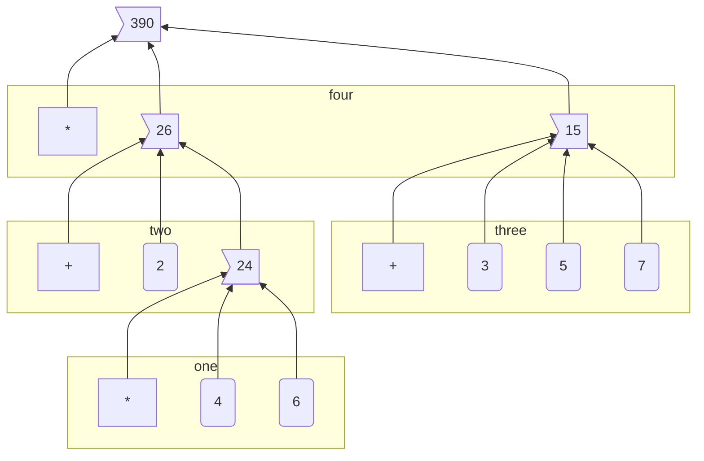
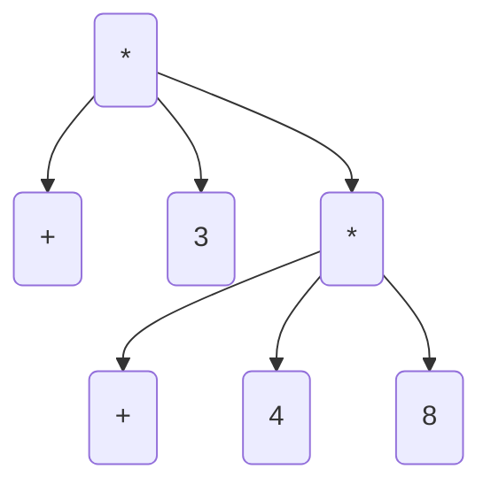
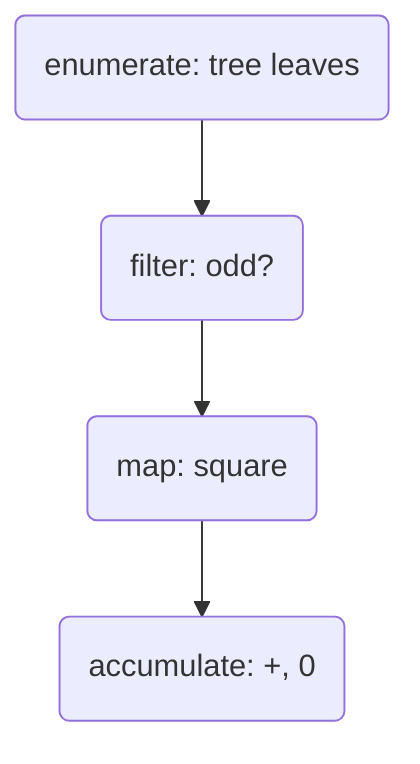

---
alias:
- 'Structure and Interpretation of Computer Programs'
- 'SICP'
- 'Abelson, Hal & Sussman, Gerald - Structure and Interpretation of Computer Programs (1995)'
---

#FunctionalProgramming [[LISP (Language)]] #Scheme  #CSTheory 

# Links
[MY SICP SOLUTIONS](https://github.com/ProducerMatt/SICP-solutions)

## Source material
[Fully-featured HTML edition](http://sarabander.github.io/sicp/html/index.xhtml)

[Texinfo edition](http://zv.github.io/sicp-in-texinfo)

[Structure and Interpretation of Computer Programs OpenCourseWare](https://ocw.mit.edu/courses/electrical-engineering-and-computer-science/6-001-structure-and-interpretation-of-computer-programs-spring-2005/) 

[SICP vs SICP JS comparison](https://sicp.sourceacademy.org/)

# Resources
- [Notes for following along in the modern day](https://github.com/zv/SICP-guile). Warning: contains some solutions
- ["cheatsheet" for key ideas](https://www.physinf.com/sicp)
- [SchemeWiki solutions list](http://community.schemewiki.org/?sicp-solutions)
- [Gwern's SICP notes in Haskell](https://www.gwern.net/sicp/Chapter-1-1) [[Haskell (language)|Haskell]]
- [Solving SICP](https://lockywolf.wordpress.com/2021/02/08/solving-sicp/) academic analysis of the author's experience doing the textbook.
- [SRFI-216](https://srfi.schemers.org/srfi-216/) provides extra support for SICP in Scheme. [SRFI-216 implementations](https://practical-scheme.net/wiliki/schemexref.cgi?SRFI-216)
- [SRFI-203](https://srfi.schemers.org/srfi-203/): extra support for the graphics drawings segments of the book.
- ![[Visualize lists in Scheme]]
- [abrantesasf's study guide](https://github.com/abrantesasf/sicp-abrantes-study-guide)

## Using #Racket for SICP

```
raco pkg install sicp
```

[This pkg](https://docs.racket-lang.org/sicp-manual/SICP_Language.html) gives you a compatible language set when loaded. Load in the REPL with `racket -I sicp`, or in files by putting `#lang sicp` at the top of your file. When using `sicp`, load modules with `#%require` instead of `require`.

# Notes

## Text Foreword
This book centers on three areas: the human mind, collections of computer programs, and the computer.

Every program is a model of a real or mental process, and these processes are at any time only partially understood. We change these programs as our understandings of these processes evolve.

Ensuring the correctness of programs becomes a Herculean task as complexity grows. Because of this, it's important to make fundamentals that can be relied upon to support larger structures.


## Preface, 1e
Programming is a medium for expressing ideas about methodology. For this reason, programs should be written first for people to read, and second for machines to execute.

The essential material for introductory programming is how to control complexity when building programs.

Skills for controlling complexity:
1. Building abstractions to hide details when appropriate.
2. Establishing conventional interfaces to combine pieces of systems.
3. Establishing new languages which emphasize different aspects of the design.

Computer Science is about imperative knowledge, as opposed to declarative. This can be called *procedural epistemology*.

## Chapter 1

### Text 1
**Computational processes** are abstract 'beings' that inhabit computers. Their evolution is directed by a pattern of rules called a **program**, and processes manipulate other abstract things called **data**.

Master software engineers are able to organize programs so they can be reasonably sure the resulting process performs the task intended, without catastrophic consequences, and that any problems can be debugged.

Lisp's users have traditionally resisted attempts to select an "official" version of the language, which has enabled Lisp to continually evolve.

There are powerful program-design techniques which rely on the ability to blur the distinction between data and processes. Lisp enables these techniques by allowing processes to be represented and manipulated as data.

### Text 1.1
A programming language isn't just a way to instruct a computer -- it's also a framework for the programmer to organize their ideas. Thus it's important to consider the means the language provides for combining ideas. Every powerful language has three mechanisms for this:
- **primitive expressions** are the simplest entities the language is concerned with
- **means of combination** by which compound elements can be built from simpler ones
- **means of abstraction** by which compound elements can be named and manipulated as units

In programming, we deal with **data** which is what we want to manipulate, and **procedures** which are descriptions of the rules for manipulating the data.

A procedure has **formal parameters**. When the procedure is applied, the formal parameters are replaced by the **arguments** it is being applied to. For example, take the following code:
```scheme
(define (square x)
  (* x x))
(square 5)
```

`x` is the formal parameter and `5` is the argument.

#### 1.1.1
The general form of Lisp is evaluating **combinations**, denoted by parenthesis, in the form `(operator operands)`, where *operator* is a procedure and *operands* are the 0 or more arguments to the operator.

Lisp uses **prefix notation**, which is not customary mathematical notation, but provides several advantages.
1. It supports procedures that take arbitrary numbers of arguments, i.e. `(+ 1 2 3 4 5)`.
2. It's straightforward to nest combinations in other combinations.

#### 1.1.2

#### 1.1.3
The evaluator can evaluate nested expressions recursively. **Tree accumulation** is the process of evaluating nested combinations, "percolating" values upward.

The recursive evaluation of `(* (+ 2 (* 4 6)) (+ 3 5 7))` breaks down into four parts:


#### 1.1.4
We have identified the following in Lisp:
- primitive data are numbers, primitive procedures are arithmetic operations
- Operations can be combined by nesting combinations
- Data and procedures can be abstracted by variable & procedure definitions

Procedure definitions give a name to a compound procedure.
```scheme
(define (square x) (* x x)) ; to square something, multiply it by itself
; now it can be applied or used in other definitions:
(square 4) ; => 16

(define (sum-of-squares x y)
  (+ (square x) (square y)))
(sum-of-squares 3 4) ; => 25
```

Note how these compound procedures are used in the same way as primitive procedures.

#### 1.1.5
To understand how the interpreter works, imagine it substituting the procedure calls with the bodies of the procedure and its arguments.

```scheme
(* (square 3) (square 4))
; has the same results as
(* (* 3 3) (* 3 3))
```

This way of understanding procedure application is called the **substitution model**. This model is to help you understand procedure substitution, and is usually not how the interpreter actually works. This book will progress through more intricate models of interpreters as it goes. This is the natural progression when learning scientific phenomena, starting with a simple model, and replace it with more refined models as the phenomena is examined in more detail.

Evaluations can be done in different orders.

**Applicative order** evaluates the operator and operands, and then applies the resulting procedure to the resulting arguments. In other words, reducing, then expanding, then reducing.

**Normal order** substitutes expressions until it obtains an expression involving only primitive operators, , or until it can't substitute any further, and then evaluates. This results in expanding the expression completely before doing any reduction, which results in some repeated evaluations.

For all procedure applications that can be modeled using substitution, applicative and normal order evaluation produce the same result. Normal order becomes more complicated once dealing with procedures that can't be modeled by substitution.

Lisp uses applicative order evaluation because it helps avoid repeated work and other complications. But normal has its own advantages which will be explored in Chapter 3 and 4.

```scheme
; Applicative evaluation
(f 5)
(sum-of-squares (+ a 1) (* a 2))
(sum-of-squares (+ 5 1) (* 5 2))
(sum-of-squares 6 10)
(+ (square x)(square y))
(+ (square 6)(square 10))
(+ (* 6 6)(* 10 10))
(+ 36 100)
136
; Normal evaluation
(f 5)
(sum-of-squares (+ a 1) (* a 2))
(sum-of-squares (+ 5 1) (* 5 2))
(+ (square (+ 5 1)) (square (* 5 2)))
(+ (* (+ 5 1) (+ 5 1)) (* (* 5 2) (* 5 2)))
(+ (* 6 6) (* 10 10))
(+ 36 100)
136
```

(Extra-curricular clarification: Normal order delays evaluating arguments until they're needed by a procedure, which is called lazy evaluation.)

#### 1.1.6
An important aspect of programming is testing and branching depending on the results of the test. `cond` tests **predicates**, and upon encountering one, returns a **consequent**.
```scheme
(cond
	 (predicate1 consequent1)
     ...
     (predicateN consequentN))
```

A shorter form of conditional:
```scheme
(if predicate consequent alternative)
```

If `predicate` is true, `consequent` is returned. Else, `alternative` is returned.

Combining predicates:
```scheme
(and expression1 ... expressionN)
; if encounters false, stop eval and returns false.
(or expression1 ... expressionN)
; if encounters true, stop eval and return true. Else false.
(not expression)
; true is expression is false, false if expression is true.
```

#### 1.1.7
Functions in the formal mathematical sense are **declarative knowledge**, while procedures like in computer science are **imperative knowledge**.

Notice that the elements of the language that have been introduced so far are sufficient for writing any purely numerical program, despite not having introduced any looping constructs like `FOR` loops.

#### 1.1.8
Notice how the `sqrt` procedure is divided into other procedures, which mirror the division of the square root problem into sub problems.

A procedure should accomplish an identifiable task, and be ready to be used as a module in defining other procedures. This lets the programmer know how to use the procedure while not needing to know the details of how it works.

Suppressing these details are particularly helpful:
- Local names. A procedure user shouldn't need to know a procedure's choices of variable names.
	A formal parameter of a procedure whose name is irrelevant is called a **bound variable**. A procedure definition **binds** its parameters. A **free variable** isn't bound. The set of expressions in which a binding defines a name is the **scope** of that name.
- Internal definitions and block structure
    By nesting relevant definitions inside other procedures, you hide them from the global namespace. This nesting is called **block structure**. Nesting these definitions also allows relevant variables to be shared across procedures, which is called **lexical scoping**.

### Lecture 1a
"Computer Science" isn't really about computers or science, in the same way that geometry isn't really about measuring the earth ('geometry' translates to 'measurement of earth').

Computer Science is about Imperative knowledge, as opposed to declarative. This can be called *procedural epistemology*.

**Declarative knowledge**: *what is true*. For example: $\sqrt{x}$ is the $y$ such that $y^2 = x$ and $y \geq 0$ [[Logarithms Exponents and Square Roots]]

**Imperative knowledge**: *How to follow a process*. For example: to find an approximation to $\sqrt{x}$, make a guess $G$, improve the guess by averaging $G$ and $x/G$, keep improving until the guess is good enough.

The real problems in computer science come when we build systems so large that nobody can keep them all in their head at once. Thus, you need *techniques for controlling complexity.*

In some sense, computer science isn't "real". Fields like electrical engineering deal with real-world components with tolerances and noise. Whereas the components of computer science are somewhat idealized. You can understand the functioning of them as much as you like, and if you can understand and imagine a program then you can build it.

#### Techniques for controlling complexity

##### Black-box abstraction
Encapsulate an operation so the details of it are irrelevant.

Define a box of the method for finding square roots.

The fixed point of a function $f()$ is a value $y$ such that $f(y) = y$. Method for finding a fixed point: start with a guess for $y$ and keep applying $f(y)$ over and over until the result doesn't change very much.

Define a box of the method for finding the fixed point of $f()$.

One way to find $\sqrt{x}$ is to take our function for approaching a square root `(lambda (guess target) (average guess (divide target guess)))`, applying that to our method for finding a fixed point, and this creates a **procedure** to find a square root.

Black-box abstraction
- Start with primitive objects of procedures and data.
- Combination: combine procedures with *composition*, combine data with *construction* of compound data.
- Abstraction: defining procedures and abstracting data.
- Capturing common patterns: make high-order procedures composed of other procedures. Use data as procedures.

##### Conventional interfaces
Agreed-upon ways of connecting things together.

- How do you make operations generalized?
- How do you make large-scale structure and modularity? 
	- Object-oriented programming: thinking of your structure as a society of discrete but interacting parts.
	- Operations on aggregates: thinking of your structure as operating on a stream, comparable to signal processing. *(Needs clarification.)*

##### Metalinguistic abstractions
Making new languages. Changes the way you interact with the system by letting you emphasize some parts and deemphasize other parts.

#### Learning Lisp
When learning a new language, ask
- primitive elements
- means of combination
- means of abstraction

It's a red herring to ask "how many characters would it take to invert a matrix?". It would be much more valuable to ask "if matrixes weren't implemented, how does this language empower me to implement them?"

##### Lisp Fundamentals
We'll consider the *primitive elements* of Lisp to be the standard library it comes with. This includes lots of things, some of which are procedures like `+` and `-` as well as natural and fractional numbers, etc.

Lisp is broadly about applying *operators* (like +) to *operands* (like numbers): `(+ 3 5)`

The parenthesis indicate *combinations*, and these combinations form 2D trees.

```scheme
(+ 3 (+ 4 8))
```


##### Abstraction
The keyword `define` is the method of abstraction.

Abstracting a constant:
```scheme
(define A (* 5 5))
(* A A) ; => 625
(define B (+ A (* 5 A)))
B ; = > 150
(+ A (/ B 5)) ; => 55
```

But what we really want is to name *methods*, such as the method of multiplying a number by itself. (Squaring)

```scheme
(define (square x)
  (* x x))
(square 10) ; => 100
```

This way of defining a method is **syntactic sugar** to the more explicit form:

```scheme
(define square
  (lambda (x)
	(* x x)))
```

Adding more methods that depend on each other.

```scheme
(define (average x y)
  (/ (+ x y) 2))
(define (mean-square x y)
  (average (square x) (square y)))
```

Lisp doesn't care whether something is built-in to the language or constructed by the user.

##### Conditionals
```scheme
(define (abs x)
  (cond ((< x 0)(- x))
		((= x 0)(x))
		((> x 0)(x))))]

; Alternatively
(define (abs x)
  (if (< x 0)
	  (- x)
	  x))
```

##### Writing guessing a square root
You essentially have everything you need to express any numerical method in Lisp!

```scheme
(define (try guess x)
  (if (good-enough? guess x)
	  guess
	  (try (improve guess x) x)))
(define (improve guess x)
  (average guess (/ x guess)))
(define (good-enough? guess x)
  (< (abs (- (square guess) x)) .001))
; This code outputs its answer as a fraction.
```

This program outputs fractions, which I assumed was a bug, turns out that's how Scheme works. Spent a while debugging this. [[Debugging Scheme in GNU Guile and Racket]]

A distinction:
```scheme
(define A (* 5 5))
(define (D) (* 5 5))
A ; => 25
D ; => compound procedure D
(D) ; => 25 (result of executing procedure D)
```

### Text 1.2
Procedures define the **local evolution** of processes. We would like to be able to make statements about the **global** behavior of a process.

#### 1.2.1 Linear Recursion and Iteration
Consider these two procedures for obtaining factorials:
```scheme
(define (factorial-recursion n)
  (if (= n 1)
	  1
	  (* n 
		 (factorial-recursion (- n 1)))))

(define (factorial-iteration n)
  (define (fact-iter product counter max-count)
	  (if (> counter max-count)
		  product
		  (fact-iter
					(* counter product)
		            (+ counter 1)
		            max-count)))
  
  (fact-iter 1 1 n))
```

These two procedures reach the same answers, but form very different processes. The `factorial-recursion` version takes more computational **time** and **space** to evaluate, by building up a chain of deferred operations. This is a **recursive process**. As the number of steps needed to operate, and the amount of info needed to keep track of these operations, both grow linearly with $n$, this is a **linear recursive process**.

The second version forms an **iterative process**. Its state can be summarized with a fixed number of state variables. The number of steps required grow linearly with $n$, so this is a **linear iterative process**.

A *recursive procedure* is one whose definition refers to itself. A *recursive process* is a process that evolves recursively. So `fact-iter` is a recursive *procedure* that generates an iterative *process*.

Many implementations of programming languages interpret all recursive procedures in a way that consume memory that grows with the number of procedure calls, even when the process is essentially iterative. These languages instead use looping constructs such as `do`, `repeat`, `for`, etc. Implementations that execute iterative processes in constant space, even if the procedure is recursive, are **tail-recursive**.

#### 1.2.2: Tree Recursion
Consider a recursive procedure for computing Fibonacci numbers:
```scheme
(define (fib n)
  (cond ((= n 0) 0)
		((= n 1) 1)
		(else (+ (fib (- n 1))
				 (fib (- n 2))))))
```

The resulting process splits into two with every iteration, creating a tree of computations, many of which are duplicates of previous computations. This kind of pattern is called **tree-recursion**. However, this one is quite inefficient. The time and space required grows exponentially with the number of iterations requested.

Instead, it makes much more sense to start from `Fib(1) = 1` and `Fib(0) = 0` and iterate upwards to the desired value. This only requires a linear number of steps relative to the input.

```scheme
(define (fib n)
  (fib-iter 1 0 n))
(define (fib-iter a b count)
  (if (= count 0) b (fib-iter (+ a b) a (- count 1))))
```

However, notice that the inefficient tree-recursive version is a fairly straightforward translation of the Fibonacci sequence's definition, while the iterative version required redefining the process as an iteration with three variables.

##### Example: Counting change
I should come back and try to make the "better algorithm" suggested.

#### 1.2.3 Orders of Growth
An **order of growth** gives you a gross measure of the resources required by a process as its inputs grow larger.

Let $n$ be a parameter for the size of a problem, and $R(n)$ be the amount of resources required for size $n$. $R(n)$ has order of growth $\Theta(f(n))$

For example:
- $\Theta(1)$ - constant, not growing
- $\Theta(n)$ - proportional growth

Some algorithms we've already seen:
- Linear recursive: time and space $\Theta(n)$
- Iterative: time $\Theta(n)$ space $\Theta(1)$
- Tree-recursive: in general, time is proportional to the number of nodes, space is proportional to the depth of the tree. In Fib algorithm example, $\Theta(n)$ and time $\Theta(\Upsilon^{n})$ ($\Upsilon$ is the golden ratio $\frac{1 + \sqrt{5}}{2}$)

Orders of growth are very crude descriptions of process behaviors, but they are useful in indicating how a process will change with the size of the problem.

[[202203291748 - SICP Exercise 1.14 Postmortem]]

#### 1.2.4 Exponentiation
Considering a few ways to compute the exponential of a given number.

```scheme
(define (expt b n)
  (expt-iter b n 1))
(define (expt-iter b counter product)
  (if (= counter 0)
      product
      (expt-iter b (- counter 1) (* b product))))
```
This iterative procedure is essentially equivalent to:

$$b^{8} = b \cdot (b \cdot (b \cdot (b \cdot (b \cdot (b \cdot (b \cdot b))))))$$

But note it could be approached faster with squaring:

$$\begin{aligned}b^2 &= b \cdot b\\
b^4 &= b^2\cdot b^2\\
b^8 &= b^4 \cdot b^4\end{aligned}$$

#### 1.2.5 Greatest Common Divisor
A greatest common divisor (or GCD) for two integers is the largest integer that divides both of them. A GCD can be quickly found by transforming the problem like so:
$$a \% b = r$$

$$\text{GCD}(a, b) = \text{GCD}(b, r)$$

This eventually produces a pair where the second number is 0. Then, the GCD is the other number in the pair. This is Euclid's Algorithm.

$$\begin{aligned}\text{GCD}(206,40) &= \text{GCD}(40,6)\\
            &= \text{GCD}(6,4)\\
            &= \text{GCD}(4,2)\\
            &= \text{GCD}(2,0) = 2\end{aligned}$$

> **Lamé’s Theorem:** If Euclid’s Algorithm requires $k$ steps to compute the GCD of some pair, then the smaller number in the pair must be greater than or equal to the $k^{th}$Fibonacci number.

#### 1.2.6 Example: Testing for Primality
Two algorithms for testing primality of numbers.

1. $\Theta(\sqrt{n})$ Start with $x = 2$, check for divisibility with $n$, if not then increment $x$ by 1 and check again. If $x^2 \gt n$ and you haven't found a divisor, $n$ is prime.
2. $\Theta(\log n)$ Given a number $n$, pick a random number $a\lt n$ and compute the remainder of $a^n$ modulo $n$. If the result is not equal to $a$, then $n$ is certainly not prime. If it is $a$, then chances are good that $n$ is prime. Now pick another random number $a$ and test it with the same method. If it also satisfies the equation, then we can be even more confident that $n$ is prime. By trying more and more values of $a$, we can increase our confidence in the result. This algorithm is known as the Fermat test.

> **Fermat’s Little Theorem:** If $n$ is a prime number and $a$ is any positive integer less than $n$, then $a$ raised to the $n^{th}$ power is congruent to $a$ modulo $n$. \[Two numbers are _congruent modulo_ $n$ if they both have the same remainder when divided by $n$.\]

The Fermat test is a probabilistic algorithm, meaning its answer is likely to be correct rather than guaranteed to be correct. Repeating the test increases the likelihood of a correct answer.

### Lecture 1B
We want to understand how particular patterns of rules and procedures cause particular patterns of behavior.

#### Part 1: Substitution model
The substitution model is a tool to help you gain greater understanding of how the computer works. It's not necessarily accurate to how the machine works. Eventually it will need to be replaced with a more advanced model. [[All models are inaccurate, all models are sometimes useful]].

The substitution rule:
> To evaluate an application:
> - Evaluate the operator to get procedure
> - Evaluate the operands to get arguments
> - Apply the procedure to the arguments:
>   - Copy the body of the procedure, substituting the arguments supplied for the formal parameters of the procedure
>   - Evaluate the resulting new body

Special forms bring more rules into this model. For example, when evaluating an `if` expression, you evaluate the predicate and depending on the result either evaluate the **consequent** or the **alternative**. If you were evaluating in a standard manner, the consequent and alternative would both be evaluated, rendering the `if` expression ineffective.

#### Part 2: the shapes of programs

Algorithms can be analyzed for the **time** they take and the **space** they use. GJS shows two variants of Peano addition. Their definitions are subtly different, but one is iterative and one is recursive, and the recursive takes much more space and time than the iterative.

The recursive solution splits the problems into multiple sub problems, which then get resolved 'backwards' (reminds me of [[Abelson Sussman 1995 SICP#1 1 5|normal order rather than applicative order]]). The iterative solution keeps a consistent amount of variables and works in its established space without needing more.

> "The key to understanding complicated things is to know what not to look at, and what not to compute, and what not to think." - Gerald J. Sussman

### Text 1.3
Procedures that manipulate procedures are called _higher-order procedures_.

#### 1.3.1 Procedures as Arguments
Let's say we have several different types of series that we want to sum. Functions for each of these tasks will look very similar, so we're better off defining a general function that expresses the *idea* of summation, that can then be passed specific functions to cause the specific behavior of the series. Mathematicians express this as $\sum$ ("sigma") notation.

For the program:

```scheme
(define (sum term a next b)
  (if (> a b)
      0
      (+ (term a)
         (sum term (next a) next b))))
```

Which is equivalent to:

$$\sum^{b}_{n=a}term(n)=term(a)+term(next(a))+term(next(next(a)))+\cdots+term(b)$$

We can pass integers to `a` and `b` and functions to `term` and `next`. Note that in order to simply sum integers, we'd need to define and pass an identity function to `term`.

#### 1.3.2 Constructing Procedures Using lambda

A procedure that's only used once is more conveniently expressed as the special form `lambda`.

Variables that are only briefly used in a limited scope can be specified with the special form `let`. Variables in `let` blocks override external variables. The authors recommend using  `define` for procedures and `let` for variables.

#### 1.3.3 Procedures as General Methods
The **half-interval method**: if $f(a)<0<f(b)$, then $f$ must have at least one 0 between $a$ and $b$. To find 0, let $x$ be the average of $a$ and $b$, if $f(x) < 0$ then 0 must be between $x$ and $b$, if $f(x)>0$ than 0 must be between $a$ and $x$.

The **fixed point** of a function satsfies the equation $$f(x)=x$$

For some functions, we can locate a fixed point by beginning with an initial guess $y$ and applying $f(y)$ repeatedly until the value doesn't change much.

**Average damping** can help converge fixed-point searches.

The symbol $\mapsto$ ("maps to") can be considered equivalent to a lambda. For example, $x \mapsto x+x$ is equivalent to `(lambda (x) (+ x x))`. In English, "the function whose value at $y$ is $x/y$". *Though it seems like $\mapsto$ doesnt necessarily describe a function, but the value of a function at a certain point? Or maybe that would just be $=$, ie $f(x)=etc$*

#### 1.3.4 Procedures as Returned Values
Procedures can return other procedures, which opens up new ways to express processes.

Newton's Method: $g(x)=0$ is a fixed point of the function $x \mapsto f(x)$ where
$$f(x)=x-\frac{g(x)}{Dg(x)}$$

Where $x \mapsto g(x)$ is a differentiable function and $Dg(x)$ is the derivative of $g$ evaluated at $x$.

[[Notation for function domain and mapping]]

## Chapter 2
The basic representations of data we've used so far aren't enough to deal with complex, real-world phenomena. We need to combine these representations to form **compound data**.

The technique of isolating how data objects are *represented* from how they are *used* is called **data abstraction**.

### 2.1: Introduction to Data Abstraction

#### 2.1.1 Example: Arithmetic Operations for Rational Numbers
Lisp gives the procedures `cons`, `car`, and `cdr` to create **pairs**. This is an easy system for representing rational numbers.

Note that the system proposed for representing and working with rational numbers has **abstraction barriers** isolating different parts of the system. The parts that use rational numbers don't know how the constructors and selectors for rational numbers work, and the constructors and selectors use the underlying Lisp interpreter's pair functions without caring how they work.

Note that these abstraction layers allow the developer to change the underlying architecture without modifying the programs that depend on it.

#### 2.1.3 What Is Meant by Data?
We can consider data as being a collection of selectors and constructors, together with specific conditions that these procedures must fulfill in order to be a valid representation. For example, in the case of our rational number implementation, for rational number $x$ made with numerator $n$ and denominator $d$, dividing the result of `(numer x)` over the result of `(denom x)` should be equivalent to dividing $n$ over $d$.

### 2.2 Hierarchical Data and the Closure Property
`cons` pairs can be used to construct more complex data-types.

![[CB25503D-ECBE-4E94-A625-8526B2DECCE1.jpeg]]

The ability to combine things using an operation, then combine those results using the same operation, can be called the **closure property**. `cons` can create pairs whose elements are pairs, which satisfies the closure property. This property enables you to create hierarchical structures. We've already regularly used the closure property in creating procedures composed of other procedures.

> [!CITE]- definitions of "closure"
> 
>The use of the word “closure” here comes from abstract algebra, where a set of elements is said to be closed under an operation if applying the operation to elements in the set produces an element that is again an element of the set. The Lisp community also (unfortunately) uses the word “closure” to describe a totally unrelated concept: A closure is an implementation technique for representing procedures with free variables. We do not use the word “closure” in this second sense in this book.

#### 2.2.3 Sequences as Conventional Interfaces
Abstractions are an important part of making code clearer and more easy to understand. One beneficial manner of abstraction is making available conventional interfaces for working with compound data, such as `filter` and `map`.

This allows for easily making "signal-flow" conceptions of processes:


#### 2.2.4 Example: A Picture Language
Authors describe a possible implementation of a "picture language" that tiles, patterns, and warps images according to a specification. This language consists of:

- a **painter** which makes an image within a specified parallelogram shaped frame. This is the most primitive element.
- **Operations** which make new painters from other painters. For example:
	- *beside* takes two painters, producing a new painter that puts one in the left half and one in the right half.
	- *flip-horiz* takes one painter and produces another to draw its image right-to-left reversed.
	These are defined as Scheme procedures and therefore have all the properties of Scheme procedures.
